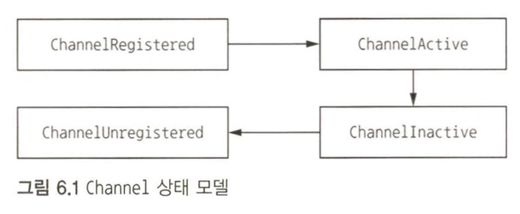
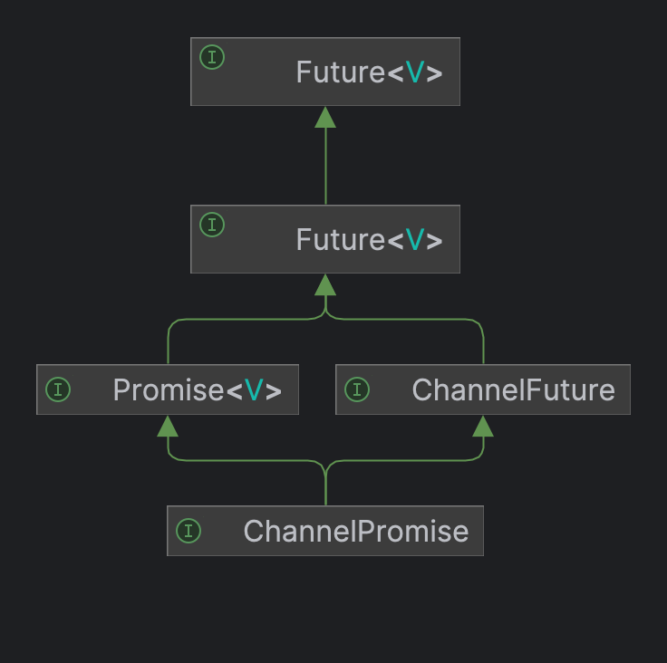
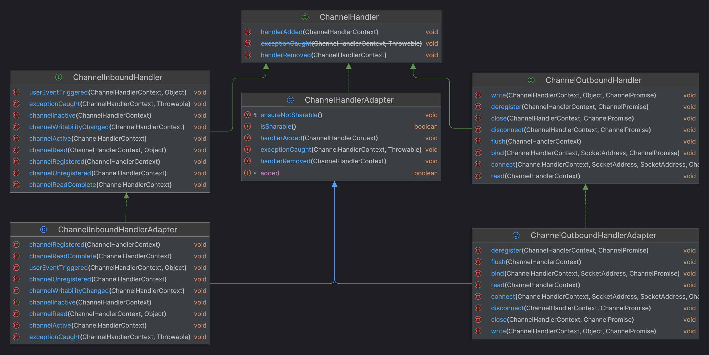
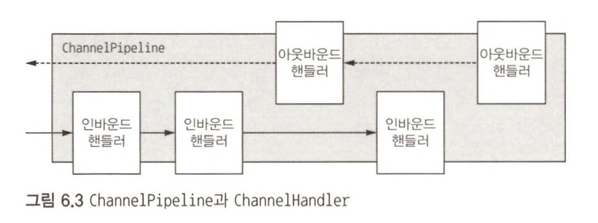
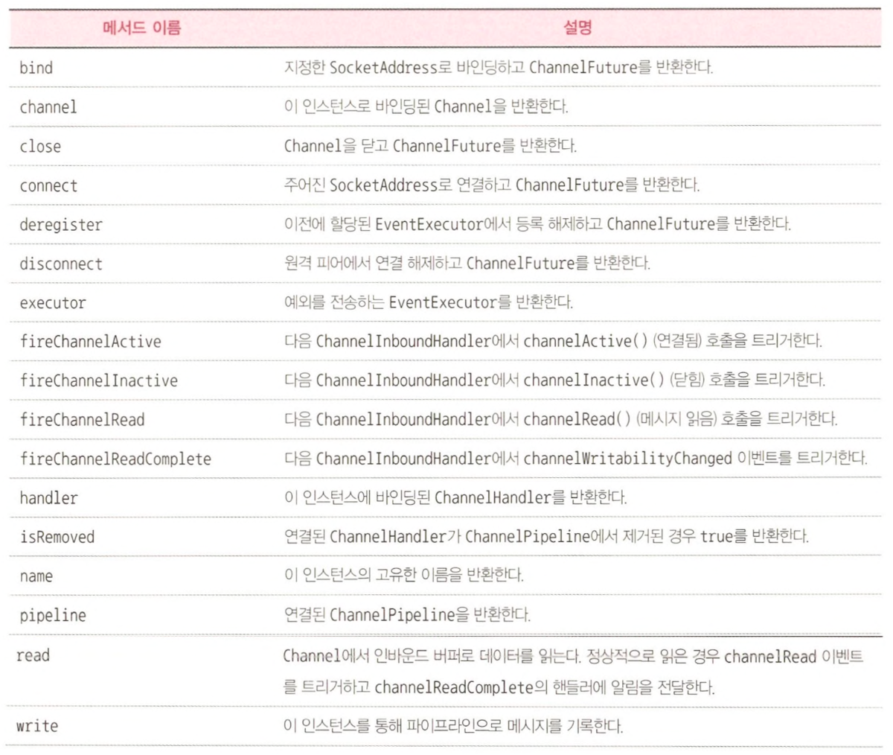

네티에서 재사용 가능한 모듈식 구현을 제작하려면 이러한 모든 컴포넌트의 상호작용을 제대로 이해해야 한다.  

# 무지목록

1. ChannelPipeline은 ChannelHandler의 연속이며 ChannelHandler는 ChannelHandlerContext를 이용해 ChannelPipieline 또는 다음 핸들러와 상호작용한다.
   1. 이때 ChannelHandler의 API로는 현재 핸들러가 인바운드 핸들러인지, 아웃바운드 핸들러인지 구분할 수 없을텐데 어떻게 다음 핸들러에게 처리를 위임할 수 있을까?

# ChannelHandler 계층

Channel의 수명주기는

1. **ChannelUnregistered**  : Channel이 생성됐지만 Event Loop에 등록되지 않음
2. **ChannelRegistered** : Channel 이 Event Loop에 등록됨
3. **ChannelActive** : Channel이 활성화됨（해당 원격 피어로 연결됨）, 이제 데이터를 주고받을 수 있음
4. **Channellnactive** : Channel이 원격 피어로 연결되지 않음


  
***

ChannelHandler 인터페이스에서 정의하는 수명주기 메서드는 ChannelHandler가 **ChannelPipeline에 추가 또는 제거된 후 호출된다.**  

```java
/**
 * ChannelHandler 가 실제 컨텍스트에 추가되고 이벤트를 처리할 준비가 된 후에 호출됩니다.
 */
void handlerAdded(ChannelHandlerContext ctx) throws Exception;

/**
 * ChannelHandler 실제 컨텍스트에서 제거된 후 호출되며 더 이상 이벤트를 처리하지 않습니다.
 */
void handlerRemoved(ChannelHandlerContext ctx) throws Exception;

/**
 * Throwable 던져지면 호출됩니다.
 * @deprecated ChannelInboundHandler 의 일부입니다.
 */
@Deprecated
void exceptionCaught(ChannelHandlerContext ctx, Throwable cause) throws Exception;
```

## ChannelInboundHandler

이 인터페이스의 수명주기 메서드는 **데이터가 수신되거나 연결된 Channel의 상태가 변경될 때 호출되며 Channel 수명주기와 밀접하게 연관된다.**  
[ChannelInboundHandler](https://netty.io/4.1/api/io/netty/channel/ChannelInboundHandler.html)를 통해 확인해보라.

- ChannelInboundHandlerAdapter를 구현한 인스턴스의 메모리를 명시적으로 해제하는 **DiscardHandler**
- 템플릿 메서드 패턴을 적용하여 자동으로 인스턴스의 메모리를 해제하는 SimpleChannelInboundHandler를 구현한 **SimpleDiscardHandler**

## ChannelOutboundHandler

아웃바운드 작업과 데이터는 ChannelOutboundHandler에 의해 처리되며, 여기에 포함된 메서드는 Channel, ChannelPipeline, ChannelHandlerContext에서 이용된다.  
ChannelOutboundHandler는 주문식으로 작업이나 이벤트를 지연하는 강력한 기능이 있어 정교하게 요청을 처리할 수 있다.  
예를 들어, 원격 피어에 대한 기록이 일시 중단된 경우 플러시 작업을 지연하고 나중에 재개할 수 있다.  

[ChannelOutboundHandler](https://netty.io/4.1/api/io/netty/channel/ChannelOutboundHandler.html)를 통해 확인해보라.  



> **ChannelPromise와 ChannelFuture 비교**  
> ChannelOutboundHandler에 있는 대부분의 메서드에는 작업이 완료되면 알림을 전달받을 ChannelPromise인수가 있다.  
> ChannelPromise는 ChannelFuture의 하위 인터페이스로서 `setSuccess()`나 `setFailure()` 같은 기록 가능 메서드를 정의해 ChannelFuture를 읽기 전용으로 만든다.

## ChannelHandler 어댑터



자신의 ChannelHandler를 작성하는 시작점으로 ChannelInboundHandlerAdapter와 ChannelOutboundHandlerAdapter 클래스를 이용할 수 있다.  
이 어댑터들은 각각 ChannelInboundHandler와 ChannelOutboundHandler의 기본 구현을 제공하며, **추상 클래스 ChannelHandlerAdapter** 를 확장해 공통 상위 인터페이스인 ChannelHandler의 메서드를 받는다.  
  
**ChannelInboundHandlerAdapter와 ChannelOutboundHandlerAdapter에서 제공되는 메서드 본문에서는 연결된 ChannelHandlerContext의 해당 메서드를 호출해 이벤트를 파이프라인의 다음 ChannelHandler로 전달한다.**  
  
자신의 핸들러에서 이러한 어댑터 클래스를 이용하려면 이러한 클래스를 확장하고 커스터마이즈할 메서드를 재정의하면 된다.  

```java
@ChannelHandler.Sharable
public class DiscardOutboundHandler extends ChannelOutboundHandlerAdapter {

    @Override
    public void write(ChannelHandlerContext ctx, Object msg, ChannelPromise promise) throws Exception {
        ReferenceCountUtil.release(msg);    // 리소스 해제
        promise.setSuccess();               // 데이터가 처리된 것을 ChannelPromise에 알림
    }
}
```

리소스를 해제하는 것만이 아니라 ChannelPrmoise에 알리는 것도 중요하다.  
그렇지 않으면 ChannelFutureListener가 메시지가 처리된 것에 대한 알림을 받지 못하는 경우가 생길 수 있다.  
  
즉, 메시지가 소비 또는 폐기되어 ChannelPipeline의 다음 ChannelOutboundHandler로 전달되지 않는 경우 직접 `release()`를 호출해야 한다.  
전송 레이어에 도달한 메시지는 기록될 때 또는 Channel이 닫힐 때 자동으로 해제된다.  

# ChannelPipeline 인터페이스

ChannelPipeline을 Channel을 통해 오가는 인바운드와 아웃바운드 이벤트를 가로채는 ChannelHandler 인스턴스의 체인이라고 생각하면, 애플리케이션의 데이터와 이벤트 처리 논리의 핵심을 구성하는 이러한 ChannelHandler의 상호작용을 쉽게 이해할 수 있다.  
  
**새로운 Channel이 생성될 때마다 새로운 ChannelPipeline이 할당된다.**  
이 연결은 `영구적`이며 Channel을 다른 ChannelPipeline과 연결하거나 현재 연결을 해제할 수 없다.  
이 과정은 네티 컴포넌트 수명주기의 고정된 작업이므로 개발자가 관여할 필요가 없다.  
  
이벤트는 전달되는 방향을 기준으로 ChannelHandlerContext 구현에 대한 호출에 의해 동일한 상위 형식의 다음 핸들러로 전달된다.  

> **ChannelHandlerContext**  
> ChannelHandler는 ChannelHandlerContext를 이용해 해당 ChannelPipeline 및 다른 핸들러와 상호작용 할 수 있다.  
> ChannelPipeline의 다음 ChannelHandler에 알림을 전달하는 것은 물론, 속해 있는 ChannelPipeline을 동적으로 수정할 수도 있다.  
> **ChannelHandlerContext에는 이벤트를 처리하고 입출력 작업을 수행하는 풍부한 API가 포함돼 있다.**



> **ChannelPipeline 상대성**  
> ChannelPipeline을 통해 이동하는 이벤트를 중심으로 보면 이벤트가 인바운드인지 아웃바운드인지에 따라 시작점이 결정된다고 생각할 수 있다.  
> `add*()` 메서드를 이용해 인바운드와 아웃바운드 핸들러를 모두 ChannelPipeline으로 추가한 후, 각 ChannelHandler의 순서는 정의한 위치로 시작부터 끝까지 정해진다.  
> 위의 이미지에서 왼쪽부터 첫 번째 핸들러는 1번이며, 오른쪽 끝 핸들러는 5번이다.

파이프라인은 이벤트를 전파하는 동안 다음 파이프라인의 ChannelHandler가 같은 이동 방향인지 확인한다.  
**이동 방향이 다르면 ChannelPipeline은 방향이 일치하는 항목이 나올 때까지 다음 ChannelHandler를 건너뛴다.**  
(물론 한 핸들러가 양쪽 Handler 모두 구현할 수도 있다.)  

<h3>ChannelPipeline 수정</h3>

ChannelHandler는 다른 ChannelHandler를 추가, 제거하는 방법으로 ChannelPipeline의 레이아웃을 실시간으로 수정할 수 있으며 자신을 ChannelPipeline에서 제거할 수도 있다.  

```java
public static void modifyPipeline(ChannelPipeline pipeline) {
    FirstHandler firstHandler = new FirstHandler();
    pipeline.addLast("handler1", firstHandler);
    pipeline.addFirst("handler2", new SecondHandler());
    pipeline.addLast("handler3", new ThirdHandler());
    pipeline.remove("handler3");
    pipeline.remove(firstHandler);
    pipeline.replace("handler2", "handler4", new FourthHandler());
}

private static final class FirstHandler extends ChannelHandlerAdapter { }
private static final class SecondHandler extends ChannelHandlerAdapter { }
private static final class ThirdHandler extends ChannelHandlerAdapter { }
private static final class FourthHandler extends ChannelHandlerAdapter { }
```

> **ChannelHandler 실행과 블로킹**  
> 일반적으로 ChannelPipeline의 각 ChannelHandler는 전달된 이벤트를 **EventLoop(입출력 스레드)를 통해 처리한다.**  
> 입출력을 처리하는 전체 성능에 부정적인 영향을 방지하기 위해 이 스레드가 블로킹되지 않게 하는 것이 매우 중요하다.  
> 블로킹 API를 이용하는 레거시 코드와 인터페이스해야 하는 경우가 있다.  
> 이와 같은 상황을 위해 ChannelPipeline에 **EventExecutorGroup을 받는 `add()` 메서드가 있다.**  
> 이벤트가 커스텀 EventExecutorGroup으로 전달되면 EventExecutorGroup에 포함된 EventExecutor 중 하나에 의해 처리되며 Channel의 EventLoop에서는 제거된다.  
> 네티는 이 작업을 위해 DefaultEventExecutorGroup이라는 구현을 제공한다.

<h3>이벤트 생성</h3>

[ChannelPipeline API](https://netty.io/4.0/api/io/netty/channel/ChannelPipeline.html)에는 인바운드와 아웃바운드 작업을 호출하는 추가 메서드가 있다.  
인바운드로는 `fire*()` 메서드들이 있으며, 아웃바운드에서는 이벤트를 처리하면 기반 소켓 상에서 일종의 조치가 이뤄지는 `bind()`, `connect()`, `disconnect()` 등이 있다.  
  
1. **ChannelPipeline은 한 Channel과 연결된 여려 ChannelHandler를 포함한다.**
2. **필요에 따라 동적으로 ChannelHandler를 추가하고 제거해 동적으로 ChannelPipeline을 수정할 수 있다.**
3. **ChannelPipeline에는 인바운드와 아웃바운드 이벤트에 반응해 작업을 호출하는 풍부한 API가 있다.**

# ChannelHandlerContext 인터페이스

ChannelHandlerConext는 ChannelHandler와 ChannelPipeline 간의 연결을 나타내며 ChannelHandler를 ChannelPipeline에 추가할 때마다 생성된다.  
ChannelHandlerContext의 주된 기능은 **연결된 ChannelHandler와 동일한 ChannelPipeline내의 다른 ChannelHandler 간의 상호작용을 관리하는 것이다.**  


> ChannelHandlerContext 와 Channel,ChannelPipeline과 동일한 메서드가 있다.  
> 이 메서드들을 ChannelHandlerContext에서 호출하면 현재 연결된 ChannelHandler에서 시작하여 파이프라인에서 이벤트를 처리할 수 있는 다음 ChannelHandler로만 전파되지만,  
> Channel 또는 ChannelPipeline에서 호출하면 메서드가 전체 파이프라인을 통해 전파된다.  



1. **ChannelHandler와 연결된 ChannelHandlerContext는 절대 변경되지 않으므로 참조를 저장해도 괜찮다.**
2. **ChannelHandlerContext 메서드는 이 절의 시작 부분에서 설명했듯이, 다른 클래스에 있는 동일한 이름의 메서드에 비해 이벤트 흐름이 짧다. 이를 잘 활용하면 성능상 이익을 거둘 수 있다.**


```java
// ChannelHandlerContext에서 Channel에 대한 참조를 얻어 버퍼를 기록
Channel channel = ctx.channel();
channel.write(Unpooled.copiedBuffer("Netty in Action", StandardCharsets.UTF_8));

// ChannelHandlerContext에서 Pipeline에 대한 참조를 얻어 버퍼를 기록
ChannelPipeline pipeline = ctx.pipeline();
pipeline.write(Unpooled.copiedBuffer("Netty in Action", StandardCharsets.UTF_8));
```

Channel 또는 ChannelPipeline에서 호출된 `write()` 메서드는 파이프라인을 통해 끝까지 전파되는 점은 같지만, 한 핸들러에서 다음 Handler 단계로 전파하는 일을 **ChannelHandlerContext가 한다는 점이 다르다.**  
  
ChannelPipeline의 특정 지점에서 이벤트 전파를 시작하는 이유는

1. **관련이 없는 ChannelHandler를 통과하면서 생기는 오버헤드를 줄일 수 있다.**
2. **이벤트와 관련된 핸들러에서 이벤트가 처리되는 것을 방지할 수 있다.**

즉, 특정 ChannelHandler에서 시작하는 처리를 호출하려면 한 단계 전 ChannelHandler와 연결된 ChannelHandlerContext를 참조해야 한다.  
이 ChannelHandlerContext는 현재 연결된 항목의 다음 ChannelHandler를 호출한다.  

```java
// 버퍼를 다음 ChannelHandler로 전송
ctx.write(Unpooled.copiedBuffer("Netty in Action", StandardCharsets.UTF_8));
```

ChannelHandlerContext의 참조를 캐싱하면 ChannelHandler 메서드 외부나 심지어 다른 스레드에서 다른 고급 기법을 실행하는데 이용할 수 있다.  

```java
public class WriteHandler extends ChannelHandlerAdapter {

    // ChannelHandlerContext의 참조를 나중에 이용하기 위해 캐싱
    private ChannelHandlerContext ctx;

    @Override
    public void handlerAdded(ChannelHandlerContext ctx) {
        this.ctx = ctx;
    }

    // 이전에 저장한 ChannelHandlerContext를 이용한 메시지 전송
    public void send(String msg) {
        ctx.writeAndFlush(msg);
    }
}
```

또한 ChannelHandler는 둘 이상의 ChannelPipeline에 속할 수 있으므로 여러 ChannelHandlerContext 인스턴스와 바인딩 할 수 있다.  
ChannelHandler를 이런 용도로 이용하려면 `@Sharable` 어노테이션을 지정해야 하며, 그렇지 않고 ChannelPipeline에 추가하려고 하면 예외가 트리거 된다.  
**여러 동시 채널(즉, 여러 연결)에서 ChannelHandler를 안전하게 이용하려면 ChannelHandler가 스레드에 대해 안전해야 한다.**  

```java
@ChannelHandler.Sharable
public class SharableHandler extends ChannelInboundHandlerAdapter {

    @Override
    public void channelRead(ChannelHandlerContext ctx, Object msg) {
        System.out.println("channel read message " + msg);
        // 다음 ChannelHandler로 전달
        ctx.fireChannelRead(msg);
    }
}

/**
 * 메서드 호출 횟수를 추적하는 데 사용되는 count 인스턴스 변수는 여러 채널에서 동시에 접근할 때 문제가 발생할 수 있다.
 */
@ChannelHandler.Sharable
public class UnsharableHandler extends ChannelInboundHandlerAdapter {

    private int count;

    @Override
    public void channelRead(ChannelHandlerContext ctx, Object msg) {
        count++;

        System.out.println("inboundBufferUpdated(...) called the " + count + " time");
        ctx.fireChannelRead(msg);
    }

}
```

ChannelHandler가 스레드에 대해 확실히 안전한 경우에만 `@Sharable`을 이용해야 한다.  
같은 ChannelHandler를 여러 ChannelPipeline에 추가하는 가장 일반적인 이유는 여러 Channel에서 통계 정보를 얻기 위해서다.  

## 예외 처리

<h3>인바운드 예외 처리</h3>

인바운드 이벤트를 처리하는 동안 예외가 발생하면 트리거된 ChannelInboundHandler부터 시작해 예외가 ChannelPipeline을 통과하기 시작한다.  
이러한 인바운드 예외를 처리하려면 `exceptionCaught()`를 재정의해야 한다.  
  
예외는 **모든 인바운드 이벤트와 동일하게 인바운드 방향으로 진행되므로 예외를 처리하는 ChannelInboundHandler는 일반적으로 ChannelPipeline의 끝부분에 배치된다.**  
그래야 ChannelPipeline 내의 어떤 위치에서 예외가 발생하던지 반드시 처리할 수 있기 때문이다.  
인바운드 예외 처리를 하지 않거나 예외를 소비하지 않는 경우 네티는 예외가 처리되지 않은 것을 알리는 내용을 로깅한다.  

```java
ChannelPipeline pipeline = ch.pipeline();
pipeline.addLast(new SharableHandler(1));
pipeline.addLast(new SharableHandler(2));
pipeline.addLast(new InboundExceptionHandler());
pipeline.addLast(new SharableHandler(3));
pipeline.addLast(serverHandler);

public class InboundExceptionHandler extends ChannelInboundHandlerAdapter {

    @Override
    public void exceptionCaught(ChannelHandlerContext ctx, Throwable cause) {
        System.out.println("InboundExceptionHandler 호출!!!");
        cause.printStackTrace();
        ctx.close();
    }
}
```

```
// InboundExceptionHandler 이전 Handler에서 예외 발생 시 
SharableHandler1 channel read message : Netty rocks!
InboundExceptionHandler 호출!!!
java.lang.RuntimeException: 1번 핸들러에서 예외 발생!!!
	at chapter06.SharableHandler.channelRead(SharableHandler.java:26)
    ...

// InboundExceptionHandler 이후 Handler에서 예외 발생 시 
SharableHandler1 channel read message : Netty rocks!
SharableHandler2 channel read message : Netty rocks!
SharableHandler3 channel read message : Netty rocks!
java.lang.RuntimeException: 3번 핸들러에서 예외 발생!!!
	at chapter06.SharableHandler.channelRead(SharableHandler.java:26)
    ...
```

1. **ChannelHandler.exceptionCaught()의 기본 구현은 현재 예외를 파이프라인의 다음 핸들러로 전달한다.**
2. **예외가 파이프라인 끝에 도달하면 예외가 처리되지 않았음을 알리는 항목이 로깅된다.**
3. **예외가 처리되는 방식을 커스터마이즈하려면 exceptionCaught를 재정의한다.** 예외를 해당 지점 외부로 전파할지 여부는 개발자가 결정할 수 있다.

<h3>아웃바운드 예외 처리</h3>

아웃바운드 작업에서 정상적인 완료와 예외를 처리하는 옵션은 다음의 알림 메커니즘에 기반을 둔다.

1. **모든 아웃바운드 작업은 ChannelFuture를 반환한다. 작업이 완료되면 ChannelFuture에 등록된 ChannelFutureListener에 성공이나 오류에 대한 알림에 제공된다.**
2. **ChannelOutboundHandler의 거의 모든 메서드에는 ChannelPromise가 전달된다. ChannelFuture의 하위 클래스인 ChannelPromise에도 비동기 알림을 위한 수신기를 할당할 수 있다. 그런데 ChannelPromise에도 즉시 알림을 지원하는 쓰기 가능 메서드가 있다.** (`setSuccess()`, `setFailure()`)

```java
public class OutboundExceptionHandler extends ChannelOutboundHandlerAdapter {

    private final ChannelFutureListener listener = (ChannelFutureListener) f -> {
        if (!f.isSuccess()) {
            f.cause().printStackTrace();
            f.channel().close();
        }
    };

    @Override
    public void write(ChannelHandlerContext ctx, Object msg, ChannelPromise promise) {
        System.out.println("OutboundExceptionHandler 호출!!!");
//        ChannelFuture future = ctx.write(msg);
//        future.addListener(listener);
        promise.addListener(listener);
    }
}
```

ChannelFutureListener를 추가하려면 ChannelFuture 인스턴스의 `addListener(ChannelFutureListener)`를 호출하면 되는데, 여기에는 두 가지 방법이 있다.  
예외를 세부적으로 처리하고 싶다면 아웃바운드 작업 `write()`가 반환하는 ChannelFuture의 addListener를 호출하거나  
간단하게 예외를 처리하고 싶다면 ChannelPromise에 추가하는 커스텀 ChannelOutboundHandler 구현이 좋다.  
  
ChannelOutBoundHandler 자체에서 예외가 발생하면 해당 ChannelPromise에 등록된 모든 수신기에 알림을 전달한다.  
