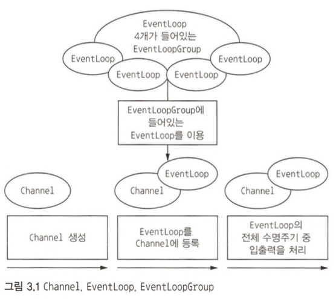
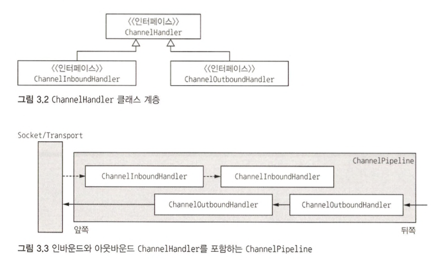

네티의 비동기 프로그래밍 모델은 Future와 콜백의 개념, 그리고 더 깊은 단계에서 이벤트를 핸들러 메서드로 발송하는 작업을 기반으로 작동한다.  
작업을 가로채고 인바운드나 아웃바운드 데이터를 즉시 변환하려면 콜백을 제공하거나 작업이 반환하는 Future를 활용하면 간단하다.  
  
네티는 이벤트를 발생시켜 Selector를 애플리케이션 밖으로 추상화하므로 개발자가 발송 코드를 직접 작성할 필요가 없다.
각 Channel에 할당되는 EventLoop는 내부적으로 다음을 비롯한 모든 이벤트를 처리한다.

1. 관심 이벤트 등록
2. 이벤트를 ChannelHandler로 발송
3. 추가 동작 스케줄링

EventLoop 자체는 한 Channel의 모든 입출력 이벤트를 처리하는 한 스레드에 의해 제어되며, EventLoop의 수명 기간 동안 달라지지 않는다.

# 이벤트와 핸들러

네티는 작업 상태의 변화를 알리기 위해 고유한 이벤트를 이용하며, 발생한 이벤트를 기준으로 적절한 동작을 트리거할 수 있다.  
다음과 같은 동작이 포함된다.  

1. 로깅
2. 데이터 변환
3. 흐름 제어
4. 애플리케이션 논리

네티는 네트워크 프레임워크이므로 이벤트 역시 인바운드 또는 아웃바운드 데이터 흐름에 대한 연관성을 기준으로 분류된다.  

1. **인바운드 이벤트**
   1. 연결 활성화 또는 비활성화
   2. 데이터 읽기
   3. 사용자 이벤트
   4. 오류 이벤트
2. **아웃바운드 이벤트**
   1. 원격 피어로 연결 열기 또는 닫기
   2. 소켓으로 데이터 쓰기 또는 플러시


위의 이미지는 이벤트 핸들러의 체인을 통해 이벤트가 처리되는 방법을 표현한다.  
네티의 `ChannelHandler`는 위의 핸들러와 같이 핸들러의 기본 추상화를 제공한다.  
**지금은 각 핸들러 인스턴스가 특정 이벤트에 반응해 실행되는 일종의 콜백이라고 이해하자.**  
  
**모든 이벤트는 핸들러 클래스의 사용자 구현 메서드로 전달할 수 있으며, 이것은 이벤트 기반 패러다임이 직접적으로 애플리케이션 구성 요소로 변환되는 좋은 사례다.**  
네티는 HTTP 및 SSL/TLS와 같은 프로토콜용 핸들러를 비롯해 곧바로 이용할 수 있는 미리 정의된 핸들러를 광범위하게 제공한다.  

# 네트워킹 추상화

## Channel 인터페이스

Channel은 자바 NIO의 기본 구조이며, 다음과 같이 정의된다.

> 하나 이상의 입출력 작업(읽기 또는 쓰기)을 수행할 수 있는 하드웨어 장치, 파일, 네트워크 소켓, 프로그램 컴포넌트와 같은 엔티티에 대한 열린 연결

일단 Channel을 들어오는(`인바운드`) 데이터와 나가는(`아웃바운드`) 데이터를 위한 **운송 수단** 이라고 볼 수 있다.  
Channel을 열거나 닫고, 연결하거나 끊을 수 있으며, 자바 기반 네트워크에서 기본 구조는 Socket 클래스다.  
기본 입출력 작업(`bind()`, `connect()`, `read()`, `write()`)은 기본 네트워크 전송에서 제공하는 기본형을 이용한다.  
  
**네티의 Channel 인터페이스는 Socket으로 직접 작업할 때의 복잡성을 크게 완화하는 API를 제공하며 다수의 미리 정의된 특수한 구현을 포함하는 광범위한 클래스 계층의 루트다.**  

1. EmbeddedChannel
2. LocalServerChannel
3. NioDatagramChannel
4. NioSctpChannel
5. NioSocketChannel
6. ...

## EventLoop 인터페이스

**연결의 수명주기 중 발생하는 이벤트를 처리하는 네티의 핵심 추상화를 정의한다.**  



1. 한 개의 EventLoopGroup은 하나 이상의 EventLoop를 포함한다.
2. 한 개의 EventLoop는 수명주기 동안 한 Thread로 바인딩된다.
3. 한 개의 EventLoop에서 처리되는 모든 입출력 이벤트는 해당 전용 Thread에서 처리된다.
4. 한 개의 Channel은 수명주기 동안 한 EventLoop에 등록할 수 있다.
5. 한 개의 EventLoop를 하나 이상의 Channel로 할당할 수 있다.
   1. 즉, 각 Channel은 한 개의 EventLoop에 등록될 수 있으며 EventLoop는 여러 개의 Channel을 가질 수 있다.

> **이 설계에서는 한 Channel의 입출력이 동일한 Thread에서 처리되므로 동기화가 사실상 필요 없다.**

## ChannelFuture 인터페이스

네티의 모든 입출력 작업은 비동기적이다. 작업이 즉시 반환되지 않을 수 있으므로 나중에 결과를 확인하기 위해 네티는 `ChannelFuture`를 제공한다.  
  
이 인터페이스의 `addListener()`는 작업이 완료되면(성공 여부와 관계없이) 알림을 받을 **ChannelFutureListener** 하나를 등록한다.  
작업이 실행되는 시점은 여러 요소에 의해 좌우되지만 실행된다는 점은 확실하다. **또한 동일한 Channel에 속하는 모든 작업은 호출된 순서와 동일한 순서로 실행된다.**  

# 데이터의 흐름을 관리하고 애플리케이션의 처리 논리를 실행하는 컴포넌트

## ChannelHandler 인터페이스

개발자의 관점에서 네티의 핵심 컴포넌트는 **인바운드와 아웃바운드의 데이터 처리에 적용되는 모든 애플리케이션 논리의 컨테이너 역할을 하고 네트워크 이벤트에 의해 트리거 되는 `ChannelHandler`다.  
**데이터를 다른 포맷으로 변환하거나 작업 중 발생한 예외를 처리하는 등 거의 모든 종류의 작업에 활용할 수 있다.**  

## ChannelPipeline 인터페이스

ChannelPipeline은 ChannelHandler 체인을 위한 컨테이너를 제공하며, 체인 상에서 인바운드와 아웃바운드 이벤트를 전파하는 API를 정의한다.  
**Channel이 생성되면 여기에 자동으로 자체적인 ChannelPipeline이 할당된다.**  

1. ChannelInitializer 구현은 ServerBootstrap에 등록된다.
2. ChannelInitializer.initChannel()이 호출되면 ChannelInitializer가 ChannelHandler의 커스텀 집합을 파이프라인에 설치한다.
3. ChannelInitializer는 ChannelPipeline에서 자신을 제거한다.

ChannelHandler는 광범위한 용도를 지원할 수 있게 특별히 설계됐으며, **ChannelPipeline을 통해 오가는 이벤트(데이터 포함)를 처리하는 모든 코드를 위한 범용 컨테이너라고 할 수 있다.**  
  
파이프라인을 통해 이벤트를 이동하는 역할은 애플리케이션의 부트스트랩 단계나 초기화 중에 설치된 ChannelHandler가 담당한다.  
이들 객체는 **이벤트를 수신하고, 구현된 처리 논리를 실행하며, 체인 상의 다음 핸들러로 데이터를 전달한다.**  
실행되는 순서는 추가된 순서에 의해 결정되며, ChannelPipeline이라고 말할 때는 이러한 ChannelHandler의 정렬된 배치 전체를 의미한다고 보면 된다.  



그림에 Socket으로 나오는 네트워크 전송에 도달하면 보통 이때 쓰기 작업이 트리거 된다.  
**네티에서 메세지를 보내는 데는 Channel에 직접 기록하거나 ChannelHandler와 연결된 ChannelHandlerContext에 기록하는 두 가지 방법이 있다.**  
전자의 방법은 메시지가 ChannelPipeline의 뒤쪽에서 시작되며, 후자의 방법은 메시지가 ChannelPipeline의 다음 핸들러에서 시작된다.  
  
> 인바운드와 아웃바운드 핸들러에서 각 메서드에 인수로 제공되는 ChannelHandlerContext를 이용해 이벤트를 현재 체인의 다음 핸들러로 전달할 수 있다.  
> 네티는 ChannelHandlerContext를 통해 다음 핸들러를 전달하는 구현체 ChannelInboundHandlerAdapter와 ChannelOutboundHandlerAdpater를 제공한다.
  
네티는 애플리케이션의 처리 논리를 쉽게 개발할 수 있게 어댑터 클래스 형태로 여러 기본 핸들러의 구현을 제공한다.  
**파이프라인의 각 ChannelHandler는 이벤트를 체인의 다음 핸들러로 전달해야 하는데, 이러한 어댑터 클래스(및 해당 상위 클래스)는 이 작업을 자동으로 해주므로 특수한 동작이 필요한 메서드와 이벤트만 재정의할 수 있다.**  

## 인코더와 디코더

네트워크 데이터는 반드시 연속된 바이트여야 하기에, 네티로 메시지를 전송하거나 수신할 때는 데이터를 변환하는 과정을 거친다.  
인바운드 메시지는 바이트에서 다른 포맷(보통은 자바 객체)으로 변환되는 디코딩을 가지며, 아웃바운드 메시지는 반대로 바이트로 인코딩된다.  
  
원하는 기능에 따라 이용할 수 있는 다양한 인코더와 디코더의 추상 클래스가 제공된다.  
다른 핸들러로 인코더와 디코더의 역할을 할 수도 있지만, ChannelHandler를 쉽게 만들 수 있게 Adapter 클래스가 있는 것처럼, **네티가 제공하는 모든 인코더/디코더 어댑터 클래스는 ChannelInboundHandler나 ChannelOutboundHandler를 구현한다.**  
  
인바운드 데이터의 경우 Channel에서 읽는 각 메시지에 대해 호출되는 `channelRead()` 메서드/이벤트를 재정의한다.  
이 메서드는 제공된 디코더의 `decode()` 메서드를 호출한 후 디코딩된 바이트를 파이프라인의 다음 ChannelInboundHandler로 전달한다.  
아웃바운드 메시지를 위한 패턴은 반대이며, 인코더가 메시지를 바이트로 변환한 후 다음 ChannelOutboundHandler로 전달한다.  

## SimpleChannelInboundHandler 추상 클래스

디코딩된 메시지를 수신하고 데이터에 비즈니스 논리를 적용하는 핸들러를 많이 필요로 하는데, 이러한 ChannelHandler를 만들려면 기본 클래스인 **SimpleChannelInboundHandler<T>** 를 확장하면 된다.  
여기서 `T`는 처리하려믄 메시지의 자바 형식이며, `channelRead0()`이 가장 중요하다.  
직접 커스텀하여 구현할 수 있지만, **현재 입출력 스레드를 블로킹하지 않아야 한다는 요건이 있다.**  

# 부트스트랩

네티의 부트스트랩 클래스는 **프로세스를 지정된 포트로 바인딩하거나 프로세스를 지정된 호스트의 저징된 포트에서 실행 중인 다른 호스트로 연결하는 등의 일을 하는 애플리케이션의 네트워크 레이어를 구성한다.**  
따라서 부트스트랩에는 클라이언트용(Bootstrap)과 서버용(ServerBootstrap)의 두 가지 유형이 있다.  
  
서버는 연결 요청을 수신해야 하므로 로컬 포트로 바인딩하는 ServerBootstrap을 이용하지만 클라이언트는 원격 호스트와 포트로 연결해야 하므로 Bootstrap을 이용한다.  
더 중요한 차이점은 **ServerBootstrap은 EventLoopGroup이 두 개 필요하다는 것이다.**  
  
서버는 각기 다른 Channel의 두 집합을 필요로 한다.  
첫 번째 집합은 로컬 포트로 바인딩된 서버 자체의 수신 소켓을 나타내는 ServerChannel 하나를 포함한다.  
두 번째 집합은 서버가 수락한 연결마다 하나씩 들어오는 클라이언트 연결을 처리하기 위해 생성된 모든 Channel을 포함한다.  


ServerChannel과 연결된 EventLoopGroup은 들어오는 연결 요청에 대해 Channel을 생성하는 역할을 EventLoop 하나에 할당한다.  
연결이 수락되면 두 번째 EventLoopGroup이 해당 Channel에 EventLoop를 할당한다.  

# 콜백

다른 메서드로 자신에 대한 참조를 제공할 수 있는 메서드다. 다른 메서드에서는 이 참조가 가리키는 메서드를 필요할 때 호출할 수 있다.  
(관심 대상에게 작업 완료를 알리는 가장 일반적인 방법 중 하나다.)  
  
네티는 이벤트를 처리할 때 내부적으로 콜백을 이용한다.  
콜백이 트리거되면 [ChannelHandler 인터페이스](https://netty.io/4.1/api/io/netty/channel/ChannelHandler.html)의 구현을 통해 이벤트를 처리할 수 있다.  
예를 들어, 아래와 같이 새로운 연결이 이뤄지면 ChannelHandler 콜백인 channelActive가 호출된다.  

```java
public class ChannelHandler extends ChannelInboundHandlerAdapter {

    // 새로운 연결이 이뤄지면 해당 메서드가 호출된다.
    @Override
    public void channelActive(ChannelHandlerContext ctx) throws Exception {
        System.out.println("Client " + ctx.channel().remoteAddress() + " connected");
        super.channelActive(ctx);
    }
}
```

# Future

작업이 완료되면 이를 애플리케이션에 알리는 한 방법으로 사용되며, 이 객체는 비동기 작업의 결과를 담는 자리표시자 역항를 하며, 미래의 어떤 시점에 작업이 완료되면 그 결과에 접근할 수 있게 해준다.  
  
JDK는 `java.util.concurrent.Future` 인터페이스를 제공하지만, 제공되는 구현에는 수동으로 작업 완료 여부를 확인하거나 완료되기 전까지 블로킹하는 기능만 있다.  
**그래서 네티는 비동기 작업이 실행됐을 때 이용할 수 있는 자체 구현 [ChannelFuture](https://netty.io/4.0/api/io/netty/channel/ChannelFuture.html)를 제공한다.**  
  
ChannelFuture에는 ChannelFutureListener 인스턴스를 하나 이상 등록할 수 있는 추가 메서드가 있다.  
작업이 완료되면 리스너의 콜백 메서드인 `operationComplete()`가 호출되며, 이 시점에 리스너는 작업이 정상적으로 완료됐는지, 아니면 오류가 발생했는지 확인할 수 있다.  
  
네티의 모든 아웃바운드 입출력 작업은 ChannelFuture를 반환하며 진행을 블로킹하는 작업은 없다.  
**네티는 기본적으로 비동기식이며 이벤트 기반이다.**  

```java
ChannelFutureListener callback = (ChannelFutureListener) future -> {
    if (future.isSuccess()) {
        // 3. 작업이 성공적인 경우 데이터를 저장할 ByteBuf를 생성
        ByteBuf buffer = Unpooled.copiedBuffer("Hello", Charset.defaultCharset());

        // 4. 데이터를 비동기식으로 원격 피어로 전송하고 ChannelFuture를 반환
        ChannelFuture wf = future.channel().writeAndFlush(buffer);
        // ...
    } else {
        // 3. 작업이 성공적이지 않다면 Future에서 예외를 꺼낸다.
        Throwable cause = future.cause();
        cause.printStackTrace();
    }
};

System.out.println("Client " + ctx.channel().remoteAddress() + " connected");

Channel channel = null;

// 1. 원격 피어로 비동기 연결을 만듦
ChannelFuture future = channel.connect(new InetSocketAddress("192.68.0.01", 25));

// 2. 작업이 완료되면 알림을 받음
future.addListener(callback);
```

콜백과 Future는 상호 보완적 메커니즘이며 둘의 조합을 통해 네티의 핵심 구성요소 중 하나를 형성한다.  

