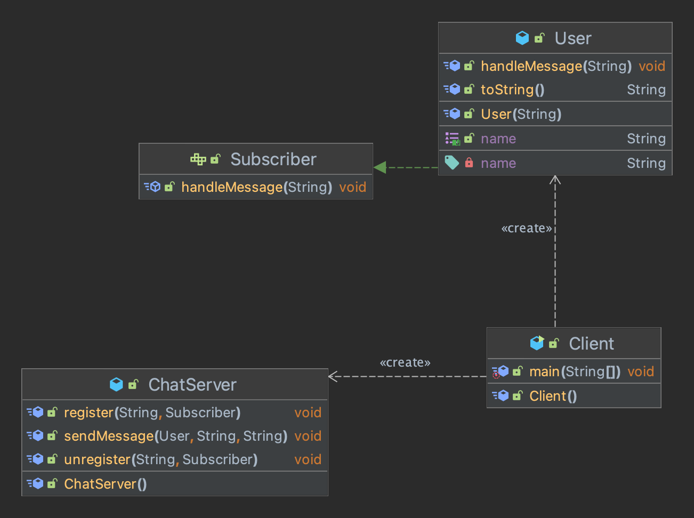
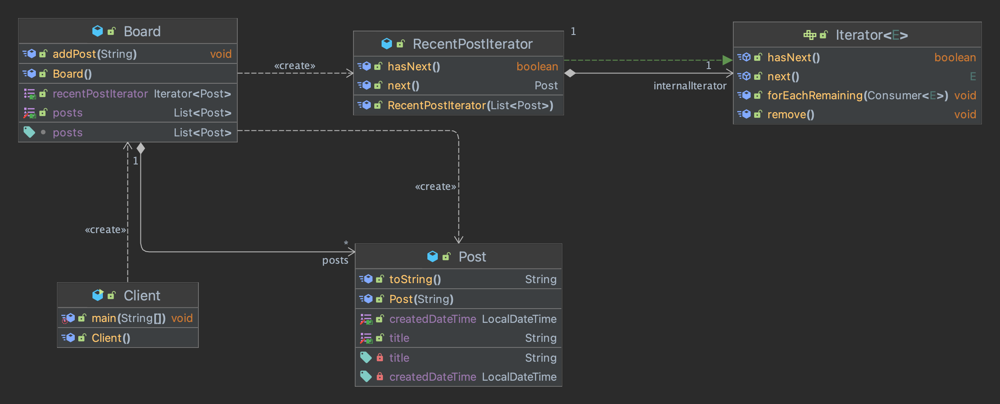

<!-- TOC -->

- [**Visitor Pattern**](#visitor-pattern)
  - [Before](#before)
  - [After](#after)
  - [장점과 단점](#장점과-단점)
  - [적용 예시](#적용-예시)
- [**Observer Pattern**](#observer-pattern)
- [**Iterator Pattern**](#iterator-pattern)

<!-- /TOC -->

# **[Visitor Pattern](https://github.com/jdalma/design-patterns/tree/master/src/main/java/me/whiteship/designpatterns/_03_behavioral_patterns/_23_visitor)**

**기존 코드를 변경하지 않고 새로운 기능을 추가하는 방법**  
- `더블 디스패치 (Double Dispatch)`를 활용할 수 있다.
- 디스패치란? **요청이 들어오면 다형성을 적용하여 구체적인 클레스나 메소드를 런타임에 위임하는 과정이다**
- `Visitor`는 `Element`를 알고있고, `Visitor`의 구현체인 `ConcreteVisitor`가 `ElementA`와 `ElementB`를 선택하여 호출하는 것

```mermaid
classDiagram
    class Visitor {
        + visit(ElementA)
        + visit(ElementB)
    }
    class ConcreteVisitor {
        + visit(ElementA)
        + visit(ElementB)
    }
    class Element {
        <<interface>>
        + accept(Visitor)
    }
    class ElementA {
        + accept(Visitor)
    }
    class ElementB {
        + accept(Visitor)
    }
    ElementA <|-- ConcreteVisitor : Association
    ElementB <|-- ConcreteVisitor : Association
    Element <|.. ElementA : Impl
    Element <|.. ElementB : Impl
    Visitor <|-- Element : Association
    Visitor <|.. ConcreteVisitor : Realization
```

**여러 디바이스의 출력 기능을 구현하기**  
- 디바이스별로 출력 기능을 구분하려한다면 `Rectangle`안에서 `Watch`면 **작게** `Phone`이면 **크게** 분기로 해야할 것이다.

## Before

```mermaid
classDiagram
    Shape <.. Client : Create
    Device <.. Client : Create
    Device <|.. Watch : Impl
    Device <|.. Phone : Impl
    Shape <|.. Triangle : Impl
    Shape <|.. Rectangle : Impl
    Shape <|.. Circle : Impl
    
    class Client {
    }
    class Device {
        <<interface>>
    }
    class Watch {

    }
    class Phone {

    }
    class Shape {
        <<interface>>
        + printTo(Deivce)
    }
```

```java
public void printTo(Device device) {
    if (device instanceof Phone) {
        System.out.println("print Circle to phone");
    } else if (device instanceof Watch) {
        System.out.println("print Circle to watch");
    }
}
```

이런 식의 **분기문이 추가될 것이 뻔하다.**  

## After

```mermaid
classDiagram
    Shape <.. Client : Create
    Device <.. Client : Create
    Device <|.. Watch : Impl
    Device <|.. Phone : Impl
    Shape <|.. Triangle : Impl
    Shape <|.. Rectangle : Impl
    Shape <|.. Circle : Impl
    
    class Client {
    }
    class Device {
        <<interface>>
        + print(Circle)
        + print(Rectangle)
        + print(Triangle)
    }
    class Watch {
        + print(Circle)
        + print(Rectangle)
        + print(Triangle)
    }
    class Phone {
        + print(Circle)
        + print(Rectangle)
        + print(Triangle)
    }
    class Shape {
        <<interface>>
        + accept(Device)
    }
    class Circle {
        + accept(Circle)
    }
    class Rectangle {
        + accept(Rectangle)
    }
    class Triangle {
        + accept(Triangle)
    }
```

1. `Shape`의 구현체들 `Circle`,`Rectangle`,`Triangle`이 **Element**
2. `Device` 인터페이스가 **Visitor**
3. `if-else` 분기문들이 사라지고 **실제 Device 구현체들이 어떤 작업을 처리할지 정한다.**
4. **Dispatch가 두 번 일어난다**
   1. `Shape`에 있는 `accept()`를 호출하기 위해 어디 구현체의 `accept()` 인지 확인하고
   2. 어떤 `Device`의 `print()`인지 확인한다.

```java
public static void main(String[] args) {
    Shape rectangle = new Rectangle();
    Device device = new Phone();
    rectangle.accept(device);
}
```

## 장점과 단점

1. 기존 코드를 수정하지 않고 확장이 가능하다 `OCP`
   1. 추가되는 `Device`들은 각 `print`만 구현하면 된다
2. 구조가 복잡하여 **더블 디스패치를 이해하기가 힘들다.**
3. `Element`가 추가되거나 사라지면 각 `Deivce` 구현체들의 코드가 다 수정되어야 한다.

## 적용 예시

1. 자바
   1. FileVisitor, SimpleFileVisitor
      1. `FileVisitResult`를 반환한다.
   2. AnnotationValueVisitor
   3. ElementVisitor
2. 스프링
   1. **BeanDefinitionVisitor**

***

# **[Observer Pattern](https://github.com/jdalma/design-patterns/commit/33aed09b07c54f1ba98e94a1113a8d7a6d30c918)**

사용자1이 메세지를 등록하면 사용자2는 어떻게 메세지를 받아야할까?  
**폴링**보단 사용자1이 메세지를 등록하면 상태 변경을 받아 사용자2에게 전송을 해주는것이 더 합리적일 것이다.  
  
**다수의 객체가 특정 객체 상태 변화를 감지하고 알림을 받는 패턴**  
- `발행-구독 패턴`을 구현할 수 있다.

[UML Aggregation, Composition?](https://www.nextree.co.kr/p6753/)
```mermaid
classDiagram
    Observer <--o Subject
    ConcreteObserver ..|> Observer
    class Subject {
        - observers: Observer[]
        + subscribe(Observer)
        + unsubscribe(Observer)
        + notify()
    }
    class Observer {
        <<interface>>
        + update()
    }
    class ConcreteObserver {
        + update()
    }
```



`ChatServer`는 `Map`으로 주제에 해당하는 구독자들을 관리한다.  
클라이언트에서 `sendMessage()`를 호출한다면, 주제에 해당하는 구독자들을 순회하며 메세지를 전송한다.  
  
**장점**    
상태를 변경하는 객체`Publisher`와 변경을 감지하는 객체`Subscriber`의 관계를 느슨하게 유지할 수 있다.  
`Subject`의 상태 변경을 주기적으로 조회하지 않고 자동으로 감지할 수 있다.  
런타임에 구독자(Observer)를 추가하거나 제거할 수 있다.  
  
**단점**  
인메모리로 관리할 시 다수의 구독자(Observer)객체를 등록이후 해지하지 않는다면 메모리 누수가 발생한다.  
  
**자바에서 찾아보는 옵저버 패턴**  
`java.util.Observer`와 `java.util.Observable`은 자바 9이후 부터 권장되지 않는다.  
1. **`java.util.concurrent.Flow` 사용을 권장한다.** [예제](https://gist.github.com/jdalma/4cafecfe12609baf2db35180e5ee1297)
   - [Reactive Streams](http://www.reactive-streams.org/) 사양에 해당한다.  
   - 비동기 프로그래밍을 통해 백프레셔 조절도 가능하다.
2. **`java.beans.PropertyChangeListener`와 `java.beans.PropertyChangeSuppoer` 사용을 권장한다.** [예제](https://gist.github.com/jdalma/5d4f08dd779df841420cd03d0e1e8489)
  
**스프링에서 찾아보는 옵저버 패턴**  
1. SpringApplication [예제](https://gist.github.com/jdalma/bdd78ab34ea272f7811d8746d5a801b7)
   - `ApplicationEventPublisher`
   - `ApplicationEvent`
   - `ApplicationRunner`
     - 스프링 부트가 제공하는 인터페이스
     - [Spring Boot 애플리케이션에서 ApplicationRunner를 사용하는 방법은 무엇입니까?](https://jhooq.com/applicationrunner-spring-boot/)
     - [`spring docs` Application Availability](https://docs.spring.io/spring-boot/docs/current/reference/htmlsingle/#features.spring-application.application-availability)
     - [`spring docs` ApplicationRunner 또는 CommandLineRunner 사용](https://docs.spring.io/spring-boot/docs/current/reference/htmlsingle/#features.spring-application.command-line-runner)

***

# **[Iterator Pattern](https://github.com/jdalma/design-patterns/commit/7b2ba06f4ac178d833a034902e4dcde09a15f4e9)**

**집합 객체 내부 구조를 노출시키지 않고 순회하는 방법을 제공하는 패턴**  
- 집합 객체를 순회하는 클라이언트 코드를 변경하지 않고 다양한 순회 방법을 제공할 수 있다.
  
```mermaid
classDiagram
    Client --> Iterator
    Client --> Aggregate
    ConcreteIterator ..|> Iterator
    ConcreteAggregate ..|> Aggregate
    ConcreteIterator <--> ConcreteAggregate

    class Iterator {
        <<interface>>
        + getNext()
        + hasNext()
    }
    class ConcreteIterator {
        + getNext()
        + hasNext()
    }
    class Aggregate {
        <<interface>>
        + createIterator(): Iterator
    }
    class ConcreteAggregate {
        + createIterator(): Iterator
    }
    
```



클라이언트는 `Board`안에 `Post`가 어떤 자료구조로 관리되고 있는지 모르게 하기 위해 `Iterator`를 구현한 `ConcreteIterator`를 추가하여 `Board`에서 해당 `Iterator`를 반환하여, 클라이언트는 해당 `Iterator`에만 의존하게 한다.  
  
**장점**  
집합 객체가 가지고 있는 객체들에 손쉽게 접근할 수 있다.  
일관된 인터페이스를 사용해 여러 형태의 집합 구조를 순회할 수 있다.  
  
**단점**  
클래스가 늘어나고 복잡도가 증가하며 `Aggregate`인 `Board`가 수정되어야 할 것이다.  
  
**자바에서 사용되는 이터레이터 패턴**  
- `java.util.Enumeration`
- 자바가 제공하는 `StAX`(Streaming Api For XML)라이브러리
  - 콘솔(커서) 기반의 API
    - 하나의 인스턴스만을 사용하여 내부의 내용만 변경됨
  - [이터레이터 기반의 API](https://github.com/jdalma/design-patterns/blob/master/src/main/java/me/whiteship/designpatterns/_03_behavioral_patterns/_16_iterator/_03_java/IteratorInJava.java)를 제공한다
    - 모든 요소당 새로운 인스턴스를 생성
  
**스프링에서 사용되는 이터레이터 패턴**  
- `org.springframework.util.CompositeIterator`