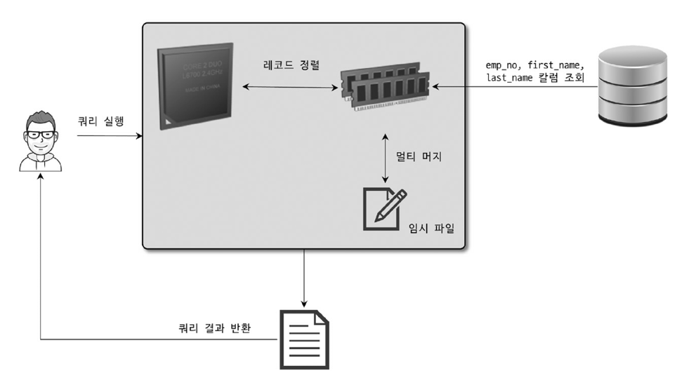
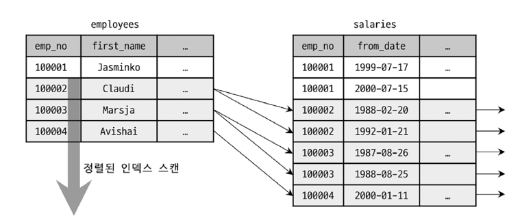
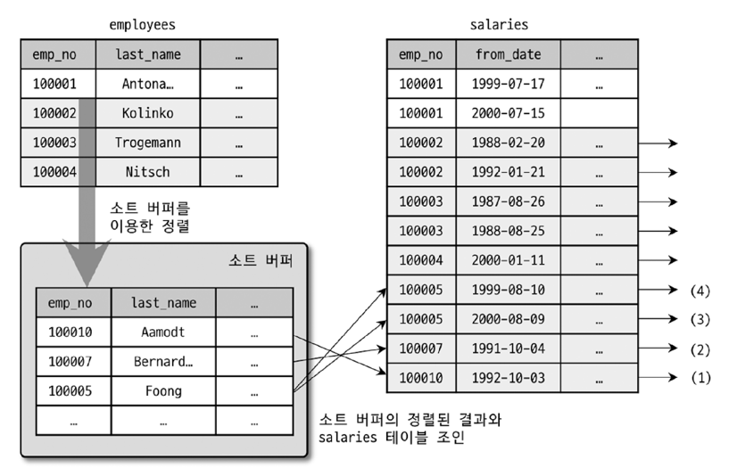
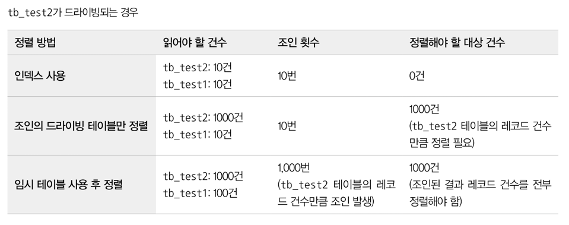
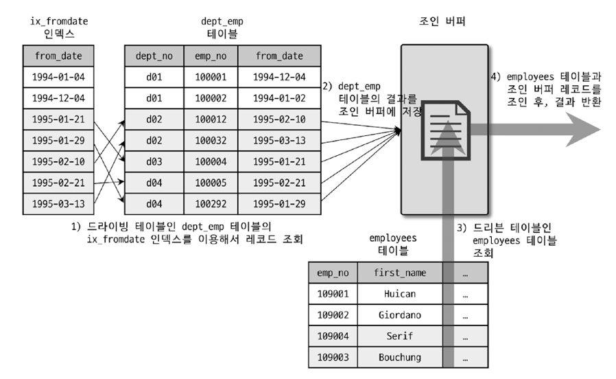
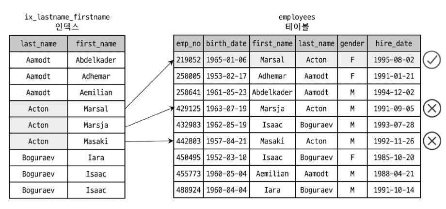
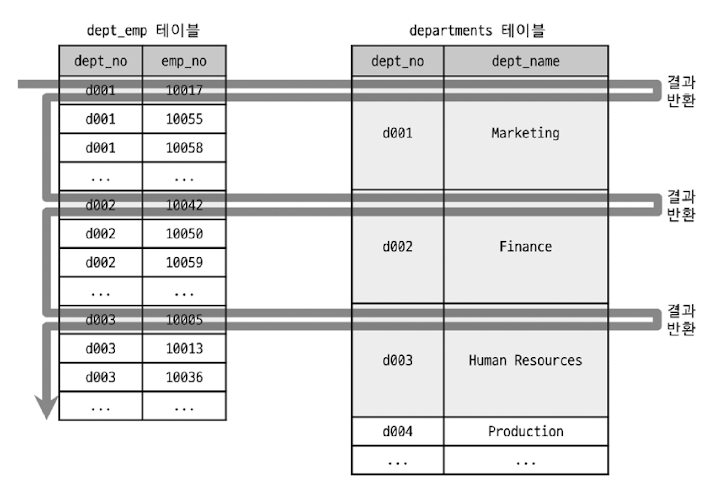
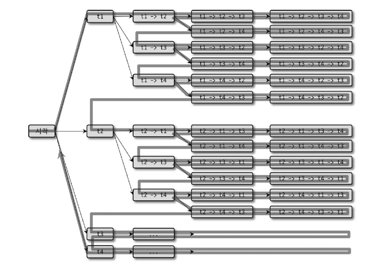
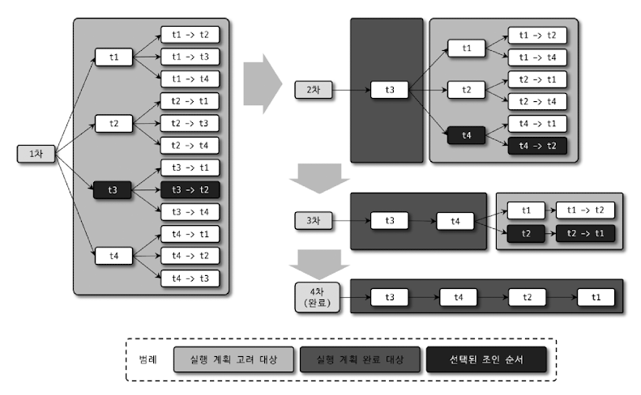

MySQL에서는 쿼리를 최적으로 실행하기 위해 각 테이블의 데이터가 어떤 분포로 저장돼 있는지 통계 정보를 참조하며, 그러한 기본 데이터를 비교해 최적의 실행 계획을 수립하는 작업이 필요하다.  
이러한 기능을 옵티마이저가 담당한다.  
  
어떤 DBMS든지 쿼리의 실행 계획을 수립하는 옵티마이저는 가장 복잡한 부분으로 알려져 있으며, 옵티마이저가 만들어 내는 실행 계획을 이해하는 것 또한 상당히 어려운 부분이다.  
하지만 실행 계획에 표시되는 내용을 이해하려면 옵티마이저가 실행하는 최적화에 대헤 어느 정도 지식을 갖추고 있어야 실행 계획의 불합리한 부분을 찾아내고, 더 최적화된 방법으로 실행 계획을 수립하도록 유도할 수 있다.  
  
# 메모

1. 여러 테이블을 조인해서 연산할 때 임시 테이블로 올려서 작업한다는 말을 많이 한다. 나는 임시 테이블이 메모리에 올라가는 모든 상황을 표현하는 줄 알았지만, 임시 테이블과 소트 버퍼는 엄연히 구분된다.
2. GROUP BY에 사용된 조건은 인덱스를 사용해서 처리할 수 없다.
3. 인덱스 레인지 스캔에서는 인덱스의 유니크한 값의 수가 많을수록 성능이 향상되는 반면 루스 인덱스 스캔에서는 인덱스의 유니크한 값이 수가 적을수록 성능이 향상된다.
   1. 즉, 루스 인덱스 스캔은 분포도가 좋지 않은 인덱스일수록 더 빠르며, 루스 인덱스 스캔으로 처리되는 쿼리에서는 별도의 임시 테이블이 필요하지 않다.
4. 인덱스를 비교하는 작업은 실제 InnoDB 스토리지 엔진이 수행하지만 테이블의 컬럼 조건을 비교하는 작업은 MySQL 엔진이 수행하는 작업이다.
   1. 그래서 MySQL 5.6부터 MySQL 엔진이 인덱스에 존재하는 컬럼 조건이 있다면 스토리지 엔진에게 모두 전달한다.
5. 옵티마이저는 여러 개의 테이블을 조인시 레코드 결과가 작은 테이블들을 드라이빙 테이블로 삼는다.
6. derived table 과 인덱스 스킵 스캔이 인상 깊다. 


# 퀴리 실행 절차

1. **사용자로부터 요청된 SQL 문장을 잘게 쪼개서 이해할 수 있는 수준으로 분리(파스 트리)한다.**
   - 이 단계에서 SQL 문장의 문법적인 에러를 찾는다.
2. **첫 번째 단계에서 만들어진 SQL 파스 트리의 정보를 확인하면서 어떤 테이블부터 읽고 어떤 인덱스를 이용해 테이블을 읽을지 선택한다.**
   - 불필요한 조건 제거 및 복잡한 연산의 단순화
   - 여러 테이블의 조인이 있는 경우 어떤 순서로 테이블을 읽을지 결정
   - 각 테이블에 사용된 조건과 **인덱스 통계 정보** 를 이용해 사용할 인덱스를 결정
   - 가져온 레코드들을 임시 테이블에 넣고 다시 한번 가공해야 하는지 결정
   - 이 단계를 **최적화 및 실행 계획 수립** 단계라고 하며, **옵티마이저에서 처리한다.** 이 단계가 완료되면 **실행 계획** 이 만들어진다.
3. **두 번째 단계에서 결정된 테이블의 읽기 순서나 선택된 인덱스를 이용해 스토리지 엔진으로부터 데이터를 가져온다.**
   - 수립된 실행 계획대로 스토리지 엔진에 레코드를 읽어오도록 요청하고, MySQL 엔진에서는 스토리지 엔진으로부터 받은 레코드를 조인하거나 정렬하는 작업을 수행한다.

첫 번째 단계와 두 번째 단계는 거의 MySQL엔진에서 처리하며, 세 번째 단계는 MySQL 엔진과 스토리지 엔진이 동시에 참여해서 처리한다.  

# 옵티마이저의 종류

**규칙 기반 최적화** 는 기본적으로 대상 테이블의 레코드 건수나 선택도 등을 고려하지 않고 옵티마이저에 내장된 우선순위에 따라 실행 계획을 수립하는 방식을 의미한다.  
통계 정보(테이블의 레코드 건수나 컬럼값의 분포도)를 조사하지 않고 실행 계획이 수립되기 때문에 **같은 쿼리에 대해서는 거의 항상 같은 실행 방법을 만들어 내기 때문에 오래전부터 거의 사용되지 않는다.**  
  
**비용 기반 최적화** 는 쿼리를 처리하기 위한 여러가지 가능한 방법을 만들고, **각 단위 작업의 비용(부하) 정보와 대상 테이블의 예측된 통계 정보를 이용해 실행 계획별 비용을 산출한다.**  

# 기본 데이터 처리

모든 RDBMS는 데이터를 정렬하거나 그루핑하는 등의 기본 데이터 가공 기능을 가지고 있다.  
하지만 결과물은 동일하더라도 RDBMS별로 그 결과를 만들어 내는 과정은 천차만별이다.  
기본적인 가공을 위해 MySQL 서버가 어떤 알고리즘을 사용하는지 살펴보자.  

## 풀 테이블 스캔과 풀 인덱스 스캔

풀 테이블 스캔은 인덱스를 사용하지 않고 테이블의 데이터를 처음부터 끝까지 읽어서 요청된 작업을 처리하는 작업을 의미한다.  
아래와 같은 조건일 때 풀 테이블 스캔이 발생한다.  

1. 테이블의 레코드 건수가 너무 작아서 **인덱스를 통해 읽는 것보다 풀 테이블 스캔을 하는 편이 더 빠른 경우(일반적으로 테이블이 페이지 1개로 구성된 경우)**
2. WHERE 절이나 ON 절에 인덱스를 이용할 수 있는 **적절한 조건이 없는 경우**
3. 인덱스 레인지 스캔을 사용할 수 있는 쿼리라고 하더라도 **옵티마이저가 판단한 조건 일치 레코드 건수가 너무 많은 경우(인덱스의 B-Tree를 샘플링해서 조사한 통계 정보 기준)**

일반적으로 테이블의 전체 크기는 인덱스보다 훨씬 크기 때문에 풀 테이블 스캔은 상당히 많은 디스크 읽기가 필요하다.  
그래서 **풀 테이블 스캔을 실행할 때 한꺼번에 여러 개의 블록이나 페이지를 읽어오는 기능을 내장하고 있다.**  
페이지 한 개씩 읽어오는 줄 알지만 InnoDB 스토리지 엔진은 **특정 테이블의 연속된 데이터 페이지가 읽히면 백그라운드 스레드에 의해 `리드 어헤드` 작업이 자동으로 시작된다.**  

> **리드 어헤드**  
> 어떤 영역의 데이터가 앞으로 필요해지리라는 것을 예측해서 요청이 오기 전에 미리 디스크에서 읽어 InnoDB의 버퍼 풀에 가져다 두는 것을 의미힌다.

즉, 풀 테이블 스캔이 실행되면 처음 몇 개의 데이터 페이지는 포그라운드 스레드가 페이지 읽기를 실행하지만 특정 시점부터는 읽기 작업을 백그라운드 스레드로 넘긴다.  
백그라운드 스레드는 한 번에 4개부터 최대 64개의 페이지를 읽으면서 버퍼 풀에 저장해 둔다.  
(데이터 웨어하우스용으로 MySQL을 사용한다면 백그라운드 스레드로 읽기 작업을 전가하는 임계치를 낮게 설정하는 것도 좋은 방법이다.)  
  
**리드 어헤드는 인덱스를 처음부터 끝까지 스캔하는 풀 인덱스 스캔에서도 동일하게 사용된다.**  

```sql
SELECT COUNT(*) FROM EMPLOYEES;
```

위의 쿼리는 풀 테이블 스캔으로 예상할 수 있지만 **단순히 레코드의 건수만 필요로 하는 쿼리라면 용량이 작은 인덱스를 선택하는 것이 디스크 읽기 횟수를 줄일 수 있기 때문에 풀 인덱스 스캔을 하게 될 가능성이 높다.**  

## 병렬 처리

MySQL 서버에서도 하나의 쿼리를 여러 스레드가 작업을 나누어 동시에 처리하는 병렬 처리가 가능해졌다.  
`innodb_parallel_read_threads` 시스템 변수를 이용해 하나의 쿼리를 최대 몇 개의 스레드를 이용해서 처리할지를 설정할 수 있다.  
**아무런 WHERE 조건 없이 단순히 테이블의 전체 건수를 가져오는 쿼리만 병렬로 처리할 수 있다.**  

- [ALTER TABLE](https://dev.mysql.com/blog-archive/mysql80-innodb-parallel-threads-ddl/)도 적용된다. [Configuring Parallel Threads for Online DDL Operations](https://dev.mysql.com/doc/refman/8.0/en/online-ddl-parallel-thread-configuration.html)


## ORDER BY 처리 (Using filesort)

정렬을 처리하는 방법은 **인덱스를 이용하는 방법** 과 **쿼리가 실행될 때 `Filesort`라는 별도의 처리를 이용하는 방법** 으로 나눌 수 있다.  

|  | **장점** | **단점** |
| :-----: | :-----: | :-----: |
| **인덱스 이용** | INSERT, UPDATE, DELETE 쿼리가 실행될 때 이미 인덱스가 정렬돼 있어서 순서대로 읽기만하면 되므로 매우 빠르다. | INSERT, UPDATE, DELETE 작업 시 부가적인 인덱스 추가/삭제 작업이 필요하므로 느리다.<br/>인덱스 때문에 디스크 공간이 더 많이 필요하다.<br/>인덱스의 개수가 늘어날수록 InnoDB의 버퍼 풀을 위한 메모리가 많이 필요하다.  |
| **Filesort 이용** | 인덱스를 생성하지 않아도 되므로 인덱스를 이용할 때의 단점이 장점으로 바뀐다.<br/>정렬해야 할 레코드가 많지 않으면 메모리에서 Filesort가 처리되므로 충분히 빠르다. | 정렬 작업이 쿼리 실행 시 처리되므로 레코드 대상 건수가 많아질수록 쿼리의 응답 속도가 느리다. |

아래와 같은 이유로 모든 정렬을 인덱스를 이용하도록 튜닝하기란 거의 불가능하다.

1. 정렬 기준이 너무 많아서 요건별로 모두 인덱스를 생성하는 것이 불가능한 경우
2. GROUP BY의 결과 또는 DISTINCT 같은 처리의 결과를 정렬해야 하는 경우
3. UNION의 결과와 같이 임시 테이블의 결과를 다시 정렬해야 하는 경우
4. 랜덤하게 결과 레코드를 가져와야 하는 경우

인덱스를 이용하지 않고 별도의 정렬 처리를 수행했는지는 실행 계획의 `Extra` 컬럼에 `"Using filesort"` 메시지가 표시되는지 여부로 판단할 수 있다.  
정렬이 어떻게 처리되는지 정렬의 특성을 이해하면 쿼리를 튜닝할 때 어떻게 하면 조금이라도 더 빠른 쿼리가 될지 쉽게 판단할 수 있다.  

### 소트 버퍼

MySQL은 정렬을 수행하기 위해 **별도의 메모리 공간을 할당받아서 사용** 하는데, 이 메모리 공간을 **소트 버퍼** 라고 한다.  
**정렬이 필요한 경우에만 할당되며, 쿼리의 실행이 완료되는 즉시 반납된다.**  
버퍼의 크기는 정렬해야 할 레코드의 크기에 따라 가변적으로 증가하지만 최대 사용 가능한 소트 버퍼의 공간은 `sort_buffer_size` 시스템 변수로 설정할 수 있다.  
  
정렬해야 할 레코드가 아주 소량이어서 메모리에 할당된 소트 버퍼만으로 정렬할 수 있다면 아주 빠르게 정렬이 처리될 거싱다.  
하지만 정렬해야 할 레코드의 건수가 소트 버퍼로 할당된 공간보다 크다면 **정렬해야 할 레코드를 여러 조각으로 나눠서 처리하는데, 이 과정에서 임시 저장을 위해 디스크를 사용한다.**  
즉, 메모리의 소트 버퍼에서 정렬을 수행하고, 그 결과를 임시로 디스크에 기록하고 다시 레코드를 가져와서 다시 정렬해여 디스크에 기록하는 것을 반복한다.  
이처럼 각 버퍼 크기만큼 정렬된 레코드를 다시 병합하면서 정렬을 수행해야 한다.  
이 병합 작업을 **멀티 머지** 라고 표현하며, 수행된 멀티 머지 횟수는 `Sort_merge_passes`라는 상태 변수에 누적해서 집계된다.  
  
이와 같은 작업은 모두 디스크 읽기와 쓰기를 유발하며, 레코드 건수가 많을수록 이 반복 작업의 횟수가 많아진다.  
소트 버퍼를 크게 설정하면 빨라질 것이라고 예상할 수 있지만 실제 벤치마크 결과로는 큰 차이를 보이진 않았다.  
일반적으로 소트 버퍼의 크기는 `56KB ~ 1MB`가 적절해 보인다.  
  
### 정렬 알고리즘

레코드를 정렬할 때 레코드 전체를 소트 버퍼에 담을지 또는 정렬 기준 컬럼만 소트 버퍼에 담을지에 따라 **"싱글 패스"** 와 **"투 패스"** , 두 가지 정렬 모드로 나눌 수 있다.  
정렬을 수행하는 쿼리가 어떤 정렬 모드를 사용하는지는 다음과 같이 옵티마이저 트레이스 기능으로 확인할 수 있다.  

```sql
mysql> SET optimizer_trace="enabled=on",END_MARKERS_IN_JSON=on;
mysql> SET optimizer_trace_max_mem_size=1000000;

mysql> select * from tb_child order by id;
mysql> select * from information_schema.optimizer_trace \G
*************************** 1. row ***************************
                            QUERY: select * from tb_child order by id
                            TRACE: {
  "steps": [
    {
      "join_preparation": {
        "select#": 1,
        "steps": [
          {
            "expanded_query": "/* select#1 */ select `tb_child`.`id` AS `id`,`tb_child`.`pid` AS `pid`,`tb_child`.`fd` AS `fd` from `tb_child` order by `tb_child`.`id`"
          }
        ] /* steps */
      } /* join_preparation */
    },
    {
      "join_optimization": {
       ...
      } /* join_optimization */
    },
    {
      "join_execution": {
        "select#": 1,
        "steps": [
        ] /* steps */
      } /* join_execution */
    }
  ] /* steps */
}
```

1. `<sort_key, rowid>` : 정렬 키와 레코드의 ROW ID만 가져와서 정렬하는 방식
2. `<sort_key, additional_fields>` : 정렬 키와 레코드 전체를 가져와서 정렬하는 방식으로, 레코드의 컬럼들은 고정 사이즈로 메모리 저장
3. `<sorkt_key, packed_additional_fields>` : 정렬 키와 레코드 전체를 가져와서 정렬하는 방식으로, 레코드의 컬럼들은 가변 사이즈로 메모리 저장

첫 번째 방식을 **"투 패스" 정렬 방식** 이라 부르고, 두 번째와 세 번째 방식을 **"싱글 패스" 정렬 방식** 이라고 한다.  
세 번째 방식은 MySQL 5.7 버전부터 정렬을 위한 메모리 공간의 효율적인 사용을 위해 도입됐다.  

<h3>싱글 패스 정렬 방식</h3>

**소트 버퍼에 정렬 기준 컬럼을 포함해 SELECT 대상이 되는 컬럼 전부를 담아서 정렬을 수행하는 정렬 방식이다.**  

```sql
SELECT emp_no, first_name, last_name
FROM employees
ORDER BY first_name;
```



처음 employees 테이블을 읽을 때 정렬에 필요하지 않은 last_name 컬럼까지 전부 읽어서 소트 버퍼에 담고 정렬을 수행한다.  
그리고 정렬이 완료되면 정렬 버퍼의 내용을 그대로 클라이언트로 넘겨주는 과정을 볼 수 있다.  

<h3>투 패스 정렬 방식</h3>

정렬 대상 컬럼과 프라이머리 키 값만 소트 버퍼에 담아서 정렬을 수행하고, 정렬된 순서대로 다시 프라이머리 키로 테이블을 읽어서 SELECT할 컬럼을 가져오는 정렬 방식으로, 싱글 패스 정렬 방식이 도입되기 이전부터 사용하던 방식이다.  
하지만 MySQL 8.0에서도 여전히 특정 조건에서는 투 패스 정렬 방식을 사용한다.  
  


처음 employees 테이블을 읽을 때는 정렬에 필요한 두 개의 컬럼을 읽어 정렬을 수행했다.  
이 정렬이 완료되면 그 결과 순서대로 **테이블을 한 번 더 읽어서 last_name을 가져와 결과를 클라이언트 쪽으로 넘긴다.**  
아래와 같은 경우 투 패스 정렬 방식이 실행된다.  
  
1. 레코드의 크기가 `max_length_for_sort_data` 시스템 변수에 설정된 값보다 클 때
2. BLOB이나 TEXT 타입의 컬럼이 SELECT 대상에 포함할 때
  
> 새로운 정렬 방식인 싱글 패스는 이러한 추가 읽기 작업이 없지만 더 많은 소트 공간이 필요하고,  
> 투 패스 정렬 방식은 소트 버퍼는 싱글 패스 보단 작게 사용하지만 추가적인 읽기 작업이 필요하다는 차이점이 있다.  
> 즉, **레코드의 크기나 건수가 작은 경우 싱글 패스가 빠르며, 레코드의 크기나 건수가 클 경우 투 패스가 효율적이다.**  
  
### 정렬 처리 방법

쿼리에 ORDER BY가 사용되면 반드시 아래의 3가지 처리 방법 중 하나로 정렬이 처리된다.  
뒤쪽에 있는 정렬 방법으로 갈수록 처리 속도는 떨어진다.  

| **정렬 처리 방법** | **실행 계획의 Extra 컬럼 내용** |
| :--- | :--- |
| 인덱스를 사용한 정렬 | 별도 표기 없음 |
| 조인에서 드라이빙 테이블만 정렬 | `"Using filesort"` 메시지가 표시됨 |
| 조인에서 조인 결과을 임시 테이블로 저장 후 정렬 | `"Using temporary; Using filesort"` 메시지가 표시됨 |

옵티마이저는 먼저 인덱스를 사용할 수 있는지 확인하고 사용할 수 없다면 WHERE 조건에 일치하는 레코드를 검색해 정렬 버퍼에 저장하면서 정렬을 처리(Using filesort)한다.  
이때 정렬 대상 레코드를 최소화하기 위해 아래의 두 가지 방법 중 하나를 선택한다.  

1. **조인의 드라이빙 테이블만 정렬한 다음 조인을 수행**
2. **조인이 끝나고 일치하는 레코드를 모두 가져온 후 정렬을 수행**

일반적으로 조인이 수행되면서 레코드 건수와 레코드의 크기는 거의 배수로 불어나기 때문에 가능하다면 **드라이빙 테이블만 정렬한 다음 조인을 수행하는 방법이 효율적이다.**  
  
> 드라이빙 테이블이란 쿼리 실행 계획에서 **조인 연산을 시작하는 주된 테이블** 을 의미한다.  
> 이 테이블은 조인의 기준이 되며, 다른 테이블은 드리븐 테이블이라고 한다.  
> 즉, **쿼리 최적화 과정에서 옵티마이저가 결정하는 조인 순서에 따라, 먼저 스캔되고 처리되는 테이블이 드라이빙 테이블이 된다.**  
> 1. 인덱스 사용 가능 여부
> 2. 로우 추정치 : 가능한 적은 로우를 처리하는 테이블을 드라이빙 테이블로 선택하려 한다.
> 3. WHERE 절과 JOIN 조건
> 드라이빙 테이블의 선택은 쿼리의 성능에 큰 영향을 미치기 때문에 때로는 쿼리의 조인 순서를 수동으로 조정하거나, 인덱스를 추가하거나 수정하여 성능을 개선할 필요가 있다.


<h3>첫 번째. 인덱스를 사용한 정렬</h3>

인덱스를 이용한 정렬을 위해서는 **반드시 ORDER BY에 명시된 컬럼이 제일 먼저 읽는 테이블(조인이 사용된 경우 드라이빙 테이블)에 속하고, ORDER BY의 순서대로 생성된 인덱스가 있어야 하며 WHERE 절에 첫 번째로 읽는 테이블의 컬럼에 대한 조건이 있다면 그 조건과 ORDER BY는 같은 인덱스를 사용할 수 있어야 한다.**  
(B-Tree 계열의 인덱스가 아닌 해시 인덱스나 전문 검색 인덱스등은 인덱스를 이용한 정렬을 사용할 수 없다.)  
  
인덱스를 이용한 정렬은 실제 인덱스의 값이 정렬돼 있기 때문에 인덱스의 순서대로 읽기만 하면 된다.  

```sql
SELECT *
FROM employees e, salaries s
WHERE s.emp_no = e.emp_no
AND e.emp_no BETWEEN 100002 AND 100020
ORDER BY e.emp_no;
```




emp_no 컬럼으로 정렬이 필요한데, 인덱스를 사용하면서 자동으로 정렬이 된다고 일부러 ORDER BY emp_no를 제거하는 것은 좋지 않은 선택이다.  
ORDER BY 절을 명시해두면 성능상의 손해가 없음은 물론이고 예외 상황이 발생하여 버그로 연결되지 않는다.  
  
즉, 인덱스를 사용한 정렬이 가능한 이유는 **B-Tree 인덱스가 키 값으로 정렬돼 있기 때문이다.**  
또한 **조인이 네스티드-루프 방식으로 실행되기 때문에 조인 때문에 드라이빙 테이블의 인덱스 읽기 순서가 흐트러지지 않는다.**  
(하지만 조인이 사용된 쿼리의 실행 계획에 조인 버퍼가 사용되면 순서가 흐트러질 수 있기 때문에 주의해야 한다.)  

<h3>두 번째. 조인의 드라이빙 테이블만 정렬</h3>

일반적으로 조인이 수행되면 결과 레코드의 건수가 몇 배로 불어나고, 레코드 하나하나의 크기도 늘어난다.  
그래서 **조인을 실행하기 전에 첫 번째 테이블의 레코드를 먼저 정렬한 다음 조인을 실행하는 것이 정렬의 차선책이 된다.**  

```sql
SELECT *
FROM employees e, salaries s
WHERE s.emp_no = e.emp_no
AND e.emp_no BETWEEN 100002 AND 100020
ORDER BY e.last_name;
```

우선 WHERE 절이 다음 두 가지 조건을 갖추고 있기 때문에 옵티마이저는 employees 테이블을 드라이빙 테이블로 선택할 것이다.  

1. **WHERE 절의 검색 조건 `e.emp_no BETWEEN 100002 AND 100020`은 employees의 프라이머리 키이기 때문에 작업량을 줄일 수 있다.**
2. **드리븐 테이블(salaries)의 조인 컬럼인 emp_no 컬럼에 인덱스가 있다.**

검색은 인덱스 레인지 스캔으로 처리할 수 있지만 ORDER BY절에 명시된 컬럼은 employees 테이블의 프라이머리 키와 전혀 연관이 없으므로 인덱스를 이용한 정렬은 불가능하다.  
그래도 ORDER BY 절의 정렬 기준 컬럼이 드라이빙 테이블에 포함되었기 때문에 **옵티마이저는 드라이빙 테이블만 검색해서 정렬을 먼저 수행하고, 그 결과와 salaries 테이블을 조인한 것이다.**  




1. 드라이빙 테이블의 조건을 만족하는 레코드를 검색
2. 검색 결과를 last_name 컬럼으로 정렬을 수행 (Filesort)
3. 정렬된 결과를 순서대로 읽으면서 salaries 테이블과 조인을 수행해 최종 결과를 가져온다.

<h3>세 번째. 임시 테이블을 이용한 정렬</h3>

단일 테이블로부터 SELECT해서 정렬하는 경우라면 임시 테이블이 필요하지 않지만, 2개 이상의 테이블을 조인해서 그 결과를 정렬해야 한다면 임시 테이블이 필요할 수도 있다.  
**두 번째 방법은 임시 테이블을 사용하지 않지만 그 외 패턴의 쿼리에서는 항상 조인의 결과를 임시 테이블에 저장하고, 그 결과를 다시 정렬하는 과정을 거친다.**  

```sql
SELECT *
FROM employees e, salaries s
WHERE s.emp_no = e.emp_no
AND e.emp_no BETWEEN 100002 AND 100020
ORDER BY e.last_name;
```

이번 쿼리에서는 **ORDER BY 절의 정렬 기준 컬럼이 드라이빙 테이블이 아니라 드리븐 테이블에 있는 컬럼이다.**  
즉, 정렬이 수행되기 전에 salaries 테이블을 읽어야 하므로 이 쿼리는 조인된 데이터를 가지고 정렬할 수 밖에 없다.  


<h3>정렬 처리 방법의 성능 비교</h3>

주로 ORDER BY와 함께 LIMIT이 거의 필수로 사용되는 경향이 있다.  
**일반적으로 LIMIT은 테이블이나 처리 결과의 일부만 가져오기 떄문에 처리해야 할 작업량을 줄이는 역할을 한다. 그런데 ORDER BY나 GROUP BY 같은 작업은 WHERE 조건을 만족하는 레코드를 LIMIT 건수만큼만 가져와서는 처리할 수 없다.**  
우선 조건을 만족하는 레코드를 모두 가져와서 졍렬을 수행하거나 그루핑을 실행해야만 비로소 LIMIT으로 건수를 제한할 수 있기 때문이다.  
  
쿼리에서 인덱스를 사용하지 못하는 정렬이나 그루핑 작업이 왜 느리게 작동할 수 밖에 없는지 쿼리가 처리되는 방법에 대해 알아보자.  

- **스트리밍 방식**
  - 처리할 데이터가 얼마인지에 관계없이 조건에 일치하는 레코드가 검색될때 마다 바로바로 클라이언트로 전송해주는 방식을 의미한다.
  - 클라이언트는 쿼리를 요청하고 곧바로 원했던 첫 번째 레코드를 전달받는다. 마지막 레코드는 언제 받을지 알 수 없지만 그다지 중요하지 않다.
  - **쿼리가 얼마나 많은 레코드를 조회하느냐에 상관없이 빠른 응답 시간을 보장해준다.**
  - 이 경우 LIMIT 조건은 작업량을 줄여준다.
- **버퍼링 방식**
  - ORDER BY나 GROUP BY 같은 처리는 쿼리의 결과가 스트리밍되는 것을 불가능하게 한다. 우선 WHERE 조건에 일치하는 모든 레코드를 스토리지 엔진으로부터 가져올 때 까지 기다린 후 일괄 가공하기 때문이다.
  - **MySQL 서버에서는 모든 레코드를 검색하고 정렬 작업을 하는 동안 클라이언트는 아무것도 하지 않고 기다려야 하기 때문에 응답 속도가 느려진다.**
  - 이 경우 LIMIT 조건은 MySQL 서버가 해야하는 작업량을 줄여주진 않는다.
  
**인덱스를 사용한 정렬 방식만 스트리밍 형태의 처리이며, 나머지는 모두 버퍼링된 후에 정렬된다.**  
즉, 인덱스를 사용한 정렬 방식은 LIMIT으로 제한된 건수만큼만 읽으면서 바로바로 클라이언트로 결과를 전송해줄 수 있다.  
인덱스를 사용하지 못하는 경우의 처리는 필요한 모든 레코드를 디스크로부터 읽어서 정렬한 후에야 비로소 LIMIT으로 제한된 건수만큼 잘라서 클라이언트로 전송해줄 수 있음을 의미힌다.  
  
```sql
SELECT *
FROM tb_test1 t1, tb_test2 t2
WHERE t1.col1 = t2.col1
ORDER BY t1.col2
LIMIT 10;
```

- tb_test1 : 100건
- tb_test2 : 1,000건
- tb_test1 레코드 1건 당 tb_test2 레코드 10건이 존재한다고 가정하기 때문에 두 테이블의 조인 결과는 전체 1,000건




어느 테이블이 먼저 드라이빙되어 조인되는지도 중요하지만 어떤 정렬 방식으로 처리되는지는 더 큰 성능 차이를 만든다.  
**가능하다면 인덱스를 사용한 정렬로 유도하고, 그렇지 못하다면 최소한 드라이빙 테이블만 정렬해도 되는 수준으로 유도하는 것도 좋은 튜닝 방법이다.**  
  

## GROUP BY 처리

스트리밍된 처리를 할 수 없게 하는 처리 중 하나다.  
GROUP BY 절이 있는 쿼리에서는 HAVING 절을 사용할 수 있는데, HAVING 절은 GROUP BY 결과에 대해 필터링 역할을 수행한다.  
**GROUP BY에 사용된 조건은 인덱스를 사용해서 처리될 수 없으므로 HAVING 절을 튜닝하려고 인덱스를 생성하거나 고민할 필요는 없다.**  
  
GROUP BY 작업도 인덱스를 이용하는 경우와 그렇지 못한 경우로 나뉘며, **인덱스를 차례대로 읽는 인덱스 스캔 방법** 과 **인덱스를 건너뛰면서 읽는 루스 인덱스 스캔** 방법으로 나뉜다.  
그리고 **인덱스를 사용하지 못하는 쿼리에서는 임시 테이블을 사용한다.**  

### 인덱스 스캔을 이용하는 GROUP BY (타이트 인덱스 스캔)

ORDER BY의 경우와 마찬가지로 드라이빙 테이블에 속한 컬럼만 이용해 그루핑할 때 GROUP BY 컬럼으로 이미 인덱스가 있다면 그 인덱스를 차례대로 읽으면서 그루핑 작업을 수행하고 그 결과로 조인을 처리한다.  
**GROUP BY가 인덱스를 사용해서 처리된다 하더라도 그룹 함수등의 그룹값을 처리해야 해서 임시 테이블이 필요할 때도 있다.**  
이렇게 인덱스를 사용하는 쿼리는 정렬된 인덱스를 읽기만 하기 때문에 추가적인 정렬 작업이나 내부 임시 테이블은 거의 필요하지 않다.  
실행 계획에서는 `Extra` 컬럼에 `"Using index for group-by"`나 임시 테이블 사용 또는 정렬 관련 코멘트 `"Using temporary; Using filesort"` 메시지가 표시되지 않는다.  

### 루스 인덱스 스캔을 이용하는 GROUP BY

인덱스의 레코드를 건너뛰면서 필요한 부분만 읽어서 가져오는 것을 의미하는데, 옵티마이저가 루스 인덱스 스캔을 사용할 때는 `Extra` 컬럼에 `"Using index for group-by"`가 표시된다.  

```sql
SELECT emp_no
FROM salaries
WHERE from_date='1985-03-01'
GROUP BY emp_no;
```

이 테이블의 인덱스는 `(emp_no, from_date)`로 생성돼 있으므로 위의 쿼리 문장에서 WHERE 조건은 인덱스 레인지 스캔 방식으로 이용할 수 없을 것으로 보이지만,  
실제로는 `"Using Where; Using index for group-by"`가 사용된다. 어떻게 실행된 것일까?  

1. `(emp_no, from_date)` 인덱스를 차례대로 스캔하면서 emp_no의 첫 번째 **유일한 값(그룹 키)을 찾아낸다.**
2. `(emp_no, from_date)` 인덱스에서 emp_no가 1번에서 찾은 키와 같은 레코드 중에서 `from_date='1985-03-01'`인 레코드만 가져온다.
   1. `WHERE emp_no = {group key} AND from_date='1985-03-01'`와 흡사하다.
3. 그 다음 그룹 키를 찾으며 이 작업을 반복한다.

이 방법은 **단일 테이블에 수행되는 GROUP BY 처리에만 사용할 수 있으며, 프리픽스 인덱스(컬럼값의 앞쪽 일부만으로 생성된 인덱스)는 루스 인덱스 스캔을 사용할 수 없다.**  
인덱스 레인지 스캔에서는 인덱스의 유니크한 값의 수가 많을수록 성능이 향상되는 반면 루스 인덱스 스캔에서는 인덱스의 유니크한 값이 수가 적을수록 성능이 향상된다.  
즉, 루스 인덱스 스캔은 분포도가 좋지 않은 인덱스일수록 더 빠르며, 루스 인덱스 스캔으로 처리되는 쿼리에서는 별도의 임시 테이블이 필요하지 않다.  
  
아래는 루스 인덱스 스캔이 사용 가능한 예시이다.


아래는 루스 인덱스 스캔이 불가능한 예시이다.


**결론은 인덱스를 이루는 컬럼의 순서가 중요하다. 이 순서대로 조건절이 작성되어 있지 않으면 항상 임시 테이블을 사용한다는 것을 명심해야 한다.**

> MySQL 8.0 부터는 루스 인덱스 스캔과 동일한 방식으로 작동하는 **인덱스 스킵 스캔** 최적화도 도입됐다.  
> 인덱스 스킵 스캔 또한 루스 인덱스 스캔과 마찬가지로 조건이 누락된 인덱스의 선행 컬럼이 유니크한 값을 많이 가질수록 쿼리 처리 성능이 떨어지게 된다.  
> 그래서 인덱스 스킵 스캔에서도 선행 컬럼의 유니크한 값의 개수가 많으면 인덱스 스킵 스캔 최적화를 사용하지 않게 된다.

### 임시 테이블을 사용하는 GROUP BY

GROUP BY의 기준 컬럼이 드라이빙 테이블에 있든 드리븐 테이블에 있든 관계없이 인덱스를 전혀 사용하지 못할 때는 이 방식으로 처리된다.  

```sql
SELECT e.last_name, AVG(s.salary)
FROM employees e, salaries s
WHERE s.emp_no = e.emp_no
GROUP BY e.last_name;
```

위의 쿼리는 `"Using temporary"` 메시지가 표시된다. employees 테이블을 풀 스캔하기 때문이 아니라 **인덱스를 전혀 사용할 수 없는 GROUP BY 이기 때문이다.**  
  
MySQL 8.0 이전 버전까지는 GROUP BY가 사용된 쿼리는 그루핑되는 컬럼을 기준으로 묵시적인 정렬까지 함께 수행했으므로 `"Using filesort"`가 표시될 수 있다.  
하지만 MySQL 8.0 부터는 이 같은 묵시적인 정렬이 더 이상 실행되지 않게 바뀌었다. [사라진 사례](https://github.com/jdalma/realmysql/issues/24)  
  
그 이유는 **GROUP BY가 필요한 경우 내부적으로 GROUP BY 절의 컬럼들로 구성된 유니크 인덱스를 가진 임시 테이블을 만들어서 중복 제거와 집합 함수 연산을 수행하기 때문이다.**  
즉, 위의 쿼리를 처리하기 위해서는 아래와 같은 임시 테이블을 생성한다.  
그리고 조인의 결과를 한 건씩 가져와 임시 테이블에서 중복 체크를 하면서 INSERT 또는 UPDATE를 실행한다. 즉 별도의 정렬 없이 GROUP BY가 처리된다.  

```sql
CREATE TEMPORARY TABLE .. (
  last_name VARCHAR(16),
  salary INT,
  UNIQUE INDEX us_lastname (last_name)
);
```

> 5.7 버전까지는 `ORDER BY NULL`을 별도로 지정하여 묵시적인 정렬을 수행하지 않도록 권장했었지만 8.0 부터는 신경쓰지 않아도 된다.

## DISTINCT 처리

특정 컬럼의 유니크한 값만 조회하려면 SELECT 쿼리에 DISTINCT를 사용한다.  
DISTINCT는 `MIN()`, `MAX()` 또는 `COUNT()`같은 **집합 함수와 함께 사용되는 경우** 와 **집합 함수가 없는 경우** 는 서로 영향을 미치는 범위가 달라지기 때문에 구분할 줄 알아야 한다.  
그리고 집합 함수와 같이 **DISTINCT가 사용되는 쿼리의 실행 계획에서 DISTINCT 처리가 인덱스를 사용하지 못할 때는 항상 임시 테이블이 필요하다.**  
중요한 점은 임시 테이블을 사용함에도 불구하고 실행 계획에서는 `"Using temporary"` 메시지가 표시되지 않기 때문에 유의해야 한다.  
  
### SELECT DISTINCT ...

단순히 SELECT 되는 레코드 중에서 유니크한 레코드를 가져오는 `SELECT DISTINCT ...` 쿼리는 GROUP BY와 동일한 방식으로 처리된다.  

```sql
SELECT DISTINCT emp_no FROM salaries;
SELECT emp_no FROM salaries GROUP BY emp_no;
```

명심해야할 점은 **DISTINCT는 SELECT하는 레코드를 유니크하게 SELECT하는 것이지, 특정 컬럼만 유니크하게 조회하는 것이 아니다.**  
즉, 아래의 쿼리에서 결과는 first_name만 유니크한 것을 가져오는 것이 아니라 `(first_name, last_name)` 조합 전체가 유니크한 레코드를 가져오는 것이다.  
**DISTINCT 키워드는 조회되는 모든 컬럼에 영향을 미친다. 절대로 SELECT하는 여러 컬럼 중에서 일부 컬럼만 유니크하네 조회하는 것은 아니다.**  

```sql
SELECT DISTINCT first_name, last_name FROM employees;
SELECT DISTINCT(first_name), last_name FROM employees; -- DISTINCT는 함수가 아니기에 괄호는 삭제된다.
```

### 집합 함수와 함께 사용된 DISTINCT

`MIN()`, `MAX()` 또는 `COUNT()`같은 집합 함수 내에서 DISTINCT 키워드가 사용되면 `SELECT DISTINCT ...`와 다르게 해석된다.  
**집합 함수 내에서 사용된 DISTINCT는 그 집합 함수의 인자로 전달된 컬럼값이 유니크한 것들을 가져온다.**  

```sql
SELECT COUNT(DISTINCT s.salary)
FROM employees e, salaries s
WHERE e.emp_no = s.emp_no AND  
      e.emp_no BETWEEN 100001 AND 100100;
```

이 쿼리는 내부적으로 `COUNT(DISTINCT s.salary)`를 처리하기 위해 임시 테이블을 사용하지만 **실행 계획에는 임시 테이블을 사용한다는 메시지는 표시되지 않는다.**  
employees 테이블과 salaries 테이블을 조인한 결과에서 salary 컬럼의 값만 저장하기 위한 임시 테이블을 만들어서 사용한다.  
이때 **임시 테이블의 salary 컬럼에는 유니크 인덱스가 생성되기 때문에 레코드 건수가 많아진다면 상당히 느려질 수 있는 형태의 쿼리다.**  
  
```sql
SELECT COUNT(DISTINCT s.salary)
       COUNT(DISTINCT e.last_name)
FROM employees e, salaries s
WHERE e.emp_no = s.emp_no AND  
      e.emp_no BETWEEN 100001 AND 100100;
```

위와 같이 `COUNT()` 함수가 두 번 사용된 쿼리의 실행 계획은 한 개의 `COUNT()` 함수가 사용된 쿼리와 동일하다.  
**하지만 `e.last_name` 컬럼의 값을 저장하는 또 다른 임시 테이블이 필요하므로 전체적으로 2개의 임시 테이블을 사용한다.**  
  
> 즉, **인덱스된 컬럼에 대해 DISTINCT 처리를 수행할 때는 인덱스를 풀 스캔하거나 레인즈 스캔하면서 임시 테이블없이 최적화된 쿼리를 수행할 수 있다는 것이다.**

DISTINCT가 집합 함수 없이 사용된 경우와 집합 함수 내에서 사용된 경우 쿼리의 결과가 조금씩 달라지기 때문에 그 차이를 정확하게 이해해야 한다.  

```sql
-- [1]
SELECT DISTINCT first_name, last_name
FROM employees
WHERE emp_no BETWEEN 10001 AND 10200;

-- [2]
SELECT COUNT(DISTINCT first_name), COUNT(DISTINCT last_name)
FROM employees
WHERE emp_no BETWEEN 10001 AND 10200;

-- [3]
SELECT COUNT(DISTINCT first_name, last_name)
FROM employees
WHERE emp_no BETWEEN 10001 AND 10200;
```

- `[1]` first_name을 유니크하게 가져오는 것이 아니라 (first_name, last_name) 이 조합 전체가 유니크 한것을 조회하는 것이다.
- `[2]` first_name과 last_name 각각 고유한 수를 세는 것이다.
- `[3]` 1번 결과에 대한 개수를 세는것이다.

## 내부 임시 테이블 활용

**MySQL 엔진이 스토리지 엔진으로부터 받아온 레코드를 정렬하거나 그루핑할 때는 내부적인 임시 테이블(Internal temporary table)을 사용한다.**  
내부적이라는 단어가 포함된 이유는 여기서 이야기하는 임시 테이블은 `CREATE TEMPORARY TABLE` 명령으로 만든 임시 테이블과는 다르기 때문이다.  
  
**Internal Temporary Table (내부 임시 테이블)** 은 내부적인 가공을 위해 생성되는 임시 테이블은 다른 세션이나 다른 쿼리에서는 볼 수 없으며 사용하는 것도 불가능하다.  
그리고 사용자가 생성한 임시 테이블과는 달리 내부적인 임시 테이블은 쿼리의 처리가 완료되면 자동으로 삭제된다.  
  
<h3>메모리 임시 테이블과 디스크 임시 테이블</h3>

**메모리에 쓸때는 MEMORY 스토리지 엔진에서 TempTable 이라는 스토리지 엔진을 사용하도록 개선됐고** , **디스크에 쓸때는 저장되는 임시 테이블은 MyISAM 스토리지 엔진에서 InnoDB 스토리지 엔진을 사용하도록 개선됐다.**  
기존 MEMORY 스토리지 엔진은 VARBINARY나 VARCHAR 같은 가변 길이 타입을 지원하지 못하기 때문에 임시 테이블에 메모리에 만들어지면 가변 길이 타입의 경우 최대 길이만큼 메모리를 할당해서 사용했는데, 이는 메모리 낭비가 심했다.  
그리고 MyISAM 스토리지 엔진은 트랜잭션을 지원하지 않는 문제점이 있었다.  
  
그래서 MEMORY 스토리지 엔진 대신 가변 길이 타입을 지원하는 TempTable 스토리지 엔진이 도입 됐으며, MyISAM 스토리지 엔진을 대신해서 트랜잭션을 지원하는 InnoDB 스토리지 엔진이 사용되도록 개선된 것이다.  
**메모리의 TempTable 크기가 1GB를 넘으면 MySQL 서버는 메모리의 TempTable을 MMAP 파일로 전환하게 된다.**  
  
메모리에 상주하던 임시 테이블이 디스크로 전환되는 경우 MMAP을 사용할지 InnoDB 테이블을 사용할지는 `temptable_use_map` 시스템 변수로 설정된다.  

> 디스크의 임시 테이블을 생성할 때 파일 오픈 후 즉시 파일 삭제를 실행한다.  
> 운영체제는 파일이 온픈된 상태에서 삭제되면 그 파일을 즉시 삭제하지 않고, 해당 파일을 참조하는 프로세스가 모두 없어져야 그때 자동으로 파일을 삭제한다.  
> MySQL 서버 또는 쿼리가 종료되었을 때 파일이 삭제되도록 보장하는 것이기도 하고, 서버 내부의 다른 스레드 또는 다른 사용자가 파일을 변경과 삭제 그리고 볼 수 없게 하기 위함이다.  
> 그래서 사용 중인 임시 테이블을 리눅스에서  "lsof -p 'pidof mysqld'" 명령으로 조회해보더라도 상태가 `deleted` 이지만 사용이 완료된 것이 아니라 사용 중인것일 수 있다.

### 임시 테이블이 필요한 쿼리

아래와 같은 패턴의 쿼리는 MySQL 엔진에서 별도의 데이터 가공 작업을 필요로 하므로 대표적으로 내부 임시 테이블을 생성하는 케이스다.  

1. **ORDER BY와 GROUP BY에 명시된 컬럼이 다른 쿼리**
2. **ORDER BY나 GROUP BY에 명시된 컬럼이 조인의 순서상 첫 번째 테이블이 아닌 쿼리**
3. **DISTINCT와 ORDER BY가 동시에 쿼리에 존재하는 경우**
4. **DISTINCT가 인덱스로 처리되지 못하는 경우**
5. **UNION이나 UNION DISTINCT가 사용된 경우** (select_type 컬럼이 UNION RESULT인 경우)
6. **쿼리의 실행 계획에서 select_type이 DERIVED인 경우**

실행 계획에서 Extra 컬럼에 `"Using temporary"` 메시지를 확인하면 되기도 하지만, 표시되지 않을 때도 임시 테이블을 사용할 수 있다.  
- 3,4,5,6번 : `"Using temporary"`가 표시되진 않지만 임시 테이블을 사용
- 1,2,3,4,5번 : 유니크 인덱스를 가지는 내부 임시 테이블이 만들어진다.
- 6번 : 유니크 인덱스가 없는 내부 임시 테이블이 만들어진다.

**일반적으로 유니크 인덱스가 있는 내부 임시 테이블은 그렇지 않은 쿼리보다 처리 성능이 상당히 느리다.**  

> MySQL 8.0부터는 UNION ALL은 임시 테이블을 사용하지 않도록 개선됐지만, UNION 또는 UNION DISTINCT를 사용하는 쿼리는 여전히 내부 임시 테이블을 사용한다.  
> UNION은 DISTINCT를 생략한 것으로 판단하기 때문에 UNION DISTINCT와 동일하느 기능이다.  
> **이 둘은 모두 여러 결과 집합에서 중복을 제거하는 작업이 필요하기 때문에 임시 테이블을 이용한 중복 제거 작업이 필수적이다.**

### 임시 테이블이 디스크에 생성되는 경우

내부 임시 테이블은 기본적으로는 메모리상에 만들어지지만 아래와 같은 조건을 만족하면 메모리 임시 테이블을 사용할 수 없게 된다.  

1. **UNION이나 UNION ALL에서 SELECT되는 컬럼 중에서 길이가 512바이트 이상인 크기의 컬럼이 있는 경우**
2. **GROUP BY나 DISTINCT 컬럼에서 512바이트 이상인 크기의 컬럼이 있는 경우**
3. **메모리 임시 테이블의 크기가 `temptable_max_ram` 변수보다 큰 경우**

> MySQL 8.0.13 버전 부터는 BLOB이나 TEXT 컬럼을 가진 임시 테이블에 대해서도 메모리에 임시 테이블을 생성할 수 있게 개선됐다.  
> MEMORY 스토리지 엔진을 사용하는 경우에는 여전히 디스크 임시 테이블을 사용한다.

# 고급 최적화

MySQL 서버의 옵티마이저가 실행 계획을 수립할 때 **통계 정보와 옵티마이저 옵션을 결합해서 최적의 실행 계획을 수립하게 된다.**  

## 옵티마이저 스위치 옵션

`optimizer_switch` 시스템 변수를 이용해서 제어하며 여러 개의 옵션을 세트로 묶어서 설정하는 방식으로 사용한다.  
Block Nested Loop 조인 알고리즘을 사용할지, Index Merge 최적화를 사용할지 등등을 결정한다.  
**옵티마이저 스위치 옵션은 글로벌과 세션별 모두 설정할 수 있는 시스템 변수이므로 서버 전체적으로 또는 현재 커넥션에 대해서만 설정할 수 있다.**  
또한 **`SELECT /** SET_VAR(...) */ ... FROM ...`와 같은 옵티마이저 힌트를 통해 현재 쿼리에만 설정할 수도 있다.**  
[Optimizer Hints](https://dev.mysql.com/doc/refman/8.3/en/optimizer-hints.html)  
  
### MRR과 배치 키 엑세스

MRR은 Multi-Range Read를 뜻하며, 메뉴얼에서는 DS-MRR (Disk Sweep Multi-Range Read)라고도 한다.  
지금까지 지원하던 조인 방식은 **드라이빙 테이블(조인에서 제일 먼저 읽는 테이블)의 레코드를 한 건 읽어서 드리븐 테이블(드라이빙이 아닌 테이블들)의 일치하는 레코드를 찾아서 조인을 수행** 하는 것이었다.  
이를 **네스티드 루프 조인** 이라고 한다.  
드라이빙 테이블 레코드 건별로 드리븐 테이블의 레코드를 찾으면 레코드를 찾고 읽는 스토리지 엔진에서는 아무런 최적화를 수행할 수가 없기에 MySQL 서버는 **조인 대상 테이블 중 하나로부터 레코드를 읽어서 조인 버퍼에 버퍼링하는 것이다.**  
즉, **조인을 즉시 실행하지 않고 드라이빙 테이블의 레코드를 읽어서 조인 대상을 버퍼링하여 버퍼링된 레코드를 스토리지 엔진으로 한 번에 요청하는 것이다.**  
이렇게 함으로써 스토리지 엔진은 읽어야 할 레코드들을 데이터 페이지에 정렬된 순서로 접근해서 디스크의 데이터 페이지 읽기를 최소화할 수 있는 것이다.  
이러한 읽기 방식을 `Multi-Range Read`라고 한다.  

### 블록 네스티드 루프 조인

대부분의 조인은 네스티드 루프 조인인데, **조인의 연결 조건이 되는 컬럼에 모두 인덱스가 있는 경우 사용되는 조인 방식이다.**  
네스티드 루프 조인과 블록 네스티드 루프 조인의 가장 큰 차이는 **조인 버퍼(`join_buffer_size` 시스템 설정으로 조정되는 조인을 위한 버퍼)가 사용되는지 여부와 조인에서 드라이빙 테이블과 드리븐 테이블이 어떤 순서로 조인되느냐다.**  
조인 쿼리의 실행 계획에서 Extra 컬럼에 `"Using Join Buffer"`가 표시되면 조인 버퍼를 사용한다는 것이다.  
  
조인은 드라이빙 테이블에서 일치하는 레코드의 건수만큼 드리븐 테이블을 검색하기 때문에 드라이빙 테이블은 한 번에 쭉 읽지만, 드리븐 테이블은 여러 번 읽는다는 것을 의미힌다.  
그래서 **드리븐 테이블을 검색할 때 인덱스를 사용할 수 없는 쿼리는 풀 테이블 스캔을 하기 때문에 굉장히 느려지며, 옵티마이저는 최대한 드리븐 테이블의 검색이 인덱스를 사용할 수 있게 실행 계획을 수립한다.**  
  
하지만 어떤 방식으로도 드리븐 테이블의 풀 테이블 스캔이나 인덱스 풀 스캔을 피할 수 없다면 옵티마이저는 **드라이빙 테이블에서 읽은 레코드를 메모리에 캐시한 후 드리븐 테이블과 이 메모리 캐시를 조인하는 형태로 처리한다.**  
이때 사용되는 메모리의 캐시를 **조인 버퍼** 라고 한다. 조인이 완료되면 버퍼는 바로 해제된다.  

```sql
select *
from dept_emp de, employees e
where de.from_date > '1995-01-01' and e.emp_no < 109004;
```

위의 쿼리는 각 테이블에 대한 조건은 WHERE 절에 있지만, 두 테이블 간의 연결 고리 역할을 하는 조인 조건은 없다.  
그래서 각 레코드들은 카테시안 조인을 수행하며 드라이빙 테이블은 dept_emp 이고, **employees 테이블을 읽을 때는 조인 버퍼를 이용해 블록 네스티드 루프 조인을 한다는 것을 Extra 컬럼을 통해 알 수 있다.**  




1. `dept_emp` 테이블의 `ix_dept_emp_from_date` 인덱스를 이용해 조건을 만족하는 레코드 검색
2. 조인에 필요한 나머지 컬럼들을 `dept_emp` 에서 읽어서 조인 버퍼에 저장
3. `employees` 테이블의 PK를 이용해 조건을 만족하는 레코드 검색
4. 3번에서 검색된 결과를 기준으로 2번의 조인 버퍼에 캐시된 레코드를 결합하여 반환

드라이빙 테이블의 결과를 조인 버퍼에 담아두고 드리븐 테이블을 읽어 조인 버퍼에서 일치하는 레코드를 찾는 방식으로 처리되기 때문에 조인 순서가 반대로 된 느낌이다.  
일반적으로 조인이 수행된 후 가져오는 결과는 드라이빙 테이블 순서에 의해 결정되지만 조인 버퍼가 사용되는 조인에서는 작동 방식 때문에 결과의 정렬 순서가 흐트러질 수 있다.  

> MySQL 8.0.18 부터는  **해시 조인 알고리즘** 이 도입되어, 블록 네스티드 루프 조인을 대체했다.  

### 인덱스 컨디션 푸시다운 (`index_condition_pushdown`)

```sql
-- 인덱스
ALTER TABLE employees ADD INDEX ix_lastname_firstname (last_name, first_name);

-- 쿼리 실행
SELECT * FROM employees WHERE last_name='Acton' AND first_name LIKE '%sal';
```



`last_name='Acton'` 조건으로 인덱스 레인지 스캔을 사용하여 테이블의 레코드를 읽은 후, `first_name LIKE '%sal'` 조건에 부합되는지 확인하는 과정이다.  
첫 번째 조건으로 3건을 읽고 두 번째 조건으로 1건을 읽어 불필요한 2건을 읽게 된것이다. 만약 첫 번째 조건으로 10000건을 읽었다면 9999건의 불필요한 레코드를 읽은것이다.  
  
두 번째 조건인 `first_name LIKE '%sal'` 조건을 인덱스의 `first_name`으로 읽었다면 불필요한 2건의 레코드를 읽지 않아도 됐을텐데, **왜 테이블의 레코드를 읽고 두 번째 조건을 확인한 것일까?**  
이 두 번째 조건은 누가 처리하느냐에 따라 인덱스에 포함된 `first_name`을 읽을지 테이블의 `first_name` 컬럼을 읽을지 달라진다.  
  
**인덱스를 비교하는 작업은 실제 InnoDB 스토리지 엔진이 수행하지만 테이블의 레코드에서 `first_name` 조건을 비교하는 작업은 MySQL 엔진이 수행하는 작업이다.**  
그런데 MySQL 5.5버전 까지는 인덱스를 범위 제한 조건으로 사용하지 못하는 `first_name` 조건은 MySQL 엔진이 스토리지 엔진으로 아예 전달해주지 않았기에 불필요한 2건의 테이블 읽기를 수행할 수 밖에 없었던 것이다.  
  
MySQL 5.6버전 부터는 이렇게 인덱스를 범위 제한 조건으로 사용하지 못한다고 하더라도 **인덱스에 포함된 컬럼의 조건이 있다면 모두 같이 모아서 스토리지 엔진으로 전달할 수 있게 핸들러 API가 개선되었다.**  
그래서 아래와 같이 인덱스를 이용해 최대한 필터링까지 완료해서 꼭 필요한 레코드 1건에 대해서만 테이블 읽기를 수행할 수 있게 됐다.  


### 인덱스 확장 (`use_index_extensions`)

이 옵티마이저 옵션은 **InnoDB 스토리지 엔진을 사용하는 테이블에서 세컨더리 인덱스에 자동으로 추가된 프라이머리 키를 활용할 수 있게 할지를 결정하는 옵션이다.**  

```sql
CREATE TABLE dept_emp (
  emp_no INT NOT NULL,
  dept_no CHAR(4) NOT NULL,
  from_date DATE NOT NULL,
  to_date DATE NOT NULL,
  PRIMARY KEY (dept_no, emp_no),
  KEY ix_fromdate (from_date)
) ENGINE=InnoDB;
```

위의 테이블에서 세컨더리 인덱스는 데이터 레코드를 찾아가기 위해 프라이머리 키인 `dept_no`와 `emp_no` 컬럼을 순서대로 포함한다.  
그래서 최종적으로 **`ix_fromdate` 인덱스는 `(from_date, dept_no, emp_no)`조합으로 인덱스를 생성한 것과 흡사하게 작동할 수 있다.**  
  
예전 MySQL 버전에서는 세컨더리 인덱스에 마지막에 자동 추가되는 프라이머리 키를 제대로 활용하지 못했지만 MySQL 서버가 업그레이드 되면서 **옵티마이저는 `ix_fromdate` 인덱스의 마지막에 `(dept_no, emp_no)` 컬럼이 숨어있다는 것을 인지하고 실행 계획을 수립하도록 개선됐다.**  

### 인덱스 머지 (`index_merge`)

옵티마이저는 대부분 테이블별로 하나의 인덱스만 사용하도록 실행 계획을 수립한다. 하지만 **인덱스 머지 실행 계획을 사용하면 하나의 테이블에 대해 2개 이상의 인덱스를 이용해 쿼리를 처리한다.**  
WHERE 조건이 여러 개 있더라도 하나의 인덱스에 포함된 컬럼에 대한 조건만으로 인덱스를 검색하고 나머지 조건은 읽어온 레코드에 대해서 체크하는 형태로 사용되는 것이 일반적이다.  
이처럼 하나의 인덱스만 사용해서 작업 범위를 충분히 줄일 수 있는 경우라면 테이블별로 하나의 인덱스를 사용하는 것이 효율적이다.  
  
하지만 **쿼리에 사용된 각각의 조건이 서로 다른 인덱스를 사용할 수 있고 그 조건을 만족하는 레코드 건수가 많을 것으로 예상될 때 MySQL 서버는 인덱스 머지 실행 계획을 선택한다.**  
인덱스 머지 실행 계획은 3개의 세부 실행 계획으로 나눠지며 모두 여러 개의 인덱스를 통해 결과를 가져온다는 것은 동일하지만 각각의 결과를 어떤 방식으로 병합할지에 따라 구분된다.  

### 인덱스 머지 - 교집합 (`index_merge_intersection`)

```sql
mysql> explain select * from employees.employees where first_name='Georgi' AND emp_no BETWEEN 10000 AND 20000;
+----+-------------+-----------+------------+-------------+----------------------+----------------------+---------+------+------+----------+----------------------------------------------------+
| id | select_type | table     | partitions | type        | possible_keys        | key                  | key_len | ref  | rows | filtered | Extra                                              |
+----+-------------+-----------+------------+-------------+----------------------+----------------------+---------+------+------+----------+----------------------------------------------------+
|  1 | SIMPLE      | employees | NULL       | index_merge | PRIMARY,ix_firstname | ix_firstname,PRIMARY | 62,4    | NULL |    1 |   100.00 | Using intersect(ix_firstname,PRIMARY); Using where |
+----+-------------+-----------+------------+-------------+----------------------+----------------------+---------+------+------+----------+----------------------------------------------------+
```

기본 키와 인덱스 컬럼을 동시에 WHERE에 추가하면 위와 같이 `Using intersect`라고 표시되며 **이 쿼리가 여러 개의 인덱스를 각각 검색해서 그 결과의 교집합만 반환했다는 것을 의미힌다.**  
만약 두 개의 조건 중 하나라도 충분히 효율적으로 쿼리를 처리할 수 있었다면 옵티마이저는 2개의 인덱스를 모두 사용하는 실행 계획을 사용하지 않았을 것이다.  
두 조건 모두 상대적으로 많은 레코드를 가져와야 하기 때문에 옵티마이저는 이런 실행 계획을 수립한 것이다.  

### 인덱스 머지 - 합집합 (`index_merge_union`)

**WHERE 절에 사용된 2개 이상의 조건이 각각의 인덱스를 사용하되 `OR` 연산자로 연결된 경우에 사용되는 최적화다.**  

```sql
mysql> explain select *  from employees.employees where first_name='Georgi' OR emp_no BETWEEN 10000 AND 20000;
+----+-------------+-----------+------------+-------------+----------------------+----------------------+---------+------+-------+----------+------------------------------------------------+
| id | select_type | table     | partitions | type        | possible_keys        | key                  | key_len | ref  | rows  | filtered | Extra                                          |
+----+-------------+-----------+------------+-------------+----------------------+----------------------+---------+------+-------+----------+------------------------------------------------+
|  1 | SIMPLE      | employees | NULL       | index_merge | PRIMARY,ix_firstname | ix_firstname,PRIMARY | 58,4    | NULL | 18966 |   100.00 | Using union(ix_firstname,PRIMARY); Using where |
+----+-------------+-
```

이는 인덱스 머지 최적화가 `ix_firstname` 인덱스의 검색 결과와 `PRIMARY` 인덱스 검색 결과를 `Union` 알고리즘으로 병합했다는 것을 의미한다.  
만약 두 검색 결과에 포함되는 중복된 데이터가 있다면 정렬 없이 걸러낼 수 있다.  
각 인덱스의 검색 결과는 (PRIMARY가 아니더라도) PRIMARY KEY로 정렬되어 있기 때문에 각 검색 결과의 집합에서 하나씩 가져와서 서로 비교하기 때문에 `emp_no` 값이 중복된 레코드들을 정렬 없이 걸러낼 수 있는 것이다.  
  
그리고 **각 검색 결과가 정렬된 상태가 아니라면 정렬 후 합집합 `Using sort_union`을 사용할 수도 있다.**  

```sql
mysql> explain select * from employees where first_name='Georgi' or hire_date BETWEEN '1987-03-01' AND '1987-03-31';
+----+-------------+-----------+------------+-------------+--------------------------+--------------------------+---------+------+------+----------+---------------------------------------------------------+
| id | select_type | table     | partitions | type        | possible_keys            | key                      | key_len | ref  | rows | filtered | Extra                                                   |
+----+-------------+-----------+------------+-------------+--------------------------+--------------------------+---------+------+------+----------+---------------------------------------------------------+
|  1 | SIMPLE      | employees | NULL       | index_merge | ix_hiredate,ix_firstname | ix_firstname,ix_hiredate | 58,3    | NULL | 3217 |   100.00 | Using sort_union(ix_firstname,ix_hiredate); Using where |
+----+-------------+-----------+------------+-------------+--------------------------+--------------------------+---------+------+------+----------+---------------------------------------------------------+
```
  
마지막으로 OR 연산자를 사용할 때 유의해야 할 점은 **OR 연산자로 연결된 조건 중 하나라도 제대로 인덱스를 사용하지 못하면 항상 풀 테이블 스캔으로 밖에 처리하지 못한다는 점이다.**  
  
```sql
mysql> explain select * from employees where first_name='Georgi' or last_name='test';
+----+-------------+-----------+------------+------+---------------+------+---------+------+--------+----------+-------------+
| id | select_type | table     | partitions | type | possible_keys | key  | key_len | ref  | rows   | filtered | Extra       |
+----+-------------+-----------+------------+------+---------------+------+---------+------+--------+----------+-------------+
|  1 | SIMPLE      | employees | NULL       | ALL  | ix_firstname  | NULL | NULL    | NULL | 299888 |    19.00 | Using where |
+----+-------------+-----------+------------+------+---------------+------+---------+------+--------+----------+-------------+
```

### 세미 조인 최적화

**다른 테이블과 실제 조인을 수행하지는 않고, 단지 다른 테이블에서 조건에 일치하는 레코드가 있는지 없는지만 체크하는 형태의 쿼리를 세미 조인이라고 한다.**  

```sql
SELECT * FROM employees e
WHERE e.emp_no IN (SELECT de.emp_no FROM dept_emp de WHERE de.from_date = '1995-01-01');

+----+--------------+-------------+------------+--------+-------------------------------+-------------+---------+--------------------+------+----------+-------------+
| id | select_type  | table       | partitions | type   | possible_keys                 | key         | key_len | ref                | rows | filtered | Extra       |
+----+--------------+-------------+------------+--------+-------------------------------+-------------+---------+--------------------+------+----------+-------------+
|  1 | SIMPLE       | <subquery2> | NULL       | ALL    | NULL                          | NULL        | NULL    | NULL               | NULL |   100.00 | NULL        |
|  1 | SIMPLE       | e           | NULL       | eq_ref | PRIMARY                       | PRIMARY     | 4       | <subquery2>.emp_no |    1 |   100.00 | NULL        |
|  2 | MATERIALIZED | de          | NULL       | ref    | ix_fromdate,ix_empno_fromdate | ix_fromdate | 3       | const              |   57 |   100.00 | Using index |
+----+--------------+-------------+------------+--------+-------------------------------+-------------+---------+--------------------+------+----------+-------------+
```

위의 쿼리는 `dept_emp` 조회를 먼저 실행하고 `employees` 테이블에서 일치하는 레코드만 검색할 것이라고 예상하겠지만, 세미 조인 최적화가 꺼져있다면 `employees` 테이블을 풀 스캔하면서 서브쿼리의 조건에 일치하는지 비교한다.  
  
**세미 조인** 형태의 쿼리와 **안티 세미 조인** 형태의 쿼리는 최적화 방법에 차이가 있다. `= (subquery)` 형태와 `IN (subquery)` 형태의 세미 조인 쿼리에 대해 다음과 같이 3가지 최적화 방법을 사용할 수 있다.
서브쿼리 최적화 중에서 최근 도입된 세미 조인 최적화에 대해 알아보자.  

<h3>Table Pull-out</h3>

세미 조인의 서브쿼리에 사용된 테이블을 아우터 쿼리로 끄집어낸 후에 쿼리를 조인 쿼리로 재작성하는 형태의 최적화다.  
**이 전략은 사용 가능하면 항상 세미 조인보다는 좋은 성능을 내기 때문에 별도로 제어하는 옵티마이저 옵션을 제공하지 않는다.**  

```sql
explain select * from employees e 
where e.emp_no in (select de.emp_no from dept_emp de where de.dept_no='d009');

+----+-------------+-------+------------+--------+---------------------------+---------+---------+---------------------+-------+----------+-------------+
| id | select_type | table | partitions | type   | possible_keys             | key     | key_len | ref                 | rows  | filtered | Extra       |
+----+-------------+-------+------------+--------+---------------------------+---------+---------+---------------------+-------+----------+-------------+
|  1 | SIMPLE      | de    | NULL       | ref    | PRIMARY,ix_empno_fromdate | PRIMARY | 16      | const               | 46012 |   100.00 | Using index |
|  1 | SIMPLE      | e     | NULL       | eq_ref | PRIMARY                   | PRIMARY | 4       | employees.de.emp_no |     1 |   100.00 | NULL        |
+----+-------------+-------+------------+--------+---------------------------+---------+---------+---------------------+-------+----------+-------------+
```

둘 다 `id` 값이 1인 것이 중요한 부분이다. **이 값이 동일한 값을 가진다는 것은 두 테이블이 서브쿼리 형태가 아니라 조인으로 처리됐음을 의미한다.**  
따로 Extra 컬럼에 보여주는 것이 없어서 해당 최적화가 사용됐는지는 **`id`값이 동일하면서 Extra 컬럼에 아무것도 출력되지 않는지 확인하는 것이다.**  
아니면 Explain 명령을 실행하고 `SHOW WARNINGS` 명령으로 옵티마이저가 재작성한 쿼리를 살펴볼 수 있다.  

```sql
mysql> SHOW WARNINGS\G
*************************** 1. row ***************************
  Level: Note
   Code: 1003
Message: /* select#1 */ 
select `employees`.`e`.`emp_no` AS `emp_no`,`employees`.`e`.`birth_date` AS `birth_date`,`employees`.`e`.`first_name` AS `first_name`,`employees`.`e`.`last_name` AS `last_name`,`employees`.`e`.`gender` AS `gender`,`employees`.`e`.`hire_date` AS `hire_date` 
from `employees`.`dept_emp` `de` join `employees`.`employees` `e` 
where ((`employees`.`e`.`emp_no` = `employees`.`de`.`emp_no`) and (`employees`.`de`.`dept_no` = 'd009'))
```

이 최적화는 몇 가지 제한사항이 있다.

1. 세미 조인 서브쿼리에서만 사용 가능하다.
2. 서브쿼리 부분이 UNIQUE 인덱스나 프라이머리 키 룩업으로 결과가 1건인 경우에만 사용 가능하다.
3. 만약 서브쿼리의 모든 테이블이 아우터 쿼리로 끄집어 낼 수 있다면 서브쿼리 자체는 없어진다.

<h3>First Match</h3>

`IN (subquery)` 형태의 세미 조인을 `EXISTS(subquery)` 형태로 튜닝한 것과 비슷한 방법으로 실행된다.  

```sql
explain select * from employees e 
where e.first_name='Matt' and e.emp_no IN (select t.emp_no from titles t where t.from_date between '1995-01-01' and '1995-01-30');

+----+-------------+-------+------------+------+----------------------+--------------+---------+--------------------+------+----------+-----------------------------------------+
| id | select_type | table | partitions | type | possible_keys        | key          | key_len | ref                | rows | filtered | Extra                                   |
+----+-------------+-------+------------+------+----------------------+--------------+---------+--------------------+------+----------+-----------------------------------------+
|  1 | SIMPLE      | e     | NULL       | ref  | PRIMARY,ix_firstname | ix_firstname | 58      | const              |  233 |   100.00 | NULL                                    |
|  1 | SIMPLE      | t     | NULL       | ref  | PRIMARY              | PRIMARY      | 4       | employees.e.emp_no |    1 |    11.11 | Using where; Using index; FirstMatch(e) |
+----+-------------+-------+------------+------+----------------------+--------------+---------+--------------------+------+----------+-----------------------------------------+
```

이 최적화에서도 `id` 컬럼의 값이 모두 1로 표시된 점과 Extra 컬럼에는 `"FirstMatch(e)"`가 출력된 것이 중요하다.  
`id` 값이 동일한 것은 서브쿼리 패턴으로 실행되지 않고 조인으로 처리됐다는 것이며, `"FirstMatch(e)"`는 `employees` 테이블에 의해 `titles` 테이블에 일치하는 레코드 1건만 찾으면 더 이상의 `titles` 테이블 검색을 하지 않는다는 것을 의미한다.  

<h3>Loose Scan</h3>

인덱스를 사용하는 GROUP BY 최적화 방법에서 살펴본 `"Using index for group-by"`의 **루스 인덱스 스캔과 비슷한 읽기 방식을 사용한다.**  
**이 최적화는 루스 인덱스 스캔으로 서브쿼리 테이블을 읽고, 그 다음으로 아우터 테이블을 드리븐으로 사용해서 조인을 수행한다.**  
그래서 **서브쿼리 부분이 루스 인덱스 스캔을 사용할 수 있는 조건이 갖춰져야 사용할 수 있는 최적화다.**  

```sql
SELECT .. FROM .. WHERE expr IN (SELECT keypart1 FROM tab WHERE ..)
SELECT .. FROM .. WHERE expr IN (SELECT keypart2 FROM tab WHERE keyparkt1={상수})
```

```sql
explain SELECT * FROM departments d WHERE d.dept_no IN (SELECT de.dept_no FROM dept_emp de);

+----+-------------+-------+------------+-------+---------------+---------+---------+------+--------+----------+--------------------------------------------+
| id | select_type | table | partitions | type  | possible_keys | key     | key_len | ref  | rows   | filtered | Extra                                      |
+----+-------------+-------+------------+-------+---------------+---------+---------+------+--------+----------+--------------------------------------------+
|  1 | SIMPLE      | de    | NULL       | index | PRIMARY       | PRIMARY | 20      | NULL | 331143 |     0.00 | Using index; LooseScan                     |
|  1 | SIMPLE      | d     | NULL       | ALL   | PRIMARY       | NULL    | NULL    | NULL |      9 |    11.11 | Using where; Using join buffer (hash join) |
+----+-------------+-------+------------+-------+---------------+---------+---------+------+--------+----------+--------------------------------------------+
```

`departments`는 9건 밖에 되지 않지만 `dept_emp`는 33만 가까이 저장돼 있다.  
`dept_emp` 테이블에 `(dept_no + emp_no)` 조합으로 프라이머리 키 인덱스가 있으니 `dept_no`만으로 그루핑해서 보면 결국 9건 밖에 없다는 말이된다.  
그렇다면 **`dept_emp` 테이블의 프라이머리 키를 `루스 인덱스 스캔`으로 유니크한 dept_no만 읽으면 중복된 레코드까지 제거하면서 아주 효율적으로 서브쿼리 부분을 실행할 수 있다.**  
  


위의 이미지는 `dept_emp` 테이블이 드라이빙 테이블로 실행되며 `dept_no` 부분에서 유니크하게 한 건씩만 읽는것을 볼 수 있다.  
(루스 인덱스 스캔 방식과 동일하다.)  

<h3>Materialization</h3>

**세미 조인에 사용된 서브 쿼리를 통째로 구체화해서 쿼리를 최적화한다는 의미다.** 쉽게 표현하면 내부 임시 테이블을 생성한다는 것을 의미한다.  

```sql
explain select * from employees e
where e.emp_no in (select de.emp_no from dept_emp de where de.from_date='1995-01-01');

+----+--------------+-------------+------------+--------+-------------------------------+-------------+---------+--------------------+------+----------+-------------+
| id | select_type  | table       | partitions | type   | possible_keys                 | key         | key_len | ref                | rows | filtered | Extra       |
+----+--------------+-------------+------------+--------+-------------------------------+-------------+---------+--------------------+------+----------+-------------+
|  1 | SIMPLE       | <subquery2> | NULL       | ALL    | NULL                          | NULL        | NULL    | NULL               | NULL |   100.00 | NULL        |
|  1 | SIMPLE       | e           | NULL       | eq_ref | PRIMARY                       | PRIMARY     | 4       | <subquery2>.emp_no |    1 |   100.00 | NULL        |
|  2 | MATERIALIZED | de          | NULL       | ref    | ix_fromdate,ix_empno_fromdate | ix_fromdate | 3       | const              |   57 |   100.00 | Using index |
+----+--------------+-------------+------------+--------+-------------------------------+-------------+---------+--------------------+------+----------+-------------+
```

- `dept_emp` 테이블을 읽는 서브쿼리가 먼저 실행되어 그 결과로 임시 테이블(`<subquery2>`)이 만들어졌다.
- 서브쿼리가 구체화된 임시 테이블 `<subquery2>` 와 `employees` 테이블을 조인해서 결과를 반환한다.

이 최적화는 `GROUP BY`절이 있어도 이 전략을 사용할 수 있다.  

```sql
explain select * from employees e
where e.emp_no in (select de.emp_no from dept_emp de where de.from_date='1995-01-01' group by de.dept_no);
+----+--------------+-------------+------------+--------+-------------------------------+-------------+---------+--------------------+------+----------+-------------+
| id | select_type  | table       | partitions | type   | possible_keys                 | key         | key_len | ref                | rows | filtered | Extra       |
+----+--------------+-------------+------------+--------+-------------------------------+-------------+---------+--------------------+------+----------+-------------+
|  1 | SIMPLE       | <subquery2> | NULL       | ALL    | NULL                          | NULL        | NULL    | NULL               | NULL |   100.00 | NULL        |
|  1 | SIMPLE       | e           | NULL       | eq_ref | PRIMARY                       | PRIMARY     | 4       | <subquery2>.emp_no |    1 |   100.00 | NULL        |
|  2 | MATERIALIZED | de          | NULL       | ref    | ix_fromdate,ix_empno_fromdate | ix_fromdate | 3       | const              |   57 |   100.00 | Using index |
+----+--------------+-------------+------------+--------+-------------------------------+-------------+---------+--------------------+------+----------+-------------+
```

<h3>Duplicate Weed-out</h3>

**세미 조인 서브쿼리를 일반적인 INNER JOIN 쿼리로 바꿔서 실행하고 마지막에 중복된 레코드를 제거하는 방법으로 처리되는 최적화 알고리즘이다.**  

```sql
explain select * from employees e
where e.emp_no in (select s.emp_no from salaries s where s.salary > 150000);

+----+--------------+-------------+------------+--------+-------------------+-----------+---------+--------------------+------+----------+--------------------------+
| id | select_type  | table       | partitions | type   | possible_keys     | key       | key_len | ref                | rows | filtered | Extra                    |
+----+--------------+-------------+------------+--------+-------------------+-----------+---------+--------------------+------+----------+--------------------------+
|  1 | SIMPLE       | <subquery2> | NULL       | ALL    | NULL              | NULL      | NULL    | NULL               | NULL |   100.00 | NULL                     |
|  1 | SIMPLE       | e           | NULL       | eq_ref | PRIMARY           | PRIMARY   | 4       | <subquery2>.emp_no |    1 |   100.00 | NULL                     |
|  2 | MATERIALIZED | s           | NULL       | range  | PRIMARY,ix_salary | ix_salary | 4       | NULL               |   36 |   100.00 | Using where; Using index |
+----+--------------+-------------+------------+--------+-------------------+-----------+---------+--------------------+------+----------+--------------------------+
```

서브쿼리인 `salaries` 테이블의 검색 결과는 중복된 `emp_no`가 발생할 수 있다.  
아래와 같이 재작성하는 것이 좋다.

```sql
explain select e.* from employees e, salaries s
where e.emp_no = s.emp_no and s.salary > 150000
group by e.emp_no;

+----+-------------+-------+------------+--------+------------------------------------------------------+-----------+---------+--------------------+------+----------+-------------------------------------------+
| id | select_type | table | partitions | type   | possible_keys                                        | key       | key_len | ref                | rows | filtered | Extra                                     |
+----+-------------+-------+------------+--------+------------------------------------------------------+-----------+---------+--------------------+------+----------+-------------------------------------------+
|  1 | SIMPLE      | s     | NULL       | range  | PRIMARY,ix_salary                                    | ix_salary | 4       | NULL               |   36 |   100.00 | Using where; Using index; Using temporary |
|  1 | SIMPLE      | e     | NULL       | eq_ref | PRIMARY,ix_hiredate,ix_gender_birthdate,ix_firstname | PRIMARY   | 4       | employees.s.emp_no |    1 |   100.00 | NULL                                      |
+----+-------------+-------+------------+--------+------------------------------------------------------+-----------+---------+--------------------+------+----------+-------------------------------------------+
```

실제로 **Duplicate Weedout 최적화 알고리즘은 원본 쿼리를 위와 같이 `INNER JOIN + GROUP BY`절로 바꿔서 실행하는 것과 동일한 작업으로 쿼리를 처리한다.**  

1. salaries 테이블의 ix_salary 인덱스를 스캔해서 salary가 150000보다 큰 사원을 검색해 employees 테이블 조인을 실행
2. 조인된 결과를 임시 테이블에 저장
3. 임시 테이블에 저장된 결과에서 emp_no 기준으로 중복 제거
4. 중복을 제거하고 남은 레코드를 최종적으로 반환

`1번`에서 조인을 수행하는 작업과 `2번`에서 임시 테이블로 저장하는 작업은 반복적으로 실행되는 과정이다.  

### 컨디션 팬아웃

조인을 실행할 때 테이블의 순서는 쿼리의 성능에 매우 큰 영향을 미친다.  
예를 들어, `A` 테이블에는 조건에 일치하는 레코드가 1만건이고 `B` 테이블에는 10건이라고 가정해보자.  
이때 A 테이블을 조인의 드라이빙 테이블로 결정하면 B 테이블을 1만번 읽어야 한다. B 테이블의 인덱스를 이용해 조인을 실행한다고 하더라도 레코드를 읽을 때마다 B 테이블의 인덱스를 구성하는 B-Tree의 루트 노드로부터 검색을 수행해야 한다.  
그래서 **MySQL 옵티마이저는 여러 테이블이 조인되는 경우 가능하다면 일치하는 레코드 건수가 적은 순서대로 조인을 실행한다.**  
  
```sql
explain select * from employees e inner join salaries s on e.emp_no = s.emp_no
where e.first_name = 'Matt' and e.hire_date between '1985-11-21' and '1986-11-21';

+----+-------------+-------+------------+------+----------------------------------+--------------+---------+--------------------+------+----------+-------------+
| id | select_type | table | partitions | type | possible_keys                    | key          | key_len | ref                | rows | filtered | Extra       |
+----+-------------+-------+------------+------+----------------------------------+--------------+---------+--------------------+------+----------+-------------+
|  1 | SIMPLE      | e     | NULL       | ref  | PRIMARY,ix_hiredate,ix_firstname | ix_firstname | 58      | const              |  233 |    26.07 | Using where |
|  1 | SIMPLE      | s     | NULL       | ref  | PRIMARY                          | PRIMARY      | 4       | employees.e.emp_no |    9 |   100.00 | NULL        |
+----+-------------+-------+------------+------+----------------------------------+--------------+---------+--------------------+------+----------+-------------+
```

1. `employees` 테이블에서 ix_firstname 인덱스를 이용해 `first_name='Matt'` 조건에 일치하는 233건의 레코드를 검색한다.
2. 검색한 233건의 레코드 중에서 `e.hire_date between '1985-11-21' and '1986-11-21'`의 레코드만 걸러내는데, 이 실행 계획에서는 `filtered`의 값이 26.07이기에 옵티마이저가 26.07% 만큼 이 hire_date 조건을 만족할 것으로 예상한 것이다.
3. `employees` 테이블을 읽은 결과 233건에 대해 `salaries` 테이블의 프라이머리 키를 이용해 `salaries` 테이블의 레코드를 읽는다.

만약 이 `condition_fan_out_filter` 옵션이 꺼져있다면 `filtered`값이 100이였을 것이다. 그만큼 1차로 걸러진 233건의 레코드 중에서 hire_date 조건에 대한 고려를 하지 않는다고 볼 수 있다.  
**어떻게 `filtered` 컬럼의 값을 예측해낼까?**  

1. WHERE 조건절에 사용된 컬럼에 대해 인덱스가 있는 경우
2. WHERE 조건절에 사용된 컬럼에 대해 히스토그램이 존재하는 경우

### 파생 테이블 머지 (`derived_merge`)

아래와 같이 FROM 절에 사용된 서브쿼리는 먼저 실행해서 그 결과를 임시테이블로 만든 다음 외부 쿼리 부분을 처리했다.  

```sql
select * from (select * from employees where first_name = 'Matt') derived_table
where derived_table.hire_date='1986-04-03';
```

이 최적화 옵션이 꺼져있다면 아래와 같이 처리된다.  

1. `first_name = 'Matt'`인 레코드들만 읽어서 임시 테이블을 생성
2. 임시 테이블을 읽어서 `hire_date='1986-04-03'` 레코드를 걸러내어 반환
  
이렇게 FROM 절에 작성된 서브쿼리를 파생 테이블 Derived Table 이라고 부른다.  
만약 이 최적화가 적용된다면 아래와 같은 실행계획을 볼 수 있다.

```sql
+----+-------------+-----------+------------+-------------+--------------------------+--------------------------+---------+------+------+----------+--------------------------------------------------------+
| id | select_type | table     | partitions | type        | possible_keys            | key                      | key_len | ref  | rows | filtered | Extra                                                  |
+----+-------------+-----------+------------+-------------+--------------------------+--------------------------+---------+------+------+----------+--------------------------------------------------------+
|  1 | SIMPLE      | employees | NULL       | index_merge | ix_hiredate,ix_firstname | ix_hiredate,ix_firstname | 3,58    | NULL |    1 |   100.00 | Using intersect(ix_hiredate,ix_firstname); Using where |
+----+-------------+-----------+------------+-------------+--------------------------+--------------------------+---------+------+------+----------+--------------------------------------------------------+

show warnings\G;

*************************** 1. row ***************************
Level: Note
Code: 1003
Message: /* select#1 */ 
  select `employees`.`employees`.`emp_no` AS `emp_no`,`employees`.`employees`.`birth_date` AS `birth_date`,`employees`.`employees`.`first_name` AS `first_name`,`employees`.`employees`.`last_name` AS `last_name`,`employees`.`employees`.`gender` AS `gender`,`employees`.`employees`.`hire_date` AS `hire_date` 
  from `employees`.`employees` 
  where ((`employees`.`employees`.`hire_date` = DATE'1986-04-03') and (`employees`.`employees`.`first_name` = 'Matt'))
```

**옵티마이저가 모든 쿼리에 대해 이렇게 서브쿼리를 외부 쿼리로 병합할 수 있는 것은 아니기에** 아래와 같은 경우 외부 쿼리로 수동으로 병합해서 작성하는 것이 좋다.  

1. `SUM()` 또는 `MIN()`, `MAX()` 같은 집계 함수와 윈도우 함수가 사용된 서브쿼리
2. DISTINCT가 사용된 서브 쿼리
3. GROUP BY나 HAVING이 사용된 서브 쿼리
4. LIMIT이 사용된 서브 쿼리
5. UNION 또는 UNION ALL을 포함하는 서브 쿼리
6. SELECT 절에 사용된 서브 쿼리
7. 값이 변경되는 사용자 변수가 사용된 서브 쿼리

### 스킵 스캔 (`skip_scan`)

인덱스의 핵심은 값이 정렬돼 있다는 것이며, 이로 인해 인덱스를 구성하는 컬럼의 순서가 매우 중요하다.  
하지만 인덱스 스킵 스캔은 (제한적이긴 하지만) **인덱스의 컬럼 순서에 대한 제약 사항을 뛰어넘을 수 있는 최적화 기법** 이다.  
  
`employees`에 아래와 같은 인덱스가 존재한다.

```sql
index ix_gender_birthdate on employees (gender, birth_date);
```

이 인덱스를 사용하기 위해서는 `gender` 컬럼에 대한 비교 조건이 필수였지만 인덱스 스킵 스캔 최적화가 도입되면서 **인덱스의 선행 컬럼이 조건 절에 사용되지 않더라도 후행 컬럼의 조건만으로도 인덱스를 이용한 쿼리 성능 개선이 가능하다.**  
인덱스의 선행 컬럼이 매우 다양한 값을 가지는 경우에는 인덱스 스킵 스캔 최적화가 비효율적일 수 있기에 **MySQL 8.0 옵티마이저는 인덱스의 선행 컬럼이 소수의 유니크한 값을 가질 때만 인덱스 스킵 스캔 최적화를 사용한다.**  

```sql
explain select COUNT(*) from employees where birth_date >= '1965-02-01';

+----+-------------+-----------+------------+-------+---------------------+---------------------+---------+------+--------+----------+----------------------------------------+
| id | select_type | table     | partitions | type  | possible_keys       | key                 | key_len | ref  | rows   | filtered | Extra                                  |
+----+-------------+-----------+------------+-------+---------------------+---------------------+---------+------+--------+----------+----------------------------------------+
|  1 | SIMPLE      | employees | NULL       | range | ix_gender_birthdate | ix_gender_birthdate | 4       | NULL | 100129 |   100.00 | Using where; Using index for skip scan |
+----+-------------+-----------+------------+-------+---------------------+---------------------+---------+------+--------+----------+----------------------------------------+
```

### 해시 조인 (`hash_join`)

기존의 네스티드 루프 조인보다 해시 조인이 빠르다고 생각하지만 항상 그렇지는 않다.  
  
네스티드 루프 조인은 **첫 번째 레코드를 찾는 것은 상대적으로 훨씬 빠르지만 마지막 레코드를 찾는데 까지 시간이 많이 걸린다.**  
해시 조인은 **첫 번째 레코드를 찾는데는 시간이 많이 걸리지만 최종 레코드를 찾는데 까지는 시간이 많이 걸리지 않는다.**  
  
즉 **해시 조인은 최고 스루풋 전략에 적합하며, 네스티드 루프 조인은 최고 응답 속도 전략에 적합하다는 것이다.**  
대표적으로 일반적인 웹 서비스는 응답 속도가 더 중요하지만 분석과 같은 서비스는 사용자의 응답 시간보다는 전체적으로 처리 소요 시간(전체 스루풋) 이 더 중요하다.  
이런 이유로 MySQL 서버는 주로 `조인 조건의 컬럼이 인덱스가 없거나, 조인 대상 테이블 중 일부의 레코드 건수가 매우 적은 경우 등`에 대해서만 해시 조인을 사용하도록 되어 있다.  
  
즉, **MySQL 서버의 해시 조인 최적화는 네스티드 루프 조인이 사용되기에 적합하지 않은 경우를 위한 차선책 같은 기능으로 생각하는 것이 좋다.**  
해시 조인 기능이 등장하기 전까지는 조인 조건이 좋지 않은 경우 블록 네스티드 루프 조인 알고리즘을 사용했었다.  
  
MySQL 8.0.20 부터는 블록 네스티드 루프 조인은 더 이상 사용되지 않고, 네스티드 루프 조인을 사용할 수 없는 경우에는 항상 해시 조인이 사용되도록 바뀌었다.  

```sql
explain
select * from employees e IGNORE INDEX(`PRIMARY`, ix_hiredate)
inner join dept_emp de IGNORE INDEX(ix_empno_fromdate, ix_fromdate)
on de.dept_no=e.emp_no and de.from_date=e.hire_date;

+----+-------------+-------+------------+------+---------------+------+---------+------+--------+----------+--------------------------------------------+
| id | select_type | table | partitions | type | possible_keys | key  | key_len | ref  | rows   | filtered | Extra                                      |
+----+-------------+-------+------------+------+---------------+------+---------+------+--------+----------+--------------------------------------------+
|  1 | SIMPLE      | de    | NULL       | ALL  | PRIMARY       | NULL | NULL    | NULL | 331143 |   100.00 | NULL                                       |
|  1 | SIMPLE      | e     | NULL       | ALL  | NULL          | NULL | NULL    | NULL | 300419 |     0.00 | Using where; Using join buffer (hash join) |
+----+-------------+-------+------------+------+---------------+------+---------+------+--------+----------+--------------------------------------------+
```

해시 조인은 **빌드 단계 (Build-Phase)** 와 **프로브 단계 (Probe-Phase)** 로 나뉘어 처리된다.  
빌드 단계에서는 **조인 대상 테이블 중에서 레코드 건수가 적어서 해시 테이블로 만들기에 용이한 테이블을 골라서 메모리에 해시 테이블을 생성하는 작업을 수행** 한다.  
이때 사용되는 테이블을 `빌드 테이블`이라고 한다.  
  
프로브 단계에서는 **나머지 테이블의 레코드를 읽어서 해시 테이블의 일치 레코드를 찾는 과정** 을 의미한다.  
이때 읽는 나머지 테이블을 `프로브 테이블`이라고 한다.  
  
EXPLAIN을 통한 실행 계획에서는 구분하기 어렵기 때문에 `EXPLAIN FORMAT=TREE` 또는 `EXPLAIN ANALYZE` 명령을 사용하는 것이 좋다.  

```sql
-> Inner hash join (e.hire_date = de.from_date), (cast(de.dept_no as double) = cast(e.emp_no as double))  (cost=9.95e+9 rows=2.49e+6)
    -> Table scan on e  (cost=0.0237 rows=300419)
    -> Hash
        -> Table scan on de  (cost=33299 rows=331143)     -- 최하단 제일 안쪽의 테이블이 빌드 테이블
```

[Hash join in MySQL 8 참고](https://dev.mysql.com/blog-archive/hash-join-in-mysql-8/)

1. 조인을 위해 빌드 테이블인 dept_emp 테이블의 레코드를 읽어서 메모리에 해시 테이블 생성
2. 프로브 테이블로 선택된 employees 테이블을 스캔하면서 메모리에 생성된 해시 테이블에서 레코드를 찾아서 결과를 사용자에가 반환

해시 테이블이 설정된 메모리 크기 (join_buffer_size)보다 커지면 청킹하여 디스크에 저장한다.

### 인덱스 정렬 선호 (`prefer_ordering_index`)

MySQL 옵티마이저는 ORDER BY 또는 GROUP BY를 인덱스를 사용해 처리 가능한 경우 쿼리의 실행 계획에서 인덱스의 가중치를 높이 설정해서 실행된다.  

```sql
explain select * from employees
where hire_date between '1985-01-01' and '1985-02-01'
order by emp_no;

+----+-------------+-----------+------------+-------+---------------+-------------+---------+------+------+----------+---------------------------------------+
| id | select_type | table     | partitions | type  | possible_keys | key         | key_len | ref  | rows | filtered | Extra                                 |
+----+-------------+-----------+------------+-------+---------------+-------------+---------+------+------+----------+---------------------------------------+
|  1 | SIMPLE      | employees | NULL       | range | ix_hiredate   | ix_hiredate | 3       | NULL |   25 |   100.00 | Using index condition; Using filesort |
+----+-------------+-----------+------------+-------+---------------+-------------+---------+------+------+----------+---------------------------------------+
```

아래 두 가지의 실행 계획을 선택할 수 있다.  

1. ix_hiredate 인덱스를 이용해 `hire_date between '1985-01-01' and '1985-02-01'` 조건에 일치하는 레코드를 찾은 다음, emp_no를 정렬해서 결과를 반환
2. employees 테이블의 프라이머리 키가 emp_no 이므로 `프라이머리 키`를 정순으로 읽으면서 hire_date 컬럼의 조건에 일치하는지 비교 후 결과를 반환
  
일반적으로는 `hire_date` 커럼의 조건에 부합되는 레코드 수가 많지 않다면 1번이 효율적일 것이다.  
하지만 옵티마이저는 위의 실행 계획 결과와 다르게 체크해야 하는 레코드 건수가 상당히 많음에도 불구하고 정렬된 인덱스 활용으로 실행 계획이 수립되는 실수로 잘못된 실행 계획을 선택할 수도 있다. (PRIMARY 키를 풀 스캔하면서 hire_date 컬럼의 값이 1985년 1월인 건만 필터링하도록 처리)  
  
이런 문제를 예방하기 위해 ORDER BY를 위한 인덱스에 너무 가중치를 부여하지 않도록 `prefer_ordering_index` 옵티마이저 옵션이 추가됐다.  

## 조인 최적화 알고리즘

MySQL에는 조인 쿼리의 실행 계획 최적화를 위한 알고리즘이 2개 있다.  
테이블의 개수가 많아지면 최적화된 실행 계획을 수립하는게 상당히 어려워지고, 수립하는데만 몇 분도 걸릴 수 있다.  

<h3>Exhaustive 검색 알고리즘</h3>

```sql
SELECT * 
FROM t1, t2, t3, t4
WHERE ...
```



FROM 절에 명시된 모든 테이블의 조합에 대해 실행 계획의 비용을 계산해서 최적의 조합 1개를 찾는 방법이다.  
테이블이 20개라면 이 방법으로 처리했을 때 가능한 조인 조합은 모두 20!(3628800)개가 된다.  

<h3>Greedy 검색 알고리즘</h3>

Exhaustive 검색 알고리즘의 시간 소모적인 문제점을 해결하기 위해 도입된 조인 최적화 기법이다.



## 인덱스 힌트

1. `STRAIGHT_JOIN` : FROM 절에 명시된 테이블의 순서대로 조인을 수행하도록 유도
2. `USE INDEX` : 옵티마이저에게 특정 테이블의 인덱스를 사용하도록 권장
3. `FORCE INDEX` : USE INDEX와 기능은 같지만 보다 옵티마이저에게 미치는 영향이 더 강한 힌트
4. `IGNORE INDEX` : 특정 인덱스를 사용하지 못하게 하는 용도
