***

# **스프링 컨테이너**

- ApplicationContext를 **스프링 컨테이너**라 한다.
- 기존에는 개발자가 AppConfig를 사용해서 직접 객체를 생성하고 DI를 했지만 , 이제부터는 스프링 컨테이너를 통해서 사용한다.
- 스프링 컨테이너는 @Configuration이 붙은 AppConfig를 설정(구성) 정보로 사용한다. 여기서 @Bean이라 적힌 메서드를 모두 호출해서 반환된 객체를 **스프링 컨테이너에 등록**한다. 이렇게 스프링 컨테이너에 등록된 객체를 **스프링 빈**이라 한다.
- 스프링 빈은 @Bean이 붙은 메서드의 명을 스프링 빈의 이름으로 사용한다.
  -   @Bean(name=" ") 변경이 가능하긴 하다
- 스프링 빈은 applicationContext.getBean() 메서드를 사용해서 찾을 수 있다.
- 이제부터는 스프링 컨테이너에 객체를 스프링 빈으로 등록하고 , 스프링 컨테이너에서 스프링 빈을 찾아 사용하도록 변경되었다.
- 코드가 약간 더 복잡해진 것 같은데 , **스프링 컨테이너를 사용하면 어떤 장점이 있을까?**

```java
ApplicationContext applicationContext =
                  new AnnotationConfigApplicationContext(AppConfig.class);
```
-   ApplicationContext를 스프링 컨테이너라 한다.
-   ApplicationContext는 **인터페이스** 이다.
-   스프링 컨테이너는 XML기반으로 만들 수 있고 , 애노테이션 기반의 자바 설정 클래스로 만들 수 있다.
-   직전에 AppConfig를 사용했던 방식이 애노테이션 기반의 자바 설정 클래스로 스프링 컨테이너를 만든 것이다.

> 더 정확히는 스프링 컨테이너를 부를 때 **BeanFactory , ApplicationContext**로 구분해서 이야기한다.  
> BeanFactory를 직접 사용하는 경우는 거의 없으므로 **일반적으로 ApplicationContext를 스프링 컨테이너라 한다.**


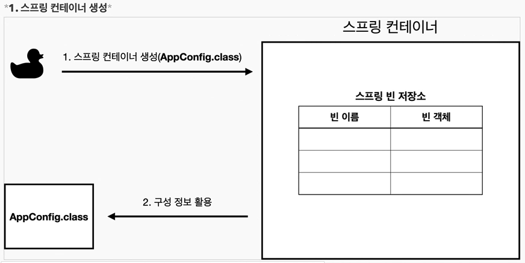
- new AnnotationConfigApplicationContext(AppConfig.class)
- 스프링 컨테이너를 생성할 때는 구성 정보를 지정해주어야 한다.
- 여기서는 AppConfig를 구성 정보로 지정했다.


- 스프링 컨테이너는 파라미터로 넘어온 설정 클래스 정보를 사용해서 스프링 빈을 등록한다.
주의 : **빈 이름은 항상 다른이름을 부여** 해야한다. 같은 이름을 부여하면 , 다른 빈이 무시 되거나 , 기존 빈을 덮어버리거나 설정에 따라 오류가 발생한다.


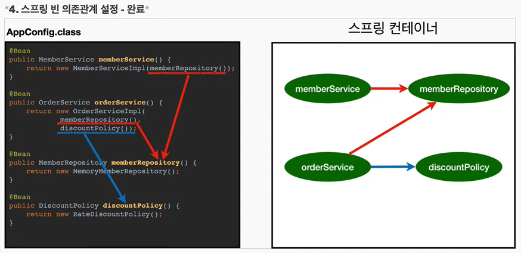
- 스프링 컨테이너는 **설정 정보를 참고해서 의존관계를 주입(DI)** 한다.
- 단순히 자바 코드를 호출하는 것 같지만 , 차이가 있다. 이 차이는 뒤에 싱글톤 컨테이너에서 설명한다.
- **스프링은 빈을 생성하고 , 의존관계를 주입하는 단계가 나누어져 있다.** 그런데 이렇게 자바 코드로 스프링 빈을 등록하면 생성자를 호출하면서 의존관계 주입도 한번에 처리된다.
- 여기서는 이해를 돕기위해 개념적으로 나누어 설명했다. **자세한 내용은 의존관계 자동 주입에서 다시 설명하겠다.**


## BeanFactory

-   **스프링 컨테이너 최상위 인터페이스다.**
-   스프링 빈을 관리하고 조회하는 역할을 담당한다.
-   **getBean()을 제공한다.**
-   **지금까지 우리가 사용했던 대부분의 기능은 BeanFactory가 제공하는 기능이다.**

## ApplicationContext

-   **BeanFactory기능을 모두 상속받아서 제공한다.**
-   빈을 관리하고 검색하는 기능을 BeanFactory가 제공해주는데 , 그러면 둘의 차이가 뭘까?
-   **애플리케이션을 개발할 때는 빈을 관리하고 조회하는 기능인 물론이고 , 수 많은 부가기능이 필요하다.**

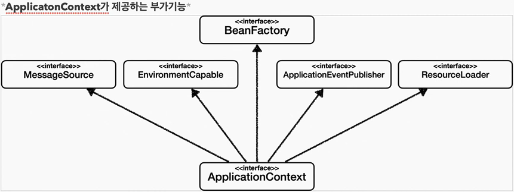
-   **MessageSource를 활용한 국제화 기능**
    -   예를 들어 한국에서 들어오면 한국어로 , 영어권에서 들어오면 영어로 출력
-   **EnvironmentCapable**
    -   로컬 , 개발 , 운영등을 구분해서 처리
-   **ApplicationEventPublisher**
    -   이벤트를 발행하고 , 구독하는 모델을 편리하게 지원
-   **ResourceLoader**
    -   파일 , 클래스패스 , 외부 등에서 리소스를 편리하게 조회
  
> ApplicationContext는 BeanFactory의 기능을 상속받는다.  
> ApplicationContext는 **"빈 관리기능 + 편리한 부가 기능"** 을 제공한다.  
> BeanFactory를 직접 사용할 일은 거의 없다. 부가기능이 포함된 ApplicationContext를 사용한다.  
> **BeanFactory나 ApplicationContext를 스프링 컨테이너라 한다.**

***

# **BeanDefinition**
- 스프링은 어떻게 다양한 설정 형식을 지원하는 것일까? **그 중심에는 BeanDefinition이라는 추상화가 있다**
- 쉽게 이야기해서 **역할과 구현을 개념적으로 나눈것** 이다.
  - XML을 읽어서 BeanDefinition을 만들면 된다.
  - 자바 코드를 읽어서 BeanDefinition을 만들면 된다.
  - 스프링 컨테이너는 자바 코드인지 , XML인지 몰라도 된다. 오직 BeanDefinition만 알면 된다.
- **BeanDefinition을 빈 설정 메타 정보라 한다.**
    - `@Bean` , `<bean>` 당 각각 하나씩 메타정보가 생성된다
- 스프링 컨테이너는 이 메타정보를 기반으로 스프링 빈을 생성한다.


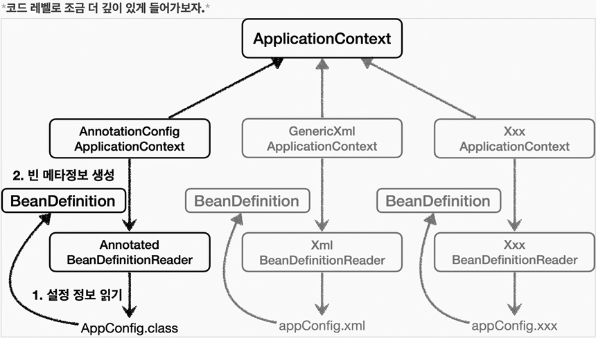

**AnnotationConfigApplicationContext는 AnnotatedBeanDefinitionReader를 사용해서 AppConfig를 사용해서 읽고 BeanDefinition을 생성한다.**

## BeanDefinition 정보

-   BeanClassName : 생성할 빈의 클래스 명 (자바 설정 처럼 팩토리 역할의 빈을 사용하면 없음)
-   factoryBeanName : 팩토리 역할의 빈을 사용할 경우 이름 (예 : **appConfig**)
-   factoryMethodName : 빈을 생성할 팩토리 메서드 지정 (예 : memberService)
-   Scope : 싱글톤 (기본값)
-   lazyInit : 스프링 컨테이너를 생성할 때 빈을 생성하는 것이 아니라 , 실제 빈을 사용할 때 까지 최대한 생성을 지연처리 하는지 여부
-   InitMethodName : 빈을 생성하고 , 의존관계를 적용한 뒤에 호출되는 초기화 메서드 명
-   DestoryMethodName : 빈의 생명주기가 끝나서 제거하기 직전에 호출되는 메서드 명
-   Constructor arguments , Properties : 의존관계 주입에서 사용한다 (자바 설정 처럼 팩토리 역할의 빈을 사용하면 없음)

```java
public class BeanDefinitionTest {

    AnnotationConfigApplicationContext ac = new AnnotationConfigApplicationContext(AppConfig .class);

    @Test
    @DisplayName("빈 설정 메타정보 확인")
    void findApplicationBean(){
        String[] definitionNames = ac.getBeanDefinitionNames();
        for (String definitionName : definitionNames) {
            BeanDefinition beanDefinition = ac.getBeanDefinition(definitionName);
            if(beanDefinition.getRole() == beanDefinition.ROLE_APPLICATION){
                System.out.println("beanDefinitionName = " + definitionName + "\n" +
                                   "beanDefinition : " + beanDefinition);
            }
        }
    }
}
```
```
beanDefinitionName = appConfig
beanDefinition :
Generic bean: class [hello.core.AppConfig$$EnhancerBySpringCGLIB$$36404936];
scope=singleton; abstract=false; lazyInit=null; autowireMode=0; dependencyCheck=0;
autowireCandidate=true; primary=false; factoryBeanName=null; factoryMethodName=null;
initMethodName=null; destroyMethodName=null

beanDefinitionName = memberRepository
beanDefinition : Root bean: class [null];
scope=; abstract=false; lazyInit=null; autowireMode=3; dependencyCheck=0;
autowireCandidate=true; primary=false; factoryBeanName=appConfig;
factoryMethodName=memberRepository; initMethodName=null; destroyMethodName=(inferred);
defined in hello.core.AppConfig

beanDefinitionName = discountPolicy
beanDefinition : Root bean: class [null];
scope=; abstract=false; lazyInit=null; autowireMode=3; dependencyCheck=0;
autowireCandidate=true; primary=false; factoryBeanName=appConfig;
factoryMethodName=discountPolicy; initMethodName=null; destroyMethodName=(inferred);
defined in hello.core.AppConfig

beanDefinitionName = memberService
beanDefinition : Root bean: class [null];
scope=; abstract=false; lazyInit=null; autowireMode=3; dependencyCheck=0;
autowireCandidate=true; primary=false; factoryBeanName=appConfig;
factoryMethodName=memberService; initMethodName=null; destroyMethodName=(inferred);
defined in hello.core.AppConfig

beanDefinitionName = orderService
beanDefinition : Root bean: class [null];
scope=; abstract=false; lazyInit=null; autowireMode=3; dependencyCheck=0;
autowireCandidate=true; primary=false; factoryBeanName=appConfig;
factoryMethodName=orderService; initMethodName=null; destroyMethodName=(inferred);
defined in hello.core.AppConfig
```

-   **BeanDefinition을 직접 생성해서 스프링 컨테이너에 등록할 수도 있다. 하지만 실무에서 BeanDefinition을 직접 정의하거나 사용할 일은 거의 없다.**
-   BeanDefinition에 대해서는 너무 깊이 있게 이해하기 보다는 , **스프링이 다양한 형태의 설정 정보를 BeanDefinition으로 추상화 해서 사용하는 것 정도만 이해하면 된다.**
-   가끔 스프링 코드나 스프링 관련 오픈 소스의 코드를 볼 때 , BeanDefinition이라는 것이 보일 때가 있다. 이때 이러한 메커니즘을 떠올리면 된다.

***

# **컴포넌트 스캔과 의존관계 자동 주입**

<h3>컴포넌트 스캔</h3>

- `@Bean` 이나 XML의 `<bean>`등을 통해서 설정 정보에 직접 등록할 스프링 빈을 나열했다.
- 스프링 빈이 수십, 수백개가 되면 일일이 등록하기도 귀찮고, 설정 정보도 커지고, 누락하는 문제도 발생한다.
- 그래서 **스프링은 설정 정보가 없어도 자동으로 스프링 빈을 등록하는 컴포넌트 스캔이라는 기능을 제공한다.**

``` java
@Configuration
@ComponentScan(
    // @Component를 찾아 스프링 빈으로 등록해준다.
    // @Component 어노테이션을 찾을 때 제외할 어노테이션 (@Configuration)
    // (기존 AppConfig.java는 등록이 되면 안되기 때문에)
    excludeFilters = @ComponentScan.Filter(type = FilterType.ANNOTATION
            , classes = Configuration.class);
)
public class AutoAppConfig {

}
```
- 컴포넌트 스캔을 사용하려면 먼저 `@ComponentScan`을 설정 정보에 붙여주면 된다.

> ✋ 컴포넌트 스캔을 사용하면 **@Configuration**이 붙은 설정 정보도 자동으로 등록되기 때문에 AppConfig, TestConfig등 앞서 만들어 두었던 설정 정보도 함께 등록되고 , 실행 되어 버린다.  
> 그래서 excludeFilters를 이용해서 설정 정보는 컴포넌트 스캔 대상에서 제외 했다.

보통 설정 정보를 컴포넌트 스캔 대상에서 제외하지는 않지만 , 기존 예제 코드를 최대한 남기고 유지하기 위해 작성했다.
(**@Configuration** 소스코드를 열어보면 **@Component** 애노테이션이 붙어있다.)

```java
@Component
public class OrderServiceImpl implements OrderService{

    private final MemberRepository memberRepository;
    private final DiscountPolicy discountPolicy;

    @Autowired // ac.getBean(MemberRepository.class)
    public OrderServiceImpl(MemberRepository memberRepository, DiscountPolicy discountPolicy) {
        this.memberRepository = memberRepository;
        this.discountPolicy = discountPolicy;
    }

    @Override
    public Order createOrder(Long memberId, String itemName, int itemPrice) {
        Member member = memberRepository.findById(memberId);
        int discountPrice = discountPolicy.discount(member , itemPrice);

        return new Order(memberId , itemName , itemPrice , discountPrice);
    }

    //테스트
    public MemberRepository getMemberRepository() {
        return memberRepository;
    }
}

public class AutoAppConfigTest {

    @Test
    void basicScan(){
        AnnotationConfigApplicationContext ac =
        		new AnnotationConfigApplicationContext(AutoAppConfig.class);

        MemberService memberService = ac.getBean(MemberService.class);
        Assertions.assertThat(memberService).isInstanceOf(MemberService.class);
    }
}
```
- **`@Component`는 스프링 빈으로 바로 등록이 되어버려 의존관계를 `@Autowired`를 추가하여 의존관계를 주입한다.**
- 이전에 AppConfig에서는 `@Bean`으로 직접 설정 정보를 작성했고 , 의존관계도 직접 작성했다.
- 이제는 이런 설정 정보 자체가 없기 때문에 , 의존관계 주입도 이 클래스 안에서 해결해야한다.

## 컴포넌트 스캔과 자동 의존관계 주입은 어떻게 동작할까


- `@ComponentScan`은 `@Component`가 붙은 **모든 클래스를 스프링 빈으로 등록한다.**
- 이때 스프링 빈의 기본 이름은 클래스명을 사용하되 맨 앞글자만 소문자를 사용한다.
  - **빈 이름 기본 전략** : MemberServiceImpl 클래스 -> memberServiceImpl
  - **빈 이름 직접 지정** : 만약 스프링 빈의 이름을 직접 지정하고 싶으면 `@Component("memberService2")`이름을 부여하면 된다

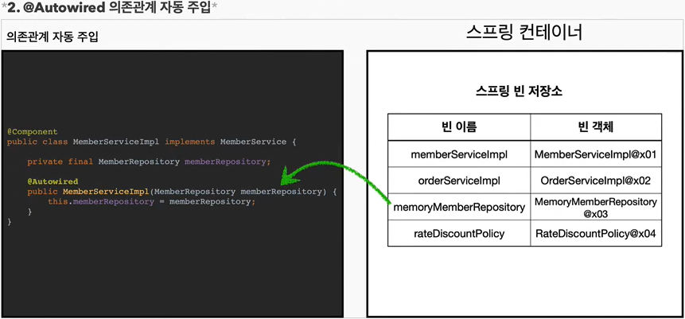
- 생성자에 `@Autowired`를 지정하면 , **스프링 컨테이너가 자동으로 해당 스프링 빈을 찾아서 주입한다.**
- 이때 기본 조회 전략은 타입이 같은 빈을 찾아서 주입한다.
  - getBean(MemberRepository.class)와 동일하다고 이해하면 된다.

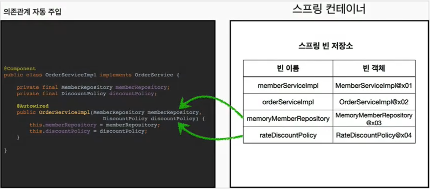
- 생성자에 파라미터가 많아도 다 찾아서 자동으로 주입한다.

## 인터페이스의 구현체가 2개 이상일 때

`OrderService`에 `DiscountPolicy`(인터페이스)의 `RateDiscountPolicy` , `FixDiscountPolicy`(구현체) 둘 중 하나를 주입해줘야하는데 구현체 2개 를 `@Component`로 등록 하게 되면??

```
NoUniqueBeanDefinitionException: No qualifying bean of type 'hello.core.discount.DiscountPolicy'
available: expected single matching bean but found 2: fixDiscountPolicy,rateDiscountPolicy
```

***

## 탐색 위치와 기본 스캔 대상

- 모든 자바 클래스를 다 컴포넌트로 스캔 하면 시간이 오래 걸린다 (라이브러리 까지 뒤진다).
- 그래서 **꼭 필요한 위치부터 탐색하도록 시작 위치를 지정할 수 있다.**

```java
@Configuration
@ComponentScan(
    // @Component를 찾아 스프링 빈으로 등록해준다.

    // 기본 스캔 범위를 정할 수 있다.
    basePackages = "hello.core.member",

    // 기존 AppConfig.java는 등록이 되면 안되기 때문에
    // @Component 어노테이션을 찾을 때 제외할 어노테이션 (@Configuration)
    excludeFilters = 
        @ComponentScan.Filter(type = FilterType.ANNOTATION, classes = Configuration.class)
)
public class AutoAppConfig {

}
```
- `basePackages` : 탐색할 패키지의 시작 위치를 지정한다. 이 패키지를 포함해서 하위 패키지를 모두 탐색한다.
- `basePackages = {"hello.core" , "hello.service"}` 이렇게 여러 시작 위치를 지정할 수도 있다.
- 만약 지정하지 않으면 `@ComponentScan`이 붙은 설정 정보 클래스의 패키지가 시작 위치가 된다
  
<h3>권장 방법</h3>

- 패키지 위치를 지정하지 않고, 설정 정보 클래스의 위치를 프로젝트 최상단에 두는 것이다.
- 최근 스프링 부트도 이 방법을 기본으로 제공한다.
- 예를 들어서 프로젝트가 다음과 같이 구조가 되어 있으면
    - `com.hello`
      - `com.hello.service`
      - `com.hello.repository`
- `com.hello` ➜ 프로젝트 시작 루트, 여기에 AppConfig같은 메인 설정 정보를 두고 `@ComponentScan` 애노테이션을 붙이고 , `basePackages` 지정은 생략한다.
- 이렇게 하면 **`com.hello`를 포함한 하위는 모두 자동으로 컴포넌트 스캔의 대상이 된다.**
- 그리고 프로젝트 메인 설정 정보는 프로젝트를 대표하는 정보이기 때문에 프로젝트 시작 루트 위치에 두는 것이 좋다.
- **참고**: 스프링 부트를 사용하면 스프링 부트의 대표 시작 정보인 `@SpringBootApplication`를 이 프로젝트 시작 루트 위치에 두는것이 관례이다. *(그리고 이 설정 안에 바로 `@ComponentScan`이 들어 있다!)*

```java
@Target(ElementType.TYPE)
@Retention(RetentionPolicy.RUNTIME)
@Documented
@Inherited
@SpringBootConfiguration
@EnableAutoConfiguration
@ComponentScan(excludeFilters = { 
        @Filter(type = FilterType.CUSTOM, classes = TypeExcludeFilter.class),
        @Filter(type = FilterType.CUSTOM, classes = AutoConfigurationExcludeFilter.class) 
    }
)
public @interface SpringBootApplication {
...
}
```

## 컴포넌트 스캔 기본 대상
**컴포넌트 스캔은 `@Component`뿐만 아니라 다음과 같은 내용도 추가로 대상에 포함한다.**  
**ClassPathBeanDefinitionScanner** 클래스 경로 스캐닝을 통해 자동 감지되도록 한다.  
  
- `@Component`
  - 컴포넌트 스캔에서 사용
- `@Controller`
  - 스프링 MVC컨트롤러로 인식
- `@Service`
  - 스프링 비즈니스 로직에서 사용
  - 특별한 처리를 하진 않는다.
- `@Repository`
  - 스프링 데이터 접근 계층으로 인식
  - **데이터 계층의 예외를 스프링 예외로 변환해준다.**
  - `데이터 액세스 개체와 DDD 스타일 리포지토리 간의 차이점을 이해하는 데 주의를 기울여야 한다`
- `@Configuration`
  - 스프링 설정 정보에서 사용
  - **스프링 빈이 싱글톤을 유지하도록 추가 처리를 한다.**
  - [`Spring docs` @Configuration](https://docs.spring.io/spring-framework/docs/current/javadoc-api/org/springframework/context/annotation/Configuration.html)

> ✋ **애노테이션에는 상속관계라는 것이 없다.**  
> 그래서 이렇게 애노테이션이 특정 애노테이션을 들고 있는 것을 인식할 수 있는 것은 자바 언어가 지원하는 기능은 아니고, 스프링이 지원하는 기능이다

## include,excludeFilters
- **includeFilters** : 컴포넌트 스캔 대상을 추가로 지정한다.
- **excludeFilters** : 컴포넌트 스캔에서 제외할 대상을 지정한다.

```java
@Target(ElementType.TYPE)
@Retention(RetentionPolicy.RUNTIME)
@Documented
public @interface MyIncludeComponent {
}


@Target(ElementType.TYPE)
@Retention(RetentionPolicy.RUNTIME)
@Documented
public @interface MyExcludeComponent {
}

@MyIncludeComponent
public class BeanA {
}

@MyExcludeComponent
public class BeanB {
}

public class ComponentFilterAppConfigTest {

    @Test
    void filterScan(){
        AnnotationConfigApplicationContext ac =
                new AnnotationConfigApplicationContext(ComponentFilterAppConfig.class);
        BeanA beanA = ac.getBean("beanA", BeanA.class);
        Assertions.assertThat(beanA).isNotNull();

        Assertions.assertThrows(NoSuchBeanDefinitionException.class, () -> ac.getBean("beanB" , BeanB.class));
    }

    @Configuration
    @ComponentScan(
            includeFilters = @ComponentScan.Filter(type = FilterType.ANNOTATION
                    , classes = MyIncludeComponent.class),
            excludeFilters = @ComponentScan.Filter(type = FilterType.ANNOTATION
                    , classes = MyExcludeComponent.class)
    )
    static class ComponentFilterAppConfig{

    }
}
```

<h3>FilterType  옵션</h3>

- `ANNOTATION` : 기본값 , 애노테이션을 인식해서 동작한다
  - 예) org.example.SomeAnnotation
- `ASSIGNABLE_TYPE` : 지정한 타입과 자식 타입을 인식해서 동작한다.
  - 예) org.example.SomeClass
- `ASPECTJ` : AspectJ 패턴 사용
  - 예) org.example..*Service+
- `REGEX` : 정규 표현식
  - 예) org\.example\.Default.*
- `CUSTOM` : TypeFilter라는 인터페이스를 구현해서 처리
  - 예) org.example.MyTypeFilter

> ✋ `@Component`면 충분하기 때문에 includeFilters를 사용할 일은 거의 없다.  
> excludeFilters는 여러가지 이유로 간혹 사용할 때가 있지만 많지는 않다.  
> 특히 최근 스프링 부트는 컴포넌트 스캔을 기본으로 제공하는데 ,<strong>*개인적으로는 옵션을 변경하면서 사용하기 보다는 스프링의 기본 설정에 최대한 맞추어 사용하는 것을 권장한다.*</strong>

## 컴포넌트 스캔에서 같은 빈 이름을 등록하면 어떻게 될까?

- **자동 빈 등록 vs 자동 빈 등록**
  - 컴포넌트 스캔에 의해 자동으로 스프링 빈이 등록되는데 , 그 이름이 같은 경우 스프링은 오류를 발생 시킨다.
    - `ConflictingBeanDefinitionException` 예외 발생
- **수동 빈 등록 vs 자동 빈 등록**
  - 만약 수동 빈 등록과 자동 빈 등록에서 빈 이름이 충돌 되면 어떻게 될까?
  - **이 경우 수동 빈 등록이 우선권을 가진다. (수동 빈이 자동 빈을 오버라이딩 해버린다)**

```
Overriding bean definition for bean 'memoryMemberRepository' with a different definition:
replacing [Generic bean: class [hello.core.member.MemoryMemberRepository];
scope=singleton; abstract=false; lazyInit=null; autowireMode=0; dependencyCheck=0;
autowireCandidate=true; primary=false; factoryBeanName=null; factoryMethodName=null;
initMethodName=null; destroyMethodName=null;
defined in file [C:\Users\pc\Desktop\study\core\out\production\classes\hello\core\member\MemoryMemberRepository.class]]
with [Root bean: class [null]; scope=; abstract=false; lazyInit=null; autowireMode=3;
dependencyCheck=0; autowireCandidate=true; primary=false; factoryBeanName=autoAppConfig;
factoryMethodName=memberRepository; initMethodName=null; destroyMethodName=(inferred);
defined in hello.core.AutoAppConfig]
```

- 물론 개발자가 의도적으로 이런 결과를 기대했다면 , 자동 보다는 수동이 우선권을 가지는 것이 좋다.
- 하지만 현실은 개발자가 의도적으로 설정해서 이런 결과가 만들어지기 보다는 여러 설정들이 꼬여서 이런 결과가 만들어지는 경우가 대부분이다.
- **"그러면 정말 잡기가 어려운 버그가 만들어진다. 항상 잡기 어려운 버그는 애매한 버그다"**
- 그래서 최근 스프링 부트에서는 수동 빈 등록과 자동 빈 등록이 충돌 나면 오류가 발생하도록 기본 값을 바꾸었다.

```
Consider renaming one of the beans or enabling overriding by setting
spring.main.allow-bean-definition-overriding=true
```

 > ✋ `application.properties` ➜ `spring.main.allow-bean-definition-overriding=true` 추가하면 오버라이딩을 한다.

***

# **웹 애플리케이션과 싱글톤 패턴**

**웹 어플리케이션은 보통 여러 고객이 동시에 요청을 한다.**
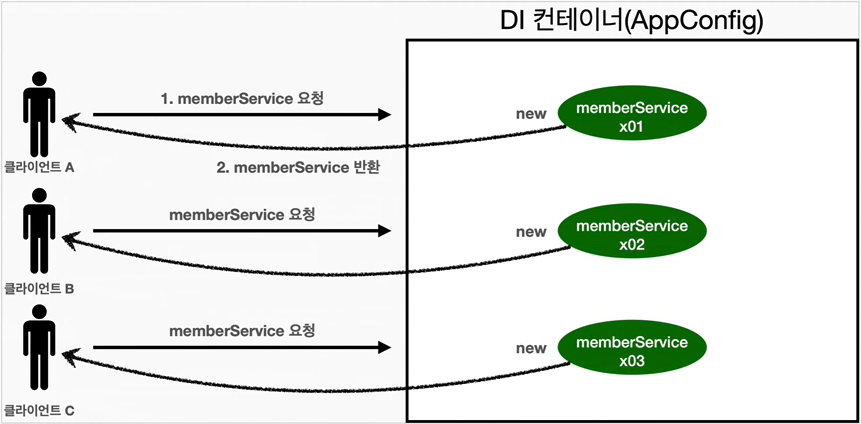

```java
public class SingletonTest {

    @Test
    @DisplayName("스프링 없는 순수한 DI 컨테이너")
    void pureContainer(){
        AppConfig appConfig = new AppConfig();

        //1. 조회 : 호출할 때 마다 객체를 생성
        MemberService memberService1 = appConfig.memberService();

        //2. 조회 : 호출할 때 마다 객체를 생성
        MemberService memberService2 = appConfig.memberService();

        //참조값이 다른 것을 확인
        System.out.println("memberService1 - " + memberService1);
        System.out.println("memberService2 - " + memberService2);
//        memberService1 - hello.core.member.MemberServiceImpl@48f2bd5b
//        memberService2 - hello.core.member.MemberServiceImpl@7b2bbc3

        // memberService1 != memberService2
        Assertions.assertThat(memberService1).isNotSameAs(memberService2);
    }
}
```
- 우리가 만들었던 스프링 없는 순수한 DI컨테이너인 AppConfig는 요청을 할 때 마다 객체를 새로 생성한다.
- 고객 트래픽이 초당 100이 나오면 초당 100개 객체가 생성되고 소멸된다
- 해결방안은 **해당 객체가 딱 1개만 생성되고 공유하도록 설계하면 된다.**

<h3>싱글톤 패턴</h3>

- **클래스의 인스턴스가 딱 1개만 생성되는 것을 보장하는 디자인 패턴이다.**
- 그래서 객체 인스턴스를 2개 이상 생성하지 못하도록 막아야 한다.
- **private 생성자를 사용해서 외부에서 임의로 new 키워드를 사용하지 못하도록 막아야 한다.**

```java
public class SingletonService {

    // 1. static영역에 객체를 딱 1개만 생성해둔다.
    private static final SingletonService instance = new SingletonService();

    // 2. public으로 열어서 객체 인스턴스가 필요하면 이 static메서드를 통해서만 조회하도록 허용한다.
    public static SingletonService getInstance(){
        return instance;
    }

    // 3. 생성자를 private로 선언하여 외부에서 new 키워드를 사용한 객체를 생성하지 못하도록 한다.
    private SingletonService(){
    }

    public void logic(){
        System.out.println("싱글톤 객체 로직 호출");
    }
}
```
- 싱글톤 패턴을 구현하는 방법은 여러가지가 있다. 여기서는 객체를 미리 생성해두는 가장 단순하고 안전한 방법을 선택했다.
- 싱글톤 패턴을 적용하면 고객의 요청이 올 때 마다 객체를 생성하는 것이 아니라 , 이미 만들어진  객체를 공유해서 효율적으로 사용할 수 있다.
- 하지만 **싱글톤 패턴은 다음과 같은 수 많은 문제점들을 가지고 있다.**

```java
@Test
@DisplayName("싱글톤 패턴을 적용한 객체 사용")
void singletonServiceTest(){
    SingletonService singletonService1 = SingletonService.getInstance();
    SingletonService singletonService2 = SingletonService.getInstance();

    System.out.println("singletonService1 - " + singletonService1);
    System.out.println("singletonService2 - " + singletonService2);
//        singletonService1 - hello.core.singleton.SingletonService@7c7b252e
//        singletonService2 - hello.core.singleton.SingletonService@7c7b252e

    // isSameAs  : ==
    // isEqualTo : .equals()
    Assertions.assertThat(singletonService1).isSameAs(singletonService2);
}
```

<h3>싱글톤 문제점</h3>

1. 싱글톤 패턴을 구현하는 코드 자체가 많이 들어간다.
2. **의존관계상 클라이언트가 구체 클래스에 의존한다  -> DIP를 위반**
3. 클라이언트가 구체 클래스에 의존해서 OCP 원칙을 위반할 가능성이 높다.
테스트하기 어렵다.
1. 내부 속성을 변경하거나 초기화 하기 어렵다.
2. private 생성자로 자식 클래스를 만들기 어렵다.
3. 결론적으로 유연성이 떨어진다. (**안티패턴**으로 불리기도 한다.)

## 싱글톤 컨테이너

- 스프링 컨테이너는 싱글톤 패턴의 문제점을 해결한다.
- **스프링 컨테이너는 싱글톤 패턴의 문제점을 해결하면서 ,객체 인스턴스를 싱글톤(1개만 생성)으로 관리한다.**
- 스프링 컨테이너는 싱글톤 패턴을 적용하지 않아도, 객체 인스턴스를 싱글톤으로 관리한다
  - 이전에 설명한 컨테이너 생성 과정을 자세히 보자, 컨테이너는 객체를 하나만 생성해서 관리한다.
- **스프링 컨테이너는 싱글톤 컨테이너 역할을 한다.** 이렇게 싱글톤 객체를 생성하고 관리하는 기능을 **싱글톤 레지스트리**라 한다.
- 스프링 컨테이너의 이런 기능 덕분에 **싱글톤 패턴의 모든 단점을 해결하면서 싱글톤으로 유지할 수 있다.**
  - 싱글톤 패턴을 위한 지저분한 코드가 들어가지 않아도 된다.
  - DIP, OCP, 테스트, private 생성자로 부터 자유롭게 싱글톤을 사용할 수 있다.

```java
@Configuration
public class AppConfig {

    @Bean
    public MemberRepository memberRepository() {
        return new MemoryMemberRepository();
    }

    @Bean
    public DiscountPolicy discountPolicy(){
        //return new FixDiscountPolicy();
        return new RateDiscountPolicy();
    }

    @Bean
    public MemberService memberService(){
        return new MemberServiceImpl(memberRepository());
    }

    @Bean
    public OrderService orderService(){
        return new OrderServiceImpl(memberRepository(), discountPolicy());
    }
}

@Test
@DisplayName("스프링 컨테이너와 싱글톤")
void springContainer(){

    AnnotationConfigApplicationContext ac =
                    new AnnotationConfigApplicationContext(AppConfig.class);

    MemberService memberService1 = ac.getBean("memberService" , MemberService.class);
    MemberService memberService2 = ac.getBean("memberService" , MemberService.class);

    //참조값 확인
    System.out.println("memberService1 - " + memberService1);
    System.out.println("memberService2 - " + memberService2);
//        memberService1 - hello.core.member.MemberServiceImpl@66fdec9
//        memberService2 - hello.core.member.MemberServiceImpl@66fdec9

    // memberService1 == memberService2
    Assertions.assertThat(memberService1).isSameAs(memberService2);
}
```

<h3>싱글톤 컨테이너 적용 후</h3>


- 스프링의 기본 빈 등록 방식은 싱글톤이지만 , 싱글톤 방식만 지원하는 것은 아니다. 요청할 때 마다 새로운 객체를 생성해서 반환하는 기능도 제공한다. [빈 스코프 참고]

## 싱글톤 방식의 주의점

1. 싱글톤 패턴이든, 스프링 같은 싱글톤 컨테이너를 사용하든, **객체 인스턴스를 하나만 생성해서 공유하는 싱글톤 방식은 여러 클라이언트가 하나의 같은 객체 인스턴스를 공유하기 때문에** 싱글톤 객체는 상태를 유지(stateful)하게 설계하면 안된다.
1. **무상태(stateless)로 설계해야 한다.**
    - 특정 클라이언트에 의존적인 필드가 있으면 안된다.
    - 특정 클라이언트가 값을 변경할 수 있는 필드가 있으면 안된다.
    - 가급적 읽기만 가능해야 한다.
    - 필드 대신에 자바에서 공유되지 않는 , 지역변수 , 파라미터 , ThreadLocal등을 사용해야 한다.
1. 스프링 빈의 필드에 공유 값을 설정하면 정말 큰 장애가 발생할 수 있다.

```java
public class StatefulService {

    private int price;  // 상태를 유지하는 필드

    public void order(String name , int price){
        System.out.println("name = " + name + " price = " + price);
        this.price = price;     // 여기가 문제!
    }

    public int getPrice(){
        return price;
    }
}

public class StatefulServiceTest {

    @Test
    void statefulServiceSingleton(){
        ApplicationContext ac = new AnnotationConfigApplicationContext(TestConfig.class);
        StatefulService statefulService1 = ac.getBean(StatefulService.class);
        StatefulService statefulService2 = ac.getBean(StatefulService.class);

        //Thread A : A사용자 10000원 주문
        statefulService1.order("userA" , 10000);
        //Thread B : B사용자 20000원 주문
        statefulService2.order("userB" , 20000);

        //Thread A : 사용자A 주문 금액 조회
        int price = statefulService1.getPrice();
        System.out.println("price = " + price);

        Assertions.assertThat(statefulService1.getPrice()).isEqualTo(20000);
    }

    static class TestConfig{
        @Bean
        public StatefulService statefulService(){
            return new StatefulService();
        }
    }
}
```
- 실제 쓰레드는 사용하지 않았다.
- StatefulService의 price필드는 공유되는 필드인데 , 특정 클라이언트가 값을 변경한다.
- **진짜 공유필드는 조심해야 한다! 무상태(stateless)로 설계해야 한다.**

## @Configuration과 싱글톤

```java
@Configuration
public class AppConfig {

    @Bean
    public MemberRepository memberRepository() {
        System.out.println("call AppConfig.memberRepository");
        return new MemoryMemberRepository();
    }

    @Bean
    public DiscountPolicy discountPolicy(){
        //return new FixDiscountPolicy();
        return new RateDiscountPolicy();
    }

    @Bean
    public MemberService memberService(){
        System.out.println("call AppConfig.memberService");
        return new MemberServiceImpl(memberRepository());
    }

    @Bean
    public OrderService orderService(){
        System.out.println("call AppConfig.orderService");
        return new OrderServiceImpl(memberRepository(), discountPolicy());
    }
}
```

- **로직상으로는 call AppConfig.memberRepository 3번 호출 되어야 하지만 , 1번만 호출된다.**
- memberService빈을 만드는 코드를 보면 memberRepository()를 호출한다
  - 이 메서드를 호출하면 new MemoryMemberRepository()를 호출한다.
- orderService빈을 만드는 코드도 동일하게 memberRepository()를 호출한다.
  - 이 메서드를 호출하면 new MemoryMemberRepository()를 호출한다.
- **결과적으로 각각 다른 2개의 MemoryMemberRepository()가 생성되면서 싱글톤이 깨지는 것 처럼 보인다. 스프링 컨테이너는 이 문제를 어떻게 해결할까?**
- **@Configuration은 싱글톤을 위해 존재한다.**

```java
// MemberServiceImpl , OrderServiceImpl 테스트 용도로
// 각각 주입 된 memberRepository를 반환 하는 메소드 추가
public MemberRepository getMemberRepository(){
    return memberRepository;
}

public class ConfigurationSingletonTest {

    @Test
    void configurationTest(){
        AnnotationConfigApplicationContext ac =
                      new AnnotationConfigApplicationContext(AppConfig.class);

        MemberServiceImpl memberService = ac.getBean("memberService", MemberServiceImpl.class);
        OrderServiceImpl orderService = ac.getBean("orderService", OrderServiceImpl.class);

        MemberRepository memberRepository1 = memberService.getMemberRepository();
        MemberRepository memberRepository2 = orderService.getMemberRepository();
        MemberRepository memberRepository3 = ac.getBean("memberRepository", MemberRepository.class);

        System.out.println("memberService -> MemberRepository = " + memberRepository1);
        System.out.println("orderService -> MemberRepository = " + memberRepository2);
        System.out.println("memberRepository = " + memberRepository3);
//        memberService -> MemberRepository = hello.core.member.MemoryMemberRepository@37091312
//        orderService -> MemberRepository = hello.core.member.MemoryMemberRepository@37091312
//        memberRepository = hello.core.member.MemoryMemberRepository@37091312

        Assertions.assertThat(memberService.getMemberRepository()).isSameAs(memberRepository3);
        Assertions.assertThat(orderService.getMemberRepository()).isSameAs(memberRepository3);
    }
}
```
***

<h3>@Configuration과 바이트코드 조작의 마법</h3>

- 스프링 컨테이너는 싱글톤 레지스트리다. 따라서 스프링 빈이 싱글톤이 되도록 보장해주어야 한다.
- 그런데 스프링이 자바 코드 까지 어떻게 하기는 어렵다. 그래서 **스프링은 클래스의 바이트코드를 조작하는 라이브러리를 사용한다.**

```java
AnnotationConfigApplicationContext ac =
                    new AnnotationConfigApplicationContext(AppConfig.class);
        AppConfig bean = ac.getBean(AppConfig.class);
        System.out.println("appConfig = " + bean.getClass());
        //appConfig = class hello.core.AppConfig$$EnhancerBySpringCGLIB$$ba528fbb
```
- 순수한 클래스라면 class hello.core.AppConfig가 나와야 한다.
- 그런데 예상과는 다르게 클래스 명에 `$$EnhancerBySpringCGLIB$$`가 붙어있다.
- **이것은 내가 만든 클래스가 아니라 스프링이 CGLIB라는 바이트 코드 조작 라이브러리를 사용해서 AppConfig클래스를 상속받은 임의의 다른 클래스를 만들고 , 그 다른 클래스를 스프링 빈으로 등록한 것이다.**
- **AppConfig@CGLIB는 AppConfig의 자식 타입** 이므로 , AppConfig타입으로 조회할 수 있다.

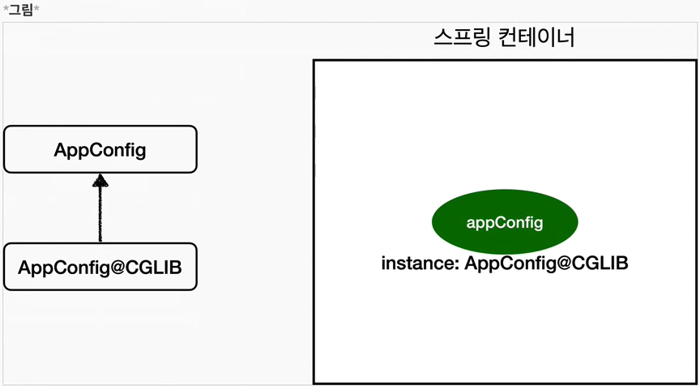

<h3>@Configuration을 적용하지 않고 , @Bean만 적용하면 어떻게 될까?</h3>

- **`@Configuration`를 붙이면 바이트코드를 조작하는 CGLIB기술을 사용해서 싱글톤을 보장**하지만 만약 **`@Bean`만 적용하면 스프링 빈으로 등록 되지만 객체가 반복 호출 되어 싱글톤이 깨져버린다.**

```
call AppConfig.memberRepository
call AppConfig.memberService
call AppConfig.memberRepository
call AppConfig.orderService
call AppConfig.memberRepository


memberService -> MemberRepository = hello.core.member.MemoryMemberRepository@51fadaff
orderService -> MemberRepository = hello.core.member.MemoryMemberRepository@401f7633
memberRepository = hello.core.member.MemoryMemberRepository@31ff43be
```

***

# **의존관게 주입 방법**

## 생성자 주입
- 이름 그대로 생성자를 통해서 의존 관계를 주입 받는 방법이다.
- 지금까지 우리가 진행했던 방식이 바로 생성자 주입이다.
- 특징
  - 생성자 호출 시점에 딱 1번만 호출 되는것이 보장 된다.
  - **"불변, 필수"** 의존관계에 사용

```java
@Component
public class OrderServiceImpl implements OrderService{

    private final MemberRepository memberRepository;
    private final DiscountPolicy discountPolicy;

    @Autowired
    public OrderServiceImpl(MemberRepository memberRepository, DiscountPolicy discountPolicy) {
        this.memberRepository = memberRepository;
        this.discountPolicy = discountPolicy;
    }
    ...
```

> ✋ **생성자가 딱 1개만 있으면 `@Autowired`를 생략해도 자동 주입 된다.** (스프링 빈에만 해당한다)

## 수정자 주입

```java
@Component
public class OrderServiceImpl implements OrderService{

    private MemberRepository memberRepository;
    private DiscountPolicy discountPolicy;

    @Autowired
    public void setMemberRepository(MemberRepository memberRepository) {
        this.memberRepository = memberRepository;
    }
    @Autowired
    public void setDiscountPolicy(DiscountPolicy discountPolicy) {
        this.discountPolicy = discountPolicy;
    }
    ...
```

> ✋ **`@Autowired`를 찾아 주입 하여 준다.**  
> (`@Autowired`가 없으면 들어오지 않는다.)  
> `@Autowired`의 기본 동작은 주입할 대상이 없으면 오류가 발생한다.  
> 주입할 대상이 없어도 동작하게 하려면 `@Autowired(required = false)`로 지정하면 된다

## 필드 주입

- 이름 그대로 필드에 바로 주입하는 방법이다.
- 특징
  - 코드가 간결해서 많은 개발자들을 유혹하지만 외부에서 변경이 불가능해서 테스트하기 힘들다는 치명적인 단점이 있다.
  - DI프레임워크가 없으면 아무것도 할 수 없다.
    - 테스트 하기 위해서는 스프링 컨테이너를 같이 올려야 한다 또는 `@SpringBootTest`에서 테스트한다.
- 스프링 설정을 목적으로 하는 `@Configuration` 같은 곳에서만 특별한 용도로 사용

```java
@Component
public class OrderServiceImpl implements OrderService{

    @Autowired private MemberRepository memberRepository;
    @Autowired private DiscountPolicy discountPolicy;


    ...
```

> ✋ **권장되지 않는다.**


## 일반 메서드 주입
- 일반 메서드를 통해서 주입 받을 수 있다.
- 특징
  - 한번에 여러 필드를 주입 받을 수 있다.
  - 일반적으로 잘 사용하지 않는다.
    - (생성자 주입 또는 setter 메서드 주입으로 해결이 다 가능하기 때문에)

```java
@Component
public class OrderServiceImpl implements OrderService{

    private MemberRepository memberRepository;
    private DiscountPolicy discountPolicy;

    @Autowired
    public void init(MemberRepository memberRepository , DiscountPolicy discountPolicy){
        this.memberRepository = memberRepository;
        this.discountPolicy = discountPolicy;
    }

    ...
```
> ✋ 의존관계 자동 주입은 스프링 컨테이너가 관리하는 스프링 빈이어야 동작한다.  
> 스프링 빈이 아닌 Member같은 클래스에서 `@Autowired` 코드를 적용해도 아무 기능도 하지 않는다.
  
- `MemberRepository`와 `DiscountPolicy`를 잘 보면 `final`이 있는것도 있고 , 없는것도 있다
- 그 이유는 **의존관계가 주입 되는 시점 차이** 때문이다.
- **생성자 주입은 구현체가 스프링 빈에 등록 되기전에 호출 되기 때문에 `final`이 가능 하지만 나머지 의존관계 주입은 구현체가 스프링 빈에 등록 되고 난 후 이기 때문에 `final`을 적용할 수 없다.**

## 자동 주입 대상을 옵션으로 처리하는 방법

주입할 스프링 빈이 없어도 동작해야 할 때가 있다.  
**그런데 `@Autowired`만 사용하면 `required` 옵션의 기본값이 `true`로 되어 있어서 자동 주입 대상이 없으면 오류가 발생한다.**  
  
- `@Autowired(required=false)` : 자동 주입할 대상이 없으면 수정자 메서드 자체가 호출 안됨
- `org.springframework.lang.@Nullable` : 자동 주입할 대상이 없으면 null이 입력된다.
  - 스프링 전반적으로 지원된다
- `Optinal<>` : 자동 주입할 대상이 없으면 `Optinal.empty`가 입력된다.

```java
public class AutowiredTest {

    @Test
    void AutowiredOption(){
        AnnotationConfigApplicationContext ac =
                          new AnnotationConfigApplicationContext(TestBean.class);
    }

    static class TestBean{

        @Autowired(required=false)
        public void setNoBean1(Member noBean1){
            // 예) 스프링 컨테이너에 관리되는 것이 없을 때
            // Member객체는 스프링 컨테이너에 관리되지 않는것이다.
            System.out.println("noBean1 = " + noBean1);
        }

        @Autowired
        public void setNoBean2(@Nullable Member noBean2){
            System.out.println("noBean2 = " + noBean2);
        }

        @Autowired
        public void setNoBean3(Optional<Member> noBean3){
            System.out.println("noBean3 = " + noBean3);
        }
    }
}
```


## 생성자 주입을 선택해야 하는 이유
**과거에는 수정자 주입과 필드 주입을 많이 사용했지만 최근에는 스프링을 포함한 DI 프레임워크 대부분이 생성자 주입을 권장한다.**

<h3>"불변"</h3>

- 대부분의 의존관계 주입은 한 번 일어나면 애플리케이션 종료 시점까지 의존관계를 변경할 일이 없다.
- 오히려 대부분의 의존관계는 애플리케이션 종료 전 까지 변하면 안된다. (불변 해야한다.)
- 수정자 주입을 사용하면 setXxx 메서드를 public으로 열어두어야한다.
- 누군가 실수로 변경할 수 도 있고 , 변경하면 안되는 메서드를 열어두는 것은 좋은 설계 방법이 아니다.
- 생성자 주입은 객체를 생성할 때 딱 1번만 호출되므로 이후에 호출되는 일이 없다. 따라서 불변하게 설계할 수 있다.

<h3>"누락"</h3>

- 프레임 워크 없이 순수한 자바코드를 단위 테스트 하는 경우에 다음과 같이 수정자 의존 관계인 경우 `@Autowired`가 프레임워크 안에서 동작할 때는 의존관계가 없으면 오류가 발생한다.
- 최대 단점으로 **스프링 컨테이너를 실행시켜야 의존관계 주입이 가능하다**

```java
@Component
public class OrderServiceImpl implements OrderService{
    private MemberRepository memberRepository;
    private DiscountPolicy discountPolicy;

    @Autowired
    public void setMemberRepository(MemberRepository memberRepository) {
        this.memberRepository = memberRepository;
    }

    @Autowired
    public void setDiscountPolicy(DiscountPolicy discountPolicy) {
        this.discountPolicy = discountPolicy;
    }
}
```

<h3>"final 키워드"</h3>

- 생성자 주입을 사용하면 필드 `final`키워드를 사용할 수 있다.
- 그래서 생성자에서 혹시라도 값이 설정되지 않았을 경우 오류를 컴파일 시점에서 막아준다.

<center><strong>수정자 주입</strong></center>

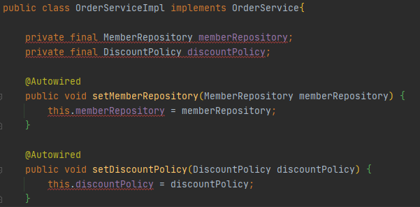

<center><strong>생성자 주입</strong></center>


  
- 생성자 주입 방식을 선택하는 이유는 여러가지가 있지만, 프레임워크에 의존하지 않고, 순수한 자바 언어의 특징을 잘 살리는 방법이기도 하다.
- 기본으로 생성자 주입을 사용하고, 필수 값이 아닌 경우에는 수정자 주입 방식을 옵션으로 부여하면 된다.
  - 생성자 주입과 수정자 주입을 동시에 사용할 수 있다.
- **항상 생성자 주입을 선택해라!** 그리고 가끔 옵션이 필요하면 수정자 주입을 선택해라. 필드 주입은 사용하지 않는게 좋다.

## 자동, 수동 스프링 빈 등록의 올바른 실무 운영 기준

<h3>편리한 자동 기능을 기본으로 사용하자</h3>

- 그러면 어떤 경우에 컴포넌트 스캔과 자동 주입을 사용하고 , 어떤 경우에 설정 정보를 통해서 수동으로 빈을 등록하고 , 의존관계도 수동으로 주입해야 할까?
- 결론부터 이야기하면 , 스프링이 나오고 시간이 갈 수록 점점 자동을 선호하는 추세다.
- 스프링은 `@Component`뿐만 아니라 `@Controller` , `@Service` , `@Repository`처럼 계층에 맞추어 일반적인 애플리케이션 로직을 자동으로 스캔할 수 있도록 지원한다.
- 거기에 더해서 최근 스프링 부트는 컴포넌트 스캔을 기본으로 사용하고 , 스프링 부트의 다양한 스프링 빈들도 조건이 맞으면 자동으로 등록하도록 설계 했다.
- 그리고 **결정적으로 자동 빈 등록을 사용해도 OCP , DIP를 지킬 수 있다.**

<h3>그러면 수동 빈 등록은 언제 사용하면 좋을까</h3>

- 애플리케이션은 크게 업무 로직과 기술 지원 로직으로 나눌 수 있다.
- **업무 로직 빈**
  - 웹을 지원하는 "Controller" , 핵심 비즈니스 로직이 있는 "Service" , 데이터 계층의 로직을 처리하는 "Repository"등이 모두 업무 로직이다. 보통 비즈니스 요구사항을 개발할 때 추가되거나 변경된다.
- **기술 지원 빈**
  - 기술적인 문제나 **공통 관심사 - AOP**를 처리할 때 주로 사용된다. 데이터베이스 연결이나, 공통 로그 처리 처럼 업무 로직을 지원하기 위한 하부 기술이나 공통 기술들이다.
- **업무 로직**은 숫자도 매우 많고 , 한 번 개발해야 하면 Controller , Service , Repository 처럼 어느정도 유사한 패턴이 있다.
  - **이런 경우 자동 기능을 적극 사용하는 것이 좋다.**
- **기술 지원 로직**은 업무 로직과 비교해서 그 수가 매우 적고 , 보통 애플리케이션 전반에 걸쳐서 광범위하게 영향을 미친다.
  - 업무로직은 문제가 발생 했을 때 어디가 문제인지 명확하게 잘 들어나지만
  - 기술 지원 로직은 적용이 잘 되고 있는지 아닌지 조차 파악하기 어려운 경우가 많다.
  - 그래서 이런 기술 지원 로직들은 가급적 수동 빈 등록을 사용해서 명확하게 들어내는 것이 좋다.

> ✋
> - 애플리케이션에 광범위하게 영향을 미치는 **기술 지원 로직**(객체)는  수동 빈으로 등록해서 딱! 설정 정보에 바로 나타나게 하는 것이 유지보수 하기 좋다.
> - <span style="color:red; font-weight:bold">스프링과 스프링 부트가 자동으로 등록하는 수 많은 빈들은 예외</span>
> - 이런 부분들은 스프링 자체를 잘 이해하고 스프링의 의도대로 잘 사용하는게 중요하다.
> - **스프링 부트의 경우 DataSource 같은 데이터베이스 연결에 사용하는 기술 지원 로직까지 내부에서 자동으로 등록하는데, 이런 부분은 매뉴얼을 잘 참고해서 스프링 부트가 의도한대로 편리하게 사용하면 된다.**
> - 스프링 부트가 아니라 **내가 직접 기술 지원 객체를 스프링 빈으로 등록한다면 수동으로 등록해서 명확하게 들어내는 것이 좋다.**
  
- **기술 지원 로직**(객체)는 한  눈에 딱 볼 수 있게 설정 파일을 따로 만들어 수동 빈 등록을 사용하자.
- 자동 빈 등록은 편리하고 직접 개발 하였으면 한 눈에 보이지만 , 인터페이스에 대한 구현체가 여러개이면 어떤 구현체가 주입되는지 확인할려면 코드를 직접 다 뒤져봐야 한다.
- 수동 빈 등록은 구현체가 여러 개 존재하고, 클라이언트의 사용 구분 마다 구현체가 달라진다면 수동 빈 등록을 사용하는게 보기 편할 것 같다. (이렇게 하여도 구현체의 메소드는 직접 다 뒤져 봐야할 것 같다.)

***

# **스프링 빈 조회**

```java
public class ApplicationContextInfoTest {

    AnnotationConfigApplicationContext ac =
              new AnnotationConfigApplicationContext(AppConfig.class);

    @Test
    @DisplayName("모든 빈 출력하기")
    void finaAllBean(){
        String[] beanDefinitionNames = ac.getBeanDefinitionNames();
        for (String beanDefinitionName : beanDefinitionNames) {
            Object bean = ac.getBean(beanDefinitionName);
            System.out.println("bean = " + beanDefinitionName + " object = " + bean);
        }
    }

    @Test
    @DisplayName("애플리케이션 빈 출력하기")   // 내가 등록한 빈만 출력하기
    void finaApplicationBean(){
        String[] beanDefinitionNames = ac.getBeanDefinitionNames();
        for (String beanDefinitionName : beanDefinitionNames) {
            BeanDefinition beanDefinition = ac.getBeanDefinition(beanDefinitionName);
            //  ROLE_APPLICATION : 직접 등록한 애플리케이션 빈
            //  ROLE_INFRASTRUCTURE : 스프링이 내부에서 사용하는 빈
            if(beanDefinition.getRole() == BeanDefinition.ROLE_INFRASTRUCTURE){
                Object bean = ac.getBean(beanDefinitionName);
                System.out.println("bean = " + beanDefinitionName + " object = " + bean);
            }
        }
    }
}
```
<center> <strong>모든 빈 출력하기</strong> </center>


<center> <strong>직접 등록한 애플리케이션 빈</strong> </center>


* * *

- **ac.getBean(빈 이름 , 타입)**
- **ac.getBean(타입)**
- 조회 대상 스프링 빈이 없으면 예외 발생
  - **NoSuchBeanDefinitionException** : No Bean name 'xxxxx' available

```java
class ApplicationContextBeanBasicFindTest {

    AnnotationConfigApplicationContext ac = new AnnotationConfigApplicationContext(AppConfig.class);

    @Test
    @DisplayName("빈 이름으로 조회")
    void 빈_이름으로_조회(){
        MemberService memberService = ac.getBean("memberService", MemberService.class);

        // getBean으로 찾아온 MemberService와 실제 객체가 연결된 구현체(MemberServiceImpl)과 동일한지
        Assertions.assertThat(memberService).isInstanceOf(MemberServiceImpl.class);
    }

    @Test
    @DisplayName("이름없이 타입으로만 조회")
    void 이름없이_타입으로만_조회(){
        MemberService memberService = ac.getBean(MemberService.class);

        // getBean으로 찾아온 MemberService와 실제 객체가 연결된 구현체(MemberServiceImpl)과 동일한지
        Assertions.assertThat(memberService).isInstanceOf(MemberServiceImpl.class);
    }

    @Test
    @DisplayName("구현체 타입으로 조회")
    void 구현체_타입으로_조회(){
        MemberServiceImpl memberService = ac.getBean("memberService", MemberServiceImpl.class);

        Assertions.assertThat(memberService).isInstanceOf(MemberServiceImpl.class);
    }

    @Test
    @DisplayName("빈 이름으로 조회(예외)")
    void 빈_이름으로_조회_예외(){
        // ac.getBean 실행 시 예외가 터져야 테스트 정상 완료
        org.junit.jupiter.api.Assertions.assertThrows(NoSuchBeanDefinitionException.class
                , () -> ac.getBean("xxxx" ,MemberService.class));
    }
}
```

## 동일한 타입이 둘 이상 존재할 때

```
org.springframework.beans.factory.NoUniqueBeanDefinitionException:
No qualifying bean of type 'hello.core.member.MemberRepository' available:
expected single matching bean but found 2: memberRepository1,memberRepository2
```
- **타입으로 조회시 같은 타입의 스프링 빈이 둘 이상이면 오류가 발생한다.** 이때는 빈 이름을 지정하자.
- **ac.getBeansOfType()**을 사용하면 해당 타입의 모든 빈을 조회할 수 있다.
  
```java
public class ApplicationContextSameBeanFindTest {

    AnnotationConfigApplicationContext ac = new AnnotationConfigApplicationContext(SameBeanConfig.class);

    @Configuration
    static class SameBeanConfig {
        @Bean
        public MemberRepository memberRepository1() {
            return new MemoryMemberRepository();
        }

        @Bean
        public MemberRepository memberRepository2() {
            return new MemoryMemberRepository();
        }
    }

    @Test
    @DisplayName("타입으로 조회시 같은 타입이 둘 이상 있으면, 중복 오류가 발생한다.")
    void 같은_타입_둘_이상_조회() {
        Assertions.assertThrows(NoUniqueBeanDefinitionException.class, () -> ac.getBean(MemberRepository.class));
    }

    @Test
    @DisplayName("타입으로 조회시 같은 타입이 둘 이상 있으면, 빈 이름을 지정하면 된다.")
    void 빈_이름_조회() {
        MemberRepository memberRepository = ac.getBean("memberRepository1", MemberRepository.class);
        Assertions.assertThat(memberRepository).isInstanceOf(MemberRepository.class);
    }

    @Test
    @DisplayName("특정 타입을 모두 조회하기")
    //Ctrl + Shift + Enter - 코드 컴플리션
    void 빈_타입_조회(){
        Map<String, MemberRepository> beansOfType = ac.getBeansOfType(MemberRepository.class);
        for (String key : beansOfType.keySet()) {
            System.out.println("key = " + key + " value = " + beansOfType.get(key));
        }
        System.out.println("beansOfType = " + beansOfType);
        Assertions.assertThat(beansOfType.size()).isEqualTo(2);
    }
//    key = memberRepository1 value = hello.core.member.MemoryMemberRepository@550a1967
//    key = memberRepository2 value = hello.core.member.MemoryMemberRepository@2a640157
//    beansOfType = {memberRepository1=hello.core.member.MemoryMemberRepository@550a1967, memberRepository2=hello.core.member.MemoryMemberRepository@2a640157}
}
```


## 스프링 빈 조회 - 상속관계
- 부모 타입으로 조회하면 , 자식 타입도 함게 조회한다.
- **그래서 모든 자바 객체의 최고 부모인 Object타입으로 조회하면 , 모든 스프링 빈을 조회한다.**

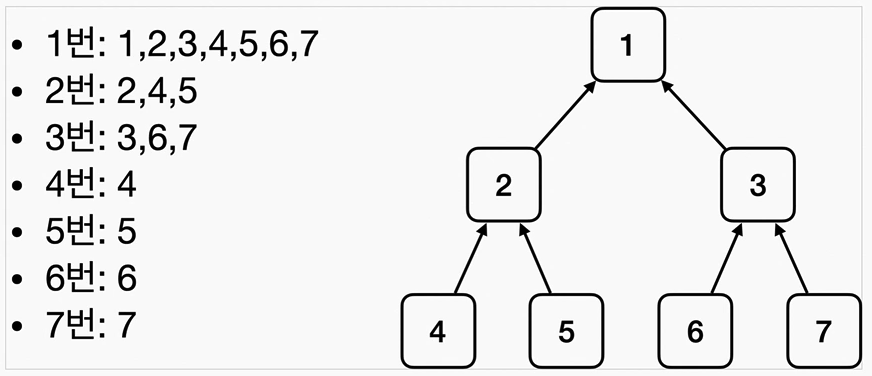

```java
public class ApplicationContextExtendsFindTest {

    AnnotationConfigApplicationContext ac = new AnnotationConfigApplicationContext(TestConfig.class);

    @Configuration
    static class TestConfig{
        @Bean
        public DiscountPolicy rateDiscountPolicy(){
            return new RateDiscountPolicy();
        }
        @Bean
        public DiscountPolicy fixDiscountPolicy(){
            return new FixDiscountPolicy();
        }
    }

    @Test
    @DisplayName("부모 타입으로 조회시 , 자식이 둘 이상 있으면 , 중복 오류가 발생한다.")
    void 부모_타입_조회(){
        Assertions.assertThrows(NoUniqueBeanDefinitionException.class, () -> ac.getBean(DiscountPolicy.class));
    }

    @Test
    @DisplayName("부모 타입으로 조회시 , 자식이 둘 이상 있으면 , 빈 이름을 지정하면 된다.")
    void 부모_타입_조회_빈_이름_지정(){
        DiscountPolicy rateDiscountPolicy = ac.getBean("rateDiscountPolicy", DiscountPolicy.class);
        Assertions.assertThat(rateDiscountPolicy).isInstanceOf(RateDiscountPolicy.class);
    }

    @Test
    @DisplayName("특정 하위 타입으로 조회")
    void 특정_하위_타입_조회(){
        RateDiscountPolicy rateDiscountPolicy = ac.getBean(RateDiscountPolicy.class);
        Assertions.assertThat(rateDiscountPolicy).isInstanceOf(RateDiscountPolicy.class);
    }

    @Test
    @DisplayName("부모 타입으로 모두 조회")
    void 부모_타입_모두_조회(){
        Map<String, DiscountPolicy> beansOfType = ac.getBeansOfType(DiscountPolicy.class);
        Assertions.assertThat(beansOfType.size()).isEqualTo(2);
        for (String key : beansOfType.keySet()) {
            System.out.println("key = " + key + " value = " + beansOfType.get(key));
        }
//        key = rateDiscountPolicy value = hello.core.discount.RateDiscountPolicy@58ffcbd7
//        key = fixDiscountPolicy value = hello.core.discount.FixDiscountPolicy@555cf22
    }

    @Test
    @DisplayName("Object 타입으로 모두 조회")
    void Object_타입(){
        Map<String, Object> beansOfType = ac.getBeansOfType(Object.class);
        for (String key : beansOfType.keySet()) {
            System.out.println("key = " + key + " value = " + beansOfType.get(key));
        }
        // 스프링에 등록된 모든 빈 출력
    }
}
```

## 조회한 빈이 모두 필요할 때 List , Map
의도적으로 정말 해당 타입의 스프링 빈이 다 필요한 경우도 있다.  
  
인터페이스 - **DiscountPolicy**
구현체 - **FixDiscountPolicy**(VIP는 1000원 고정 할인) , **RateDiscountPolicy** (VIP는 금액의 10% 할인)
  
```java
@Component
public class FixDiscountPolicy implements DiscountPolicy{
    private int discountFixAmount = 1000; // 1000원 할인

    @Override
    public int discount(Member member, int price) {
        if(member.getGrade() == Grade.VIP){ // enum타입은 == 을 쓰는게 맞다.
            return discountFixAmount;
        }
        else{
            return 0;
        }
    }
}

@Component
@MainDiscountPolicy
public class RateDiscountPolicy implements DiscountPolicy{

    private int discountPercent = 10;

    @Override
    public int discount(Member member, int price) {
        if(member.getGrade() == Grade.VIP){
            return price * discountPercent / 100;
        }
        else{
            return 0;
        }
    }
}
```
```java
public class AllBeanTest {

    @Test
    void findAllBean(){
        AnnotationConfigApplicationContext ac =
                new AnnotationConfigApplicationContext(AutoAppConfig.class,DiscountService.class);

        DiscountService discountService = ac.getBean(DiscountService.class);
        Member member = new Member(1L, "userA", Grade.VIP);
        int fixDiscountPrice = discountService.discount(member , 10000 , "fixDiscountPolicy");
        int rateDiscountPrice = discountService.discount(member , 20000 , "rateDiscountPolicy");

        Assertions.assertThat(discountService).isInstanceOf(DiscountService.class);
        Assertions.assertThat(fixDiscountPrice).isEqualTo(1000);
        Assertions.assertThat(rateDiscountPrice).isEqualTo(2000);
    }

    static class DiscountService{
        private final Map<String,DiscountPolicy> policyMap;
        private final List<DiscountPolicy> policyList;

        @Autowired
        public DiscountService(Map<String, DiscountPolicy> policyMap, List<DiscountPolicy> policyList) {
            this.policyMap = policyMap;
            this.policyList = policyList;
            for (String policyMapKey : policyMap.keySet()) {
                System.out.println("policyMapKey = " + policyMapKey +
                        " | policyMapVal = " + policyMap.get(policyMapKey));
            }
            for (DiscountPolicy discountPolicy : policyList) {
                System.out.println("policyList = " + discountPolicy);
            }
        }


        public int discount(Member member, int price, String discountCode) {
            DiscountPolicy discountPolicy = policyMap.get(discountCode);
            return discountPolicy.discount(member , price);
        }
    }
}
```


- 스프링 컨테이너에 DiscountPolicy타입을 검색해 현재 구현체 2개가 스프링 빈으로 등록되어 있다.
- **DiscountService**의 생성자가 `policyMap`과 `policyList`를 스프링 컨테이너에서 가져온다.
- 스프링 컨테이너가 **DiscountPolicy**의 자식들을 검색하여 자바 컬렉션에 한하여 데이터 타입을 보고 자동으로 넣어준다.
- 테스트 코드는 **RateDiscountPolicy**와 **FixDiscountPolicy** 각각 만들어 `discount메소드`를 호출한다.
- `discount메소드`는 **member객체**와 **가격** 그리고 **빈으로 등록된 할인 정책 클래스 이름 (문자열)** 을 받게된다.
- 빈으로 등록된 할인 정책 클래스 이름을 사용하여 생성자에서 받아놓은 `policyMap`에서 해당하는 빈을 가져와 그 빈의 `discount 메소드`를 사용하게 된다.
- (RateDiscountPolicy와 FixDiscountPolicy의 클래스 안에도 discount메소드가 정의 되어 있다.)

***

# **빈 생명주기**

**데이터베이스 커넥션 풀이나 , 네트워크 소켓 처럼 애플리케이션 시작 시점에 필요한 연결을 미리 해두고 , 애플리케이션 종료시점에 연결을 모두 종료하는 작업을 진행 하려면** , <span style="color:red; font-weight:bold">객체의 초기화와 종료 작업이 필요하다.</span>  
이러한 초기화 작업과 종료 작업을 어떻게 진행하는지 예제로 알아보자  
  
스프링은 간단하게 다음과 같은 라이프 사이클을 거친다.
- **"객체 생성" → "의존관계 주입" (생성자 주입은 예외)**
  
스프링 빈은 객체를 생성하고 , 의존관계 주입이 다 끝난 다음에야 필요한 데이터를 사용할 수 있는 준비가 완료된다.  
**스프링은 의존관계 주입이 완료되면**<span style="color:red; font-weight:bold"> 스프링 빈에게 콜백 메서드를 통해서 초기화 시점을 알려주는 다양한 기능</span>을 제공한다.  
  
또한 **스프링은 스프링 컨테이너가 종료되기 직전에** <span style="color:red; font-weight:bold">소멸 콜백</span>을 해준다.

> **스프링 빈의 이벤트 라이프 사이클**  
> 1. "스프링 컨테이너 생성"
> 1. "스프링 빈 생성"
> 1. "의존관계 주입"
> 1. "초기화 콜백"
> 1. "사용"
> 1. "소멸전 콜백"
> 1. "스프링 종료"

✋
> **"객체의 생성과 초기화를 분리하자"**   
> 생성자는 필수 정보(파라미터)를 받고 , 메모리를 할당해서 객체를 생성하는 책임을 가진다.  
> 반면에 초기화는 이렇게 생성된 값들을 활용해서 외부 커넥션을 연결하는 등 무거운 동작을 수행한다.따라서 생성단에서 무거운 초기화 작업을 함께하는 것 보다는 객체를 생성하는 부분과 초기화 하는 부분을 명확하게 나누는 것이 유지보수 관점에서 좋다.  
> 물론 초기화 작업이 내부 값들만 약간 변경하는 정도로 단순한 경우에는 생성자에서 한번에 다 처리하는게 더 나을 수 있다.

***

## **스프링은 크게 3가지 방법으로 빈 생명주기 콜백을 지원한다.**

<h3>인터페이스 (InitializingBean , DisposableBean)</h3>

인터페이스를 사용하는 초기화, 종료 방법은 스프링 초창기에 나온 방법들이고,지금은 더 나은 방법들이 있어 거의 사용하지 않는다.  

```java
public class NetworkClient implements InitializingBean , DisposableBean {
    private String url;

    public NetworkClient() {
        System.out.println("생성자 호출 , url = " + url);
    }

    public void setUrl(String url) {
        this.url = url;
    }

    // 서비스 시작시 호출
    public void connect(){
        System.out.println("Connect : " + url);
    }

    public void call(String message){
        System.out.println("Call : " + url + " message : "+ message);
    }

    // 서비스 종료시 호출
    public void disconnect(){
        System.out.println("close : " + url);
    }

    @Override
    // 의존관계 주입이 끝나면 호출
    public void afterPropertiesSet() throws Exception {
        connect();
        call("초기화 연결 메시지");
    }

    @Override
    // 서버가 종료 될 때
    public void destroy() throws Exception {
        System.out.println("destory");
        disconnect();
    }
}

public class BeanLifeCycleTest {

    @Test
    public void lifeCycleTest(){
        // 스프링 컨테이너 생성
        AnnotationConfigApplicationContext ac =
                new AnnotationConfigApplicationContext(LifeCycleConfig.class);

        NetworkClient bean = ac.getBean(NetworkClient.class);

        // 스프링 컨테이너 종료
        ac.close();
    }

    @Configuration
    static class LifeCycleConfig{
        @Bean
        public NetworkClient networkClient(){
            NetworkClient networkClient = new NetworkClient();
            networkClient.setUrl("http://hello-spring.dev");
            return networkClient;
        }
    }
}
```
```
생성자 호출 , url = null
Connect : http://hello-spring.dev
Call : http://hello-spring.dev message : 초기화 연결 메시지
destory
close : http://hello-spring.dev
```

- **단점**
  - 이 인터페이스는 스프링 전용 인터페이스다. 해당 코드가 스프링 전용 인터페이스에 의존한다.
  - 초기화 , 소멸 메소드의 이름을 변경할 수 없다.
  - 내가 코드를 고칠 수 없는 외부라이브러리에 적용할 수 없다.

<h3>설정 정보에 초기화 메서드 , 종료 메서드 지정</h3>

**설정 정보에 `@Bean(InitMethod="init" , destroyMethod="close")`처럼 초기화 , 소멸 메소드를 지정할 수 있다.**

```kotlin
class BeanTest {

    @Test
    fun beanLifeCycle() {
        val ac = AnnotationConfigApplicationContext(BeanConfig::class.java)
        val bean = ac.getBean(TestBean::class.java)

        ac.close()
        Assertions.assertThat(bean.url).isEqualTo("http://hello-spring.dev")
    }
}

@Configuration
class BeanConfig {
    @Bean(initMethod = "init", destroyMethod = "close")
    fun networkClient(): TestBean {
        return TestBean("http://hello-spring.dev")
    }
}

data class TestBean(
    val url: String
) {

    init {
        println("[TestBean] 생성자 호출 , url = $url")
    }

    // 의존관계 주입이 끝나면 호출
    @Throws(Exception::class)
    fun init() {
        println("[TestBean] init : $url")
    }

    // 종료될 때
    @Throws(Exception::class)
    fun close() {
        println("[TestBean] close : $url")
    }
}
```
```
[TestBean] 생성자 호출 , url = http://hello-spring.dev
[TestBean] init : http://hello-spring.dev
[TestBean] close : http://hello-spring.dev
```

- **설정 정보 사용 특징**
  - **`@Bean`에서만 사용 가능하다.**
  - 메소드 이름을 자유롭게 줄 수 있다.
  - 스프링 빈이 스프링 코드에 의존하지 않는다.
  - **코드가 아니라 설정 정보를 사용하기 때문에 코드를 고칠 수 없는 외부 라이브러리에도 초기화 , 종료 메소드를 적용할 수 있다.**
- **종료 메소드 추론**
  - `@Bean`의 `destroyMethod`에는 아주 특별한 기능이 있다.
  - 라이브러리는 대부분 `close` , `shutdown`이라는 이름의 종료 메소드를 사용한다.
  - `@Bean`의 `destroyMethod`는 기본값이 **"inferred"**(추론)으로 등록 되어 있다.
  - 이 추론 기능은 `close` , `shutdown`이라는 이름의 메서드를 자동으로 호출해준다.
  - 이름 그대로 종료 메소드를 추론해서 호출 해준다.
  - **따라서 스프링 빈`@Bean`으로 등록하면 종료 메소드는 따로 적어주지 않아도 잘 동작한다**
  - 추론 기능을 사용하기 싫으면 빈 공백을 지정하면 된다.

***

<h3>`@PostConstruct` , `@PreDestory` 애노테이션 지정 (권장)</h3>  


```kotlin
class BeanTest {

    @Test
    fun beanLifeCycle() {
        val ac = AnnotationConfigApplicationContext(BeanConfig::class.java)
        val bean = ac.getBean(TestBean::class.java)

        ac.close()
        Assertions.assertThat(bean.url).isEqualTo("http://hello-spring.dev")
    }
}

@Configuration
class BeanConfig {
//    @Bean(initMethod = "init", destroyMethod = "close")
    @Bean
    fun networkClient(): TestBean {
        return TestBean("http://hello-spring.dev")
    }
}

data class TestBean(
    val url: String
) {

    init {
        println("[TestBean] 생성자 호출 , url = $url")
    }

    // 의존관계 주입이 끝나면 호출
    @PostConstruct
    @Throws(Exception::class)
    fun customInitMethod() {
        println("[TestBean] customInitMethod : $url")
    }

    // 종료될 때
    @PreDestroy
    @Throws(Exception::class)
    fun customCloseMethod() {
        println("[TestBean] customCloseMethod : $url")
    }
}

```

```java
[TestBean] 생성자 호출 , url = http://hello-spring.dev
[TestBean] customInitMethod : http://hello-spring.dev
[TestBean] customCloseMethod : http://hello-spring.dev
```

- **특징**
  - **최신 스프링에서 가장 권장하는 방법이다.**
  - 스프링에 종속적인 기술이 아니라 JSR-250이라는 자바 표준이다.따라서 스프링이 아닌 다른 컨테이너에서도 동작한다.
  - 컴포넌트 스캔(자동 빈 등록)과 잘 어울린다.
  - **유일한 단점은 외부 라이브러리에는 적용하지 못한다는 것이다. 외부 라이브러리를 초기화 , 종료 해야하면 `@Bean`의 기능을 사용하자**

***

# **빈 스코프란?**
**스프링 빈**이 스프링 컨테이너의 시작과 함께 생성되어 스프링 컨테이너가 종료될 때 까지 유지된다고 학습했다.

✅ **이것은 스프링 빈이 기본적으로 싱글 톤 스코프로 생성되기 때문이다.**

✅ **스코프는 번역 그대로 빈이 존재할 수 있는 범위를 뜻한다.**

- **싱글톤** : 기본 스코프 , **스프링 컨테이너의 시작과 종료까지 유지 되는 가장 넓은 범위의 스코프**이다.
- **프로토 타입** : 스프링 컨테이너는 **프로토 타입 빈의 생성과 의존관계 주입까지만 관여하고 더는 관리하지 않는 매우 짧은 범위의 스코프** 이다.

<h3>컴포넌트 스캔 자동 등록</h3>

```java
  @Scope("prototype")
  @Component
  public class FixDiscountPolicy implements DiscountPolicy{
  	...
  }
```

<h3>수동 등록 (`@Bean`)</h3>

```java
@Scope("prototype")
@Bean
public OrderService orderService(){
    return new OrderServiceImpl(memberRepository(), discountPolicy());
}
```

***

## **프로토 타입 스코프**
- **싱글 톤 스코프의 빈을 스프링 컨테이너는 항상 같은 인스턴스의 스프링 빈을 반환한다.**
- 반면에 **프로토타입 스코프를 스프링 컨테이너에 조회하면 스프링 컨테이너는 항상 새로운 인스턴스를 생성해서 반환한다.**


<h3>싱글톤 빈 요청</h3>

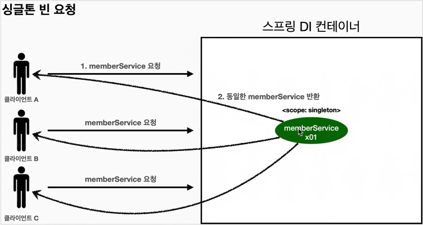
- 싱글 톤 스코프의 빈을 스프링 컨테이너에 요청 한다.
- 스프링 컨테이너는 본인이 관리하는 스프링 빈을 반환한다.
- 이후에 스프링 컨테이너에 같은 요청이 와도 같은 객체 인스턴스의 스프링 빈을 반환한다.

<h3>테스트</h3>

```java
public class SingletonTest {

    @Test
    void singletonBeanFind(){
        AnnotationConfigApplicationContext ac = new AnnotationConfigApplicationContext(SingletonBean.class);

        SingletonBean singletonBean1 = ac.getBean(SingletonBean.class);
        SingletonBean singletonBean2 = ac.getBean(SingletonBean.class);

        System.out.println("singletonBean1 = " + singletonBean1);
        System.out.println("singletonBean2 = " + singletonBean2);
        Assertions.assertThat(singletonBean1).isSameAs(singletonBean2);

        ac.close();
//       출력
//       SingletonBean.init
//       singletonBean1 = hello.core.scope.SingletonTest$SingletonBean@7c9da249
//       singletonBean2 = hello.core.scope.SingletonTest$SingletonBean@7c9da249
//       SingletonBean.destory
    }

    @Scope("singleton") // default
    static class SingletonBean{

        @PostConstruct
        public void init(){
            System.out.println("SingletonBean.init");
        }

        @PreDestroy
        public void destory(){
            System.out.println("SingletonBean.destory");
        }
    }
}
```

## 프로토타입 빈 요청

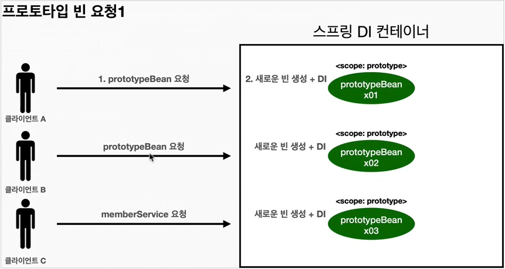
- 프로토타입 스코프의 빈을 스프링 컨테이너에 요청한다.
- **스프링 컨테이너는 이 시점에 프로토타입 빈을 생성하고 , 필요한 의존관계를 주입한다. (요청 시점에 생성한다.)**


- 스프링 컨테이너는 생성한 프로토타입 빈을 클라이언트에 반환한다.
- **이후에 스프링 컨테이너에 같은 요청이 오면 항상 새로운 프로토타입 빈을 생성해서 반환한다.**

<h3>테스트</h3>

```java
public class PrototypeTest {

    @Test
    void prototypeBeanFind(){
        AnnotationConfigApplicationContext ac =
                new AnnotationConfigApplicationContext(PrototypeBean.class);
        System.out.println("find prototypeBean1");
        PrototypeBean prototypeBean1 = ac.getBean(PrototypeBean.class);

        System.out.println("find prototypeBean2");
        PrototypeBean prototypeBean2 = ac.getBean(PrototypeBean.class);

        System.out.println("prototypeBean1 = " + prototypeBean1);
        System.out.println("prototypeBean2 = " + prototypeBean2);

        Assertions.assertThat(prototypeBean1).isNotSameAs(prototypeBean2);

        ac.close();
//        출력
//        find prototypeBean1
//        PrototypeBean.init
//        find prototypeBean2
//        PrototypeBean.init
//        prototypeBean1 = hello.core.scope.PrototypeTest$PrototypeBean@7c9da249
//        prototypeBean2 = hello.core.scope.PrototypeTest$PrototypeBean@7ea7bde1
    }

    @Scope("prototype")
    static class PrototypeBean{
        @PostConstruct
        public void init(){
            System.out.println("PrototypeBean.init");
        }

        @PreDestroy
        public void destory(){
            System.out.println("PrototypeBean.destory");
        }
    }
}
```


> 프로토타입 빈을 언제 사용할까?  
> - **매번 사용할 때 마다 의존관계 주입이 완료된 새로운 객체가 필요하면 사용하면 된다.**
> - 그런데 실무에서 개발하다 보면 싱글톤 빈으로 대부분의 문제를 해결할 수 있기 때문에 프로토타입 빈을 직접 적으로 사용하는 경우는 매우 드물다.
> - `ObjectProvider`는 DL을 위한 편의 기능을 많이 제공해주고 , 스프링 외에 별도의 의존관계 추가가 필요 없이 때문에 편리하다.
> - 만약 코드를 스프링이 아닌 다른 컨테이너에서도 사용할 수 있어야 한다면 JSR-330 Provider를 사용해야 한다.

## 정리

- **싱글톤 빈**은 **스프링 컨테이너 생성 시점에 초기화 메서드가 실행 되지만 , 프로타입 스코프 빈은 스프링 컨테이너에서 빈을 조회할 때 생성을 하고 초기화 메서드도 그 때 실행된다.**
- 프로토타입 빈을 2번 조회했으므로 완전히 다른 스프링 빈이 생성되고 , 초기화도 2번 실행된 것을 확인할 수 있다.
- 싱글톤 빈은 스프링 컨테이너가 관리하기 때문에 스프링 컨테이너가 종료될 때 빈의 종료 메소드가 실행 되지만
- **프로토타입 빈은 스프링 컨테이너가 생성과 의존관계 주입 그리고 초기화 까지만 관여하고 , 더는 관리하지 않는다.**
- 따라서 프로토타입 빈은 스프링 컨테이너가 종료될 때 `@PreDestroy`와 같은 종료 메소드가 전혀 실행 되지 않는다.

## 싱글톤 , 프로토타입 빈 함께 사용시 문제점과 문제 해결 방법

스프링 컨테이너에 프로토타입 스코프의 빈을 요청하면 항상 새로운 객체 인스턴스를 생성해서 반환한다.  
하지만 **싱글톤 빈과 함께 사용할 때는 의도한 대로 잘 동작하지 않으므로 주의해야 한다.**  

<h3>프로토타입 빈 직접 요청</h3>

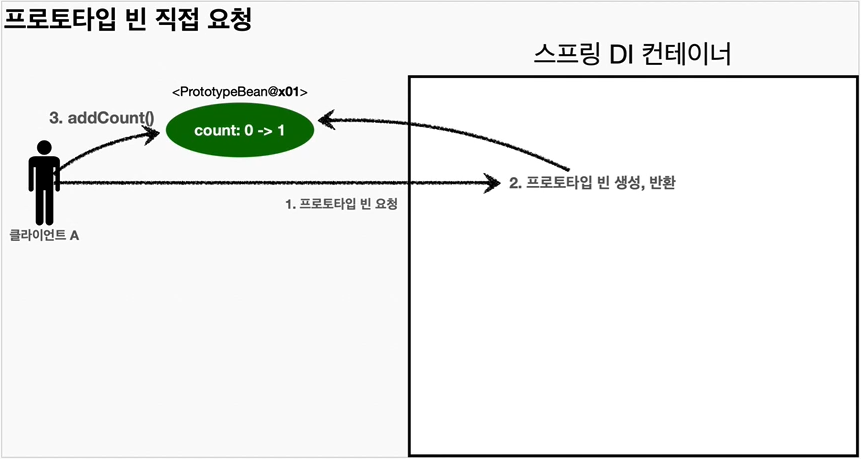
- 클라이언트A는 스프링 컨테이너에 프로토타입 빈을 요청한다.
- 스프링 컨테이너는 프로토타입 빈을 새로 생성해서 반환`('x01')`한다. 해당 빈의 `count` 필드 값은 `0`이다.
- 클라이언트는 조회한 프로토타입 빈에 `addCount`를 호출하면서 `count`필드를 `+1` 한다.
- 결과적으로 프로토타입 빈 `('x01')`의 `count`는 `1`이 된다.

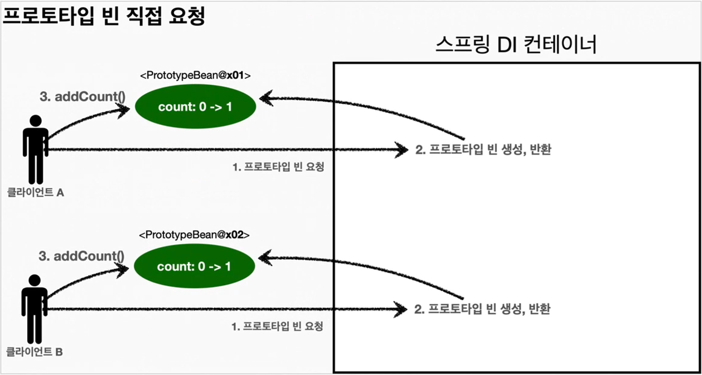
- 클라이언트B는 스프링 컨테이너에 프로토타입 빈을 요청한다.
- 스프링 컨테이너는 프로토타입 빈을 새로 생성해서 반환`('x02')`한다. 해당 빈의 `count` 필드 값은 `0`이다.
- 클라이언트는 조회한 프로토타입 빈에 `addCount()`를 호출하면서 `count` 필드를 `+1` 한다.
- 결과적으로 프로토타입 빈`('x02')`의 `count`는 `1`이 된다.

<h3>테스트</h3>

```java
public class SingletonWithPrototypeTest1 {

    @Test
    void prototypeFind(){
        AnnotationConfigApplicationContext ac =
                new AnnotationConfigApplicationContext(PrototypeBean.class);

        PrototypeBean prototypeBean1 = ac.getBean(PrototypeBean.class);
        prototypeBean1.addCount();
        System.out.println("prototypeBean1 : " + prototypeBean1.getCount());
        Assertions.assertThat(prototypeBean1.getCount()).isEqualTo(1);

        PrototypeBean prototypeBean2 = ac.getBean(PrototypeBean.class);
        prototypeBean2.addCount();
        System.out.println("prototypeBean2 : " + prototypeBean2.getCount());
        Assertions.assertThat(prototypeBean2.getCount()).isEqualTo(1);

//        출력
//        PrototypeBean.init hello.core.scope.SingletonWithPrototypeTest1$PrototypeBean@5fb4aba9
//        prototypeBean1 : 1
//        PrototypeBean.init hello.core.scope.SingletonWithPrototypeTest1$PrototypeBean@2ed424ed
//        prototypeBean2 : 1
    }

    @Scope("prototype")
    static class PrototypeBean{
        private int count = 0;

        public void addCount(){
            count++;
        }

        public int getCount(){
            return count;
        }

        @PostConstruct
        public void init(){
            System.out.println("PrototypeBean.init " + this);
        }

        @PreDestroy
        public void destory(){
            System.out.println("PrototypeBean.destroy");
        }
    }
}
```

## 싱글톤 빈에서 프로토타입 빈 사용

**이번에는 clientBean이라는 싱글톤 빈이 의존관계 주입을 통해서 프로토타입 빈을 주입받아서 사용하는 예를 보자**


- `clientBean`은 싱글톤 이므로 , 보통 스프링 컨테이너 생성 시점에 함께 생성되고 , 의존관계 주입도 발생한다.
- `clientBean`은 의존관계 자동 주입을 사용한다. 주입 시점에 스프링 컨테이너에 프로토타입 빈을 요청한다.
- 스프링 컨테이너는 프로토타입 빈을 생성해서 `clientBean`에 반환한다. 프로토타입 빈의 `count` 필드 값은 `0`이다.
- 이제 `clientBean`은 프로토타입 빈을 내부 필드에 보관한다. **(정확히는 참조값을 보관한다.)**

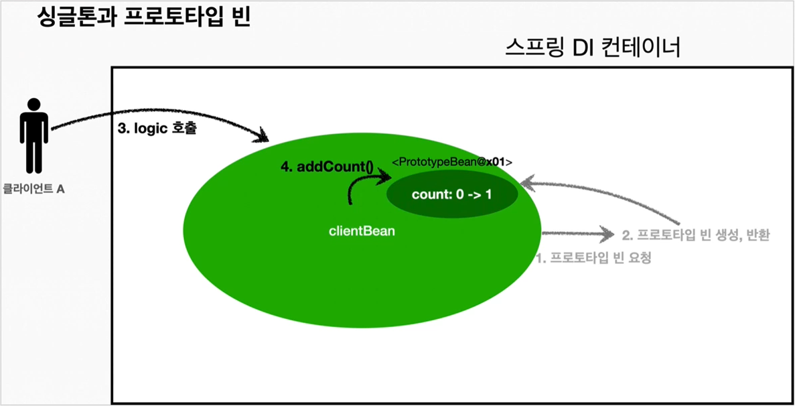
- 클라이언트A는 `clientBean`을 스프링 컨테이너에 요청해서 받는다. 싱글톤이므로 항상 같은 `clientBean`이 반환된다.
- 클라이언트A는 `clientBean.logic()` (addCount메소드 포함)을 호출한다.
- `clientBean`은 `prototypeBean`의 `addCount()`를 호출해서 프로토타입 빈의 `count`를 증가한다.
- `count`값이 `1`이 된다.

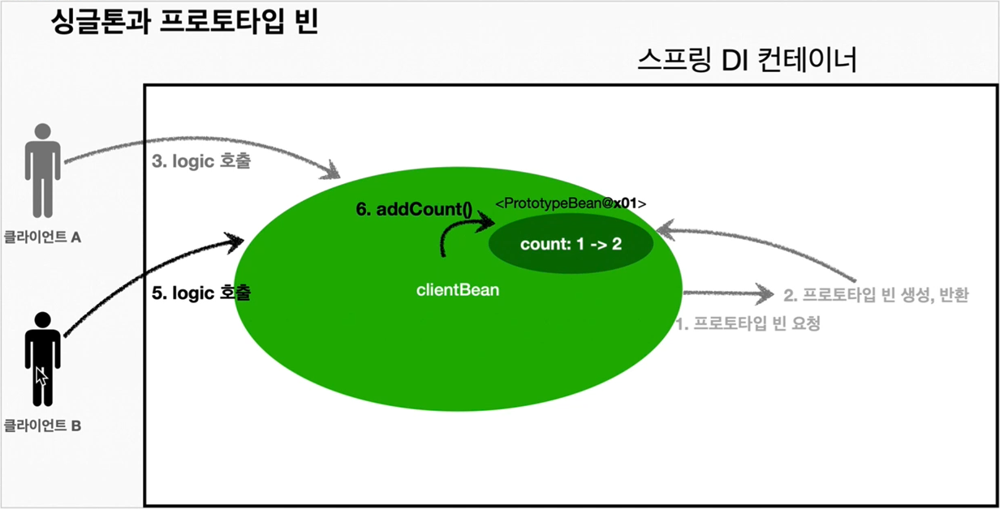
- 클라이언트B는 `clientBean`을 스프링 컨테이너에 요청해서 받는다. 싱글톤이므로 항상 같은 `clientBean`이 반환된다.
- `clientBean`이 내부에 가지고 있는 프로토타입 빈은 이미 과거에 주입이 끝난 빈이다. 주입 시점에 스프링 컨테이너에 요청해서 프로토타입 빈이 새로 생성이 된 것이지 , 사용 할 때마다 새로 생성되는 것이 아니다.
- 클라이언트B는 `clientBean.logic()` (addCount메소드 포함)을 호출한다.
- `clientBean`은 `prototypeBean`의 `addCount()`를 호출해서 프로토타입 빈의 `count`를 증가한다.
- 원래 `1`이였으므로 `2`가 된다.

<h3>테스트</h3>

```java
public class SingletonWithPrototypeTest1 {

    @Test
    void singletonClientUsePrototype(){
        AnnotationConfigApplicationContext ac =
                new AnnotationConfigApplicationContext(ClientBean.class , PrototypeBean.class);

        ClientBean clientBean1 = ac.getBean(ClientBean.class);
        int count1 = clientBean1.logic();
        Assertions.assertThat(count1).isEqualTo(1);

        ClientBean clientBean2 = ac.getBean(ClientBean.class);
        int count2 = clientBean2.logic();
        Assertions.assertThat(count2).isEqualTo(2);

    }
    @Scope("singleton")
    static class ClientBean{
        private final PrototypeBean prototypeBean;

        // PrototypeBean 호출 시점이 ClientBean이 스프링 빈으로 등록 될 때 1번 만 호출
        // 결국 같은 PrototypeBean이 사용된다.
        public ClientBean(PrototypeBean prototypeBean) {
            this.prototypeBean = prototypeBean;
        }

        public int logic(){
            prototypeBean.addCount();
            return prototypeBean.getCount();
        }
    }

    @Scope("prototype")
    static class PrototypeBean{
        private int count = 0;

        public void addCount(){
            count++;
        }

        public int getCount(){
            return count;
        }

        @PostConstruct
        public void init(){
            System.out.println("PrototypeBean.init " + this);
        }

        @PreDestroy
        public void destory(){
            System.out.println("PrototypeBean.destroy");
        }
    }
}
```
- **스프링은 일반적으로 싱글톤 빈을 사용하므로 , 싱글톤 빈이 프로토타입 빈을 사용하게 된다.**
- 그런데 싱글톤 빈은 생성 시점에만 의존관계 주입을 받기 때문에 , **프로토타입 빈이 생성되기는 하지만 싱글톤 빈과 함께 계속 유지되는 것이 문제다.**
- 프로토타입 빈을 주입 시점에만 새로 생성하는게 아니라 , 사용할 때 마다 새로 생성해서 사용하는것을 원한다.


> ✋
> - 여러 빈에서 같은  프로토타입 빈을 주입 받으면 , **"주입 받는 시점에 각각 새로운 프로토타입 빈이 생성된다"**
> - 예를 들어
>    - clientA , clientB가 각각 의존관계 주입을 받으면 각각 다른 인스턴스의 프로토타입 빈을 주입 받는다.
>    - clientA -> prototypeBean@x01
clientB -> prototypeBean@x02
물론 사용할 때 마다 새로 생성되는 것은 아니다.

## 문제 해결
싱글톤 빈과 프로토타입 빈을 함께 사용할 때 ,**어떻게 하면 사용할 때 마다 항상 새로운 프로토타입 빈을 생성할 수 있을까?**

<h3>스프링 컨테이너에 요청 `ObjectProvider` , `ObjectFactory`</h3>

✅ **가장 간단한 방법은 싱글톤 빈이 프로토타입을 사용할 때 마다 스프링 컨테이너에 새로 요청하는 것이다.**

- `ac.getBean()`을 통해서 항상 새로운 프로토타입 빈이 생성되는 것을 확인할 수 있다.
- **의존관계를 외부에서 주입(DI)받는게 아니라 이렇게 직접 필요한 의존관계를 찾는 것을 Dependency Lookup(DL)의존관계 조회(탐색) 이라 한다.**
- 그런데 이렇게 스프링의 애플리케이션 컨텍스트 전체를 주입 받게 되면 , 스프링 컨테이너에 종속적인 코드가 되고 ,단위 테스트도 어려워 진다.
- 지금 필요한 기능은 지정한 프로토타입 빈을 컨테이너 에서 대신 찾아주는 DL정도의 기능만 제공하는 무언가가 있으면 된다.

✅ **ObjectProvider , ObjectFactory**

```java
@Scope("singleton")
static class ClientBean{
    @Autowired
    private ObjectProvider<PrototypeBean> prototypeBeanProvider;

    public int logic(){
        PrototypeBean prototypeBean = prototypeBeanProvider.getObject();
        prototypeBean.addCount();
        return prototypeBean.getCount();
    }
}

@Scope("singleton")
static class ClientBean{
    @Autowired
    private ObjectFactory<PrototypeBean> prototypeBeanProvider;

    public int logic(){
        PrototypeBean prototypeBean = prototypeBeanProvider.getObject();
        prototypeBean.addCount();
        return prototypeBean.getCount();
    }
}
```

**ObjectProvider**
- `prototypeBeanProvider.getObject()`는 `ac.getBean()` 처럼 **스프링 컨테이너를 통해 (제네릭에 정의된) `PrototypeBean`을 찾아 반환해준다. (DL)**
- 스프링이 제공하는 기능을 사용하지만 , 기능이 단순하므로 단위테스트를 만들거나 mock코드를 만들기는 훨씬 쉬워진다.
- **너무 무거운 `ac`를 새로 생성하는 것 보다 딱 필요한 DL정도의 기능만 제공한다.**

**ObjectFactory**
- 상속 , 옵션 , 스트림 처리의 편의 기능이 많다.
- 기능이 단순 , 별도의 라이브러리 필요 없고 , 스프링에 의존한다.
- `getObject()` 메소드 하나만 존재한다.


<h3>JSR-330 Provider (자바 표준)</h3>

**마지막 방법은 javax.inject.Provider라는 JSR-330 자바 표준을 사용하는 방법이다.**

```
implementation 'javax.inject:javax.inject:1'
```
```java
@Scope("singleton")
static class ClientBean{
    @Autowired
    private Provider<PrototypeBean> prototypeBeanProvider;

    public int logic(){
        PrototypeBean prototypeBean = prototypeBeanProvider.get();
        prototypeBean.addCount();
        return prototypeBean.getCount();
    }
}
```

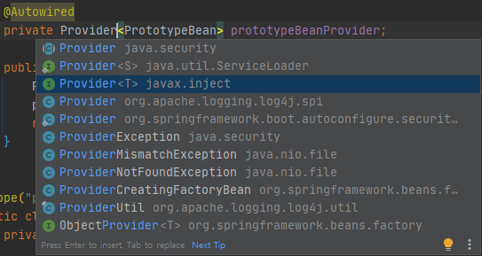
- `provider.get()`을 통해 항상 새로운 프로토타입 빈을 생성한다.
- `provider.get()`을 호출하면 내부에서는 스프링 컨테이너를 통해 해당 빈을 찾아서 반환한다.(DL)
- 기능이 단순하므로 단위테스트를 만들거나 mock코드를 만들기는 훨씬 쉬워진다.
- Provider는 지금 딱 필요한 DL정도의 기능만 제공한다.
- 자바 표준이므로 스프링이 아닌 다른 컨테이너에서도 사용할 수 있다.

**싱글톤 빈**은 스프링 컨테이너의 시작과 끝까지 함께하는 매우 긴 스코프 이고 ,
**프로토타입 빈**은 생성과 함께 의존관계 주입 , 그리고 초기화까지만 진행하는 특별한 스코프이다.

# 웹 스코프

- **웹 환경에서만 동작한다.**
- **프로토타입과 다르게 스프링이 해당 스코프의 종료시점까지 관리한다. 따라서 종료메서드가 호출된다.**
- **웹 스코프 종류**
  - `request` : (각각의) HTTP 요청 하나가 들어오고 나갈 때 까지 유지되는 스코프 , 각각의 HTTP 요청 마다 별도의 빈 인스턴스가 생성되고 관리된다.
  - `session` : HTTP Session과 동일한 생명 주기를 가지는 스코프
  - `application` : 서블릿 컨텍스트(ServletContext)와 동일한 생명 주기를 가지는 스코프
  - `websocket` : 웹 소켓과 동일한 생명 주기를 가지는 스코프

> ✋ 여기서는 `request` 스코프를 예제로 설명한다.  
> 나머지는 범위만 다르지 동작 방식은 비슷하다.  

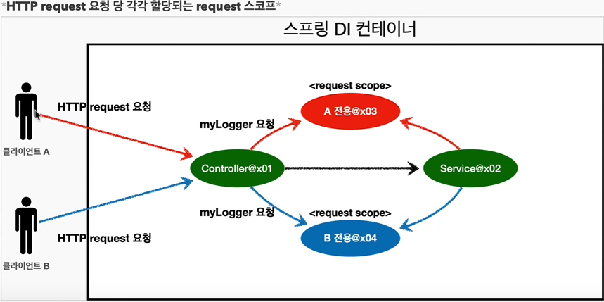

<h3>request 스코프 예제 만들기</h3>

```
implementation 'org.springframework.boot:spring-boot-starter-web'
```
> ✋
> - `spring-boot-starter-web`을 추가하면 내장 톰캣 서버를 활용해서 웹 서버와 스프링을 함께 실행 시킨다.
> - 스프링 부트는 웹 라이브러리가 없으면 우리가 지금까지 학습한 `AnnotationConfigApplicationContext`를 기반으로 애플리케이션을 구동한다.
> - 웹 라이브러리가 추가되면 웹과 관련된 추가 설정과 환경들이 필요하므로`AnnotationConfigServletWebServerApplicationContext`를 기반으로 애플리케이션을 구동한다.

- **동시에 여러 HTTP 요청이 오면 정확이 어떤 요청이 남긴 로그인지 구분하기 어렵다.**
- 이럴때 사용하기 딱 좋은것이 바로 `request` 스코프 이다.


- **기대하는 공통 포맷 : [UUID][requestURL]{message}**
- UUID를 사용해서 HTTP요청을 구분하자.
- requestURL 정보도 추가로 넣어서 어떤 URL을 요청해서 남은 로그인지 확인하자.

```java
@Component
@Scope(value="request")
public class MyLogger {
    private String uuid;
    private String requestURL;

    public void setRequestURL(String requestURL) {
        this.requestURL = requestURL;
    }

    public void log(String message){
        System.out.println("[" + uuid + "][" + requestURL + "] " + message );
    }

    @PostConstruct
    public void init(){
        uuid = UUID.randomUUID().toString();
        System.out.println("[" + uuid + "] request scope bean create :" + this);
    }

    @PreDestroy
    // HTTP REQUEST가 빠져 나갈 때 소멸된다.
    public void close(){
        System.out.println("[" + uuid + "] request scope bean close :" + this);
    }
}
```
- **로그를 출력하기 위한 클래스이다.**
- `@Scope(value = "request")`를 사용해서 `request`스코프로 지정했다.
- 이 빈은 HTTP요청 당 하나씩 생성되고 , HTTP요청이 끝나는 시점에 소멸된다.
- 이 빈이 생성되는 시점에 자동으로 `@PostConstruct`초기화 메서드를 사용해 uuid를 생성하고 저장해둔다.
- 이 빈은 HTTP요청 당 하나씩 생성되므로 , uuid를 지정해두면 다른 HTTP요청과 구분할 수 있다.
- 이 빈이 소멸되는 시점에 `@PreDestroy`를 사용해서 종료 메시지를 남긴다.
- requestURL은 이 빈이 생성되는 시정에 알 수  없으므로 , 외부에서 setter로 입력 받는다.


```java
@Controller
@RequiredArgsConstructor
public class LogDemoController {
    private final LogDemoService logDemoService;
    private final MyLogger myLogger;

    @RequestMapping("log-demo")
    @ResponseBody	// 앞단 페이지가 없으므로 단순 문자열 RETURN
    public String logDemo(HttpServletRequest request){
        String requestUrl = request.getRequestURL().toString();
        myLogger.setRequestURL(requestUrl);

        myLogger.log("controller test");

        logDemoService.logic("testId");

        return "OK";
    }
}

@Service
@RequiredArgsConstructor
public class LogDemoService {
    private final MyLogger myLogger;

    public void logic(String id){
        myLogger.log("service id = " + id);
    }
}
```

> **requestURL을 MyLogger에 저장하는 부분은 컨트롤러 보다는 공통 처리가 가능한 스프링 인터셉터나 서블릿 필터 같은 곳을 활용하는 것이 좋다.**

- request scope를 사용하지 않고 파라미터로 이 모든 정보를 서비스 계층에 넘긴다면 파라미터가 많아서 지저분해진다.
- 더 문제는 requestURL 같은 웹과 관련된 정보가 웹과 관련없는 서비스 계층까지 넘어가게 된다. **웹과 관련된 부분은 컨트롤러까지만 사용해야 한다.**
- **서비스 계층은 웹 기술에 종속되지 않고 , 가급적 순수하게 유지하는 것이 유지보수 관점에서 좋다.**
- request scope의 `MyLogger` 덕분에 이런 부분을 파라미터로 넘기지 않고 , `MyLogger`의 멤버변수에 저장해서 코드와 계층을 깔끔하게 유지 할 수 있다.

> ✋ **현재 상태로 실행시 MyLogger의 Scope가 Request이기 때문에 에러가 난다.**
Request는 Http에서 요청이 들어와야 생기는 것이고 , 스프링 컨테이너가 등록될 때는 찾을 수 없기 때문이다.

## 스코프와 Provider 적용

```java
@Controller
@RequiredArgsConstructor
public class LogDemoController {
    private final LogDemoService logDemoService;
    private final ObjectProvider<MyLogger> myLoggerProvider;

    @RequestMapping("log-demo")
    @ResponseBody
    public String logDemo(HttpServletRequest request){
        MyLogger myLogger = myLoggerProvider.getObject();
        String requestUrl = request.getRequestURL().toString();
        myLogger.setRequestURL(requestUrl);

        myLogger.log("controller test");

        logDemoService.logic("testId");

        return "OK";
    }
}

@Service
@RequiredArgsConstructor
public class LogDemoService {
    private final ObjectProvider<MyLogger> myLoggerProvider;

    public void logic(String id){
        MyLogger myLogger = myLoggerProvider.getObject();
        myLogger.log("service id = " + id);
    }
}
```
```
[d69b91f4-3aa9-4063-a749-6df391e68288] request scope bean create :hello.core.common.MyLogger@39e92fb
[d69b91f4-3aa9-4063-a749-6df391e68288][http://localhost:8080/log-demo] controller test
[d69b91f4-3aa9-4063-a749-6df391e68288][http://localhost:8080/log-demo] service id = testId
[d69b91f4-3aa9-4063-a749-6df391e68288] request scope bean close :hello.core.common.MyLogger@39e92fb
[eb9b4986-f858-4f0a-bb54-555e6bc6b48f] request scope bean create :hello.core.common.MyLogger@4783f1f6
[eb9b4986-f858-4f0a-bb54-555e6bc6b48f][http://localhost:8080/log-demo] controller test
[eb9b4986-f858-4f0a-bb54-555e6bc6b48f][http://localhost:8080/log-demo] service id = testId
[eb9b4986-f858-4f0a-bb54-555e6bc6b48f] request scope bean close :hello.core.common.MyLogger@4783f1f6
[d6db25d5-e7fd-4248-9524-726e29d631d7] request scope bean create :hello.core.common.MyLogger@1204206e
[d6db25d5-e7fd-4248-9524-726e29d631d7][http://localhost:8080/log-demo] controller test
[d6db25d5-e7fd-4248-9524-726e29d631d7][http://localhost:8080/log-demo] service id = testId
[d6db25d5-e7fd-4248-9524-726e29d631d7] request scope bean close :hello.core.common.MyLogger@1204206e
[ba0654ac-ab3e-4648-9da1-725ca959f878] request scope bean create :hello.core.common.MyLogger@3c949420
[ba0654ac-ab3e-4648-9da1-725ca959f878][http://localhost:8080/log-demo] controller test
[ba0654ac-ab3e-4648-9da1-725ca959f878][http://localhost:8080/log-demo] service id = testId
[ba0654ac-ab3e-4648-9da1-725ca959f878] request scope bean close :hello.core.common.MyLogger@3c949420
```
- `ObjectProvider` 덕분에 `ObjectProvider.getObject()`를 호출하는 시점까지 `request scope` **"빈의 생성을 지연할 수 있다."**
- **`ObjectProvider.getObject()`를 호출하는 시점에는 HTTP 요청이 진행중이므로 request scope 빈의 생성이 정상 처리 된다.**
- `ObjectProvider.getObject()`를 `LogDemoController` , `LogDemoService`에서 각각 한 번씩 따로 호출 해도 같은 HTTP 요청이면 같은 스프링이 반환된다.

> ✋ **자바 웹 서버는 고객의 HTTP 요청마다 별도의 쓰레드를 할당합니다. 자바에서는 ThreadLocal이라는 객체가 있는데, 이 객체를 내부에서 사용해서 쓰레드를 구분할 수 있습니다.(id 값 대신 쓰레드 id로 구분합니다.)**


## 스코프와 프록시 적용

```java
@Component
@Scope(value = "request" , proxyMode = ScopedProxyMode.TARGET_CLASS)
public class MyLogger {
    private String uuid;
    private String requestURL;

    public void setRequestURL(String requestURL) {
        this.requestURL = requestURL;
    }

    public void log(String message){
        System.out.println("[" + uuid + "][" + requestURL + "] " + message );
    }

    @PostConstruct
    public void init(){
        uuid = UUID.randomUUID().toString();
        System.out.println("[" + uuid + "] request scope bean create :" + this);
    }

    @PreDestroy
    // HTTP REQUEST가 빠져 나갈 때 소멸된다.
    public void close(){
        System.out.println("[" + uuid + "] request scope bean close :" + this);
    }
}

@Controller
@RequiredArgsConstructor
public class LogDemoController {
    private final LogDemoService logDemoService;
    private final MyLogger myLogger;

    @RequestMapping("log-demo")
    @ResponseBody
    public String logDemo(HttpServletRequest request){
        String requestUrl = request.getRequestURL().toString();
        myLogger.setRequestURL(requestUrl);

        myLogger.log("controller test");

        logDemoService.logic("testId");

        return "OK";
    }
}

@Service
@RequiredArgsConstructor
public class LogDemoService {
    private final MyLogger myLogger;

    public void logic(String id){
        myLogger.log("service id = " + id);
    }
}
```

## 핵심

```java
@Component
@Scope(value = "request" , proxyMode = ScopedProxyMode.TARGET_CLASS)
public class MyLogger {
	...
}
```
- **`@Scope(value = "request" , proxyMode = ScopedProxyMode.TARGET_CLASS)`**
  - 적용 대상이 인터페이스가 아닌 클래스면 TARGET_CLASS를 선택
  - 적용 대상이 인터페이스면 INTERFACES 선택
- **이렇게 하면 MyLogger의 가짜 프록시 클래스를 만들어 두고 HTTP request와 상관 없이 가짜 프록시 클래스를 다른 빈에 미리 주입해 둘 수 있다.**

```
myLoggerclass hello.core.common.MyLogger$$EnhancerBySpringCGLIB$$d86074d7
```

- **CGLIB라는 라이브러리로 내 클래스를 상속 받은 가짜 프록시 객체를 만들어서 주입한다.**
- ✅ **`@Scope의 proxyMode = ScopedProxyMode.TARGET_CLASS`를 성정하면 스프링 컨테이너는 CGLIB라는 바이트 코드를 조작하는 라이브러리를 사용해서 , MyLogger를 상속 받은 가짜 프록시 객체를 생성한다.**
- 스프링 컨테이너에 "myLogger"라는 이름으로 진짜 대신에 이 가짜 프록시 객체를 등록한다.
- `ac.getBean("myLogger" , MyLogger.class)`로 조회해도 프록시 객체가 조회되는 것을 확인할 수 있다.
- 그래서 **의존관계 주입도 이 가짜 프록시 객체가 주입된다.**

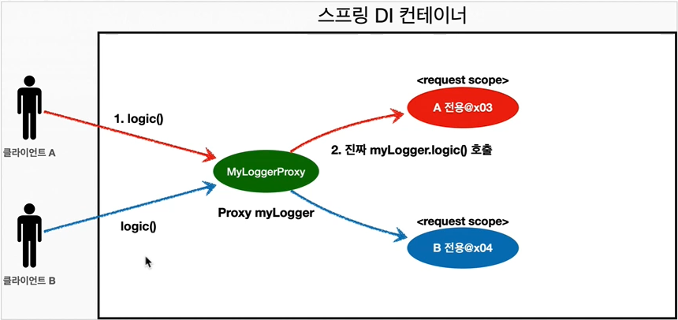
- **가짜 프록시 객체는 요청이 오면 그 때 내부에서 진짜 빈을 요청하는 위임 로직이 들어 있다.**
- 클라이언트가 `myLogger.logic()`을 호출하면 사실은 가짜 프록시 객체의 메서드를 호출한 것이다.
  - (가짜 프록시 객체는 내부에 진짜 `myLogger`를 찾는 방법을 알고 있다.)
- 가짜 프록시 객체는 request 스코프의 진짜 `myLogger.logic()`을 호출한다.
- 가짜 프록시 객체는 원본 클래스를 상속 받아서 만들어졌기 때문에 이 객체를 사용하는 클라이언트 입장에서는 사실 원본인지 아닌지도 모르게 , 동일하게 사용할 수 있다.**(다형성)**

## 정리
- 프록시 객체 덕분에 클라이언트는 마치 싱글톤 빈을 사용하듯이 편리하게 request scope를 사용할 수 있다.
- **사실 Provider를 사용하든 , 프록시를 사용하든 핵심 아이디어는 진짜 객체 조회를 꼭 필요한 시점까지 지연처리 한다는 점이다.**
- 단지 애노테이션 설정 변경만으로 원본 객체를 프록시 객체로 대체할 수 있다.
- **이것이 바로 다형성과 DI컨테이너가 가진 큰 강점이다.**
- 꼭 웹 스코프가 아니어도 프록시는 사용할 수 있다.
