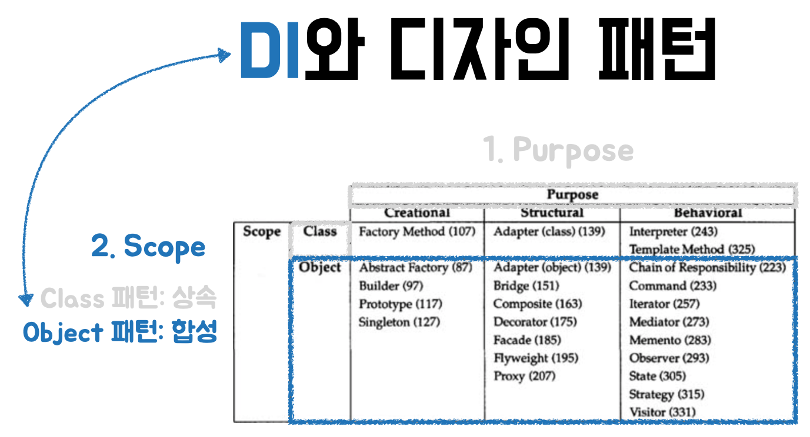

> 프로그래밍 언어가 발전함에 따라 일부 디자인 패턴은 더 이상 사용되지 않을 뿐만 아니라 심지어 안티 패턴으로 간주되며,  
> 반복자 패턴 같은 일부 디자인 패턴은 프로그래밍 언어에 포함되면서 새로운 디자인 패턴들이 등장하고 있다.  
> **자주 사용하는 디자인 패턴은 이해하고 마스터하는데 더 많은 시간을 할애해야 하며, 거의 사용하지 않는 디자인 패턴의 경우 의미를 이해하는 것으로도 충분할 것이다.**  
>
> 디자인 패턴을 적용하는 목적은 디커플링, 즉 더 나은 코드 구조를 사용하여 단일 책임을 위해 큰 코드 조각을 작은 클래스로 분할하여 코드가 **높은 응집도와 낮은 결합도**의 특성을 충족하도록 하는 것이다.  

- 디자인 패턴은 그저 언어가 지원하지 않는 기능을 구현하는 것이다.  
- 동적 타입 언어에서 디자인 패턴은 필요하지 않으며, 객체지향 언어에서만 유효하다.

디자인 과정의 기본 절차는 아래와 같다.

1. 당면한 문제가 무엇인지 정확하게 정의하기
2. 다른 해결책을 생각해 보고 장단점을 검토하기
3. 주어진 제한 사항 내에서 문제를 해결하는 최적의 해결책을 선택하기

## 생성 디자인 패턴 : 생성 코드를 분리하는 것

주로 객체를 생성하는 방법과 시기에 대한 문제를 해결하고 복잡한 생성 프로세스를 **캡슐화**하며 객체의 생성 코드와 사용 **코드를 분리**한다.  

- **싱글턴 패턴**은 전역적으로 유일한 객체를 생성
- **팩터리 패턴**은 같은 상위 클래스나 인터페이스를 상속하는 하위 클래스와 같이 비록 유형은 다르지만 서로 관련되어 있는 객체를 주어진 객체 타입에 맞게 생성하는데 사용
  - **팩토리 메서드 패턴** 생성자만으로 객체를 생성하기 힘들 때, 객체를 생성하는 메서드에 관한 디자인 패턴이다.
- **추상 팩토리 패턴** 은 팩토리를 만들어내는 팩토리이다. 즉 여러 팩토리 메서드를 감싸는 클래스이다.
- **빌더 패턴**은 복잡한 객체를 생성할 때 사용
- **프로토타입 패턴**은 기존 객체를 복사하는 방법을 사용

## 구조 디자인 패턴 : 다른 기능 코드를 분리하는 것

주로 특정 응용 프로그램 시나리오의 문제를 해결하는 데 사용되는 클래스나 객체의 고전적인 구조를 모아둔 것이다.  
클래스 사이의 복잡한 계층 관계를 만들지 않고도 객체의 기능을 확장하는 방법 그리고 미래의 변경 사항을 반영하며 과거의 설계를 수정하는 방법, 메모리 사용량을 줄이는 방법들을 알 수 있다.

- **프록시 패턴**은 원본 클래스에 연관 없는 기능을 추가할 때 사용된다.
- **데코레이터 패턴**은 원본 클래스와 관련이 있거나 향상된 기능을 추가하는데 사용된다.
- **어댑터 패턴**은 코드 호환성 문제를 해결하는데 사용된다.
- **브리지 패턴**은 합성의 폭발 문제를 해결하는데 사용된다.
- **퍼사드 패턴**은 인터페이스 설계에 사용된다.
- **복합체 패턴**은 트리 구조로 나타낼 수 있는 데이터에 사용된다.
- **플라이 웨이트 패턴**은 재사용 문제를 해결하는데 사용된다.

## 행동 디자인 패턴 : 다른 행동 코드를 분리하는 것

객체가 상황에 따라 다르게 동작하도록 하는 방법, 여러 객체가 서로를 알지 못해도 통신할 수 있도록 하는 방법, 복잡한 구조에 대해 반복을 수행하는 패턴이다.  

- **전략 패턴** : 런타임에 애플리케이션의 동작을 변경하고 싶을 때 사용된다.
- **반복자 패턴** : 복잡한 자료구조를 추상화 시켜서 평면적으로 만들 수 있다.
- **상태 패턴** : 전략 패턴은 외부의 클라이언트가 전략을 교체하는 반면, 상태 패턴에서의 상태는 오로지 입력에 의해 내부적으로 변경할 떄 사용된다.
- **명령 패턴** : 명령과 실행을 분리하여 실행 시점을 조정하거나 실행을 취소할 수 있다.
- **책임 사슬 패턴** : 횡단 관심사를 다루기 위해 사용된다.
- **해석기 패턴**
- **중개인 패턴** : 다른 객체끼리 직접 협력하는 것이 아니라 중개인을 통해서만 대화하도록 강제할 수 있다.
- **기억 패턴** : 이전의 상태를 복원할 필요가 있는 경우에 사용된다.
- **방문자 패턴** 
- **템플릿 메서드 패턴**
- **관찰자 패턴**

## 동시성 디자인 패턴

많은 작업을 한 번에 관리하고 이들의 생명 주기를 구조화할 수 있다.  
또한 동시성 디자인 패턴을 잘 사용하면 자원 누출이나 데드락과 같은 문제를 방지할 수 있다.  
코틀린에서 어떻게 구현되는지, 코루틴, 채널, 흐름, 함수형 프로그래밍에 더 가까워질 수 있다.

- **값 지연 패턴**
- **장벽 패턴**
- **스케줄러 패턴**
- **파이프라인 패턴**
- **팬아웃 패턴**
- **팬인 패턴**
- **경주 패턴**
- **뮤텍스 패턴**
- **사이드킥 채널 패턴**

## 질문

1. 중개인 패턴과 관찰자 패턴의 차이점은 무엇인가?
   1. 두 패턴은 비슷한 목적을 갖지만, 중개인 패턴은 객체 간에 다양한 목적으로 활용할 수 있는 강한 결합이 만들어진다. 하지만 관찰자 패턴은 느슨히 결합된 컴포넌트 사이에서 작동한다.

***

- [디자인 패턴의 아름다움](https://www.yes24.com/Product/Goods/118859035?pid=123487&cosemkid=go16849206587827416&gclid=CjwKCAjwrranBhAEEiwAzbhNtdjfjQZd0B02hfhdUhse1wTvJRMf6TUakz2eqZ7uVKPPBLqkLPkrexoCJ9sQAvD_BwE)
- [디자인 패턴에 뛰어들기](https://refactoring.guru/ko/design-patterns/book)
- [코딩으로 학습하는 GoF의 디자인 패턴](https://www.inflearn.com/course/%EB%94%94%EC%9E%90%EC%9D%B8-%ED%8C%A8%ED%84%B4)