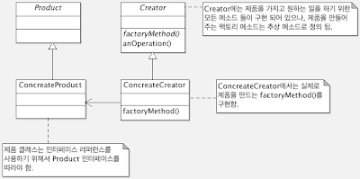
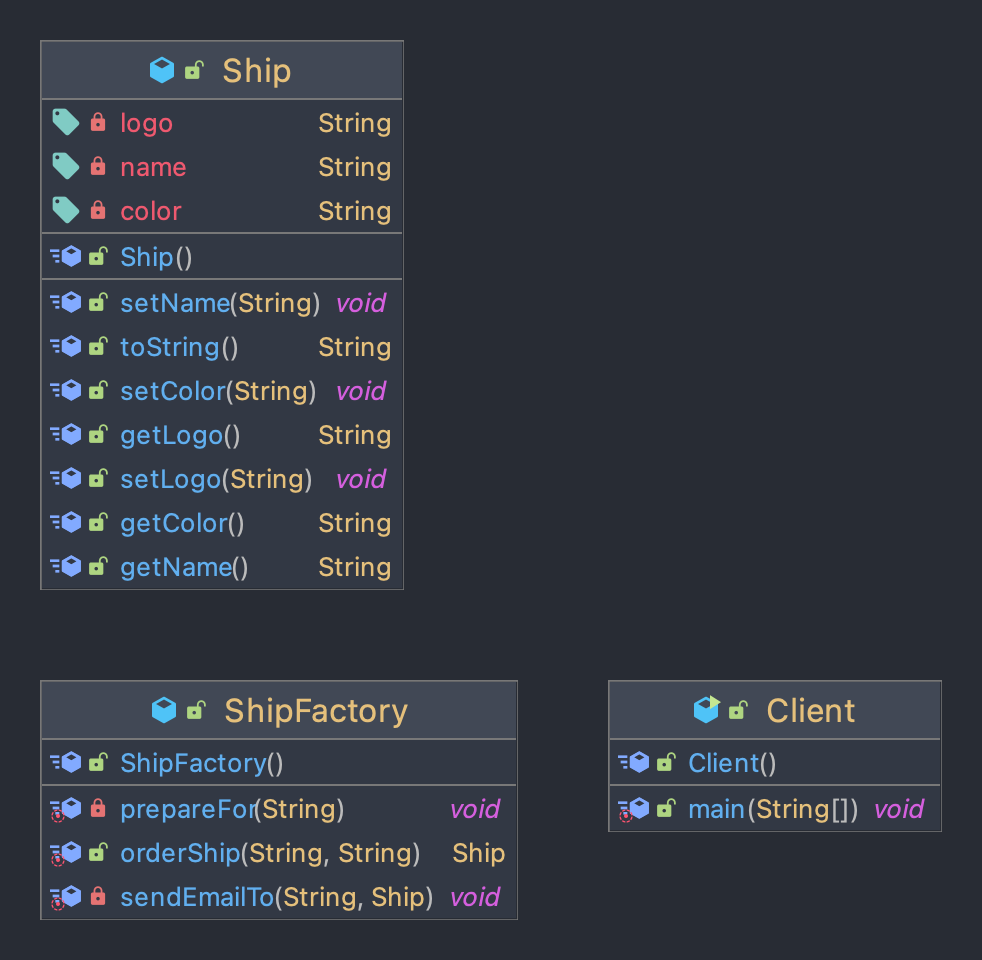
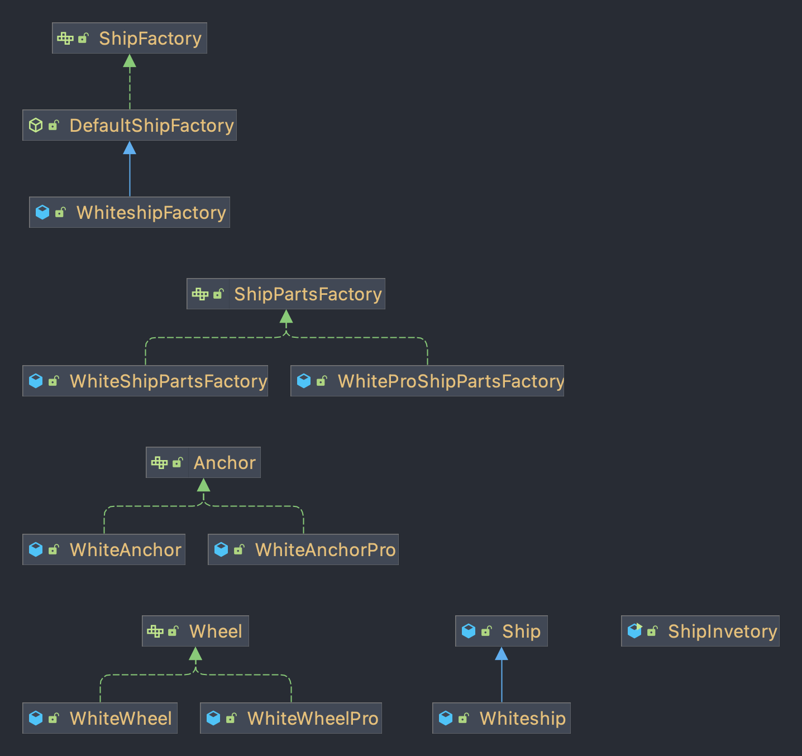

<!-- TOC -->

- [**Singleton Pattern**](#singleton-pattern)
  - [`private` 생성자에 `static` 메소드 방법](#private-생성자에-static-메소드-방법)
  - [`synchronized` 키워드 사용](#synchronized-키워드-사용)
  - [이른 초기화 `eager initialization` 사용하기](#이른-초기화-eager-initialization-사용하기)
  - [`double checked locking` 사용하기](#double-checked-locking-사용하기)
  - [`static inner class` 사용하기 (권장하는 방법 중의 하나)](#static-inner-class-사용하기-권장하는-방법-중의-하나)
    - [Reflection을 이용하여 싱글톤 깨트리기](#reflection을-이용하여-싱글톤-깨트리기)
    - [직렬화 \& 역직렬화를 이용하여 싱글톤 깨트리기](#직렬화--역직렬화를-이용하여-싱글톤-깨트리기)
  - [`enum` 사용하기](#enum-사용하기)
  - [질문](#질문)
  - [자바와 스프링에서 사용되는 곳](#자바와-스프링에서-사용되는-곳)
- [**Builder Pattern**](#builder-pattern)
  - [**Before**](#before)
  - [**After**](#after)
  - [실무 적용 예시](#실무-적용-예시)
  - [장점과 단점](#장점과-단점)
- [**Factory Method Pattern**](#factory-method-pattern)
  - [**Before**](#before-1)
  - [**After**](#after-1)
  - [**After** (+ `Interface`적용)](#after--interface적용)
  - [**질문**](#질문-1)
  - [실무 적용 예시](#실무-적용-예시-1)
- [**Abstract Factory Pattern**](#abstract-factory-pattern)

<!-- /TOC -->

# **Singleton Pattern**

- **인스턴스를 오직 한 개만 제공하는 클래스**
- `new`키워드를 사용하지 못하게 `private` 생성자를 만들고 클래스 내부에서 글로벌하게 접근 가능한 인스턴스를 만드는 메소드를 추가해야한다.
- 관련 이펙티브 자바 아이템 🚩
  1. 아이템 3. "private 생성자나 열거 타입으로 싱글턴임을 보증하라"
  2. 아이템 83. "지연 초기화는 신중히 사용하라"
  3. 아이템 85. "자바 직렬화의 대안을 찾으라"
  4. 아이템 86. "Serializable을 구현할지는 신중히 결정하라"

## `private` 생성자에 `static` 메소드 방법

```java
public class Settings {

    private static Settings instance;

    private Settings() {
        System.out.println("Settings 생성자 호출");
    }

    public static Settings getInstance() {
        if (instance == null) {
            instance = new Settings();
            System.out.println("Settings 인스턴스 생성");
        }
        return instance;
    }
}

// Settings 생성자 호출
// Settings 인스턴스 생성
// Settings 생성자 호출
// Settings 인스턴스 생성
// Settings 생성자 호출
// Settings 인스턴스 생성
```

이 방법은 심각한 문제가 있다.  
멀티스레드 환경에서는 취약하다.  

## `synchronized` 키워드 사용

```java
public class Settings1 {

    private static Settings1 instance;

    private Settings1() {
        System.out.println("Settings 생성자 호출");
    }

    public static synchronized Settings1 getInstance() {
        if (instance == null) {
            instance = new Settings1();
            System.out.println("Settings 인스턴스 생성");
        }
        return instance;
    }
}

// Settings 생성자 호출
// Settings 인스턴스 생성
```

동시에 `getInstance()`를 실행할 수 없긴 하지만 **동기화 처리 작업**으로 인해 성능에 불이익이 크다.<br>

## 이른 초기화 `eager initialization` 사용하기

```java
public class Settings2 {

    private static final Settings2 INSTANCE = new Settings2();

    private Settings2() {
        System.out.println("Settings 생성자 호출");
    }

    public static Settings2 getInstance() {
        return INSTANCE;
    }
}

// Settings 생성자 호출
// Settings 인스턴스 생성
```

클래스가 로딩되는 시점에 바로 초기화 하기 때문에 멀티스레드에 안전하다.<br>
**미리 만든다는 자체가 단점**이 될 수 있다.<br>
- 인스턴스를 만드는 과정이 복잡하고 오래 걸리거나, 만들었는데 사용하지 않게되면 자원 낭비이기 때문이다.

## `double checked locking` 사용하기

```java
public class Settings3 {

    private static volatile Settings3 instance;

    private Settings3() {
        System.out.println("Settings3 생성자 호출");
    }

    public static Settings3 getInstance() {
        if (instance == null) {
            synchronized (Settings3.class) {
                if (instance == null) {
                    instance = new Settings3();
                    System.out.println("Settings3 인스턴스 생성");
                }
            }
        }
        return instance;
    }
}

// Settings3 생성자 호출
// Settings3 인스턴스 생성
```

첫 번째 `if`를 통과해서 `synchronized` 블록으로 들어온다면 먼저 점유한 스레드가 생성을 끝나게 되면 다른 스레드는 내부 `if`를 통과하지 않기 때문에 안전하다.<br> 
- [`java docs` Synchronization](https://docs.oracle.com/javase/tutorial/essential/concurrency/sync.html)
  - [`java docs` atomic](https://docs.oracle.com/javase/tutorial/essential/concurrency/atomic.html)
  - [`java docs` Atomic Variables](https://docs.oracle.com/javase/tutorial/essential/concurrency/atomicvars.html)
<br>

메소드 레벨에 `synchronized`를 작성하는 것보다 효율적이고, 필요할 때 인스턴스를 생성한다는 것이 장점이다.<br>
하지만 이 기법은 **굉장히 복잡한 기법**이다.<br>
인스턴스가 왜 `volatile` 키워드를 포함해야 하는지 이해하려면 자바 1.4이하 버전의 멀티스레드에서 메모리 관리 방법을 이해해야한다.<br>

## `static inner class` 사용하기 (권장하는 방법 중의 하나)

```java
public class Settings4 {

    private Settings4() {}

    private static class SettingsHolder {
        private static final Settings4 INSTANCE = new Settings4();
    }

    public static Settings4 getInstance() {
        return SettingsHolder.INSTANCE;
    }
}
```

### Reflection을 이용하여 싱글톤 깨트리기

```java
public static void main(String[] args) throws NoSuchMethodException, InvocationTargetException, InstantiationException, IllegalAccessException {

    Settings4 settings4 = Settings4.getInstance();

    Constructor<Settings4> declaredConstructor = Settings4.class.getDeclaredConstructor();
    declaredConstructor.setAccessible(true);

    Settings4 reflectionSettings4 = declaredConstructor.newInstance();

    System.out.println(settings4 == reflectionSettings4);
}
```

### 직렬화 & 역직렬화를 이용하여 싱글톤 깨트리기

```java
public static void main(String[] args) throws Exception {
    Settings4 settings4 = Settings4.getInstance();
    Settings4 deserializationSettings4 = null;

    // 직렬화
    try (ObjectOutput out = new ObjectOutputStream(new FileOutputStream("settings.obj"))) {
        out.writeObject(settings4);
    }

    // 역직렬화
    try (ObjectInput in = new ObjectInputStream(new FileInputStream("settings.obj"))) {
        deserializationSettings4 = (Settings4) in.readObject();
    }

    System.out.println(settings4 == deserializationSettings4);
}

// false
```

**대응 방안**<br>

```java
public class Settings4 implements Serializable {

    ...

    protected Object readResolve() {
        return getInstance();
    }
}
```

`Settings4` 클래스에 `readResolve()` 시그니처를 추가해 놓으면 역직렬화 할 때 해당 메소드를 사용한다.
- 위의 코드를 실행하면 `true`가 나온다

***

## `enum` 사용하기

```java
public enum Settings5 {
    INSTANCE;
}
```

`enum`을 사용하여 INSTANCE에 속성 값을 추가하여 싱글턴을 사용한다면 Reflection에 안전하다.<br>
아래는 `Settings5`를 바이트코드로 작성된 생성자다.

```java
private <init>(Ljava/lang/String;I)
```

그럼 Reflection을 사용하여 생성자에 문자열을 넣어주면 생성할 수 있지 않을까?

```java
public static void main(String[] args) throws NoSuchMethodException, InvocationTargetException, InstantiationException, IllegalAccessException {
    Settings5 settings5 = Settings5.INSTANCE;
    Settings5 reflectionSettings5 = null;
    Constructor<?>[] declaredConstructors = Settings5.class.getDeclaredConstructors();
    for (Constructor<?> constructor : declaredConstructors) {
        constructor.setAccessible(true);
        reflectionSettings5 = (Settings5) constructor.newInstance("INSTANCE");
    }

    System.out.println(settings5 == reflectionSettings5);
}
```

컴파일 에러는 나지 않지만, 실행하면 `Cannot reflectively create enum objects`라는 예외를 던진다.<br>
`enum`은 **Reflection에서 `newInstance`를 사용하지 못하게 막아 놓았다.<br>

```java
    @CallerSensitive
    @ForceInline // to ensure Reflection.getCallerClass optimization
    public T newInstance(Object ... initargs)
        throws InstantiationException, IllegalAccessException,
               IllegalArgumentException, InvocationTargetException
    {
        if (!override) {
            Class<?> caller = Reflection.getCallerClass();
            checkAccess(caller, clazz, clazz, modifiers);
        }
        if ((clazz.getModifiers() & Modifier.ENUM) != 0)
            throw new IllegalArgumentException("Cannot reflectively create enum objects");
        ConstructorAccessor ca = constructorAccessor;   // read volatile
        if (ca == null) {
            ca = acquireConstructorAccessor();
        }
        @SuppressWarnings("unchecked")
        T inst = (T) ca.newInstance(initargs);
        return inst;
    }
```

<br>

그리고 `enum`은 직렬화 & 역직렬화에도 안전하다.<br>
`Enum` 클래스는 `Serializable` 인터페이스를 이미 구현하고 있다.<br>

```java
public static void main(String[] args) throws NoSuchMethodException, InvocationTargetException, InstantiationException, IllegalAccessException, IOException, ClassNotFoundException {
    Settings5 settings5 = Settings5.INSTANCE;
    Settings5 reflectionSettings5 = null;

    try (ObjectOutput out = new ObjectOutputStream(new FileOutputStream("settings.obj"))) {
        out.writeObject(settings5);
    }

    try (ObjectInput in = new ObjectInputStream(new FileInputStream("settings.obj"))) {
        reflectionSettings5 = (Settings5) in.readObject();
    }

    System.out.println(settings5 == reflectionSettings5);
}

// true
```

## 질문

1. 자바에서 enum을 사용하지 않고 싱글톤 패턴을 구현하는 방법은?
2. private생성자와 static메소드를 사용하는 방법의 단점은?
3. enum을 사용해 싱글톤 패턴을 구현하는 방법의 장점과 단점은?
   - 상속을 쓰지 못하고 미리 만들어진다는 점이 단점이다.
4. static inner 클래스를 사용해 싱글톤 패턴을 구현하라

## 자바와 스프링에서 사용되는 곳

- 스프링 빈 스코프 중 싱글톤 스코프
- 자바 `java.lang.Runtime`
  - 자바 애플리케이션이 실행되고있는 컨텍스트 정보
- 다른 디자인 패턴 구현체의 일부로 쓰이기도 한다
  - 빌더, 퍼사드, 추상 팩토리 등

***

# **[Builder Pattern](https://github.com/jdalma/design-patterns/tree/master/src/main/java/me/whiteship/designpatterns/_01_creational_patterns/_04_builder)**

- **동일한 프로세스를 거쳐 다양한 구성의 인스턴스를 만드는 방법**
- (복잡한) 객체를 만드는 프로세스를 독립적으로 분리할 수 있다.


- 인스턴스를 만드는 방법들을 단계별로 인터페이스에 정의를 한다.
- `Client`가 직접 `ConcreteBuilder`를 직접 사용하지 않고 `Director`클래스를 통하여 `Builder`를 사용하는 방법도 있다.

## **Before**

```java
    public static void main(String[] args) {
        TourPlan shortTrip = new TourPlan();
        shortTrip.setTitle("오레곤 롱비치 여행");
        shortTrip.setStartDate(LocalDate.of(2021, 7, 15));


        TourPlan tourPlan = new TourPlan();
        tourPlan.setTitle("칸쿤 여행");
        tourPlan.setNights(2);
        tourPlan.setDays(3);
        tourPlan.setStartDate(LocalDate.of(2020, 12, 9));
        tourPlan.setWhereToStay("리조트");
        tourPlan.addPlan(0, "체크인 이후 짐풀기");
        tourPlan.addPlan(0, "저녁 식사");
        tourPlan.addPlan(1, "조식 부페에서 식사");
        tourPlan.addPlan(1, "해변가 산책");
        tourPlan.addPlan(1, "점심은 수영장 근처 음식점에서 먹기");
        tourPlan.addPlan(1, "리조트 수영장에서 놀기");
        tourPlan.addPlan(1, "저녁은 BBQ 식당에서 스테이크");
        tourPlan.addPlan(2, "조식 부페에서 식사");
        tourPlan.addPlan(2, "체크아웃");
    }
```

## **After**


- `App`

```java
    public static void main(String[] args) {
        TourPlanBuilder builder = new DefaultTourBuilder();
        TourDirector tourDirector = new TourDirector(new DefaultTourBuilder());

        TourPlan longBeachTrip1 = builder.title("오레곤 롱비치 여행")
                .startDate(LocalDate.of(2021, 7, 15))
                .getPlan();

        TourPlan longBeachTrip2 = tourDirector.longbeachTrip();


        TourPlan cancunTrip1 = builder.title("칸쿤 여행")
                .nightsAndDays(2 , 3)
                .startDate(LocalDate.of(2020, 12, 9))
                .whereToStay("리조트")
                .addPlan(0, "체크인 이후 짐풀기")
                .addPlan(0, "저녁 식사")
                .addPlan(1, "조식 부페에서 식사")
                .addPlan(1, "해변가 산책")
                .addPlan(1, "점심은 수영장 근처 음식점에서 먹기")
                .addPlan(1, "리조트 수영장에서 놀기")
                .addPlan(1, "저녁은 BBQ 식당에서 스테이크")
                .addPlan(2, "조식 부페에서 식사")
                .addPlan(2, "체크아웃")
                .getPlan();

        TourPlan cancunTrip2 = tourDirector.cancunTrip();
    }
```

- `interface`

```java
public interface TourPlanBuilder {

    TourPlanBuilder title(String title);
    TourPlanBuilder nightsAndDays(int nights , int days);
    TourPlanBuilder startDate(LocalDate localDate);
    TourPlanBuilder whereToStay(String whereToStay);
    TourPlanBuilder addPlan(int day , String plan);
    TourPlan getPlan();

}
```

- `implementation`

```java
public class DefaultTourBuilder implements TourPlanBuilder {

    private String title;
    private int nights;
    private int days;
    private LocalDate startDate;
    private String whereToStay;
    private List<DetailPlan> plans;

    @Override
    public TourPlanBuilder nightsAndDays(int nights, int days) {
        this.nights = nights;
        this.days = days;
        return this;
    }

    @Override
    public TourPlanBuilder title(String title) {
        this.title = title;
        return this;
    }

    @Override
    public TourPlanBuilder startDate(LocalDate startDate) {
        this.startDate = startDate;
        return this;
    }

    @Override
    public TourPlanBuilder whereToStay(String whereToStay) {
        this.whereToStay = whereToStay;
        return this;
    }

    @Override
    public TourPlanBuilder addPlan(int day, String plan) {
        if (this.plans == null) {
            this.plans = new ArrayList<>();
        }

        this.plans.add(new DetailPlan(day, plan));
        return this;
    }

    @Override
    public TourPlan getPlan() {
        return new TourPlan(title, nights, days, startDate, whereToStay, plans);
    }-
}
```

- `director`

```java
public class TourDirector {
    private TourPlanBuilder tourPlanBuilder;

    public TourDirector(TourPlanBuilder tourPlanBuilder){
        this.tourPlanBuilder = tourPlanBuilder;
    }

    public TourPlan cancunTrip(){
        return tourPlanBuilder.title("칸쿤 여행")
                            .nightsAndDays(2 , 3)
                            .startDate(LocalDate.of(2020, 12, 9))
                            .whereToStay("리조트")
                            .addPlan(0, "체크인 이후 짐풀기")
                            .addPlan(0, "저녁 식사")
                            .addPlan(1, "조식 부페에서 식사")
                            .addPlan(1, "해변가 산책")
                            .addPlan(1, "점심은 수영장 근처 음식점에서 먹기")
                            .addPlan(1, "리조트 수영장에서 놀기")
                            .addPlan(1, "저녁은 BBQ 식당에서 스테이크")
                            .addPlan(2, "조식 부페에서 식사")
                            .addPlan(2, "체크아웃")
                            .getPlan();
    }

    public TourPlan longbeachTrip(){
        return tourPlanBuilder.title("오레곤 롱비치 여행")
                            .startDate(LocalDate.of(2021, 7, 15))
                            .getPlan();
    }
}

```

## 실무 적용 예시

- 자바 8 `Stream.Builder` API
  - `Stream<String> names = Stream.<String>builder().add("2022").add("-01-18").build();`
- 스프링
  - `UriComponentsBuilder`
  - `MockMvcWebClientBuilder`
  - `...Builder`
- [`롬복의 @Builder`](https://projectlombok.org/features/Builder)

## 장점과 단점

- `장점`
  1. 만들기 복잡한 객체를 순차적으로 만들 수 있다.
  2. 복잡한 객체를 만드는 구체적인 과정을 숨길 수 있다.
  3. 동일한 프로세스를 통해 각기 다르게 구성된 객체를 만들 수도 있다.
  4. 불완전한 객체를 사용하지 못하도록 방지할 수 있다.
- `단점`
  1. 원하는 객체를 만들려면 빌더 또는 다이렉터 부터 만들어야 한다.
  2. 구조가 복잡해 진다. (트레이드 오프)


***

# **[Factory Method Pattern](https://github.com/jdalma/design-patterns/tree/master/src/main/java/me/whiteship/designpatterns/_01_creational_patterns/_02_factory_method)**

- **구체적으로 어떤 인스턴스를 만들지는 서브클래스가 정한다**
- 다양한 구현체 (`Product`)가 있고 , 그 중에서 특정한 구현체를 만들 수 있는 다양한 팩토리 (`Creator`)를 제공할 수 있다
- [Concrete Class](https://www.geeksforgeeks.org/concrete-class-in-java/)



- [이미지 출처](http://nsnotification.blogspot.com/2013/01/factory-method-pattern.html)

## **Before**



- 현재는 `ShipFactory.orderShip()`안에 검은색 배 , 하얀색 배를 만드는 로직이 같이 들어가있다

```java
Ship ship = new Ship();
```

- 배를 만드는 부분을 하위 클래스에서 결정하게 수정하자

## **After**


> ✋ 
> 
> 여기서는 추상클래스를 사용하지 않고 인터페이스의 `default`키워드를 사용한다 (+ `JAVA 8`)
> 
> 인터페이스에 `private method`를 추가하여 사용한다 (+ `JAVA 9`)
> - 9버전 보다 아래라면 `ShipFactory`와 `ShipFactory의 구현체` **사이에 추상 클래스를 작성할 수도 있다**

- **Client**에서 `Ship`을 만들 때 무슨 Ship을 만들지 직접 정의해 준다
- **Factory**를 통해 *`Ship`을 확장하는* `WhiteShip` 또는 `BlackShip`을 생성하여 `orderShip()`을 호출한다
- 추가적인 `Ship`이 더 필요하다면 **`Factory`를 구현하는 Class**와 **`Ship`을 확장하는 Model을 추가**하면 된다 
  - **기존 코드를 전혀 건드리지 않고 새로운 공장과 새로운 제품을 추가한다**
  - 따라서, 확장에 열려있고 변경에는 닫혀있는 코드가 된다

<br>

```java
public class Client {
    public static void main(String[] args) {
        Ship whiteship = new WhiteShipFactory().orderShip("Whiteship", "keesun@mail.com");
        System.out.println(whiteship);

        Ship blackShip = new BlackShipFactory().orderShip("BlackShip" , "test");
        System.out.println(blackShip);
    }
}
```

```java
public class Ship {

    private String name;

    private String color;

    private String logo;

    // Getter , Setter , toString ...
}
```

```java
public class WhiteShip extends Ship{

    public WhiteShip(){
        super.setName("whiteship");
        super.setLogo("\uD83D\uDEE5️");
        super.setColor("white");
    }
}


public class BlackShip extends Ship{

    public BlackShip() {
        super.setName("blackship");
        super.setColor("black");
        super.setLogo("⚓");
    }
}
```

```java
public interface ShipFactory {

    Ship createShip();

    default Ship orderShip(String name , String email){
        validate(name , email);
        prepareFor(name);
        Ship ship = createShip();
        sendEmailTo(email, ship);
        return ship;
    }

    private void validate(String name , String email){
        if (name == null || name.isBlank()) {
            throw new IllegalArgumentException("배 이름을 지어주세요.");
        }
        if (email == null || email.isBlank()) {
            throw new IllegalArgumentException("연락처를 남겨주세요.");
        }
    }

    private void prepareFor(String name) {
        System.out.println(name + " 만들 준비 중");
    }

    private void sendEmailTo(String email, Ship ship) {
        System.out.println(ship.getName() + " 다 만들었습니다.");
    }
}
```

```java
public class WhiteShipFactory implements ShipFactory{
    @Override
    public Ship createShip() {
        return new WhiteShip();
    }
}

public class BlackShipFactory implements ShipFactory{
    @Override
    public Ship createShip() {
        return new BlackShip();
    }
}
```

- 💡 **Client**는 변경됐지 않나요??
  - 그럼 변경에 닫혀있는게 맞는건가?? 
  - 그래서 보통 **인터페이스 기반**으로 작성하여 **구체적인 클래스를 의존성 주입**을 받게끔 작성한다

## **After** (+ `Interface`적용)
- 현재는 **Client**는 **Factory**가 추가될 때 마다 **구체적인 Factory를 알고 주문해야 하기 때문에** Client는 계속 변경될 여지가 있다

```java
public class Client {
    public static void main(String[] args) {
        Client client = new Client();
        client.print(new WhiteShipFactory() , "Whiteship", "keesun@mail.com");
        client.print(new BlackShipFactory() , "Blackship", "test@mail.com");
    }

    private void print(ShipFactory factory, String name, String email) {
        System.out.println(factory.orderShip(name , email));
    }
}
```

- 위와 같이 `print()`메소드 에서 `ShipFactory`를 인터페이스로 받게 작성하면 조금 더 유연하게 사용이 가능하다

***

## **질문**
1. 팩토리 메소드 패턴을 적용했을 때의 장점은 ? 단점은 ?
- 장점
   - `"확장에 열려있고 변경에 닫혀있는 객체 지향 원칙"`을 지킨다
   - **기존 코드를 수정하지 않고 새로운 인스턴스를 다른 과정으로 얼마든지 확장이 가능하다**
   - 가능한 이유는 , `Product` ↔︎ `Creator` 간의 결합도를 느슨하게 가져가기 때문이다
   - [느슨한 결합과 강한 결합 ( Loose Coupling VS Tight Coupling ) 이란?](https://hongjinhyeon.tistory.com/141)
- 단점
  - 각자의 역할을 나누다 보니 클래스가 늘어난다

2. `"확장에 열려있고 변경에 닫혀있는 객체 지향 원칙"`을 설명하세요
   - **OCP**
   - **기존 코드를 수정하지 않고 새로운 인스턴스를 다른 과정으로 얼마든지 확장이 가능하다**

3. 자바 8에 추가된 `default` 메소드에 대해 설명하세요
   - interface의 기본 구현체를 만들어 놓을 수 있다
   - *추상 클래스에서 하던 일을 인터페이스에서도 많은 일을 할 수 있다*

4. 자바 9의 `private method`는 어떻게 추가가 가능한가?
   - [Interface](https://www.notion.so/4b0cf3f6ff7549adb2951e27519fc0e6)

***

## 실무 적용 예시
- **SimpleFactoryPattern** 
  - java.util.Calendar
  - NumberFormat
  - BeanFactory
    - 스프링에서 Bean을 가져오는 인스턴스가 콘크리트 클래스라고 볼 수 있다

***

# **[Abstract Factory Pattern](https://github.com/jdalma/design-patterns/tree/master/src/main/java/me/whiteship/designpatterns/_01_creational_patterns/_03_abstract_factory/_04_prac)**

- **서로 관련있는 여러 객체를 만들어주는 인터페이스**
- 구체적으로 어떤 클래스의 인스턴스를 (`concrete prodcut`)를 사용하는지 감출 수 있다 
- **팩토리 메소드 패턴과 굉장히 흡사한데 무엇이 다른건지**
  - 둘 다 구체적인 객체 생성 과정을 추상화한 인터페이스를 제공
  - **팩토리 메소드 패턴**은 `“팩토리를 구현하는 방법 (inheritance)”`에 초점을 둔다.
  - **팩토리 메소드 패턴**은 `구체적인 객체 생성 과정을 하위 또는 구체적인 클래스로 옮기는 것이 목적`
  - **추상 팩토리 패턴**은 `“팩토리를 사용하는 방법 (composition)”`에 초점을 둔다.
  - **추상 팩토리 패턴**은 `관련있는 여러 객체를 구체적인 클래스에 의존하지 않고 만들 수 있게 해주는 것이 목적`
- 스프링 **FactoryBean**이 대표적인 예



