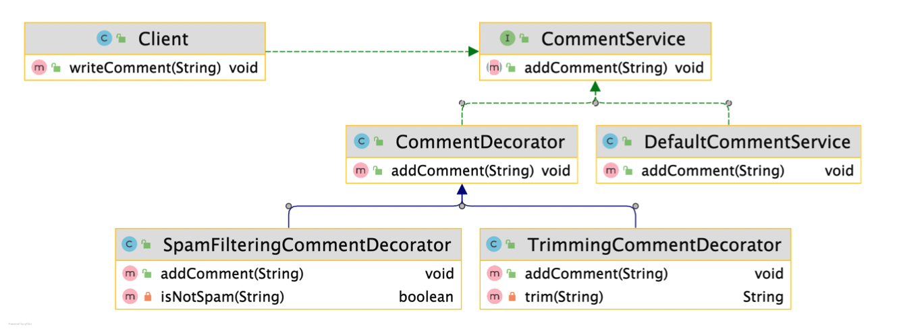
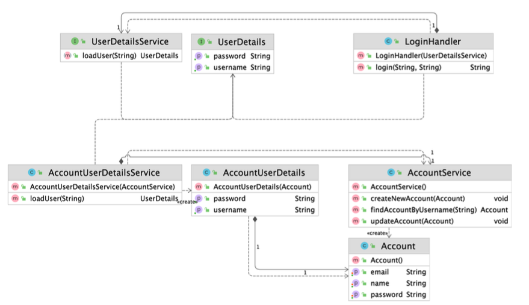

<!-- TOC -->

- [**프록시 패턴**](#%ED%94%84%EB%A1%9D%EC%8B%9C-%ED%8C%A8%ED%84%B4)
    - [인터페이스 기반의 프록시 패턴](#%EC%9D%B8%ED%84%B0%ED%8E%98%EC%9D%B4%EC%8A%A4-%EA%B8%B0%EB%B0%98%EC%9D%98-%ED%94%84%EB%A1%9D%EC%8B%9C-%ED%8C%A8%ED%84%B4)
    - [상속 기반의 프록시 패턴](#%EC%83%81%EC%86%8D-%EA%B8%B0%EB%B0%98%EC%9D%98-%ED%94%84%EB%A1%9D%EC%8B%9C-%ED%8C%A8%ED%84%B4)
    - [리플렉션 기반의 동적 프록시](#%EB%A6%AC%ED%94%8C%EB%A0%89%EC%85%98-%EA%B8%B0%EB%B0%98%EC%9D%98-%EB%8F%99%EC%A0%81-%ED%94%84%EB%A1%9D%EC%8B%9C)
- [**데코레이터 패턴**](#%EB%8D%B0%EC%BD%94%EB%A0%88%EC%9D%B4%ED%84%B0-%ED%8C%A8%ED%84%B4)
    - [패턴 소개](#%ED%8C%A8%ED%84%B4-%EC%86%8C%EA%B0%9C)
    - [장점과 단점](#%EC%9E%A5%EC%A0%90%EA%B3%BC-%EB%8B%A8%EC%A0%90)
    - [적용 예제](#%EC%A0%81%EC%9A%A9-%EC%98%88%EC%A0%9C)
- [**어댑터 패턴**](#%EC%96%B4%EB%8C%91%ED%84%B0-%ED%8C%A8%ED%84%B4)
    - [패턴 소개](#%ED%8C%A8%ED%84%B4-%EC%86%8C%EA%B0%9C)

<!-- /TOC -->
    - [리플렉션 기반의 동적 프록시](#%EB%A6%AC%ED%94%8C%EB%A0%89%EC%85%98-%EA%B8%B0%EB%B0%98%EC%9D%98-%EB%8F%99%EC%A0%81-%ED%94%84%EB%A1%9D%EC%8B%9C)
- [**어댑터 패턴**](#%EC%96%B4%EB%8C%91%ED%84%B0-%ED%8C%A8%ED%84%B4)
    - [패턴 소개](#%ED%8C%A8%ED%84%B4-%EC%86%8C%EA%B0%9C)
- [**데코레이터 패턴**](#%EB%8D%B0%EC%BD%94%EB%A0%88%EC%9D%B4%ED%84%B0-%ED%8C%A8%ED%84%B4)
    - [패턴 소개](#%ED%8C%A8%ED%84%B4-%EC%86%8C%EA%B0%9C)
    - [장점과 단점](#%EC%9E%A5%EC%A0%90%EA%B3%BC-%EB%8B%A8%EC%A0%90)
    - [적용 예제](#%EC%A0%81%EC%9A%A9-%EC%98%88%EC%A0%9C)

<!-- /TOC -->

# **프록시 패턴**

프록시 패턴의 기본 기능은 **프록시 클래스를 생성하여 원본 클래스와 관련이 없는 기능을 추가하는 것** 이다.  
1. 주요 비즈니스와 관련 없는 요구 사항의 개발에 활용될 수 있다.
   - 모니터링, 통계, 인증, 트래픽 제한, 트랜잭션, 멱등성, 로깅과 같이 주요 비즈니스와 관련없는 요구 사항을 개발하는데 적합하다.
2. RPC에서 프록시 패턴을 적용할 수 있다.
   - RPC 프레임워크는 프록시 패턴의 응용 프로그램이다.
3. 캐시에 프록시 패턴을 적용할 수 있다.


## 인터페이스 기반의 프록시 패턴

프록시 패턴은 원본 클래스를 변경하지 않은 상태로 **프록시 클래스**를 도입하여 원본 클래스와 관련 없는 새로운 기능을 추가하는 것이다.  

```kotlin
class UserController(
  private val metricsCollector: MetricsCollector
) {
  
  fun login(tel: String, password: String) : UserVO {
    // 핵심 외 기능 : 실행 시작 시간 기록

    // 핵심 : 비즈니스 로직

    // 핵심 외 기능 : 실행 결과 시간 계산 및 Metric전달
  }
}
```

위의 예제를 보면 **성능 통계 코드가 비즈니스 코드를 침범해 밀접하게 결합되어 있다.**  
이후 `MetricsCollector`가 변경되어야 한다면 핵심 비즈니스 로직에도 수정이 일어날 확률이 높다.  
  
이때 비즈니스 코드에서 성능 통계 코드를 분리하기 위해 프록시 패턴이 유용하게 사용될 수 있다.  

```kotlin
interface IUserController {
    fun login(tel: String, password: String) : UserVO
}

class UserController: IUserController {
    override fun login(tel: String, password: String): UserVO {
        // 핵심 로직
    }
}

class UserControllerProxy (
    private val target: IUserController,
    private val metricsCollector: MetricsCollector
) : IUserController {
    override fun login(tel: String, password: String): UserVO {
        // 부가 기능
        target.login(tel, password)
        // 부가 기능
    }
}
```

위의 코드에서 클라이언트 코드는 `IUserController` 타입에 의존하지만 실제 구현체를 `UserControllerProxy`로 주입하게 되면 클라이언트 코드는 프록시의 기능 존재를 알아차릴 수 없다.  

## 상속 기반의 프록시 패턴

인터페이스 기반의 프록시 패턴에서는 원본 클래스와 프록시 클래스가 동일한 인터페이스를 구현했다.  
하지만 원본 클래스가 외부 라이브러리의 클래스일 뿐만 아니라 인터페이스를 정의하지 않고 있어서 클래스를 직접 수정할 수 없는 경우에 적합하다.  

```kotlin
open class UserController {
    open fun login(tel: String, password: String): UserVO {
        // 핵심 로직
    }
}

class UserControllerProxy (
    private val metricsCollector: MetricsCollector
) : UserController() {
    override fun login(tel: String, password: String): UserVO {
        // 부가 기능
        super.login(tel, password)
        // 부가 기능
    }
}
```

## 리플렉션 기반의 동적 프록시

앞의 예제는 프록시 클래스가 원본 클래스의 모든 메서드를 다시 구현해야하기 때문에 번거롭다.  
그리고 프록시 클래스가 늘어날수록 복잡도가 커진다.  
  
이 문제를 해결할 수 있는 방법은 **동적 프록시** 를 사용하여 각 원본 클래스에 대한 프록시 클래스를 미리 작성하는 대신, `코드를 실행하는 도중에 원본 클래스에 대한 프록시 클래스를 동적으로 생성하고, 코드 내의 원본 클래스를 프록시 클래스로 대체하는 것`을 말한다.  
통계적 성능이 필요한 클래스를 위해 프록시 클래스를 동적으로 생성해주는 `MetricsControllerProxy` 동적 프록시 클래스를 확인해보자.

```kotlin
class MetricsControllerProxy (
    private val metricsCollector: MetricsCollector
) {

    fun createProxy(proxiedObject: Any) : Any {
        val interfaces : Array<Class<*>> = proxiedObject.javaClass.interfaces
        val dynamicProxyHandler = DynamicProxyHandler(proxiedObject)
        return Proxy.newProxyInstance(
            proxiedObject.javaClass.classLoader,
            interfaces,
            dynamicProxyHandler
        )
    }

    class DynamicProxyHandler (
        private val proxiedObject: Any
    ) : InvocationHandler {
        override fun invoke(proxy: Any, method: Method, args: Array<out Any>): Any {
            val startTimeStamp = System.currentTimeMillis()

            val result = method.invoke(proxiedObject, args)

            val endTimeStamp = System.currentTimeMillis()
            val responseTime = endTimeStamp - startTimeStamp

            // responseTime Metric 기록
            return result
        }
    }
}

class Client {
  val proxy = MetricsControllerProxy(MetricsCollector())
  val controller: IUserController = proxy.createProxy(UserController()) as IUserController
}
```

***

# **[데코레이터 패턴](https://github.com/jdalma/design-patterns/commit/9537c45bc4b9c53e0f9af0d4bd48c7503998fc2d)**

## 패턴 소개

- Java의 `IO 클래스 라이브러리`가 가지고 있는 기본 설계 사상을 분석하여 데코레이터 패턴을 설명할 수 있다. // TODO
- **기존 코드를 변경하지 않고 부가 기능을 추가하는 패턴**
- 상속이 아닌 위임을 사용해서 보다 유연하게 (런타임에) 부가 기능을 추가하는 것도 가능하다.



```java
public static void main(String[] args) {
    CommentService commentService = new DefaultCommentService();

    if (enabledSpamFilter) {
        commentService = new SpamFilteringCommentDecorator(commentService);
    }

    if (enabledTrimming) {
        commentService = new TrimmingCommentDecorator(commentService);
    }
    ...
}
```
- 이 코드를 보면 대략 알 수 있을 것이다.

## 장점과 단점

- **장점**
  - 새로운 클래스를 만들지 않고 **기존 기능을 조합할 수 있다.**
  - 컴파일 타임이 아닌 런타임에 동적으로 기능을 변경할 수 있다.
- **단점**
  - 데코레이터를 조합하는 코드가 복잡할 수 있다.

## 적용 예제

1. `InputStream`, `OutputStream`, `Reader`, `Writer`의 생성자를 활용한 랩퍼
2. `Collections`이 제공하는 데코레이터 메소드
   - `Collections.checkedXXX()`
   - `Collections.synchronizedXXX()`
   - `Collections.unmodifiableXXX()`
3. 웹플럭스 `ServerHttpRequestDecorator`, `ServerHttpResponseDecorator`
4. 빈 설정 데코레이터 `BeanDefinitionDecorator`

***

# **[어댑터 패턴](https://github.com/jdalma/design-patterns/tree/master/src/main/java/me/whiteship/designpatterns/_02_structural_patterns/_06_adapter)**

## 패턴 소개

- 클래스 어댑터와 객체 어댑터에 대해 살펴보고, 다섯 가지 응용 방법에 대해 알아보자 // TODO
- **기존 코드를 클라이언트가 사용하는 인터페이스의 구현체로 바꿔주는 패턴**
  - *클라이언트가 사용하는 인터페이스를 따르지 않는 기존 코드를 재사용할 수 있게 해준다*




- **UserDetail** , **UserDetailsService** 인터페이스가 `Target`에 해당한다
- **Account** 와 **AccountService**가 `Adaptee`에 해당한다
- 📌
  - 어떻게 **UserDetailsService**와 **AccountService**를 연결할 것 인가?
  - 어떻게 **Account**와 **UserDetails**를 연결할 것인가?

***

# **브리지 패턴**

// TODO