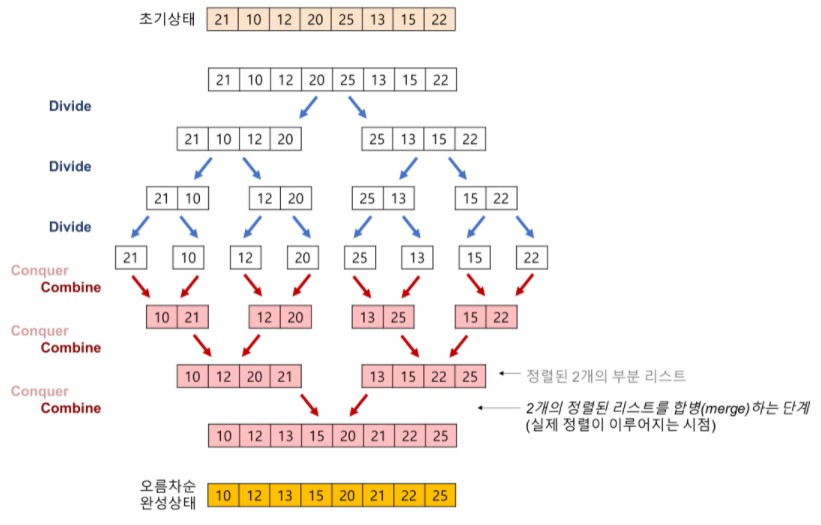
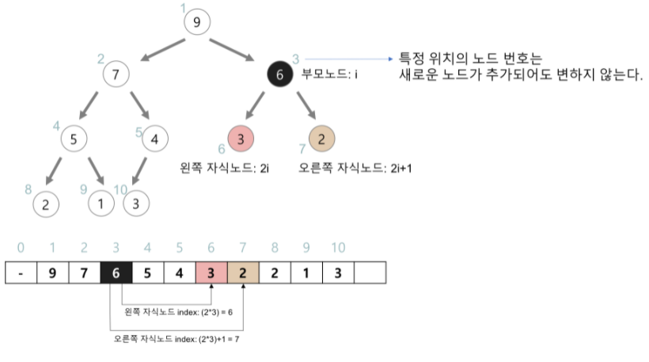
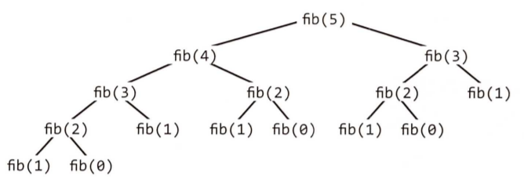
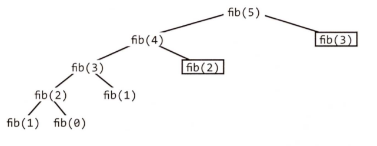
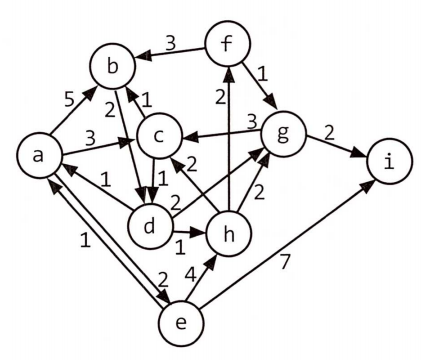
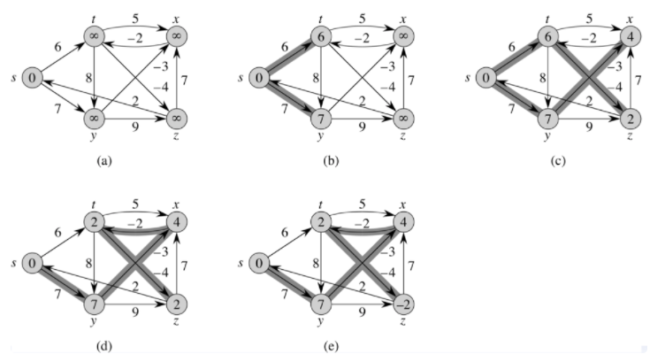
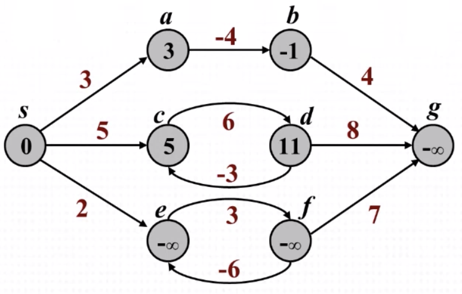
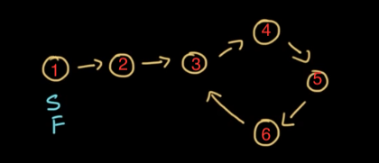
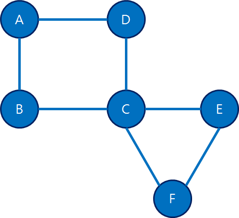
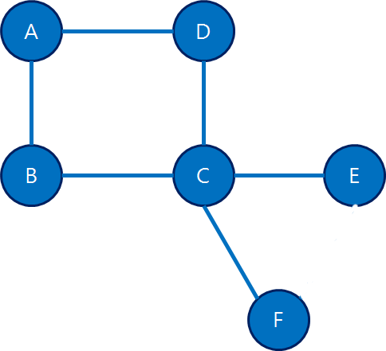

<!-- TOC -->

- [**알고리즘을 왜 하고, 얼마나 깊게 해야할까**](#%EC%95%8C%EA%B3%A0%EB%A6%AC%EC%A6%98%EC%9D%84-%EC%99%9C-%ED%95%98%EA%B3%A0-%EC%96%BC%EB%A7%88%EB%82%98-%EA%B9%8A%EA%B2%8C-%ED%95%B4%EC%95%BC%ED%95%A0%EA%B9%8C)
- [**널리 사용되는 정렬 알고리즘**](#%EB%84%90%EB%A6%AC-%EC%82%AC%EC%9A%A9%EB%90%98%EB%8A%94-%EC%A0%95%EB%A0%AC-%EC%95%8C%EA%B3%A0%EB%A6%AC%EC%A6%98)
    - [✋ **TimSort에 대해 - NaverD2**](#-timsort%EC%97%90-%EB%8C%80%ED%95%B4---naverd2)
    - [**버블 정렬 Bubble Sort - 평균 및 최악 실행 시간 : On<sup>2</sup> , 메모리 : O1**](#%EB%B2%84%EB%B8%94-%EC%A0%95%EB%A0%AC-bubble-sort---%ED%8F%89%EA%B7%A0-%EB%B0%8F-%EC%B5%9C%EC%95%85-%EC%8B%A4%ED%96%89-%EC%8B%9C%EA%B0%84--onsup2sup--%EB%A9%94%EB%AA%A8%EB%A6%AC--o1)
    - [**선택 정렬 Selection Sort - 길이 N의 배열에 대해 ~N<sup>2</sup>/2번의 비교와 N번의 교환을 수행**](#%EC%84%A0%ED%83%9D-%EC%A0%95%EB%A0%AC-selection-sort---%EA%B8%B8%EC%9D%B4-n%EC%9D%98-%EB%B0%B0%EC%97%B4%EC%97%90-%EB%8C%80%ED%95%B4-nsup2sup2%EB%B2%88%EC%9D%98-%EB%B9%84%EA%B5%90%EC%99%80-n%EB%B2%88%EC%9D%98-%EA%B5%90%ED%99%98%EC%9D%84-%EC%88%98%ED%96%89)
    - [**삽입 정렬 Insertion Sort - 평균적으로 ~N<sup>2</sup>/4번의 비교와 ~N<sup>2</sup>/4번의 교환을 수행**](#%EC%82%BD%EC%9E%85-%EC%A0%95%EB%A0%AC-insertion-sort---%ED%8F%89%EA%B7%A0%EC%A0%81%EC%9C%BC%EB%A1%9C-nsup2sup4%EB%B2%88%EC%9D%98-%EB%B9%84%EA%B5%90%EC%99%80-nsup2sup4%EB%B2%88%EC%9D%98-%EA%B5%90%ED%99%98%EC%9D%84-%EC%88%98%ED%96%89)
    - [**셸 정렬 Shell Sort**](#%EC%85%B8-%EC%A0%95%EB%A0%AC-shell-sort)
    - [**병합 정렬 Merge Sort**](#%EB%B3%91%ED%95%A9-%EC%A0%95%EB%A0%AC-merge-sort)
    - [**퀵 정렬 Quick Sort**](#%ED%80%B5-%EC%A0%95%EB%A0%AC-quick-sort)
        - [삽입 정렬로의 컷오프 전환 **2.3.25 풀것** 📌](#%EC%82%BD%EC%9E%85-%EC%A0%95%EB%A0%AC%EB%A1%9C%EC%9D%98-%EC%BB%B7%EC%98%A4%ED%94%84-%EC%A0%84%ED%99%98-2325-%ED%92%80%EA%B2%83-)
        - [-중앙값 분할](#-%EC%A4%91%EC%95%99%EA%B0%92-%EB%B6%84%ED%95%A0)
- [**Binary Search 이분,이진 탐색**](#binary-search-%EC%9D%B4%EB%B6%84%EC%9D%B4%EC%A7%84-%ED%83%90%EC%83%89)
    - [Basic Template](#basic-template)
- [**그래프**](#%EA%B7%B8%EB%9E%98%ED%94%84)
    - [**인접 리스트**](#%EC%9D%B8%EC%A0%91-%EB%A6%AC%EC%8A%A4%ED%8A%B8)
    - [**인접 행렬**](#%EC%9D%B8%EC%A0%91-%ED%96%89%EB%A0%AC)
    - [**그래프 탐색**](#%EA%B7%B8%EB%9E%98%ED%94%84-%ED%83%90%EC%83%89)
        - [깊이 우선 탐색 DFS](#%EA%B9%8A%EC%9D%B4-%EC%9A%B0%EC%84%A0-%ED%83%90%EC%83%89-dfs)
        - [넓이 우선 탐색 BFS](#%EB%84%93%EC%9D%B4-%EC%9A%B0%EC%84%A0-%ED%83%90%EC%83%89-bfs)
        - [양방향 탐색](#%EC%96%91%EB%B0%A9%ED%96%A5-%ED%83%90%EC%83%89)
- [**트리**](#%ED%8A%B8%EB%A6%AC)
    - [**이진 트리 Binary Tree**](#%EC%9D%B4%EC%A7%84-%ED%8A%B8%EB%A6%AC-binary-tree)
    - [**이진 탐색 트리 Binary Search Tree**](#%EC%9D%B4%EC%A7%84-%ED%83%90%EC%83%89-%ED%8A%B8%EB%A6%AC-binary-search-tree)
    - [**완전 이진 트리 Complete Binary Search**](#%EC%99%84%EC%A0%84-%EC%9D%B4%EC%A7%84-%ED%8A%B8%EB%A6%AC-complete-binary-search)
    - [**전 이진 트리 Full Binary Tree**](#%EC%A0%84-%EC%9D%B4%EC%A7%84-%ED%8A%B8%EB%A6%AC-full-binary-tree)
    - [**포화 이진 트리 Perfect Binary Tree**](#%ED%8F%AC%ED%99%94-%EC%9D%B4%EC%A7%84-%ED%8A%B8%EB%A6%AC-perfect-binary-tree)
    - [**이진 트리 순회**](#%EC%9D%B4%EC%A7%84-%ED%8A%B8%EB%A6%AC-%EC%88%9C%ED%9A%8C)
        - [중위 순회 in-order traversal](#%EC%A4%91%EC%9C%84-%EC%88%9C%ED%9A%8C-in-order-traversal)
        - [전위 순회 pre-order traversal](#%EC%A0%84%EC%9C%84-%EC%88%9C%ED%9A%8C-pre-order-traversal)
        - [후위 순회 post-order traversal](#%ED%9B%84%EC%9C%84-%EC%88%9C%ED%9A%8C-post-order-traversal)
    - [**이진 힙 최소 힙**](#%EC%9D%B4%EC%A7%84-%ED%9E%99-%EC%B5%9C%EC%86%8C-%ED%9E%99)
- [균형 탐색 트리](#%EA%B7%A0%ED%98%95-%ED%83%90%EC%83%89-%ED%8A%B8%EB%A6%AC)
    - [2-3 탐색 트리](#2-3-%ED%83%90%EC%83%89-%ED%8A%B8%EB%A6%AC)
    - [레드 블랙 트리](#%EB%A0%88%EB%93%9C-%EB%B8%94%EB%9E%99-%ED%8A%B8%EB%A6%AC)
- [**트라이 Trie 접두사 트리**](#%ED%8A%B8%EB%9D%BC%EC%9D%B4-trie-%EC%A0%91%EB%91%90%EC%82%AC-%ED%8A%B8%EB%A6%AC)
- [**TreeSet**](#treeset)
    - [**TreeSet 선언**](#treeset-%EC%84%A0%EC%96%B8)
    - [**TreeSet 값 추가**](#treeset-%EA%B0%92-%EC%B6%94%EA%B0%80)
    - [**TreeSet 값 삭제**](#treeset-%EA%B0%92-%EC%82%AD%EC%A0%9C)
    - [**TreeSet 값 출력**](#treeset-%EA%B0%92-%EC%B6%9C%EB%A0%A5)
- [우선순위 큐 **2.4.3 참조**](#%EC%9A%B0%EC%84%A0%EC%88%9C%EC%9C%84-%ED%81%90-243-%EC%B0%B8%EC%A1%B0)
    - [**힙**](#%ED%9E%99)
    - [**힙 복구 작업**](#%ED%9E%99-%EB%B3%B5%EA%B5%AC-%EC%9E%91%EC%97%85)
        - [**상향식 힙 복구swim**](#%EC%83%81%ED%96%A5%EC%8B%9D-%ED%9E%99-%EB%B3%B5%EA%B5%ACswim)
        - [**하향식 힙 복구sink**](#%ED%95%98%ED%96%A5%EC%8B%9D-%ED%9E%99-%EB%B3%B5%EA%B5%ACsink)
- [**해시 테이블**](#%ED%95%B4%EC%8B%9C-%ED%85%8C%EC%9D%B4%EB%B8%94)
    - [📌 **키와 값을 해시테이블에 넣을 때**는 다음의 과정을 거친다.](#-%ED%82%A4%EC%99%80-%EA%B0%92%EC%9D%84-%ED%95%B4%EC%8B%9C%ED%85%8C%EC%9D%B4%EB%B8%94%EC%97%90-%EB%84%A3%EC%9D%84-%EB%95%8C%EB%8A%94-%EB%8B%A4%EC%9D%8C%EC%9D%98-%EA%B3%BC%EC%A0%95%EC%9D%84-%EA%B1%B0%EC%B9%9C%EB%8B%A4)
- [**해시 충돌 해결 방법**](#%ED%95%B4%EC%8B%9C-%EC%B6%A9%EB%8F%8C-%ED%95%B4%EA%B2%B0-%EB%B0%A9%EB%B2%95)
    - [**개방 주소법Open Addressing**](#%EA%B0%9C%EB%B0%A9-%EC%A3%BC%EC%86%8C%EB%B2%95open-addressing)
    - [**분리 연결법Seperate Chaining**](#%EB%B6%84%EB%A6%AC-%EC%97%B0%EA%B2%B0%EB%B2%95seperate-chaining)
    - [**JAVA8의 분리 연결법**](#java8%EC%9D%98-%EB%B6%84%EB%A6%AC-%EC%97%B0%EA%B2%B0%EB%B2%95)
- [**StringBuilder**](#stringbuilder)
- [**재귀 Recursive 와 동적 프로그래밍 Dynamic Programming**](#%EC%9E%AC%EA%B7%80-recursive-%EC%99%80-%EB%8F%99%EC%A0%81-%ED%94%84%EB%A1%9C%EA%B7%B8%EB%9E%98%EB%B0%8D-dynamic-programming)
    - [**상향식 접근법 bottom-up approach**](#%EC%83%81%ED%96%A5%EC%8B%9D-%EC%A0%91%EA%B7%BC%EB%B2%95-bottom-up-approach)
    - [**하향식 접근법 top-down approach**](#%ED%95%98%ED%96%A5%EC%8B%9D-%EC%A0%91%EA%B7%BC%EB%B2%95-top-down-approach)
    - [**반반 접근법 half-and-half approach**](#%EB%B0%98%EB%B0%98-%EC%A0%91%EA%B7%BC%EB%B2%95-half-and-half-approach)
    - [**동적계획법 & 메모이제이션**](#%EB%8F%99%EC%A0%81%EA%B3%84%ED%9A%8D%EB%B2%95--%EB%A9%94%EB%AA%A8%EC%9D%B4%EC%A0%9C%EC%9D%B4%EC%85%98)
        - [Recursive Fibo](#recursive-fibo)
        - [하향식 동적 프로그래밍 메모이제이션](#%ED%95%98%ED%96%A5%EC%8B%9D-%EB%8F%99%EC%A0%81-%ED%94%84%EB%A1%9C%EA%B7%B8%EB%9E%98%EB%B0%8D-%EB%A9%94%EB%AA%A8%EC%9D%B4%EC%A0%9C%EC%9D%B4%EC%85%98)
        - [상향식 동적 프로그래밍](#%EC%83%81%ED%96%A5%EC%8B%9D-%EB%8F%99%EC%A0%81-%ED%94%84%EB%A1%9C%EA%B7%B8%EB%9E%98%EB%B0%8D)
- [**최단경로 문제**](#%EC%B5%9C%EB%8B%A8%EA%B2%BD%EB%A1%9C-%EB%AC%B8%EC%A0%9C)
    - [0-1BFS](#0-1bfs)
    - [다익스트라 알고리즘](#%EB%8B%A4%EC%9D%B5%EC%8A%A4%ED%8A%B8%EB%9D%BC-%EC%95%8C%EA%B3%A0%EB%A6%AC%EC%A6%98)
    - [벨만-포드 알고리즘](#%EB%B2%A8%EB%A7%8C-%ED%8F%AC%EB%93%9C-%EC%95%8C%EA%B3%A0%EB%A6%AC%EC%A6%98)
        - [음수간선](#%EC%9D%8C%EC%88%98%EA%B0%84%EC%84%A0)
    - [SPFA Shortest Path Faster Algorithm - 벨만-포드 알고리즘 보완](#spfa-shortest-path-faster-algorithm---%EB%B2%A8%EB%A7%8C-%ED%8F%AC%EB%93%9C-%EC%95%8C%EA%B3%A0%EB%A6%AC%EC%A6%98-%EB%B3%B4%EC%99%84)
- [**최소 신장 트리 Minimum Spanning Tree**](#%EC%B5%9C%EC%86%8C-%EC%8B%A0%EC%9E%A5-%ED%8A%B8%EB%A6%AC-minimum-spanning-tree)
    - [**Kruskal Algorithm 크루스칼 알고리즘**](#kruskal-algorithm-%ED%81%AC%EB%A3%A8%EC%8A%A4%EC%B9%BC-%EC%95%8C%EA%B3%A0%EB%A6%AC%EC%A6%98)
    - [**Prim 프림 알고리즘**](#prim-%ED%94%84%EB%A6%BC-%EC%95%8C%EA%B3%A0%EB%A6%AC%EC%A6%98)
    - [✋ Kruskal , Prim 차이점](#-kruskal--prim-%EC%B0%A8%EC%9D%B4%EC%A0%90)
- [**LIS 최장 증가 부분 수열 알고리즘**](#lis-%EC%B5%9C%EC%9E%A5-%EC%A6%9D%EA%B0%80-%EB%B6%80%EB%B6%84-%EC%88%98%EC%97%B4-%EC%95%8C%EA%B3%A0%EB%A6%AC%EC%A6%98)
- [**Backtracking 백트래킹 특징**](#backtracking-%EB%B0%B1%ED%8A%B8%EB%9E%98%ED%82%B9-%ED%8A%B9%EC%A7%95)
- [**Kadane’s Algorithm**](#kadanes-algorithm)
- [**Floyd's Cycle Finding Algorithm**](#floyds-cycle-finding-algorithm)
- [오일러 회로 Eulerian Circuit](#%EC%98%A4%EC%9D%BC%EB%9F%AC-%ED%9A%8C%EB%A1%9C-eulerian-circuit)
- [오일러 경로 Eulerian Trail](#%EC%98%A4%EC%9D%BC%EB%9F%AC-%EA%B2%BD%EB%A1%9C-eulerian-trail)

<!-- /TOC -->

# **알고리즘을 왜 하고, 얼마나 깊게 해야할까**

> 컴퓨터를 이용해 문제를 풀어야할 때 같으 문제라도 여러 가지 해결 방법이 있을 수 있다.  
> 문제의 크기가 작다면 올바른 답을 내기만 하면 어떤 방법을 사용하든 크게 관계될 것이 없지만,  
> 문제의 크기가 크다면 **시간과 공간을 효율적으로 이용하는 방법을 찾는것이 중요해진다.**  
> 알고리즘을 공부하는 주된 이유는 그 사고 체계와 접근 방법이 같은 문제를 풀더라도  
> **훨씬 더 적은 자원으로도 해결할 수 있도록 심지어 해결 불가능한 것을 가능하게 만들어주기 때문이다.**  
> 어떤 작업에 합당한 알고리즘을 배우는 것뿐만 아니라 **알고리즘적 방법론들이 가진 성능 차이를 비교할 수 있는 안목을 가질 수 있다.**  
> - 알고리즘 개정 4판
  
> 문제를 많이 푼다면 구현 실력이나, 자신이 아는 요소(여기서는 그게 알고리즘이 되겠죠)를 적재적소에 활용하는 능력을 키울 수 있는 점은 분명하지만,  
> 이 알고리즘들이 모든 컴퓨터 분야에 필수인 것은 절대 아니고, 오히려 실무에서는 몰라도 큰 상관이 없을 때가 많습니다.  
> 고급 알고리즘이 꼭 좋은 것도 아닙니다.  
> 실무와 개발에 있어서는 유지보수성과 협업을 신경쓰는 것도 굉장히 중요한데요.  
> 성능은 좋지만 그렇게 필수적이지는 않았는데도 구현이 난해한 알고리즘을 너무 남발하다 보면,  
> 시간이 지나고 자신의 코드를 되돌아볼 때나 다른 사람과 협업해야 할 때,  
> 다른 사람이 이어서 작업해야 할 때 등 상당히 골치 아파지는 경우도 있을 것입니다.  
> (물론, 항상 좋은 것이 아니랬지 성능이 무조건적으로 우선인 곳에서는 잘 사용할 때도 있습니다.)  
> (리눅스의 스케쥴러가 레드블랙트리로 구현되어 있는 것이 좋은 예)  
> 어느 정도 가벼이 취미로 하기에 재밌기도 하고, 이때는 취미를 하면서 코딩/구현 실력도 늘릴 수 있다는 점에서 컴퓨터분야 종사자의 취미생활로써는 굉장히 도움이 많이 되지만,  
> 주 목적이 되는 일은 흔치 않을 것입니다.  
> 덤으로 제가 모든 개발자가 기본소양(?) 정도로 갖추면 좋겠을 지식은 기초 자료구조들 및 그리디, DP 정도가 뭔지를 아는 것이 끝입니다.  
> 또 어느때나 물어보면 즉시 구현이 가능할 정도도 아니고, 아는 것만으로 충분하다고 봅니다.  
> - [출처](https://blog.naver.com/kks227)
  
  
- **[Cracking The Coding Interview 6th Edition In LeetCode](https://leetcode.com/discuss/general-discussion/1152824/cracking-the-coding-interview-6th-edition-in-leetcode#4)**
- **알고리즘 개정 4판 (빨간책)**
  - [예제 코드](https://algs4.cs.princeton.edu/code/)
  - [`coursera` 알고리즘 1부](https://www.coursera.org/learn/algorithms-part1)
  - [`coursera` 알고리즘 2부](https://www.coursera.org/learn/algorithms-part2)

***

# **널리 사용되는 정렬 알고리즘**

[`leetcode` Sort an Array](https://leetcode.com/problems/sort-an-array/) 문제를 여러 정렬 구현으로 풀어보자.  
이 문제는 `O(nlog(n))` 시간복잡도를 지켜야하므로 어떤 정렬이 통과하고 실패하는지 확인할 수 있다.  


```kotlin
class Solution {
    fun sortArray(nums: IntArray): IntArray {
//        selectionSort(nums)                       // Time Limit Exceeded
//        insertionSort(nums)                       // Runtime 2900 ms
//        shellSort(nums)                           // Runtime 662 ms
//        aux = IntArray(nums.size)
//        topDownMergeSort(nums, 0, nums.size - 1)  // Runtime 646ms
//        bottomUpMergeSort(nums)                   // Runtime 693ms
//        quickSort(nums, 0, nums.size - 1)         // Runtime 2055ms , shuffle을 수행한다면 700ms 이내
//        threeWayQuickSort(nums, 0, nums.size - 1) // Runtime 2088ms , shuffle을 수행한다면 700ms 이내 , shuffle을 수행하지 않고 정렬된 케이스를 구분해서 정렬을 하면 1300ms
        nums.sort()                                 // Runtime 626ms
        return nums;
    }

    private fun selectionSort(nums: IntArray) {
        nums.forEachIndexed {index, element ->
            var min = index
            for (innerIndex in index + 1 until nums.size) {
                if (nums[min] > nums[innerIndex]) {
                    min = innerIndex
                }
            }
            nums.exchange(index, min)
        }
    }

    private fun insertionSort(num: IntArray) {
        for (index in 1 until num.size) {
            var innerIndex = index
            while (innerIndex > 0 && num[innerIndex] < num[innerIndex - 1]) {
                num.exchange(innerIndex, innerIndex - 1)
                innerIndex--
            }
        }
    }

    private fun IntArray.exchange(index1: Int, index2: Int) {
        val tmp = this[index1]
        this[index1] = this[index2]
        this[index2] = tmp
    }
}
```

## ✋ **[TimSort에 대해 - NaverD2](https://d2.naver.com/helloworld/0315536)**


- [joshuajangblog.wordpress.com](https://joshuajangblog.wordpress.com/2016/09/21/time_complexity_big_o_in_easy_explanation/)
- **O(1) – 상수 시간** : 알고리즘이 문제를 해결하는데 오직 한 단계만 거칩니다.
- **O(log n) – 로그 시간** : 문제를 해결하는데 필요한 단계들이 연산마다 특정 요인에 의해 줄어듭니다.
- **O(n) – 직선적 시간** : 문제를 해결하기 위한 단계의 수와 입력값 n이 1:1 관계를 가집니다.
- **O(n<sup>2</sup>) – 2차 시간** : 문제를 해결하기 위한 단계의 수는 입력값 n의 제곱입니다.
- **O(C<sup>n</sup>) – 지수 시간** : 문제를 해결하기 위한 단계의 수는 주어진 상수값 C 의 n 제곱입니다. (상당히 큰수가 됩니다)


## **버블 정렬 (Bubble Sort) - 평균 및 최악 실행 시간 : O(n<sup>2</sup>) , 메모리 : O(1)**

- **서로 인접한 두 원소의 대소를 비교하고, 조건에 맞지 않다면 자리를 교환하며 정렬하는 알고리즘**

1. 1회전에 첫 번째 원소와 두 번째 원소를, 두 번째 원소와 세 번째 원소를, 세 번째 원소와 네 번째 원소를, … 이런 식으로 (마지막-1)번째 원소와 마지막 원소를 비교하여 조건에 맞지 않는다면 서로 교환합니다.
2. **1회전을 수행하고 나면 가장 큰 원소가 맨 뒤로 이동하므로 2회전에서는 맨 끝에 있는 원소는 정렬에서 제외되고, 2회전을 수행하고 나면 끝에서 두 번째 원소까지는 정렬에서 제외됩니다.** 
- 이렇게 정렬을 1회전 수행할 때마다 정렬에서 제외되는 데이터가 하나씩 늘어납니다.


- **장점**
  - 정렬하고자 하는 배열 안에서 교환하는 방식이므로, 다른 메모리 공간을 필요로 하지 않는다.. ➜ 제자리 정렬(in-place sorting)
  - **안정 정렬(Stable Sort)**
- **단점**
  - **시간복잡도가 최악, 최선, 평균 모두 O(n^<sup>2</sup>)으로, 굉장히 비효율적입니다.**
  - 정렬 돼있지 않은 원소가 정렬 됐을때의 자리로 가기 위해서, 교환 연산(swap)이 많이 일어나게 됩니다.

## **선택 정렬 (Selection Sort) - 길이 N의 배열에 대해 ~N<sup>2</sup>/2번의 비교와 N번의 교환을 수행**

1. 주어진 배열 중에 최소값을 찾는다.
2. 그 값을 맨 앞에 위치한 값과 교체한다.
3. 인덱스를 한 칸 옮기고 나머지 배열을 같은 방법으로 교체한다.


- **특징**
  - 매우 단순한 정렬 방법으로 이해하기도 쉽고 구현하기도 쉽다.
  - **해당 순서에 원소를 넣을 위치는 이미 정해져 있고, 어떤 원소를 넣을지 선택하는 알고리즘**
  - **해당 자리를 선택하고 그 자리에 오는 값을 찾는 것**
  - 각 교환 작업은 각 항목을 종국적으로 위치할 자리에 두기 때문에 전체 교환 작업 횟수는 N이 된다.
  - 따라서 실행 시간이 비교 횟수에 주요하게 영향받는다고 할 수 있다.
  - 이미 정렬되어 있거나 완전히 정렬된 배열을 입력으로 주어도 무작위로 섞인 배열만큼이나 정렬에 시간이 오래 걸려 **실행시간이 입력에 민갑하다**
  - 선택 정렬에서 이용하는 교환 횟수는 배열의 크기에 선형으로 비례하여 **데이터의 이동을 최소화한다.**
- **명제**
  - 선택 정렬은 길이 N의 배열에 대해 ~N<sup>2</sup>/2번의 비교와 N번의 교환을 수행한다.

## **삽입 정렬 (Insertion Sort) - 평균적으로 ~N<sup>2</sup>/4번의 비교와 ~N<sup>2</sup>/4번의 교환을 수행**

1. 정렬은 2번째 위치(index)의 값을 temp에 저장합니다.
1. temp와 이전에 있는 원소들과 비교하며 삽입해나갑니다.
1. '1'번으로 돌아가 다음 위치(index)의 값을 temp에 저장하고, 반복합니다.


- **특징**
  - **2번째 원소부터 시작하여 그 앞(왼쪽)의 원소들과 비교하여 삽입할 위치를 지정한 후, 원소를 뒤로 옮기고 지정된 자리에 자료를 삽입 하여 정렬하는 알고리즘**
  - 삽입 정렬은 큰 값을 오른쪽으로 밀어내듯이 정렬하여 기준 인덱스의 값이 왼쪽 인덱스보다 값이 크다면 바로 다음 요소로 넘어가게 된다. 따라서 배열의 접근 횟수가 절반으로 줄어든다.
  - <span style="color:red; font-weight:bold">고급 정렬 알고리즘의 일부로 사용될 만큼 좋은 정렬 알고리즘</span>이다.
- **명제**
  - 중복 없는 키를 가진 무작위로 정렬된 크기 N의 배열에 대해 평균적으로 ~N<sup>2</sup>/4번의 비교와 ~N<sup>2</sup>/4번의 교환을 수행한다.
  - 최악 조건에서는 ~N<sup>2</sup>/2번의 비교와 ~N<sup>2</sup>/2번의 교환을 수행한다.
  - 최적 조건에서는 N-1번의 비교와 0번의 교환을 수행한다.
  - 삽입 정렬에서 발생하는 교환 작업 횟수는 배열 안에 존재하는 역순 쌍의 개수와 동일하다. 그리고 비교 작업의 횟수는 최대, 역순 쌍의 개수 + (배열 크기 - 1)만큼 발생한다.

## **셸 정렬 (Shell Sort)**

- **특징**
  - 삽입 정렬은 인접한 항목과의 교환만 일어나 한 번에 한 위치로만 이동할 수 있기 때문에 크기가 큰 정렬되지 않은 배열을 처리하는데 느리다.
  - **셸 정렬은 삽입 정렬의 확장 버전으로 서로 멀리 떨어진 항목 간에도 교환이 일어날 수 있게 함으로써 삽입 정렬이 빠르게 처리할 수 있는 부분적으로 정렬된 배열을 만든다.**
  - 매 `h번째` 항목들 간에 순서를 따질 때 정렬된 상태가 되도록 배열을 재정리하는 것이다. 이렇게 부분적으로 정렬된 배열을 "h-정렬 되었다" 라고 한다.
  - 각각의 `h`에 대해, **`h`개의 부분 시퀀스**를 대상으로 한 독립적인 삽입 정렬을 수행하는 것이다. 단 배열을 1씩 이동 순회하는 대신 `h 단위`로 이동 순회하도록 수정해야 한다.

```kotlin
private fun shellSort(num: IntArray) {
    var N = num.size
    var h = 1

    while(h < N / 3) {
        h = h * 3 + 1
    }
    while(h >= 1) {
        for (index in h until N) {
            var innerIndex = index
            while (innerIndex >= h && num[innerIndex] < num[innerIndex - h]) {
                num.exchange(innerIndex, innerIndex - h)
                innerIndex -= h
            }
        }
        h /= 3
    }
}
```

## **병합 정렬 (Merge Sort)**

- **배열을 절반씩 나누어 각각을 정렬한 다음 이 둘을 합하여 다시 정렬 하는 방법이다.**
- 나눈 절반을 정렬할 때도 같은 알고리즘이 사용되고 , **결국에는 원소 한 개짜리 배열 두 개를 병합하게 된다.**
- 가장 큰 장점 중 하나는 크기 `N`인 배열을 정렬하는 시간이 `NlogN`에 비례한다는 것이다. 대신 `N`에 비례하는 추가적인 메모리 공간을 소요한다는 것이 가장 큰 단점이다.
- **분할 (Divide)** : 입력 배열을 같은 크기의 2개의 부분 배열로 분할
- **정복 (Conquer)** : 부분 배열을 정렬한다. 부분 배열의 크기가 충분히 작지 않으면 **순환 호출**을 이용하여 다시 분할 정복 방법을 적용한다.
- **결합 (Combine)** : 정렬된 부분 배열들을 하나의 배열에 합병한다.
- **분할 정복 알고리즘의 하나**



```kotlin
private lateinit var aux: IntArray

private fun topDownMergeSort(num: IntArray, low: Int, high: Int) {
    if (low >= high) return

    val mid = low + (high - low) / 2      // 오버플로우 예방
    topDownMergeSort(num, low, mid)       // 왼쪽 절반 정렬
    topDownMergeSort(num, mid + 1, high)  // 오른쪽 절반 정렬
    merge(num, low, mid, high)            // 670ms 병합

//    if (num[mid] > num[mid + 1]) {
//      merge(num, low, mid, high)          // 610ms 병합
//    }
}

private fun bottomUpMergeSort(num: IntArray) {
    var size = 1
    while (size <= num.size) {
        for (low in 0 .. num.size - size step(size + size)) {
            val mid = low + size - 1
            val high = Math.min(low + size + size - 1, num.size - 1)
            merge(num, low, mid, high)
        }
        size += size
    }
}

private fun merge(num: IntArray, low: Int, mid: Int, high: Int) {
    var i = low
    var j = mid + 1

    for (index in low .. high) {
        aux[index] = num[index]
    }

    for (index in low .. high) {
        if (i > mid) num[index] = aux[j++]              // i가 mid값을 넘어섰다는 말은 왼쪽 영역을 다 할당했다는 의미
        else if (j > high) num[index] = aux[i++]        // j가 high값을 넘어섰다는 말은 오른쪽 영역을 다 할당했다는 의미
        else if (aux[i] > aux[j]) num[index] = aux[j++] // 왼쪽 값이 더 크다면 오른쪽 값을 먼저 할당
        else num[index] = aux[i++]                      // 위에 해당하지 않으면 왼쪽 값을 할당
    }
}
```

- **작은 부분 배열에 삽입 정렬 이용하기**
  - 정렬 자체에 있어서는 삽입 정렬(또는 선택 정렬)이 더 단순하기 때문에 매우 작은 배열에 대해서는 병합 정렬보다 더 빠를 가능성이 크다.
  - 작은 부분 배열(크기가 15이하인)에 대한 정렬을 삽입 정렬로 바꾸면 보통의 병합 정렬 구현 보다 `10% ~ 15%`에 이르는 성능 개선 효과를 볼 수 있다. [2.2.23 참조](https://github.com/reneargento/algorithms-sedgewick-wayne/blob/master/src/chapter2/section2/Exercise23_Improvements.txt)
- **배열이 이미 정렬된 상태인지 확인하기**
  - `a[mid] <= a[mid + 1]`을 확인하여 merge의 호출을 생략하도록 수정하면 배열에 대한 성능을 선형으로 만들 수 있다.
  - 이 [문제](https://leetcode.com/problems/sort-an-array/description/)에 적용하면 `670ms`에서 `610ms`로 절감된다.
- **임시 작업 배열로의 복제 제거** 
  - 병합용 임시 작업 배열로의 복제에 드는 시간을 제거하는 것도 가능하다.
  - 하나는 원본 배열을 입력으로 받아 정렬 결과를 임시 배열에 넣고, 다른 하나는 그 임시 배열을 입력으로 받아 정렬 결과를 원본 배열에 넣는다.
  - 이러한 접근 방법으로 재귀적인 호출이 원본 배열과 임시 배열을 번갈아가며 이용하도록 조율한다.
  - [2.2.11 참고](https://github.com/reneargento/algorithms-sedgewick-wayne/blob/master/src/chapter2/section2/Exercise11_Improvements.java)하여 테스트 해보기

> **정렬의 복잡도**  
> 병합 정렬을 알아야 하는 중요한 이유 중 하나는, 정렬 작업의 본질적인 속성을 이해하는데 필요한 "계산 복잡도"를 구하는데 있어서 기반이 되는 기초 정보를 제공한다는 점이다.  
> 정렬 알고리즘은 계산 복잡도에 직접적으로 영향을 받는다. 따라서 계산 복잡도에 대해서 상세하게 알아볼 필요가 있다.  
> `Comparable API`를 사용해야하는 제약 때문에 이 장에서 다루는 알고리즘들은 모두 비교 기반 알고리즘 클래스에 속한다. (배열 접근 비용은 무시한다.)  
>
> 1. 공간(활용)에 있어서는 병합 정렬이 최적이라고 할 수 없다.  
> 2. 가정한 최악 조건이 실제 응용 상황과는 다를 수도 있다.  
> 3. 비교 연산 외에 다른 연산(예를 들어 배열 접근과 같은)이 더 중요할 수도 있다.  
> 4. 비교 연산을 전혀 사용하지 않고도 정렬할 수 있는 데이터가 있을 수도 있다.  
> 

## **퀵 정렬 (Quick Sort)**

> 퀵-정렬의 내부 루프(분할 메서드에 있는)는 인덱스를 증가시켜가며 어떤 고정된 값과 배열 항목의 값을 비교한다.  
> 이러한 단순함이 퀵-정렬을 빠르게 하는 요인 중 하나이다. (이보다 더 짤은 내부 루프를 고안하기는 어렵다.)  
> 예를 들어, 병합 정렬이나 셸-정렬이 전형적으로 더 느린 이유는 내부 루프에서 데이터 이동까지 하기 때문이다.  
> 
> 퀵-정렬을 빠르게 하는 두 번째 요인은 적은 수의 비교 연산을 하기 때문이다.  
> 퀵-정렬의 효율은 종국적으로 배열을 얼마나 잘 분할 하느냐에 달려있다.  
> 그리고 이 부분은 어떤 항목을 분할 기준 항목으로 선택하느냐에 의해 결정된다.  
> 가장 이상적인 분할은 매 분할 단계마다 배열이 정확히 절반으로 나뉘어지는 것이다.  
> 이렇게 되면 비교 연산 횟수가 분할 정복 재귀 동작과 같아져 C<sub>N</sub> = 2C<sub>N/2</sub> + N을 만족하게 된다.  
> 2C<sub>N/2</sub> = 두 개의 부분 배열을 정렬하는 비용  
> N은 분할 기준 항목 또는 다른 항목을 이용해 각 배열 항목들을 검사하는 비용을 의미

- **분할 정복(divide and conquer) 방법**
  - 문제를 작은 2개의 문제로 분리하고 각각을 해결한 다음, 결과를 모아서 원래의 문제를 해결하는 전략
  - Merge Sort와 달리 Quick Sort는 배열을 비균등하게 분할
  - 분할이 균형있게 이루어지지 않을 경우 극단적으로 비효율적이 될 수 있다. (무작위로 섞는 이유는 이러한 상황을 피하기 위해서이다.)

> **명제** 퀵-정렬은 최악 조건에서 **~N<sup>2</sup>/2**번에 이르는 비교연산을 수행한다. 하지만 입력 배열을 무작위로 뒤섞으면 이러한 경우가 발생하는 것을 방지할 수 있다.  
> **증명** 주어진 조건에 의해, 모든 분할 작업에 대해서 분할로 생성된 두 부분 배열 중 하나가 항상 공백 배열이라면, 공백이 아닌 나머지 배열들의 정렬에 수행되는 비교 연산 횟수는 다음과 같다.  
> **N + (N - 1) + (N - 2) + ... + 2 + 1 = (N + 1) N/2**  
> 이러한 동작은 정렬 실행 시간이 제곱 시간이라는 점뿐만 아니라 재귀 호출에 필요한 메모리 공간도 선형이라는 것을 의미한다.  
> 표준 편차가 약 .65 N 이기 때문에 N이 커질수록 평균에 가까워지는 경향이 있고 평균을 크게 벗어나는 경우가 없을 것 이다.  
> **큰 배열에 대해서 퀵-정렬이 삽입 정렬이나 선택 정렬만큼의 비교 연산을 사용할 가능성은 정렬 와중에 컴퓨터가 번개를 맞을 확률만큼이나 적다.**  
> 퀵-정렬은 데이터의 이동이 훨씬 적기 때문에 (비록 39%나 더 많은 비교 연산을 수행함에도 불구하고) 전형적인 경우들에서는 퀵-정렬이 병합 정렬보다 더 빠르다.  
> 이러한 수학적 분석은 확률에 기반한 결론이기는 하지만 이에 의존한다고 해서 무리가 될 것은 없다.

1. 배열 가운데서 하나의 원소를 고릅니다. 이렇게 고른 원소를 피벗(pivot) 이라고 합니다.
2. 피벗 앞에는 피벗보다 값이 작은 모든 원소들이 오고, 피벗 뒤에는 피벗보다 값이 큰 모든 원소들이 오도록 피벗을 기준으로 배열을 둘로 나눕니다.
    - 이렇게 배열을 둘로 나누는 것을 **분할(Divide)** 이라고 합니다.
    - 분할을 마친 뒤에 피벗은 더 이상 움직이지 않습니다.
3. 분할된 두 개의 작은 배열에 대해 **재귀(Recursion)적으로 이 과정을 반복**합니다.
4. 재귀 호출이 한번 진행될 때마다 최소한 하나의 원소는 최종적으로 위치가 정해진다.


- **장점**
  - 불필요한 데이터의 이동을 줄이고 먼 거리의 데이터를 교환할 뿐만 아니라, 한 번 결정된 피벗들이 추후 연산에서 제외되는 특성 때문에, 다른 정렬 알고리즘과 비교했을 때도 가장 빠르다.
  - 정렬하고자 하는 배열 안에서 교환하는 방식이므로, 다른 메모리 공간을 필요로 하지 않는다..  ➜ 제자리 정렬(in-place sorting)
- **단점**
  - **불안정 정렬(Unstable Sort)**
  - 정렬된 배열에 대해서는 Quick Sort의 불균형 분할에 의해 오히려 수행시간이 더 많이 걸린다.
  - 배열 분할에 사용되는 원소가 중간값에 가까운 값이 되리라는 보장이 없기 때문에 , 정렬 알고리즘이 느리게 동작할 수 있다.

```kotlin
private fun quickSort(num: IntArray, low: Int, high: Int) {
    if (low >= high) return

    val pivot = partition(num, low, high) // 2개의 파티션
    quickSort(num, low, pivot - 1)          
    quickSort(num, pivot + 1, high)
}

private fun partition(num: IntArray, low: Int, high: Int): Int {
    var left = low
    var right = high + 1

    val pivot = num[low]
    while (true) {
        while (num[++left] < pivot) {   // pivot의 값보다 큰 원소를 찾는다
            if (left == high) break
        }
        while (pivot < num[--right]) {  // pivot의 값보다 작은 원소를 찾는다
            if (right == low) break
        }
        if (left >= right) break  // left와 right가 서로 교차할 때 멈춘다.
        num.exchange(left, right) // 위에서 찾은 큰 원소와 작은 원소를 서로 바꾼다.
    }
    // right는 pivot보다 작은 원소를 가지고 있다는게 보장되기 때문에, 끝나면 pivot 위치와 바꾼다.
    // pivot 기준 왼쪽은 모두 기준보다 작고, 기준 오른쪽은 모두 기준보다 크다.
    num.exchange(low, right)
    return right
}

private fun IntArray.shuffle() {
    for (index in 0 until this.size) {
        val r = index + Random.nextInt(this.size - index)
        val tmp = this[index]
        this[index] = this[r]
        this[r] = tmp
    }
}
```

- **즉석 분할**  
  - 추가적인 작업용 배열을 사용하면 구현이 쉬워지긴 하지만 분할된 배열을 원본 배열에 복제해 넣는 오버헤드 비용을 상쇄할 만큼 쉬워진다고 볼 수 없다.
  - 임시 작업 메모리를 재귀 메서드 안에서 각 분할마다 매번 새로 생성하게 구현하면 정렬 수행 시간이 급격하게 늘어난다.
- **경계선 넘지 않기**
  - 만약 분할 기준 항목이 가장 작은 키 또는 가장 큰 키를 가졌다면 스캔 중에 배열의 왼쪽 또는 오른쪽 끝을 넘어가지 않도록 주의해야 한다.
- **분할 기준 항목과 동일한 키를 가지는 배열 항목 다루기**
  - 가장 좋은 방법은 좌측을 스캔할 떄는 `분할 기준 항목 보다 크거나 같은 항목`이 나오면 스캔을 중단하고,
  - 우측을 스캔할 때는 `분할 기준 항목보다 작거나 같은 항목`이 나올 때 스캔을 중단하는 것이다.
  - 비록 이러한 방식이 분할 기준 항목과 키가 같은 항목 간에 불필요한 교환을 유발하기는 하지만 특정 활용 환경에서 제곱 시간 성능으로 떨어지는 막기 위해서는 감수해야 할 오버헤드이다.
- **무작위로 뒤섞는 작업**
  - `shuffle()`을 진행하지 않고 정렬을 진행하면 `2000ms`정도 걸리지만, 무작위로 섞은 후 정렬을 진행하면 `700ms`이내에 정렬된다.
  - **최악 조건이 발생하는 것을 막아주고 실행 시간을 예측할 수 있게 해주기 때문이다.**

### 삽입 정렬로의 컷오프 전환 **2.3.25 풀것** 📌

거의 모든 재귀 알고리즘이 그렇듯이, 다음의 두 가지 관찰을 바탕으로 단서를 찾으면 퀵-정렬의 성능을 쉽게 개선할 수 있다.
- **작은 부분 배열에서는 퀵-정렬이 삽입 정렬보다 느리다.**
- **재귀적 동작으로 인해, 작은 부분 배열에 대해서도 반드시 퀵-정렬의 `sort()`가 호출된다.**

따라서, 작은 부분 배열에 대해서 알고리즘을 삽입 정렬로 전환하면 성능 개선이 있을 수 있다.  
`cutOff`는 `5 ~ 15`가 적절하다고 한다.  

```kotlin
private fun quickSort(num: IntArray, low: Int, high: Int, cutOff: Int) {
    if (low >= high) return

    val subArraySize = high - low + 1;

    if (subArraySize < cutOff) {
        insertionSort(num, low, high)
        return
    }

    val pivot = partition(num, low, high)
    quickSort(num, low, pivot - 1, cutOff)
    quickSort(num, pivot + 1, high, cutOff)
}

private fun insertionSort(num: IntArray, low: Int, high: Int) {
    for (index in low .. high) {
        var innerIndex = index
        while (innerIndex > 0 && num[innerIndex] < num[innerIndex - 1]) {
            num.exchange(innerIndex, innerIndex - 1)
            innerIndex--
        }
    }
}
```


### 3-중앙값 분할

분할 기준 항목을 정할 때 작은 크기의 샘플에서 그 중앙값을 이용하는 것도 퀵-정렬의 성능을 개선할 수 있다.  
조금 더 효율적으로 분할을 할 수 있긴하지만, 중앙값을 계산하는 추가 비용이 따른다.  
- [2.3.18 : 3-중앙값 분할을 퀵-정렬에 적용하고 효과가 있는지 확인하라](https://github.com/reneargento/algorithms-sedgewick-wayne/blob/master/src/chapter2/section3/Exercise18_MedianOf3Partitioning.txt)
- [2.3.19 : 5-중앙값 분할은 효과가 있을까?](https://github.com/reneargento/algorithms-sedgewick-wayne/blob/master/src/chapter2/section3/Exercise19_MedianOf5Partitioning.txt)

> **분할 기준 항목의 키값 보다 작은 부분, 같은 부분, 큰 부분으로 나눈다.**

```kotlin
private fun threeWayQuickSort(num: IntArray, low: Int, high: Int) {
    if (low >= high) return

    var left = low
    var index = low + 1
    var right = high
    val pivot = num[low]

    while (index <= right) {
        val compare = num[index] - pivot
        if (compare < 0) {
            num.exchange(left++, index++)
        }
        else if (compare > 0) {
            num.exchange(index, right--)
        }
        else {
            index++
        }
    }
    threeWayQuickSort(num, low, left - 1)
    threeWayQuickSort(num, right + 1, high)
}
```

***

# **`Binary Search` 이분,이진 탐색**
- 이진 탐색 알고리즘은 **정렬된 원소 리스트를 받아 리스트에 원하는 원소가 있을경우 그 원소의 위치를 반환**, 없을경우 null을 반환함.
- 시간복잡도는 O(log n)으로 매우 빠른편.


- [https://velog.io/@ming/](https://velog.io/@ming/%EC%9D%B4%EB%B6%84%ED%83%90%EC%83%89Binary-Search)

## Basic Template

- 배열의 단일 인덱스에 접근하여 검색할 때 사용 된다.
- Initial Condition : `left = 0, right = length-1`
- Termination : `left > right`
- Searching Left : `right = mid-1`
- Searching Right : `left = mid+1`


```java
int binarySearch(int[] nums, int target){
  if(nums == null || nums.length == 0)
    return -1;

  int left = 0, right = nums.length - 1;
  while(left <= right){
    // Prevent (left + right) overflow
    int mid = left + (right - left) / 2;
    if(nums[mid] == target){ return mid; }
    else if(nums[mid] < target) { left = mid + 1; }
    else { right = mid - 1; }
  }

  // End Condition: left > right
  return -1;
}
```


***

# **그래프**
- **노드와 그 노드를 연결하는 간선(edge)를 하나로 모아 놓은 것이다.**
- 방향성이 있을 수도 있고 없을 수도 있다.
- **여러 개의 고립된 부분 그래프 (isolated subgraphs)로 구성될 수 있다.**
- 모든 정점간에 경로가 존재하는 그래프는 **연걸 그래프**라고 부른다.
- 그래프에는 사이클이 존재할 수도 있고 존재하지 않을 수도 있다.

## **인접 리스트**
- 그래프를 표현할 때 사용되는 가장 일반적인 방법이다.


## **인접 행렬**
- `N*N` 행렬 로써 `행렬[i][j]`에 정보가 존재한다면 **i에서 j로의 간선**이 있다는 뜻이다.
- 무방향 그래프를 인접 행렬로 표현한다면 이 행렬은 **대칭 행렬(symmetric matrix)**이 된다.


## **그래프 탐색**

### 깊이 우선 탐색 (DFS)
- **루트 노드 (혹은 다른 임의의 노드)에서 시작해서 다음 분기로 넘어가기 전에 해당 분기를 완벽하게 탐색하는 방법**
- 모든 노드를 방문하고자 할 때 더 선호되는 편이다.
- [백준(DFS , 백트래킹) - N과 M](https://www.acmicpc.net/workbook/view/9372)
- **[Binary Tree Level Order Traversal](https://leetcode.com/problems/binary-tree-level-order-traversal/)**

### 넓이 우선 탐색 (BFS)
- 노드 사이의 최단 경로 혹은 임의의 경로를 찾고 싶을 때 사용한다.
- 큐(Queue)를 사용하여 구현한다.

- **[Find if Path Exists in Graph](https://leetcode.com/problems/find-if-path-exists-in-graph/)**

### 양방향 탐색
- **출발지와 도착지 사이에 최단 경로를 찾을 때 사용된다.**
- 기본적으로 , 출발지와 도착지 두 노드에서 동시에 너비 우선 탐색을 사용한 뒤 , 두 탐색 지점이 충돌하는 경우에 경로를 찾는 방식이다.


> 추가로 읽을 거리 - 위상정렬 , 다익스트라 , AVL , 레드블랙트리

# **트리**
- 노드로 이루어져있고 그래프의 한 종류인 자료구조이다.
- 트리는 하나의 루트 노드를 갖는다.
  - *꼭 가질 필요는 없지만 프로그래밍 면접에서 사용하는 트리에선 맞는 말이다.*
- 루트노드는 0개 이상의 자식 노드를 갖고 있다.
- 그 자식 노드 또한 0개 이상의 자식 노드를 갖고 있고 , 이는 반복적으로 정의된다.
- **사이클이 존재할 수 없다.**
- 노드들은 특정 순서로 나열될 수도 있고 그렇지 않을 수도 있다.
- 각 노드는 부모 노드로의 연결이 있을 수도 있고 없을 수도 있다.

## **이진 트리 (Binary Tree)**
- **이진 트리는 각 노드가 최대 두 개의 자식을 갖는 트리**를 말한다.
- [구간 합 구하기](https://www.acmicpc.net/problem/2042), [구간 곱 구히기](https://www.acmicpc.net/problem/11505), [최소값과 최대값](https://www.acmicpc.net/problem/2357) 이 세그먼트 트리 문제들은 이진트리에 대한 응용이다.

## **이진 탐색 트리 (Binary Search Tree)**
- **`모든 왼쪽 자식들 <= n < 모든 오른쪽 자식들` 속성은 모든 노드 n에 대해서 반드시 참이어야 한다.**
- 부등식의 경우에 대해서는 바로 아래 자식뿐만 아니라 **내 밑에 있는 모든 자식 노드들에 대해서 참이어야 한다.**

> 같은 값을 처리하는 방식에 따라 이진 탐색 트리는 약간씩 정의가 달라질 수 있다.  
> 어떤 곳에서는 중복된 값을 가지면 안 된다고 나오고 , 또 다른 곳에서는 중복된 값은 오른 쪽 혹은 양쪽 어느 곳이든 존재할 수 있다고 나온다.


- 모든 노드에 대해서 그 **왼쪽 자식들의 값이 현재 노드 값보다 작거나 같도록 하고** , **오른쪽 자식들의 값은 현재 노드의 값보다 반드시 커야 한다**.

## **완전 이진 트리 (Complete Binary Search)**
- **트리의 모든 높이에서 노드가 꽉 차 있는 이진트리를 말한다.**
- 마지막 레벨은 꽉 차 있지 않아도 되지만 **왼쪽에서 오른쪽으로 채워져야 한다.**


## **전 이진 트리 (Full Binary Tree)**
- **모든 노드의 자식이 없거나 정확히 두 개 있는 경우를 말한다.**
- 즉, *자식이 하나만 있는 노드가 존재해서는 안된다.*


## **포화 이진 트리 (Perfect Binary Tree)**
- **전 이진 트리**이면서 **완전 이진 트리**인 경우를 말한다.
- **모든 말단 노드는 같은 높이에 있어야 하며 , 마지막 단계에서 노드의 개수가 최대가 되어야 한다.**
- 노드의 개수는 정확히 **2<sup>k-1</sup>(k는 트리의 높이)** 이다.

## **이진 트리 순회**

### 중위 순회 (in-order traversal)
- **왼쪽 가지 , 현재 노드 , 오른쪽 가지** 순서로 노드를 방문하는 것이다.
- **이진 탐색 트리를 이 방식으로 순회한다면 오름차순으로 방문하게 된다.**
- *가장 빈번하게 사용된다.*

### 전위 순회 (pre-order traversal)
- **자식 노드보다 현재 노드를 먼저 방문하는 방법을 말한다.**
- 가장 먼저 방문하게 될 노드는 언제나 루트이다.

### 후위 순회 (post-order traversal)
- **모든 자식 노드들을 먼저 방문한 뒤 마지막에 현재 노드를 방문하는 방법을 말한다.**
- 후위 순회에서 가장 마지막에 방문하게 될 노드는 언제나 루트이다.


## **이진 힙 (최소 힙)**
- **최대 힙은 원소가 내림차순으로 정렬되어 있다는 점만 다를 뿐 , 최소 힙과 완전히 같다.**
- 최소 힙은 트리의 마지막 단계에서 오른쪽 부분을 뺀 나머지 부분이 가득 채워져 있다는 점에서 완전 이진 트리이다.
- **각 노드의 원소가 자식들의 원소보다 작다는 특성이 있다.**


- **삽입 (Insert)**
  - **원소를 삽입할 때는 언제나 트리의 밑바닥에서부터 삽입을 시작한다.**
  - *완전 트리의 속성에 위배되지 않게 새로운 원소는 밑바닥 가장 오른쪽 위치로 삽입된다.*
  - 새로 삽입된 원소가 제대로 된 자리를 찾을 때 까지 부모 노드와 교환해 나간다.


- **최소 원소 뽑아내기 (Extract_Min)**
  - 최소 원소는 가장 위에 놓이기 때문에 최소 원소를 찾기란 쉬운 일이다.
  - **이 최소 값을 어떻게 힙에서 제거하느냐가 까다로운 일이다.**
  1. 최소 원소를 제거한 후에 힙에 있는 가장 마지막 원소(밑바닥 가장 왼쪽에 위치한 원소)와 교환한다.
  2. 최소 힙의 성질을 만족하도록 , 해당 노드를 자식 노드와 교환해 나감으로 써 밑으로 내보낸다. (*자식들 중 최소 값을 선택한다.*)


> 
> - [출처 및 최대 힙](https://gmlwjd9405.github.io/2018/05/10/data-structure-heap.html)

# 균형 탐색 트리

## `2-3` 탐색 트리

## 레드 블랙 트리

# **트라이 Trie (접두사 트리)**
- **각 노드에 문자를 저장하는 자료구조 이다.**
- 따라서 트리를 아래쪽으로 순회하면 단어가 하나 나온다.
- **접두사를 빠르게 찾아보기 위한 아주 흔한 방식이다.**
- NULL 노드라고도 불리우는 **`*`노드** 는 종종 단어의 끝을 나타낸다.
  - **`*`노드** 의 실제 구현은 특별한 종류의 자식 노드로 표현될 수도 있다.
  - 아니면 **`*`노드** 의 **부모 노드 안에 boolean flag 새로 정의함으로써 단어의 끝을 표현할 수도 있다.**


- **유효한 단어 집합을 이용하는 많은 문제들은 트라이를 통해 최적화 할 수 있다.**

***

# **TreeSet**
- 객체를 중복해서 저장할 수 없고 저장 순서가 유지되지 않는다는 **Set**의 성질을 그대로 가지고 있다.
- **이진 탐색 트리** 구조로 되어 있다.
- 추가와 삭제에는 시간이 조금 더 걸리지만 **정렬,검색**에 높은 성능을 보이는 자료구조 이다.
- 생성자의 매개변수로 Comparator객체를 입력하여 정렬 방법을 임의로 지정해 줄 수도 있다.
- **레드-블랙트리**로 구현되어 있다.
  - 부모노드보다 작은 값을 가지는 노드는 왼쪽 자식으로 ,
  - 큰 값을 가지는 노드는 오른쪽 자식으로 배치하여 균형을 맞춘다.


- [문제 - K번째 큰 수](https://jdalma.github.io/docs/algorithm/javaAlgorithm/section4/#treeset-k%EB%B2%88%EC%A7%B8-%ED%81%B0-%EC%88%98-%EC%8B%A4%ED%8C%A8)

## **TreeSet 선언**

```java
TreeSet<Integer> set1 = new TreeSet<Integer>();//TreeSet생성
TreeSet<Integer> set2 = new TreeSet<>();//new에서 타입 파라미터 생략가능
TreeSet<Integer> set3 = new TreeSet<Integer>(set1);//set1의 모든 값을 가진 TreeSet생성
TreeSet<Integer> set4 = new TreeSet<Integer>(Arrays.asList(1,2,3));//초기값 지정
```

## **TreeSet 값 추가**
- 입력되는 값이 TreeSet 내부에 존재하지 않는다면 그 값을 추가한 뒤 true를 반환하고
- 내부에 값이 존재한다면 false를 반환한다.
- 7,4,9,2,5를 차례대로 TreeSet에 저장한다면 아래와같은 과정을 거치게 된다.

```java
  TreeSet<Integer> set = new TreeSet<Integer>();//TreeSet생성
  set.add(7); //값추가
  set.add(4);
  set.add(9);
  set.add(2);
  set.add(5);
```


## **TreeSet 값 삭제**
- 매개변수 value의 값이 존재한다면 그 값을 삭제한 후 true를 반환하고 없으면 false를 반환한다.

```java
TreeSet<Integer> set = new TreeSet<Integer>();//TreeSet생성
set.remove(1);//값 1 제거
set.clear();//모든 값 제거
```

## **TreeSet 값 출력**

```java
TreeSet<Integer> set = new TreeSet<Integer>(Arrays.asList(4,2,3));//초기값 지정
System.out.println(set); //전체출력 [2,3,4]
System.out.println(set.first());//최소값 출력
System.out.println(set.last());//최대값 출력
System.out.println(set.higher(3));//입력값보다 큰 데이터중 최소값 출력 없으면 null
System.out.println(set.lower(3));//입력값보다 작은 데이터중 최대값 출력 없으면 null

Iterator iter = set.iterator();	// Iterator 사용
while(iter.hasNext()) {//값이 있으면 true 없으면 false
    System.out.println(iter.next());
}
```

***

# 우선순위 큐 **2.4.3 참조** 

우선순위 큐는 **추상 데이터 타입의 전형적인 예**이다.  
기본적인 큐나 스택의 사용 방법과 비슷하지만, 우선순위에 따른 동작을 효율적으로 구현하는 것은 좀 더 어렵다.  
**스택/큐 구현과 대비해 우선순위 큐를 구현하는 것의 중요한 차이는 최악 조건에서 삽입 작업 또는 최대 키 값 항목 삭제 작업이 로그 시간 성능을 보이는 것이다.**  
- 정렬을 삽입에 하거나 값을 꺼낼 때 하던 결국은 `N`이지만, 우선순위 큐로는 `logN`이 걸린다.
- [Kth Largest Element in an Array](https://leetcode.com/problems/kth-largest-element-in-an-array/) 이 문제를 아래와 같은 방식으로 풀면
  - Runtime 346ms Beats 98.78%of users with Kotlin
  - Memory 49.84mb Beats 93.90%of users with Kotlin
  - 위와 같은 성능이 나온다.

우선순위 큐의 기본 동작들을 효율적으로 할 수 있게 해주는 힙에 대해 알아보자.

## **힙**
- **`Complete Binary Tree` 완전 이진 트리 이다.**
- **모든 노드에 저장된 값들은 자식 노드들의 것보다 크거나 같다.**
- **일종의 반정렬 상태(느슨한 정렬 상태) 를 유지한다.**
  - 큰 값이 상위 레벨에 있고 작은 값이 하위 레벨에 있다는 정도
  - 간단히 말하면 부모 노드의 키 값이 자식 노드의 키 값보다 항상 큰(작은) 이진 트리를 말한다.
- **힙을 저장하는 표준적인 자료구조는 배열** 이다.
  - 구현을 쉽게 하기 위하여 배열의 첫 번째 인덱스인 0은 사용되지 않는다.
  - 특정 위치의 노드 번호는 새로운 노드가 추가되어도 변하지 않는다.
  - 예를 들어 루트 노드의 오른쪽 노드의 번호는 항상 3이다.
- **힙에서의 부모 노드와 자식 노드의 관계**
  - **왼쪽 자식의 인덱스 = `(부모의 인덱스) * 2`**
  - **오른쪽 자식의 인덱스 = `(부모의 인덱스) * 2 + 1`**
  - **부모의 인덱스 = `(자식의 인덱스) / 2`**


[출처](https://gmlwjd9405.github.io/2018/05/10/data-structure-heap.html)

## **힙 복구 작업**

### **상향식 힙 복구(swim)**

**배열의 끝부분에 새로운 원소를 추가(삽입)할 때 발생한다.**  
어떤 노드가 부모 노드보다 커지면서 힙의 순서가 어긋난다면 그 노드를 부모 노도와 교환하여 힙을 복구할 수 있다.  
교환 후에도 새로운 부모와 비교해서 자식 노드가 더 크다면 같은 방식으로 교환해 나간다. (거슬러올라간다.)  

```java
private void swim(int k) {
    while(k > 1 && this.less(k / 2, k)) {
        this.exch(k / 2, k);
        k /= 2;
    }
}
```

### **하향식 힙 복구(sink)**

**힙의 최상위에서 원소를 꺼내고(최대 또는 최소 항목 삭제) 힙의 바닥에 있는 항목을 힙의 꼭대기로 옮긴 후에 발생한다.**   
어떤 노드가 두 자식 노드들 중 어느 하나보다 작아서 힙 순서가 위반되었다면 그 노드를 자식 노드들 중에서 큰 노드와 교환함으로써 순서를 바로 잡을 수 있다.  
교환 후에도 자식 노드들 보다 작다면 똑같이 교환해나가면서 순서를 바로 잡는다.  

```java
private void sink(int k) {
    while(true) {
        if (2 * k <= this.n) {
            int j = 2 * k;
            if (j < this.n && this.less(j, j + 1)) {
                ++j;
            }
            if (this.less(k, j)) {
                this.exch(k, j);
                k = j;
                continue;
            }
        }
        return;
    }
}
```

***

# **해시 테이블**
- 간단한 해시 테이블을 구현하기 위해선 , **연결리스트**와 **해시 코드 함수**만 있으면 된다.
- **Hashtable 클래스는 컬렉션 프레임웍이 만들어지기 이전부터 존재**하던 것이기 때문에 컬렉션 프레임워의 명명법을 따르지 않는다.

## 📌 **키와 값을 해시테이블에 넣을 때**는 다음의 과정을 거친다.
1. **처음엔 키의 해시 코드를 계산한다.**
   - 키의 자료형은 보통 `int` 혹은 `long`이 된다.
   - **hashCode는 객체의 주소값을 변환하여 생성한 객체의 고유한 정수값이다.**
   - **서로 다른 두 개의 키가 같은 해시 코드를 가리킬 수 있다는 사실을 명심하자**
2. 그 다음엔 `hash(key) % array_length`와 같은 방식으로 해시 코드를 이용해 배열의 인덱스를 구한다.
   - **물론 서로 다른 두개의 해시 코드가 같은 인덱스를 가리킬 수도 있다.** 
3. 배열의 각 인덱스에는 키와 값으로 이루어진 연결 리스트가 존재한다.
   - **충돌에 대비해서 반드시 연결 리스트를 이용해야 한다.**

> 충돌이 자주 발생한다면 , 최악의 경우의 수행시간 `worst case runtime`은 `O(N)`이 된다.


- **균형 이진 탐색 트리로 구현**
  - 이 경우에 탐색 시간은 `O(log N)`이 된다.
  - 키의 집합을 특정 순서로 차례대로 접근할 수 있는데 , 어떤 경우에는 이런 기능이 유용하기도 하다.

> ✋ **[객체의 hashCode() 와 String의 hashCode()](https://brunch.co.kr/@mystoryg/133)**
> - `equals()`가 **false**이고 `hashCode()`가 **true**인 경우 ➜ HashMap에서 **다른 key**로 처리
> - `equals()`가 **true**이고 `hashCode()`가 **false**인 경우 ➜ HashMap에서 **다른 key**로 처리
> - `equals()`가 **true**이고 `hashCode()`가 **true**인 경우 ➜ HashMap에서 **같은 key**로 처리

> ✋ **[HashTable vs HashMap vs ConcurrentHashMap](https://devlog-wjdrbs96.tistory.com/269)**

# **해시 충돌 해결 방법**

## **개방 주소법(Open Addressing)**
- 추가적인 메모리를 사용하는 `Chaining` 방식과 다르게 비어있는 해시 테이블의 공간을 활용하는 방법
- 개방 주소법을 구현하기 위한 대표적인 3가지 방식이 존재한다.
    1. **Linear Probing** : 만약 충돌이 `h[k]` 에서 난다면 `h[k + 1]`이 비어있는지 확인하고 비어 있지 않다면 `h[k + 2] . . .` 식으로 계속 확인하는 방법
    2. **Quadratic Probing** : 해시의 저장순서 폭을 제곱으로 저장하는 방식, 예를 들어 처음 충돌이 발생한 경우에는 `1`만큼 이동하고 그 다음 계속 충돌이 발생하면 `2^2, 3^2` 칸씩 옮기는 방식
    3. **Double Hashing Probing** : 해시된 값을 한번 더 해싱하여 새로운 주소를 할당하기 때문에 다른 방법들보다 많은 연산을 하게 된다.
    - 1, 2번은 버킷 조사를 원형으로 회전하게 된다 테이블의 마지막에 도달하면 다시 처음으로 이동한다.


## **분리 연결법(Seperate Chaining)**
- **Java HashMap에서도 이용하고 있는 방식**
- 동일한 버킷의 데이터에 대해 **리스트 or 트리 자료구조를 이용해서 추가 메모리를 사용하여 다음 데이터의 주소를 저장하는 것**

> - 충돌이 많이 발생해서 리스트의 형태로 계속 데이터가 쌓이게 되면 검색하는데 **시간 복잡도가 `O(n)`** 으로 나빠지게 된다.
> - 그래서 Java8의 HashMap은 리스트의 개수가 8개 이상이 되면 **Self-Balancing Binary Search Tree 자료구조를 사용해 Chaining 방식을 구현** 하였다. **탐색할 때 `O(logN)`으로 성능이 좋아집니다.**


## **JAVA8의 분리 연결법**
- Java 7까지는 분리 연결법에서 충돌이 발생하면 연결 리스트를 이용하였다.
- 그런데 이러면 데이터가 많이 쌓였을 때 탐색하는데 시간이 많이 걸린다는 단점이 있기에,
- **Java 8에서는 일정 개수 이상이 되면 트리구조를 이용하는 것으로 발전했다**.
  - 그러면 `O(n)`의 탐색시간이 `O(logN)`으로 빨라질 수 있다.
- **버킷에 8개의 키-값 쌍이 쌓이면 리스트 ➜ 트리로 변경한다.** 그리고 **다시 6개이하가 되면 트리 ➜ 리스트의 형태로 바꾼다.**

```java
static final int TREEIFY_THRESHOLD = 8;

static final int UNTREEIFY_THRESHOLD = 6;
```

> - Java 8 HashMap에서는 `Entry` 클래스 대신 `Node` 클래스를 사용한다.
> - **`Node` 클래스 자체는 사실상 Java 7의 `Entry` 클래스와 내용이 같지만, 링크드 리스트 대신 트리를 사용할 수 있도록 하위 클래스인 `TreeNode`가 있다는 것이 Java 7 HashMap과 다르다.**
> - 이때 사용하는 트리는 **Red-Black Tree**인데, Java Collections Framework의 TreeMap과 구현이 거의 같다.

> ✋ **정리**
> 개방주소법은 연속된 공간에 데이터를 저장하기 때문에 `Seperate Chaining`에 비하여 캐시 효율이 높다.  
> 따라서 **데이터의 개수가 충분히 적다면 개방 주소법이 분리 연결법보다 성능이 더 좋다**.  
> **하지만 배열의 크기가 커질수록 캐시의 효율이라는 개방 주소법의 장점은 사라진다.**  
> **Java HashMap에서 사용하고 있는 것은 `Seperate Chaining`이다.**  
> **key-value 쌍이 일정 개수 이상 많아지면 개방 주소법이 분리 연결법보다 속도가 느리다는 단점이 있다.**  


[d2.naver.com 자세히 읽어보기](https://d2.naver.com/helloworld/831311)

***

# **StringBuilder**

- **[문자열(String) 객체가 저장되는 String Pool에 대하여](https://dololak.tistory.com/718)**
- **[String은 항상 StringBuilder로 변환될까?](https://siyoon210.tistory.com/160)**

> ✋ `String.intern()`

```java
    public static void main (String[] args) {
    	String a = "테스트";
    	String b = new String("테스트");
    	
    	System.out.println("a equals b : " + a.equals(b));
    	System.out.println("a == b : " + (a == b));

    	b = b.intern();
    	System.out.println("a equals b : " + a.equals(b));
    	System.out.println("a == b : " + (a == b));
    	
//    	a equals b 	: true
//    	a == b 		: false
//    	a equals b 	: true
//    	a == b 		: true    	
    }
```

***

# **재귀 Recursive 와 동적 프로그래밍 Dynamic Programming**
- 재귀적 해법은 , **부분 문제(subproblem)**에 대한 해법을 통해 완성된다.
  1. 단순히 `f(n-1)`에 대한 해답에 무언가를 더하거나, 제거하거나,
  2. 그 해답을 변경하여 `f(n)`을 계산해내거나,
  3. 데이터를 반으로 나눠 각각에 대해서 문제를 푼 뒤 이 둘을 **병합 (merge)**하기도 한다.
- 주어진 문제를 부분문제로 나누는 3가지 방법
  - 상향식 (bottom-up)
  - 하향식 (top-down)
  - 반반 (half-half)

## **상향식 접근법 (bottom-up approach)**
- 가장 직관적인 경우가 많다.
- **이 접근법은 우선 간단한 경우들에 대한 풀이법을 발견하는 것으로부터 시작한다.**
- 리스트를 예로 들어보면,
  1. 처음에는 원소 하나를 갖는 리스트로부터 시작한다.
  2. 다음에는 원소를 두 개가 들어 있는 리스트에 대한 풀이법을 찾고,
  3. 그 다음에는 세 개 원소를 갖는 리스트에 대한 풀이법을 찾는다.
  4. 이런 식으로 계속해 나간다.
- 📌 **이 접근법의 핵심은 , 이전에 풀었던 사례를 확장하여 다음 풀이를 찾는다는 점이다.**

## **하향식 접근법 (top-down approach)**
- 해당 접근법은 덜 명확해서 복잡해 보일 수 있다.
- 이러한 문제들은 **어떻게 하면 `N`에 대한 문제를 부분 문제로 나눌 수 있을지 생각해 봐야 한다.**
- 나뉜 부분 문제의 경우가 서로 겹치지 않도록 주의한다.

## **반반 접근법 (half-and-half approach)**
- 위에 소개된 2개의 접근법 외에 데이터를 절반으로 나누는 방법도 종종 유용하다.
- **이진 탐색**은 **반반 접근법**을 이용한 탐색 방법이다.
- **병합 정렬** 또한 **반반 접근법**을 이용한 정렬 방법이다.
  - 배열 절반을 각각 정렬한 뒤 이들을 하나로 병합한다.

## **동적계획법 & 메모이제이션**
- **동적 프로그래밍은 거의 대부분 재귀적 알고리즘과 반복적으로 호출되는 부분문제를 찾아내는 것이 관건이다.**
- 이를 찾은 뒤에는 나중을 위해 현재 결과를 캐시에 저장해 놓으면 된다.

### Recursive Fibo



```java
int fibo(int i){
    if (i == 0) return 0;
    if (i == 1) return 1;
    return fibo(i - 1) + fibo(i - 2);
}
```

- 트리의 말단 노드는 기본 경우인 `fibo(1)`아니면 `fibo(0)`인 것을 알 수 있다.
- **각 호출에 소요되는 시간이 `O(1)`이므로 트리의 전체 노드의 개수와 수행 시간은 같다.**
- **O(2<sup>n</sup>)** 개의 노드를 갖게 되며 총 호출 횟수가 수행 시간이 된다.

### 하향식 동적 프로그래밍 (메모이제이션)
- **`fibo(i)`를 계산할 때 마다 이 결과를 캐시에 저장하고 나중에는 저장된 값을 사용하는 것이 좋다.**

```java
public int fibo(int i){
    if (i == 0) return 0;
    else if (i == 1) return 1;
    else if (memo[i] != 0) return memo[i];
    return memo[i] = fibo(i - 1) + fibo(i - 2);
}
```



- **사각형 부분은 캐시값을 그대로 사용한 부분이며 , `O(N)` 수행 시간이 걸린다.**


### 상향식 동적 프로그래밍

```java
public int fibo(int n){
    if(n == 0) return 0;
    else if(n == 1) return 1;
    int[] memo = new int[n];
    memo[0] = 0;
    memo[1] = 1;
    for(int i = 2 ; i < n ; i++){
        memo[i] = memo[i - 1] + memo[i - 2];
    }
    return memo[n - 1] + memo[n - 2];
}
```

- `fibo(0)` 과 `fibo(1)`을 계산하고 , 이 둘을 이용해(이전의 결과를 이용해) 위로 점차 올라간다.
- `memo[i]`는 `memo[i + 1]` 과 `memo[i + 2]`를 계산할 때만 사용될 뿐 , 그 뒤에는 전혀 사용되지 않는다.
  - 따라서 `memo` 배열 말고 변수 몇 개를 사용해서 풀 수도 있다.


```java
public int fibo(int n){
    if(n == 0) return 0;
    int a = 0;
    int b = 1;
    for(int i = 2 ; i < n ; i++){
        int c = a + b;
        a = b;
        b = c;
    }
    return a + b;
}
```

- 피보나치 수열의 마지막 숫자 두 개를 `a`와 `b`변수에 저장하도록 바꾼 결과다.

***

# **최단경로 문제**
- 최단 경로 문제란 두 노드를 잇는 가장 짧은 경로를 찾는 문제입니다. 
- **가중치가 있는 그래프(Weighted Graph)에서는 엣지 가중치의 합이 최소가 되도록 하는 경로를 찾으려는 것이 목적입니다.**
- 최단 경로 문제엔 다음과 같은 변종들이 존재합니다.
- **단일 출발(single-source) 최단경로** : 단일 노드 v에서 출발하여 그래프 내의 모든 다른 노드에 도착하는 가장 짧은 경로를 찾는 문제.
- **단일 도착(single-destination) 최단경로** : 모든 노드들로부터 출발하여 그래프 내의 한 단일 노드 v로 도착하는 가장 짧은 경로를 찾는 문제. 그래프 내의 노드들을 거꾸로 뒤집으면 단일 출발 최단경로문제와 동일.
- **단일 쌍(single-pair) 최단 경로** : 주어진 꼭지점 u와 v에 대해 u에서 v까지의 최단 경로를 찾는 문제.
- **전체 쌍(all-pair) 최단 경로** : 그래프 내 모든 노드 쌍들 사이의 최단 경로를 찾는 문제.

> ✋ 
> - **플로이드-와샬 알고리즘**은 **전체 쌍 최단 경로**문제에 널리 쓰인다.
> - **다익스트라 알고리즘** , **벨만-포드 알고리즘** , **SPFA**는 **단일 출발 최단경로**문제를 푸는데 적합합니다. 하지만 여기에서 **조금 더 응용하면 나머지 세 문제도 풀 수 있습니다.**

- **출처 [ratsgo.github.io](https://ratsgo.github.io/data%20structure&algorithm/2017/11/25/shortestpath/)**

## [0-1BFS](https://justicehui.github.io/medium-algorithm/2018/08/30/01BFS/)
- [벽 타기](https://www.acmicpc.net/problem/23563)
- [숨바꼭질 3](https://www.acmicpc.net/problem/13549)

## 다익스트라 알고리즘
- 그래프의 간선에 가중치를 부여돼어있을 때 , `현재 위치에서 목표 위치까지 최단 경로`는?(**단일 출발 최단경로**문제) **다익스트라 알고리즘**
- 📌 **사이클이 있을수도 있는 가중 방향 그래프에서 두 지점간의 최단 경로를 찾는 방법이다.**
- **참고 예제**
  - [백준 - 최단경로](https://jdalma.github.io/docs/algorithm/2021y10m/#%EB%B0%B1%EC%A4%80-%EB%8B%A4%EC%9D%B5%EC%8A%A4%ED%8A%B8%EB%9D%BC---%EA%B8%B0%EC%B4%88%EB%AC%B8%EC%A0%9C-%EC%B5%9C%EB%8B%A8%EA%B1%B0%EB%A6%AC)
  - [백준 - 숨바꼭질3](https://jdalma.github.io/docs/algorithm/2021y09m/#-%EB%B0%B1%EC%A4%80-bfs-%EC%88%A8%EB%B0%94%EA%BC%AD%EC%A7%883)
- **동작 원리**
  1. `s`에서 시작한다．
  2. `s`의 유출 간선의 개수만큼 우리 자신을 복제한 뒤 해당 간선을 걸어간다.`(s, x)`
  의 가중치가 `5`라면 `x`에 도달하는 데 실제로 **5분**이 걸린다는 뜻이다．
  3. **노드에 도착하면 이전에 누가 방문했었는지 확인한다. 만약 방문했었다면 거기
  서 멈춘다.** `s`에서 시작한 다른 누군가가 이미 우리보다 빨리 도착했기 때문에
  자동으로 현재 경로는 다른 경로보다 더 빠를 수 없게 된다. **아무도 도착한 적
  이 없다면 , 다시 우리 자신을 복제한 뒤 가능한 모든 경로로 나아간다.**
  4. 먼저 `t`에 도착하는사람이 이긴다.



<!-- |    |**a**|**b**|**c**|**d**|**e**|**f**|**g**|**h**|**i**|
|----|---|---|---|---|---|---|---|---|---|
|**a**|0|5|3||2|||||
|**b**||0||2||||||
|**c**||1|0|1||||||
|**d**|1|||0|||2|1||
|**e**|1||||0|||4|7|
|**f**||3||||0|1|||
|**g**|||3||||0||2|
|**h**|||2||||2|0||
|**i**|||||||||0| -->


- `path_weight[node]` : 시작 지점에서 `node`로의 최단 경로의 길이가 적혀있다.
  - `path_weight[0]`만 **0**으로 초기화 되어 있고 , 나머지는 모두 무한대 값으로 초기화 된다.
- `previous[node]` : 현재까지의 최단 경로가 주어졌을 때 , 각 노드를 방문하기 이전 노드의 정보가 적혀있다.
- `remaining` : **모든 노드에 대한 우선순위 큐 이다.**
  - 각 노드의 우선순위는 `path_weight`에 의해 정의된다.
- **`remaining`이 빌 때까지 노드를 꺼내 와서 다음을 수행한다.**
    1. `remaining`에서 `path_weight`가 가장 작은 노드를 선택한다.
       - 이노드를 `n`이라 하자.
    2. 📌 **인접한 노드들에 대해서 `path_weight[x]`(현재까지의 `a`에서 `x`로의 최단 경로)와 `path_weight[n] + edge_weight[(n , x)]`를 비교한다.**
        - `a`에서 `x`로 가는 현재까지의 경로보다 더 짧은 경로가 존재한다면 , `path_weight`와 `previouse`를 갱신한다.
    3. `remaining`에서 `n`을 삭제한다.
    4. `remaining`이 비면 `path_weight`에는 `a`에서 각각의 노드로의 최단 경로의 거리가 들어있게 된다.
- **위의 `previous`를 쫓아가면서 최단 경로를 재구성할 수 있다.**
    1. `n`의 첫번째 값은 `a`가 된다. 
    2. 인접한 노드 `(b , c , e)`를 보고 `path_weight (각각 5 , 3 , 2)` 와 `previous(a)`를 갱신하고 `remaining`에서 `a`를 삭제한다.
    3. 그 다음으로 작은 노드인 `e`를 선택한다. `path_weight[e]`를 2로 갱신했었다. 
    4. `e`의 인접한 노드는 `h`,`i`이므로 `path_weight (각각 6 , 2)`와 `previous`를 갱신한다. 
       - 6은 `path_weight[e](2) + (e , h)(4)`의 결과이다.
    5. 그 다음으로 작은 노드는 3인 `c`이다. 인전합 노드는 `b`와 `d`이다. 
    6. `path_weight[d]`는 무한대 값이므로 4로 갱신한다. `path_weight[c] + weight(c , d)`, `path_weight[b]`는 이전에 5였지만 , `path_weight[c] + weight(c , b) (3+1=4)`가 5보다 작으므로 `path_weight[b]`는 4로 갱신되고 `previous`는 `c`로 갱신된다.
       - `a`에서 `b`로 가는 경로가 `c`를 통해서 가는 경로로 개선되었다는 뜻이다.
- 아래의 다이어그램은 `path_weight`(왼쪽)와 `previous`(오른쪽)가 변하는 것을 단계별로 보여준다.


## 벨만-포드 알고리즘
- **출처 [ratsgo.github.io](https://ratsgo.github.io/data%20structure&algorithm/2017/11/27/bellmanford/)**
- **단일 출발 최단경로**문제에 적합하며 , 가중치가 **음수**일 때도 사용 가능하다.
  - *하지만 , 다익스트라 알고리즘에 비해 느리므로 , **가중치가 모두 양수일 경우에는 다익스트라 알고리즘을 사용한다.***
- **동작 원리**



- [벨만-포드 참고](https://coder-in-war.tistory.com/entry/%EA%B0%9C%EB%85%90-38-%EB%B2%A8%EB%A7%8C%ED%8F%AC%EB%93%9CBellman-Ford-%EC%95%8C%EA%B3%A0%EB%A6%AC%EC%A6%98)
  - `(vertex - 1) * edge`만큼만 확인하는 이유
  - `INF`일 때 `contiune`하는 이유
  - `costArr`이 `long`인 이유
  

### 음수간선



> - 위 그림에서 `c`,`d` 그리고 `e`,`f`가 사이클을 이루고 있는 걸 확인할 수 있습니다. 
> - `c`,`d`의 경우 사이클을 돌 수록 거리가 커져서 최단경로를 구할 때 문제가 되지 않습니다. 
> - 반면 **`e`,`f`의 경우 사이클을 돌면 돌수록 그 거리가 작아져 벨만-포드 알고리즘으로 최단경로를 구하는 것 자체가 의미가 없어집니다.**
> - 따라서 그래프 모든 엣지에 대해 **edge relaxation (변 경감)**을 시작노드를 제외한 전체 노드수 만큼 반복 수행한 뒤, 
> - **마지막으로 그래프 모든 엣지에 대해 edge relaxation을 1번 수행**해 줍니다. 
> - 📌 이때 한번이라도 업데이트가 일어난다면 위와 같은 **negative cycle**이 존재한다는 뜻이 되어서 결과를 구할 수 없다는 의미의 **false를 반환하고 함수를 종료하게 됩니다.** 

## SPFA (Shortest Path Faster Algorithm) - `벨만-포드 알고리즘 보완`
- [**MCMF**(Minimum Cost Maximum Flow)](https://www.crocus.co.kr/1090)에서 자주 쓰인다.
- **벨만-포드**와 같은 아이디어지만 차이점은
  - **벨만-포드**는 <span style="color:red; font-weight:bold;">모든 간선에 대해 업데이트를 진행</span>
  - **SPFA**는 <span style="color:red; font-weight:bold;">바뀐 정점과 연결된 간선에 대해서만 업데이트를 진행</span>
- **이를 위해 바뀐 정점은 큐를 이용해서 관리하고, 큐에 해당 정점이 있는지 없는지는 배열을 이용해서 체크한다.**


***

# **최소 신장 트리 `Minimum Spanning Tree`**
- [출처](https://velog.io/@fldfls/최소-신장-트리-MST-크루스칼-프림-알고리즘)
- **간선의 가중치의 합이 최소**
- 모든 노드가 연결
- 트리의 속성을 만족 (사이클이 존재하지 않는다)

## **`Kruskal Algorithm` 크루스칼 알고리즘**
- 그리디 알고리즘의 일종이다.
  - 그래프 간선들을 **가중치의 오름차순**으로 정렬해 놓은 뒤 , 사이클을 형성하지 않는 선에서 정렬된 순서대로 간선을 선택한다.
  - 연결하려는 2개의 노드가 서로 연결되지 않은 상태라면 , 2개의 노드를 서로 연결한다.
- **`Union & Find 활용` 사이클 판단하기**
  - **Union-Find 란?**
    - Disjoint Set (서로소 집합) 을 표현하는 자료구조
    - **서로 다른 두 집합을 병합하는 Union 연산**, **집합 원소가 어떤 집합에 속해있는지 찾는 Find 연산**을 지원하기에 이러한 이름이 붙었다.
    - [해당 알고리즘을 트리 구조로 구현하는 이유](https://gmlwjd9405.github.io/2018/08/31/algorithm-union-find.html)

## **`Prim` 프림 알고리즘**
- **시작 정점을 기준으로 가장 작은 간선과 연결된 정점을 선택하며 신장 트리를 확장 시키는 알고리즘**
- `정점 선택을 기반으로 하는 알고리즘`
  - 임의의 간선을 선택
  - **선택한 간선의 정점으로부터 가장 낮은 가중치를 갖는 정점을 선택**


## ✋ `Kruskal` , `Prim` 차이점
- **프림**은 **정점 위주**의 알고리즘 , **크루스칼**은 **간선 위주**의 알고리즘
- **프림**은 시작점을 정하고 , 시작점에서 가까운 정점을 선택하면서 트리로 구성하므로 그 과정에서 사이클을 이루지 않는다.
  - 최소 거라의 정점을 찾는 부분에서 자료구조의 성능에 영향을 받는다.
- **크루스칼**은 시작점을 따로 정하지 않고 최소 비용의 간선을 차례로 대입하면서 트리를 구성하기 때문에 **사이클이 이루어지는지 항상 확인 해야한다.**
  - 간선을 기준으로 정렬하는 과정이 오래 걸린다.
- **간선의 개수가 작은 경우**에는 **크루스칼**
- **간선의 개수가 많은 경우**에는 **프림**
- [참고 문제1](https://jdalma.github.io/docs/javaAlgorithm/section9/#-원더랜드-)
- [참고 문제2](https://jdalma.github.io/docs/algorithm/2022y02m/#프로그래머스-최소신장트리-섬-연결하기)

***

# **`LIS` 최장 증가 부분 수열 알고리즘**
- 원소가 n개인 배열의 일부 원소를 골라내서 만든 부분 수열 중,
- 각 원소가 이전 원소보다 크다는 조건을 만족하고, 그 길이가 최대인 부분 수열을 **최장 증가 부분 수열**이라고 합니다.

- 예를 들어, { 6, **2**, **5**, 1, **7**, 4, **8**, 3} 이라는 배열이 있을 경우, LIS는 **{ 2, 5, 7, 8 }** 이 됩니다.
- { 2, 5 }, { 2, 7 } 등 증가하는 부분 수열은 많지만 그 중에서 가장 긴 것이 { 2, 5, 7, 8 } 입니다.
-  일반적으로 최장 증가 부분 수열의 길이가 얼마인지 푸는 간편한 방법은 **DP**를 이용하는 것입니다.
    - 시간복잡도를 개선하기 위하여 LIS를 구성할 때 이분탐색을 활용한다.

[출처](https://chanhuiseok.github.io/posts/algo-49/)

***

# **`Backtracking` 백트래킹 특징**
- 백트래킹은 말 그대로 **역추적**을 의미한다
- 문제 해결을 위한 모든 경우의 수를 따져보기 위해서 일반적으로 활용되는 기법 중 하나이다.
  - `(완전 검색 (Exhaustive search), 실제로 모든 케이스를 다 직접 확인한다는 의미는 아니다)`
- 백트래킹은 우선 어떤 하나의 가능한 케이스를 확인하고, 가능하지 않다면 다시 Back하고,
- 다시 다른 가능성있는 케이스를 확인하면서 Solution이 도출될 때까지 이런 과정이 계속적으로 반복되도록 구현하게 된다.
- 따라서 **일반적으로 백트래킹은 알고리즘의 구조 특성상 재귀함수를 사용하여 구현**된다.
- 백트래킹에 있어 중요한 것은 문제의 요구사항에 따라서, 구현된 알고리즘의 연산량이 제한 시간을 넘어버리게 되는 경우가 발생한다는 것이다.
- 무작정 전 검색을 수행하는 데에는 한계가 발생할 수 밖에 없다.
- 따라서, 더 이상 탐색할 필요가 없는 후보군에 대해서는 재귀 호출을 더 이상 하지 않고 **가지치기 (Pruning 또는 Branch and bound) 하는 것이 매우 중요**합니다.
- 굳이 체크할 필요가 없다고 판단되는 후보군들을 적절히 제외시켜서, 연산 시간은 줄이면서 완전 검색이 수행되도록 하는 것이 백트래킹의 핵심이라고 할 수 있다.
- [N Queen 문제 최적화 (Backtracking)](https://jayce-with.tistory.com/17)

[출처 Jayce's Blog](https://jayce-with.tistory.com/16)

***

# **[Kadane’s Algorithm](https://sustainable-dev.tistory.com/23)**

***

# **Floyd's Cycle Finding Algorithm**

- [참고 문제](https://jdalma.github.io/docs/leetCodeStudyPlan/dataStructure1/#linked-list-linked-list-cycle)



- `Fast`가 `null`이거나 `Fast.next`가 `null`이면 사이클이 없는 것
- `Slow`와 `Fast`가 같다면 사이클이 발생한 것이다.

```
1.
S - 1
F - 1

2.
S - 2
F - 3

3.
S - 3
F - 5

4.
S - 4
F - 3

5.
S - 5
F - 5
```

***

# 오일러 회로 `Eulerian Circuit`
- **그래프의 모든 간선을 정확히 한 번씩 방문하고 시작점으로 돌아오는 경로를 말한다**
  - *정점은 여러번 방문해도 상관없다*



- 위의 그림에서 여러 순서들 중 `{A , B , C , E , F , C , D , A}`는 오일러 회로이다.
- **연결 그래프의 모든 정점의 차수가 짝수이면 오일러 회로가 존재한다.**
- 어떤 연결 그래프가 오일러 회로를 가지려면 각 정점의 차수가 모두 짝수여야 한다.
  - 만약, *홀수 차수를 가진 정점이 존재한다면 오일러 회로는 존재하지 않는다.*

# 오일러 경로 `Eulerian Trail`
- **그래프의 모든 간선을 정확히 한 번씩 방문하는 경로를 말한다.**
  - *오일러 회로와는 다르게 시작점으로 돌아올 필요가 없다.*



- 위의 그림에서는 오일러 회로가 존재할 수 없다.
  - *`E`와 `F`의 차수가 홀수이기 때문이다*
- **여러 개의 경로 중 `{F , C , B , A , D , C , E}` 가 그 중 오일러 경로의 하나이다.**
- **연결 그래프에서 홀수 차수를 가진 정점이 정확히 0개 또는 2개 존재한다면 , 오일러 경로가 존재한다.** 📌 
