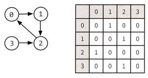

# **그래프**

> 그래프 이론은 수백 년 동안 연구되어온 주요한 수학 분야 중 하나이다.  
> 중요하고도 유용한 속성들이 많이 발견되었고, 중요한 알고리즘들도 많이 개발되었다.  

- **그래프는 정점(노드)의 집합과 그 집합의 쌍을 연결하는 간선의 모음이다.**
- 방향성이 있을 수도 있고 없을 수도 있다.
- **여러 개의 고립된 부분 그래프 (isolated subgraphs)로 구성될 수 있다.**
- 모든 정점간에 경로가 존재하는 그래프는 **연걸 그래프**라고 부른다.
- 그래프에는 사이클이 존재할 수도 있고 존재하지 않을 수도 있다.

> 수학자들은 다중 간선이 있는 그래프를 **다중 그래프**라고 부르고, 다중 간선이나 자기 순환이 없는 그래프를 **단순 그래프**라고 부른다.

## **용어**

그래프에는 많은 전문 용어들이 사용된다.  

- 두 정점이 간선으로 연결되어 있으면, 두 정점이 서로 `인접한다 (adjacent to)`라고 말한다.
- 그 간선을 두 정점에 `부속한다 (incident to)`라고 말한다.
- 그리고 정점에 부속된(연결된) 간선의 개수를 그 정점의 `차수 (degree)`라고 말한다.
- 그래프를 이루는 간선들(그에 연결된 정점을 포함하여)의 부분 집합을 `서브 그래프`라고 한다.
- 간선으로 연결된 정점 쌍의 개수와 가능한 정점 쌍의 개수 비율을 `그래프의 밀도 (density)`라고 한다.
- 가능한 간선 개수에 대비해 상대적으로 적은 수의 간선을 가지는 그래프를 `희소 (sparse)`그래프 라고 한다.
- 간선의 개수가 `V`에 작은 상수 비율 정도의 값이면 희소하다고 하고, 그 이외에는 밀집하다라고 한다.

## **인접 리스트**
- 그래프를 표현할 때 사용되는 가장 일반적인 방법이다.


## **인접 행렬**
- `N*N` 행렬 로써 `행렬[i][j]`에 정보가 존재한다면 **i에서 j로의 간선**이 있다는 뜻이다.
- 무방향 그래프를 인접 행렬로 표현한다면 이 행렬은 **대칭 행렬(symmetric matrix)**이 된다.



## **그래프 탐색**

### 깊이 우선 탐색 (DFS)
- **루트 노드 (혹은 다른 임의의 노드)에서 시작해서 다음 분기로 넘어가기 전에 해당 분기를 완벽하게 탐색하는 방법**
- 모든 노드를 방문하고자 할 때 더 선호되는 편이다.
- [백준(DFS , 백트래킹) - N과 M](https://www.acmicpc.net/workbook/view/9372)
- **[Binary Tree Level Order Traversal](https://leetcode.com/problems/binary-tree-level-order-traversal/)**

### 넓이 우선 탐색 (BFS)
- 노드 사이의 최단 경로 혹은 임의의 경로를 찾고 싶을 때 사용한다.
- 큐(Queue)를 사용하여 구현한다.
- **[Find if Path Exists in Graph](https://leetcode.com/problems/find-if-path-exists-in-graph/)**

### 양방향 탐색
- **출발지와 도착지 사이에 최단 경로를 찾을 때 사용된다.**
- 기본적으로 , 출발지와 도착지 두 노드에서 동시에 너비 우선 탐색을 사용한 뒤 , 두 탐색 지점이 충돌하는 경우에 경로를 찾는 방식이다.


# **`Minimum Spanning Tree` 최소 신장 트리**
- **간선의 가중치의 합이 최소**
- 모든 노드가 연결
- 트리의 속성을 만족 (사이클이 존재하지 않는다)

## **`Kruskal Algorithm` 크루스칼 알고리즘**
- 그리디 알고리즘의 일종이다.
  - 그래프 간선들을 **가중치의 오름차순**으로 정렬해 놓은 뒤 , 사이클을 형성하지 않는 선에서 정렬된 순서대로 간선을 선택한다.
  - 연결하려는 2개의 노드가 서로 연결되지 않은 상태라면 , 2개의 노드를 서로 연결한다.
- **`Union & Find 활용` 사이클 판단하기**
  - **Union-Find 란?**
    - Disjoint Set (서로소 집합) 을 표현하는 자료구조
    - **서로 다른 두 집합을 병합하는 Union 연산**, **집합 원소가 어떤 집합에 속해있는지 찾는 Find 연산**을 지원하기에 이러한 이름이 붙었다.
    - [해당 알고리즘을 트리 구조로 구현하는 이유](https://gmlwjd9405.github.io/2018/08/31/algorithm-union-find.html)

## **`Prim` 프림 알고리즘**
- **시작 정점을 기준으로 가장 작은 간선과 연결된 정점을 선택하며 신장 트리를 확장 시키는 알고리즘**
- **선택한 간선의 정점으로부터 가장 낮은 가중치를 갖는 정점을 선택**
- 먼저 아무 정점이든 선택하여 정점 하나짜리 트리에서 시작한다. 그 다음 `V-1`개의 간선을 붙여 나간다.

> **프림 알고리즘은 얼마나 빠를까?**  
> 느긋한 버전은 E개의 간선과 V개의 정점을 가지는 가중 간선 연결 그래프의 MST를 계산하는데, **E에 비례하는 공간과 E log E에 비례하는 시간(촤악 조건)을 소요한다.  
> 이 알고리즘의 병목점은 우선순위 큐의 삽입과 삭제에서 수행되는 간선 가중치의 비교 연산 횟수에 있다.  
> 우선순위 큐의 간선 개수는 최대 E개이고 이것이 공간 사용량의 상한이 된다.

### 느긋한 버전

- Runtime Details 1002ms
  - Beats 71.43%of users with Kotlin
- Memory Details 87.85mb
  - Beats 61.90%of users with Kotlin

```kotlin
import java.util.PriorityQueue
import kotlin.math.abs

class Solution {
    data class Edge (
        val from: Int,
        val to: Int,
        val dist: Int
    ) : Comparable<Edge> {
        override fun compareTo(other: Edge): Int =
            this.dist - other.dist
    }

    lateinit var marked: BooleanArray
    lateinit var adjList: List<MutableList<Edge>>
    fun minCostConnectPoints(points: Array<IntArray>): Int {
        marked = BooleanArray(points.size)
        adjList = calcDistance(points)

        var sumCost = 0
        lazyPrim(0).forEach {
            sumCost += it.dist
        }
        return sumCost
    }

    private fun lazyPrim(node: Int) : List<Edge>{
        val pq = PriorityQueue<Edge>()
        val mst = mutableListOf<Edge>()

        pq.addAll(findNearNode(node))
        while (pq.isNotEmpty()) {
            val edge = pq.poll()
            if (marked[edge.from] && marked[edge.to]) {
                continue
            }

            mst.add(edge)
            if (!marked[edge.from]) pq.addAll(findNearNode(edge.from))
            if (!marked[edge.to]) pq.addAll(findNearNode(edge.to))
        }
        return mst
    }

    private fun findNearNode(node: Int) : List<Edge> {
        marked[node] = true
        return adjList[node].filter { !marked[it.to] }
    }

    private fun calcDistance(points: Array<IntArray>) : List<MutableList<Edge>> {
        val edges = mutableListOf<MutableList<Edge>>()
        for (fromIndex in points.indices) {
            val from = points[fromIndex]
            edges.add(mutableListOf())
            for (toIndex in points.indices) {
                val to = points[toIndex]
                if (fromIndex != toIndex) {
                    val dist = abs(from[0] - to[0]) + abs(from[1] - to[1])
                    val edge = Edge(fromIndex, toIndex, dist)
                    edges[fromIndex].add(edge)
                }
            }
        }
        return edges
    }
}
```

### 성급한 버전

느긋한 버전을 개선하는 방법으로, 우선순위 큐에서 부적합 간선을 삭제하여 트리의 정점과 트리가 아닌 정점을 연결하는 횡단 간선만 남게하는 것이다.  
예를 들어, 정점 `v`를 트리에 추가할 때, 트리에 추가되지 않은 다른 정점 `w`와 연결되는 모든 간선들을 우선순위 큐에 관리할 필요는 없다.  
우선순위 큐에는 최소 가중치 간선만 관리하되 `v`가 트리에 추가될 때 최소 가중치 간선을 업데이트할 필요가 있는지만 검사하면 된다.  
**간선`v-w`가 더 작은 가중치를 가질 수도 있기 때문에 확인이 필요하다.**  
  

## ✋ `Kruskal` , `Prim` 차이점
- **프림**은 **정점 위주**의 알고리즘 , **크루스칼**은 **간선 위주**의 알고리즘
- **프림**은 시작점을 정하고 , 시작점에서 가까운 정점을 선택하면서 트리로 구성하므로 그 과정에서 사이클을 이루지 않는다.
  - 최소 거라의 정점을 찾는 부분에서 자료구조의 성능에 영향을 받는다.
- **크루스칼**은 시작점을 따로 정하지 않고 최소 비용의 간선을 차례로 대입하면서 트리를 구성하기 때문에 **사이클이 이루어지는지 항상 확인 해야한다.**
  - 간선을 기준으로 정렬하는 과정이 오래 걸린다.
- **간선의 개수가 작은 경우**에는 **크루스칼**
- **간선의 개수가 많은 경우**에는 **프림**
- [참고 문제1](https://jdalma.github.io/docs/javaAlgorithm/section9/#-원더랜드-)
- [참고 문제2](https://jdalma.github.io/docs/algorithm/2022y02m/#프로그래머스-최소신장트리-섬-연결하기)