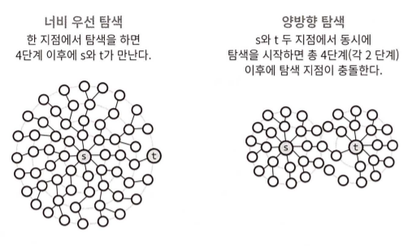

# **그래프**
- **노드와 그 노드를 연결하는 간선(edge)를 하나로 모아 놓은 것이다.**
- 방향성이 있을 수도 있고 없을 수도 있다.
- **여러 개의 고립된 부분 그래프 (isolated subgraphs)로 구성될 수 있다.**
- 모든 정점간에 경로가 존재하는 그래프는 **연걸 그래프**라고 부른다.
- 그래프에는 사이클이 존재할 수도 있고 존재하지 않을 수도 있다.

## **인접 리스트**
- 그래프를 표현할 때 사용되는 가장 일반적인 방법이다.

## **인접 행렬**
- `N*N` 행렬 로써 `행렬[i][j]`에 정보가 존재한다면 **i에서 j로의 간선**이 있다는 뜻이다.
- 무방향 그래프를 인접 행렬로 표현한다면 이 행렬은 **대칭 행렬(symmetric matrix)**이 된다.

## **그래프 탐색**

### 깊이 우선 탐색 (DFS)
- **루트 노드 (혹은 다른 임의의 노드)에서 시작해서 다음 분기로 넘어가기 전에 해당 분기를 완벽하게 탐색하는 방법**
- 모든 노드를 방문하고자 할 때 더 선호되는 편이다.
- [백준(DFS , 백트래킹) - N과 M](https://www.acmicpc.net/workbook/view/9372)
- **[Binary Tree Level Order Traversal](https://leetcode.com/problems/binary-tree-level-order-traversal/)**

### 넓이 우선 탐색 (BFS)
- 노드 사이의 최단 경로 혹은 임의의 경로를 찾고 싶을 때 사용한다.
- 큐(Queue)를 사용하여 구현한다.

- **[Find if Path Exists in Graph](https://leetcode.com/problems/find-if-path-exists-in-graph/)**

### 양방향 탐색
- **출발지와 도착지 사이에 최단 경로를 찾을 때 사용된다.**
- 기본적으로 , 출발지와 도착지 두 노드에서 동시에 너비 우선 탐색을 사용한 뒤 , 두 탐색 지점이 충돌하는 경우에 경로를 찾는 방식이다.

> 추가로 읽을 거리 - 위상정렬 , 다익스트라 , AVL , 레드블랙트리