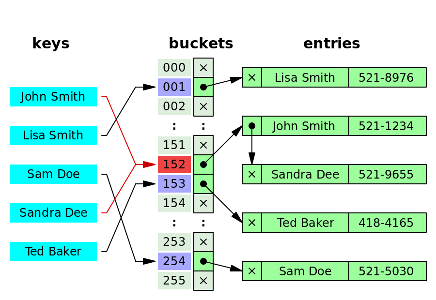

# **해시 테이블**
- **Hashtable 클래스는 컬렉션 프레임웍이 만들어지기 이전부터 존재**하던 것이기 때문에 컬렉션 프레임워크의 명명법을 따르지 않는다.
- 간단한 해시 테이블을 구현하기 위해선 , **연결리스트**와 **해시 함수**만 있으면 된다.
- `M`개의 키/값 쌍을 가지는 배열을 이용한다면 임의의 키를 그 배열의 인덱스 범위 `M`보다 작은 값으로 변환해주는 **해시 함수**이다.
    1. 일관성이 있어야한다. 즉, 같은 키라면 같은 해시 값을 가져야 한다.
    2. 효율적으로 계산될 수 있어야 한다. (너무 오래 걸려선 안된다.)
    3. 해시 값이 가능한 키 값 범위에 균일하게 분포해야 한다.

> 충돌이 자주 발생한다면 , 최악의 경우의 수행시간 `worst case runtime`은 `O(N)`이 된다.


> ✋ **[객체의 hashCode() 와 String의 hashCode()](https://brunch.co.kr/@mystoryg/133)**  
> `hashCode()`는 반드시 해당 타입에서 객체의 동일성과 일관성을 유지하도록 구현되어야 한다.  
> - `equals()`가 **false**이고 `hashCode()`가 **true**인 경우 ➜ HashMap에서 **다른 key**로 처리
> - `equals()`가 **true**이고 `hashCode()`가 **false**인 경우 ➜ HashMap에서 **다른 key**로 처리
> - `equals()`가 **true**이고 `hashCode()`가 **true**인 경우 ➜ HashMap에서 **같은 key**로 처리

# **해시 충돌 해결 방법**

## **개별 체이닝(Seperate Chaining)**
- **Java HashMap에서도 이용하고 있는 방식**
- 동일한 버킷의 데이터에 대해 **리스트 or 트리 자료구조를 이용해서 추가 메모리를 사용하여 다음 데이터의 주소를 저장하는 것**

> - 충돌이 많이 발생해서 리스트의 형태로 계속 데이터가 쌓이게 되면 검색하는데 **시간 복잡도가 `O(n)`** 으로 나빠지게 된다.
> - 그래서 Java8의 HashMap은 리스트의 개수가 8개 이상이 되면 **Self-Balancing Binary Search Tree 자료구조를 사용해 Chaining 방식을 구현** 하였다. **탐색할 때 `O(logN)`으로 성능이 좋아집니다.**



## **개방 주소법(Open Addressing)**
- 추가적인 메모리를 사용하는 체이닝 방식과 다르게 비어있는 해시 테이블의 공간을 활용하는 방법
- 테이블에 항목이 있는지 없는지 검사하는 탐색 키를 `"탐칠 (probe)"`이라고 부른다.
- 개방 주소법을 구현하기 위한 대표적인 3가지 방식이 존재한다.
    1. **Linear Probing** : 만약 충돌이 `h[k]` 에서 난다면 `h[k + 1]`이 비어있는지 확인하고 비어 있지 않다면 `h[k + 2] . . .` 식으로 계속 확인하는 방법
    2. **Quadratic Probing** : 해시의 저장순서 폭을 제곱으로 저장하는 방식, 예를 들어 처음 충돌이 발생한 경우에는 `1`만큼 이동하고 그 다음 계속 충돌이 발생하면 `2^2, 3^2` 칸씩 옮기는 방식
    3. **Double Hashing Probing** : 해시된 값을 한번 더 해싱하여 새로운 주소를 할당하기 때문에 다른 방법들보다 많은 연산을 하게 된다.
    - 1, 2번은 버킷 조사를 원형으로 회전하게 된다 테이블의 마지막에 도달하면 다시 처음으로 이동한다.


개방 주소법에서는 삭제를 어떻게 진행할까?  
해당 키 위치를 `null`로 변경하게 되면 뒤에 연결된 값들을 잃게 된다.  

```java
public void delete(Key key) {
    if (!contains(key)) return;

    int i = hash(key);
    while (!key.equals(keys[i])) {
      i = (i + 1) % M;
    }
    keys[i] = null;
    vals[i] = null;
    i = (i + 1) % M;

    while (keys[i] != null) {
      Key keyToRedo = keys[i];
      Value valToRedo = vals[i];
      keys[i] = null;
      vals[i] = null;
      N--;
      put(keyToRedo, valToRedo);
      i = (i + 1) % M;
    }
    N--;
    if (N > 0 && N <= M/8) {
      resize(M/2);
    }
}
```

위의 코드를 보면 삭제 해야할 인덱스는 null로 지정하고 해당 인덱스 뒤부터 1씩 증가하면서 null이 아니라면 `put`과정을 다시 거치게해서 삽입한다.  

## **JAVA8의 분리 연결법**

- **균형 이진 탐색 트리로 구현**
  - 이 경우에 탐색 시간은 `O(log N)`이 된다.
  - 키의 집합을 특정 순서로 차례대로 접근할 수 있는데 , 어떤 경우에는 이런 기능이 유용하기도 하다.
- Java 7까지는 분리 연결법에서 충돌이 발생하면 연결 리스트를 이용하였다. 하지만 충돌이 자주 발생한다면 최악으로는 선형 시간만큼 걸린다.
- Java 8에서는 **일정 개수 이상이 되면 트리구조를 이용하는 것으로 발전하여 `O(n)`의 탐색시간이 `O(logN)`으로 빨라질 수 있다.
- **버킷에 8개의 키-값 쌍이 쌓이면 리스트 ➜ 트리로 변경한다.** 그리고 **다시 6개이하가 되면 트리 ➜ 리스트의 형태로 바꾼다.**

```java
static final int TREEIFY_THRESHOLD = 8;

static final int UNTREEIFY_THRESHOLD = 6;
```

> - Java 8 HashMap에서는 `Entry` 클래스 대신 `Node` 클래스를 사용한다.
> - **`Node` 클래스 자체는 사실상 Java 7의 `Entry` 클래스와 내용이 같지만, 링크드 리스트 대신 트리를 사용할 수 있도록 하위 클래스인 `TreeNode`가 있다는 것이 Java 7 HashMap과 다르다.**
> - 이때 사용하는 트리는 **Red-Black Tree**인데, Java Collections Framework의 TreeMap과 구현이 거의 같다.


## **정리**  

개방주소법은 연속된 공간에 데이터를 저장하기 때문에 개별체이닝에 비하여 캐시 효율이 높다.  
따라서 **데이터의 개수가 충분히 적다면 개방 주소법이 분리 연결법보다 성능이 더 좋다.**  
**하지만 배열의 크기가 커질수록 캐시의 효율이라는 개방 주소법의 장점은 사라진다.**  
자바 8부터는 
- [`d2.naver.com`  HashMap은 어떻게 작동할까?](https://d2.naver.com/helloworld/831311)
- [`JEP 180` : 균형 잡힌 트리로 빈번한 HashMap 충돌 처리 ](https://openjdk.org/jeps/180)
- [HashMap의 TreeNode를 확인하는 실험](https://johngrib.github.io/wiki/java/hashmap/#hashmap%EC%9D%98-treenode%EB%A5%BC-%ED%99%95%EC%9D%B8%ED%95%98%EB%8A%94-%EC%8B%A4%ED%97%98)