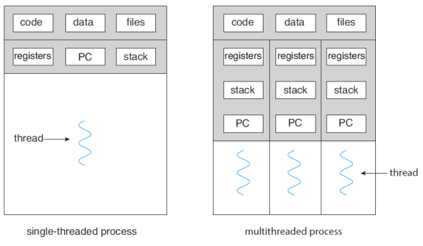
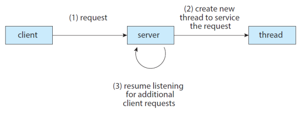
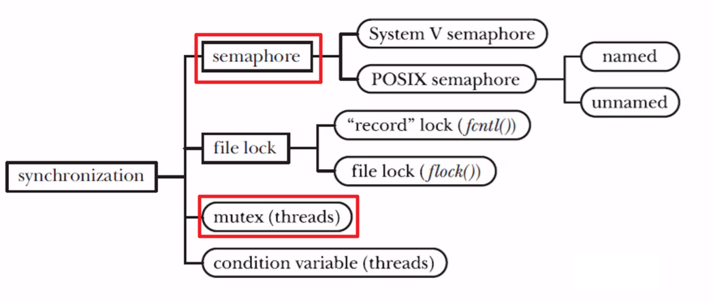
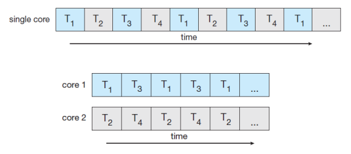
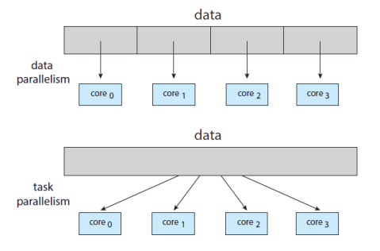
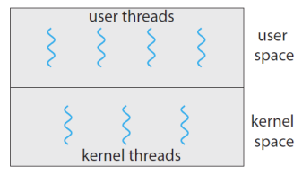
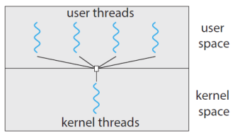
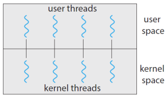
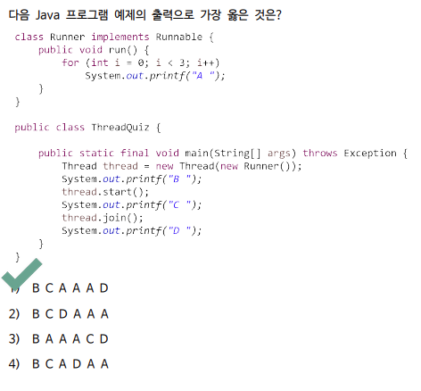

> 단일 CPU 컴퓨터도 여러 사용자를 지원할 수 있는데 이는 운영체제가 각 사용자에 프로세스 하나를 할당하기 때문이다.  
> 운영체제는 두 사용자가 각각 자신만의 공간에 있다고 생각할 수 있도록 가상 주소 공간을 각각의 프로세스에 제공한다.  
> 운영체제는 주기적으로 번갈아가며 각 프로세스에 CPU를 할당함으로 실제로 마술 같은 일이 일어난다.  
> **프로세스는 다시 운영체제에 한 개 이상의 스레드 즉, 본인이 가진 프로세스와 같은 주소 공간을 공유하는 프로세스를 요청함으로 태스크를 동시에 또는 협력적으로 실행할 수 있다.**  
>
> 멀티코어 설정에서는 스레드의 도움 없이 프로그램이 컴퓨팅 파워를 모두 활용할 수 없다.  
> 각 코어는 한 개 이상의 프로세스나 스레드에 할당될 수 있지만 프로그램이 스레드를 사용하지 않는다면 효율성을 고려해 여러 프로세서 코어 중 한 개만을 사용할 것이다.  
> 실제로 네 개의 코어를 가진 CPU에서 이론적으로 프로그램을 네 개의 코어에서 병렬로 실행함으로 실행 속도를 네 배까지 향상시킬 수 있다. (물론 오버헤드로 인해 실제 네 배가 되긴 어렵지만)

- 지금까지 우리는 프로세스가 단일 제어 스레드로 실행중인 프로그램이라고 가정했다.
- 하지만 **프로세스는 여러 스레드를 포함 할 수 있다.**

# **스레드 `Thread`**
- 한 프로세스 내에서 동작되는 여러 실행의 흐름으로 , 프로세스 내의 주소 공간이나 자원들을 대부분 공유하면서 실행된다
- **경량 프로세스 `Light Weight Process - LWP`** 라고도 불린다.
- CPU 실행의 기본 단위
- `Thread`의 구성
  - `Program Counter`
  - `Register Set`
  - `Stack Space`



- `Thread`는 같은 **Process**에 속한 **다른 `Thread`** 와  **Code Section** , **Data Section** 그리고 **열린 파일이나 신호와 같은 운영체제 자원**들을 공유한다.
- **Code Section** : 자신을 실행하는 코드가 저장되어 있다.
- **Data Section** : 전역 변수와 `Static`변수가 저장 되어 있다.
- **Stack Section** : 지역 변수 , 함수 호출 시 매개변수 , 돌아갈 주소가 저장되어 있다.



## **병렬성 `Parallelism` vs 동시성 `Concurrency`**
- **병렬성**
  1. 동시에 진행되는 동시적인 작업을 가리킨다
  2. 작업들이 동일한 방향으로 교차됨 없이 독립적으로 진행되는 것을 의미한다
- **동시성**
  1. 단일 프로세서와 다중 프로세서 시스템에서 모두 가능하다
  2. 본질적으로 병렬성을 흉내낸 것으로 단일 프로세스에서 동작이 가능하다
  3. 두 가지 이상의 일이 동시에 발생하는 것 처럼 보이게끔 해준다

## **Thread 병렬 처리**

### Thread 안전 `thread-safe`
- Multi-Thread 환경에서 **다수의 쓰레드가 동시에 함수를 호출** 하더라도 공유되는 데이터를 안전하게 보호하는 코드
  1. 여러 쓰레드가 공유 데이터에 대한 `data-race`현상이 발생하지 않도록 하거나
  2. 여러 쓰레드가 전역 변수(공유 데이터)로 사용되는 데이터에 동시 접근을 방지하기 위해 동기화 기법을 사용

### 재진입 `reentrant`
- Single-Threaded 환경에서 **호출한 함수의 실행이 종료되기 이전에 외부 인터럽트에 의해 해당 함수로의 진입**이 가능
- 동일한 쓰레드에서 동일한 함수를 호출하더라도 `thread-safe`가 보장되어야 한다
- **`Re-entrancy`를 보장하는 방법은 지역변수만을 사용하는 것**
  - **즉 쓰레드 내에서는 `static`이나 `전역변수`를 사용하지 않고 , `정적 데이터`에 대한 포인터를 반환하지 않는다**

### 뮤텍스 `mutex` vs `semaphore`




- 뮤텍스란 코드의 임계역영을 한 순간에 특정 **Thread 하나만 사용할 수 있도록 하는 것**
  - *임계영역에 진입할 때 마다 뮤텍스를 `lock`하고 , 임계영역을 빠져나올 때 마다 뮤텍스를 `release`하는 방법으로 동기화*
- 세마포어란 **임계영역에 진입할 때 마다 세마포어 값을 확인하여 세마포어를 얻을 수 없을 때에는 임계영역에 들어갈 수 없고 , 오로지 세마포어를 얻을 수 있을 때에만 세마포어의 값을 줄여주고 임계영역으로 들어갈 수 있다**
  - *여러 개의 공유 데이터를 한꺼번에 관리해야 하는 경우에는 뮤텍스보다는 세마포어를 이용하는것이 더 효과적이다*

## **멀티 스레드 프로그래밍 장점**
- 다중 스레드로 구성된 태스크 구조에서는 하나의 서버 스레드가 `blocked (waiting)`상태인 동안에도 **동일한 태스크 내의 다른 스레드가 실행 `(running)`되어 빠른 처리를 할 수 있다.**
- `Thread`를 사용하면 병렬성을 높일 수 있다.
  
1. **응답성** - 지속적인 실행을 허용할 수 있음
2. **자원 공유** - 스레드는 프로세스의 자원을 공유하고, **공유 메모리 또는 메시지 전달보다 쉽다**
3. **경제성** - 프로세스 생성보다 저렴
   - **스레드 스위칭은 컨텍스트 스위칭보다 오버헤드가 낮다.**
4. **멀티 프로세서(`MP`) 아키텍처 활용 가능**


## **Java에서 스레드를 명시적으로 생성하는 세 가지 기술**.

### `public class MyThread extends Thread`
- Thread 클래스에서 파생된 새 클래스를 만든다.
- `public void run()` 메서드를 재정의한다.

```java
public class MyThread extends Thread{
    @Override
    public void run() {
        try{
            while(true){
                System.out.println("Hello , Thread");
                Thread.sleep(500);
            }
        }
        catch(InterruptedException ie){
            System.out.println("--------Interrupted");
        }
    }
}
```

```java
import java.io.IOException;

class Main {
    public static void main(String[] args) throws IOException {
        MyThread thread = new MyThread();
        thread.start();
        System.out.println("Hello , my child");
    }
}
```


### `public class MyThread implements Runnable`
- Runnable 인터페이스를 구현하는 새 클래스를 정의한다.
- `public void run()` 메서드를 재정의한다.

```java
public class MyThread implements Runnable{
    @Override
    public void run() {
        try{
            while(true){
                System.out.println("Hello , Runnable");
                Thread.sleep(500);
            }
        }
        catch(InterruptedException ie){
            System.out.println("--------Interrupted");
        }
    }
}
```

```java
import java.io.IOException;

class Main {
    public static void main(String[] args) throws IOException {
        Thread thread = new Thread(new MyThread());
        thread.start();
        System.out.println("Hello , my child");
    }
}
```

### **Lambda 표현식 사용(Java 버전 1.8부터)**
- 새로운 클래스를 정의하지 않고 대신 **Runnable의 람다 식을 사용**한다.

```java
class Main {
    public static void main(String[] args){
        Runnable task = () -> {
            try{
                while(true){
                    System.out.println("Hello , Lambda Runnable");
                    Thread.sleep(500);
                }
            }
            catch(InterruptedException ie){
                System.out.println("--------Interrupted");
            }
        };
        Thread thread = new Thread(task);
        thread.start();
        System.out.println("Hello , my child");
    }
}
```

### **부모 쓰레드의 대기**

```java
class Main {
    public static void main(String[] args){
        Runnable task = () -> {
            for(int i = 0 ; i < 5 ; i++){
                System.out.println("Hello , Lambda Runnable");
            }
        };
        Thread thread = new Thread(task);
        thread.start();
        try{
            thread.join();
        }
        catch(InterruptedException ie){
            System.out.println("Parent thread is interrupted");
        }
        System.out.println("Hello , My Joined Child");
    }
}
```

### **쓰레드의 종료**

```java
class Main {
    public static void main(String[] args) throws InterruptedException {
        Runnable task = () -> {
            try{
                while(true){
                    System.out.println("Hello , Lambda Runnable!");
                    Thread.sleep(100);
                }
            }
            catch (InterruptedException ie){
                System.out.println("I'm Interrupted");
            }
        };
        Thread thread = new Thread(task);
        thread.start();
        Thread.sleep(500);
        thread.interrupt();
        System.out.println("Hello , My Interrupted Child!");
    }
}
```

> ✋ **[인터럽트(Interrupt)란?](https://whatisthenext.tistory.com/147)**

***

## **멀티코어 시스템의 멀티스레딩**
- **향상된 동시성을 위해 다중 코어를 보다 효율적으로 사용한다.**
- **단일 코어** - 스레드는 시간이 지남에 따라 **Interleave - 인터리브**된다.
- **다중 코어** - 일부 스레드는 병렬로 실행될 수 있다.



> ✋  **[인터리브(Interleave)란?](https://www.scienceall.com/%EC%9D%B8%ED%84%B0%EB%A6%AC%EB%B8%8Cinterleave/)**
> - 컴퓨터 하드디스크의 성능을 높이기 위해 **데이터를 서로 인접하지 않게 배열하는 방식을 말한다.**
> - 인터리브(`interleave`)라는 단어는 ‘**교차로 배치하다**’라는 뜻이며, 이를 통해 디스크 드라이브를 좀더 효율적으로 만들수 있다.
> - 인터리브는 기억장치를 몇 개의 부분으로 나누어서 메모리 액세스를 동시에 할 수 있게 함으로써 복수의 명령을 처리하여 메모리 액세스의 효율화를 도모하는 것이다.
> - 대부분의 하드디스크는 드라이브의 속도와 운영체제(OS), 응용 프로그램 등에 영향을 받기 때문에 인터리브 값을 미리 설정하지는 않는다.
> - 인터리브 값이 작을수록 하드디스크 드라이브의 속도가 빨라진다.

### **멀티코어 시스템 프로그래밍 시 고려할 점**
- **Identifying tasks (작업 식별)** - 각 스레드가 수행해야 할 작업을 확실히 구별 해야한다.
- **Balance (균형)** -  각 스레드의 작업 균형을 확인해야 한다.
- **Data splitting (데이터 분할)** - 별도의 코어에서 실행하려면 데이터도 분할해야 한다.
- **Data dependency (데이터 종속성)** - 작업 실행이 동기화되었는지 확인한다.
- **Testing and debugging (테스트 및 디버깅)**



### ✋ **코어는 무조건 많을수록 좋은가? [Amdahl’s Law - 암달의 법칙](https://johngrib.github.io/wiki/amdahl-s-law/)**

***

# **두 가지 유형의 Thread**


## **User Thread - 사용자 스레드**
- 커널 위에서 지원되며, **커널 지원 없이 관리된다.**

## **Kernel Thread - 커널 스레드**
- 운영 체제에서 직접 지원 및 관리된다.

- **Many-to-One Model**



- **One-to-One Model**



- **Many-to-Many Model**


***

# **세 가지 주요 스레드 라이브러리**

## **POSIX Pthread**
- POSIX 표준(IEEE 1003.1c)
- 구현이 아닌 스레드 동작에 대한 사양

### 예제 1

```c
#include <stdio.h>
#include <stdlib.h>
#include <pthread.h>

/* 스레드 간 공유 변수 */
int sum;

/* 스레드 간 호출 함수 */
void * runner(void *param);

int main(int argc , char *argv[])
{
    pthread_t tid;          // 스레드 id
    pthread_attr_t attr;    // 스레드 속성

    pthread_attr_init(&attr);
    pthread_create(&tid , &attr , runner , argv[1]);
    pthread_join(tid , NULL);

    printf("sum = %d , %ld\n" , sum , tid);
    // ./a.out 100
    // sum = 5050 , 140363881649920
}

void *runner(void *param)
{
    int i;
    int upper = atoi(param); // atoi - 문자열을 정수로 변환
    sum = 0;
    for(i = 0 ; i <= upper ; i++){
        sum += i;
    }
    pthread_exit(0);
}
```

### 예제 2

```c
#include <stdio.h>
#include <unistd.h>
#include <wait.h>
#include <pthread.h>

int value;
void * runner(void *param);

int main(int argc , char *argv[])
{
    pid_t pid;
    pthread_t tid;
    pthread_attr_t attr;

    pid = fork();

    if(pid == 0){   // 자식 프로세스
        pthread_attr_init(&attr);
        pthread_create(&tid , &attr , runner , NULL);   // create 하자마자 runnner 실행
        pthread_join(tid , NULL);
        printf("CHILD : value = %d , pid = %d\n" , value , pid);
    }
    else if(pid > 0){   // 부모 프로세스
        wait(NULL);
        printf("PARENT : value = %d , pid = %d\n" , value , pid);
    }
    // CHILD : value = 5 , pid = 0
    // PARENT : value = 0 , pid = 5080
}

void *runner(void *param)
{
    value = 5;
    pthread_exit(0);
}
```

### ❓ **문제**

```c
pid_t pid;

pid = fork();
if(pid == 0){
  fork();
  thread_create(...);
}
fork();
```
- **고유한 프로세스는 몇 개 생성되었는가?** - 6개
- **고유한 스레드는 몇 개 생성되었는가?** - 2개 또는 프로세스를 포함한 8개

***

# **`The Strategy of Implicit Threading` 암시적 스레딩 전략**
- **동시 및 병렬 애플리케이션 설계**
  - 즉, **멀티코어 시스템에서 멀티스레딩 설계**
  - 개발자에게 너무 어렵다.
- 이 어려움을 **컴파일러 또는 런타임 라이브러리가 알아서 해준다.**

## `Thread Pools` 스레드 풀
- 작업을 기다리는 풀에 여러 스레드를 만든다.

## `Fork & Join` 포크 및 조인 🚩 
- 명시적 스레딩이지만 암시적 스레딩에 대한 훌륭한 후보
- [Guide to the Fork/Join Framework in Java](https://www.baeldung.com/java-fork-join)

## `OpenMP`
- C/C++로 작성된 프로그램용 컴파일러 지시문 및 API 세트
- 병렬 영역을 병렬로 실행할 수 있는 코드 블록으로 식별한다.
- 컴파일러 지시문을 병렬 영역의 소스 코드에 삽입한다.
- 이 지시문은 **OpenMP 런타임 라이브러리가 영역을 실행하도록 지시한다.**

### 예제 1

```c
#include <stdio.h>
#include <omp.h>

int main(int argc , char *argv[])
{
    #pragma omp parallel // 컴파일러 지시문
    {
        printf("Parallel region. \n");
    }

    return 0;
}
```

```
root@DESKTOP-LBC6EVJ:~/example# gcc parallel.c
root@DESKTOP-LBC6EVJ:~/example# ./a.out
Parallel region.

root@DESKTOP-LBC6EVJ:~/example# gcc -fopenmp parallel.c
root@DESKTOP-LBC6EVJ:~/example# ./a.out
Parallel region.
Parallel region.
Parallel region.
Parallel region.
Parallel region.
Parallel region.
Parallel region.
Parallel region.
```

### 예제 2

```c
#include <stdio.h>
#include <omp.h>

int main(int argc , char *argv[])
{
    omp_set_num_threads(4); // 스레드 갯수 제한
    #pragma omp parallel // 컴파일러 지시문
    {
        printf("Parallel region OpenMP thread : %d\n" , omp_get_thread_num());
    }

    return 0;
}
```

```
root@DESKTOP-LBC6EVJ:~/example# gcc -fopenmp parallel.c
root@DESKTOP-LBC6EVJ:~/example# ./a.out
Parallel region OpenMP thread : 0
Parallel region OpenMP thread : 3
Parallel region OpenMP thread : 2
Parallel region OpenMP thread : 1
```

### 예제 3

```c
#include <stdio.h>
#include <omp.h>

#define SIZE 1000000000

int a[SIZE] , b[SIZE] , c[SIZE];

int main(int argc , char *argv[])
{
    int i;
    for(i = 0 ; i < SIZE ; i++) a[i] = b[i] = i;

    #pragma omp parallel for
    for(i = 0 ; i < SIZE ; i++){
        c[i] = a[i] + b[i];
    }

    return 0;
}
```

```
root@DESKTOP-LBC6EVJ:~/example# gcc -fopenmp parallel.c
root@DESKTOP-LBC6EVJ:~/example# ./a.out
root@DESKTOP-LBC6EVJ:~/example# time ./sum_not_parallel
bash: ./sum_not_parallel: No such file or directory

real    0m0.002s
user    0m0.001s   -> 유저 모드
sys     0m0.001s    -> OS 커널 모드
```

```
root@DESKTOP-LBC6EVJ:~/example# time ./sum_with_openmp
bash: ./sum_with_openmp: No such file or directory

real    0m0.001s
user    0m0.001s
sys     0m0.000s
```

***

# **스레드 스케줄링**

운영체제는 **에포크** 에 맞춰 스레드의 작업 시간을 적당한 크기로 나눈다.  
스레드의 타임 슬라이스를 종류별로 에포크에 할당한다. 하지만 모든 스레드가 각 에포크에서 할당되진 않는다.  

> **Dynamic Priority = Static Priority + Bonus**  
> Static Priority : 개발자가 미리 설정한다.  
> Bonus : 운영 체제가 각각의 에포크마다 조절한다.

위와 같이 적용하면 운영체제는 즉각적인 반응이 필요한 실시간 스레드나 인터랙티브 스레드에게 우선권을 준다.  
동시에 기아현상을 막기위해 이전 에포크에서 실행 시간이 부족했거나 완료되지 않은 스레드도 놓치지 않는다.  

***

# **틀린 퀴즈**

## Pthread


## Java 멀티 쓰레드


