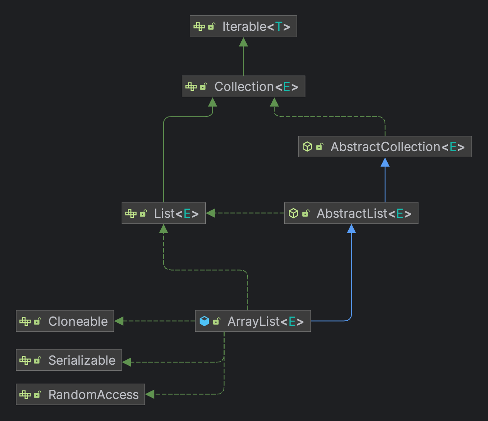

자바 8에서 `List`인터페이스에 `sort`가 추가되었는데, `default method` 기능이 없었다면 기존의 `List`인터페이스를 구현했던 모든 컬렉션 프레임워크 (Guava, Apache Common 등)에서 `sort`를 구현해야 할 것이다.  
  
기본 구현을 포함하는 인터페이스를 정의하는 두 가지 방법을 제공한다.  
**결과적으로 기존 인터페이스를 구현하는 클래스는 자동으로 인터페이스에 추가된 새로운 메서드의 디폴트 메서드를 상속받게 된다.**  
  
```java
// List interface
default void sort(Comparator<? super E> c) {
    Object[] a = this.toArray();
    Arrays.sort(a, (Comparator) c);
    ListIterator<E> i = this.listIterator();
    for (Object e : a) {
        i.next();
        i.set((E) e);
    }
}

// Collection interface
default Stream<E> stream() {
    return StreamSupport.stream(spliterator(), false);
}

@Override
default Spliterator<E> spliterator() {
    return Spliterators.spliterator(this, 0);
}
```

`default method`를 이용하면 자바 API의 호환성을 유지하면서 라이브러리를 변경할 수 있기 때문에 주로 라이브러리 설계자들이 사용한다.  
그리고 **다중 상속 동작이라는 유연성을 제공하면서 프로그램 구성에도 도움을 주기 떄문에 해당 기능에 잘 이해하는 것이 중요하다.**  
<span style="color:red; font-weight:bold">Object가 제공하는 기능 (equals ,hashCode ,toString 등등..)은 기본 메서드로 제공 할 수 없다  
  
> **정적 메서드와 인터페이스**  
> 보통 자바에서는 인터페이스 그리고 인터페이스의 인스턴스를 활용할 수 있는 다양한 정적 메서드를 정의하는 유틸리티 클래스를 활용한다.  
> 예를 들어 Collections는 Collection 객체를 활용할 수 있는 유틸리티 클래스다.  
> **자바 8에서는 인터페이스에 직접 정적 메서드를 선언할 수 있으므로 유틸리티 클래스를 없애고 직접 인터페이스 내부에 정적 메서드를 구현할 수 있다.**  
> 그럼에도 불구하고 과거 버전과의 호환성을 유지할 수 있도록 자바 API에는 유틸리티 클래스가 남아있다.

# 호환성에 대해

자바 프로그램을 바꾸는 것과 관련된 호환성 문제는 크게 세 가지가 있다.  
  
1. **바이너리 호환성**
   - 뭔가를 바꾼 이후에도 에러 없이 기존 바이너리가 실행될 수 있는 상황 (인증, 준비, 해석 등의 과정이 포함된다.)
   - 예를 들어, 인터페이스에 메서드를 추가했을 때 추가된 메서드를 호출하지 않는 한 문제가 일어나지 않는 것이다.
2. **소스 호환성**
   - 코드를 고쳐도 기존 프로그램을 성공적으로 재컴파일할 수 있음을 의미한다.
   - 예를 들어, 인터페이스에 메서드를 추가하면 소스 호환성이 아니다. 추가한 메서드를 구현하도록 클래스를 고쳐야 하기 때문이다.
3. **동작 호환성**
   - 코드를 바꾼 다음에도 같은 입력값이 주어지면 프로그램이 같은 동작을 실행한다는 의미다.
   - 예를 들어, 인터페이스에 메서드를 추가하더라도 프로그램에서 추가된 메서드를 호출할 일은 없으므로 동작 호환성은 유지된다.

# 추상 클래스와 자바 8의 인터페이스

디폴트 메서드는 인터페이스가 자신을 구현하는 클래스에서 메서드를 구현하지 않을 수 있는 새로운 메서드 시그니처를 제공할 수 있는 기능이다.  
둘 다 추상 메서드와 바디를 포함하는 메서드를 정의할 수 있는데 인터페이스와 추상클래스와 차이점은 뭘까?  

1. **클래스는 하나의 추상 클래스만 상속받을 수 있지만 인터페이스는 여러 개 구현할 수 있다.**
2. **추상 클래스는 인스턴스 변수(필드)로 공통 상태를 가질 수 있지만 인터페이스는 인스턴스 변수를 가질 수 없다.**
  
# 디폴트 메서드 활용 패턴
  
<h3>선택형 메서드</h3>
  
인터페이스를 구현하는 클래스에서 메서드의 내용이 비어있는 경우가 있을 것이다.  
구현하는 클래스에서는 추상 메서드를 모두 구현해야 하니 필요없는 메소드도 작성해야하기 때문이다.  
  
```java
public interface Iterator<E> {
    boolean hasNext();
    E next();
    default void remove() {
        throw new UnsupportedOperationException("remove");
    }
```
  
하지만 디폴트 메서드를 사용하여 `Iterator`인터페이스의 `remove` 같이 작성해놓으면 구현하는 클래스에서는 필요없는 메소드를 신경쓰지 않아도 되는 장점이 있다.  

<h3>다중 상속</h3>  
  
**인터페이스가 구현을 가질 수 있고 클래스는 여러 인터페이스를 동시에 구현할 수 있으므로 결국 자바도 다중 상속을 지원하는 걸까?**  
인터페이스를 구현하는 클래스가 디폴트 메서드와 같은 메서드 시그니처를 정의하거나 아니면 디폴트 메서드를 오버라이드 한다면 어떻게 될까?  
  


`ArrayList`는 한 개의 클래스를 상속받고, 여섯 개의 인터페이스를 구현한다.  



자바 8에서는 인터페이스가 구현을 포함할 수 있으므로 클래스는 여러 인터페이스에서 동작(구현 코드)을 상속받을 수 있다.  
같은 시그니처를 갖는 여러 개의 디폴트 메서드를 상속받는 상황이 생길 수 있다.  
이런 상황에서는 어떤 인터페이스와 디폴트 메서드를 사용할게 될까?  
  
```java
interface A {
    default String hello() {
        return "Hello from A interface";
    }
}
interface B extends A {
    default String hello() {
        return "Hello from B interface";
    }
}

class C implements B,A {}
class D implements B,A {
    @Override
    public String hello() {
        return "Hello from D class";
    }
}
class F implements A,AA {
    @Override
    public String hello() {
        return A.super.hello();
    }
}


@Test
void multipleDefaultMethod() {
    Assertions.assertThat(new C().hello()).isEqualTo("Hello from C class");
    Assertions.assertThat(new D().hello()).isEqualTo("Hello from B interface");
    Assertions.assertThat(new E().hello()).isEqualTo("Hello from B interface");
    Assertions.assertThat(new F().hello()).isEqualTo("Hello from A interface");
}
```

**알아야 할 세 가지 해결 규칙**  
1. 클래스가 항상 이긴다. 클래스나 슈퍼클래스에서 정의한 메서드가 디폴트 메서드보다 우선권을 갖는다.
2. 1번 규칙 이외의 상황에서는 서브인터페이스가 이긴다. 상속 관계를 갖는 인터페이스에서 같은 시그니처를 갖는 메서드를 정의할 때는 서브 인터페이스가 이긴다.
   - 즉, B가 A를 상속받는다면 B가 A를 이긴다. `C`와 `H` 클래스의 관계가 이 상황이다.
3. 여전히 디폴트 메서드의 우선순위가 결정되지 않았다면 여러 인터페이스를 상속받는 클래스가 명시적으로 디폴트 메서드를 오버라이드하고 호출해야 한다.
   - 위의 예제에서 `F` 클래스는 **무조건 메서드를 재정의해야 한다.**
  
결국은 **슈퍼 클래스** 또는 **서브인터페이스** 또는 **결정하지 못할 상황에는 구현 클래스가 오버라이드** 를 해야한다.  

> 상속으로 코드 재사용 문제를 모두 해결할 수 있는 것은 아니다.  
> 예를 들어 한 개의 메서드를 재사용하려고 100개의 메서드와 필드가 정의되어 있는 클래스를 상속받는 것은 **옳지 못한 상속** 이다.  
> 이럴 때는 **delegation** , 즉 멤버 변수를 이용해서 클래스에서 필요한 메서드를 직접 호출하는 메서드를 작성하는 것이 좋다.  
> `String`클래스와 같이 종종 `final`로 선언된 클래스를 볼 수 있다. 이 의미는 다른 누군가가 `String`의 핵심 기능을 바꾸지 못하도록 제한하려 하는 것이다.  
> 디폴트 메서드에도 위와 같은 규칙을 적용하여 **필요한 기능만 포함하도록 인터페이스를 최소환으로 유지한다면 필요한 기능만 선택할 수 있으므로 쉽게 기능을 조립할 수 있다.**  
