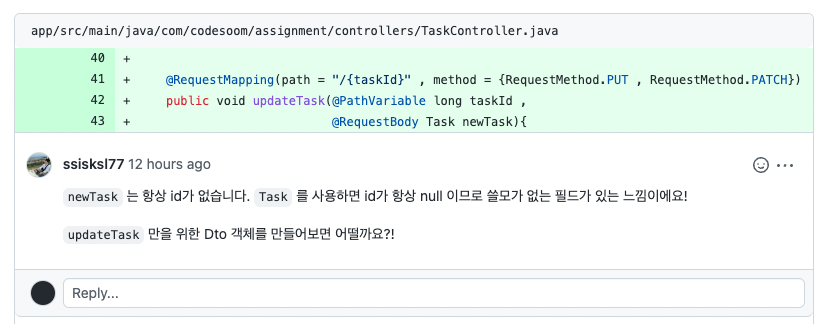

<!-- TOC -->

- [**DTO**](#dto)
  - [DTO `vs` Domain](#dto-vs-domain)
- [**POJO**](#pojo)
- [**JavaBean**](#javabean)

<!-- /TOC -->

- [리뷰](https://github.com/CodeSoom/spring-week2-assignment-1/pull/94#discussion_r940216284)에서 DTO에 대한 얘기가 나와 정리해본다
- 출처
  - [`javatpoint` DTO in java](https://www.javatpoint.com/dto-java)
  - [`baeldung` java-dto-pattern](https://www.baeldung.com/java-dto-pattern)
  - [`baeldung` POJO](https://www.baeldung.com/java-pojo-class)
  - [`martinfowler` DTO Pattern](https://martinfowler.com/eaaCatalog/dataTransferObject.html)
  - [`geeksforgeeks` POJO vs Java Beans](https://www.geeksforgeeks.org/pojo-vs-java-beans/)

***

# **DTO**
- 마틴 파울러의 [Enterprise Application Architecture](https://martinfowler.com/books/eaa.html)에서 처음으로 언급되었다


- [이미지 출처](https://www.baeldung.com/java-dto-pattern)

<br>

1. 동일한 도메인의 다른 Presentation을 만들 수 있지만 도메인 디자인에 영향을 주지 않으면서 클라이언트의 요구에 맞게 최적화할 수 있다
2. DTO 또는 데이터 전송 개체는 **메서드 호출 수를 줄이기 위해 프로세스 간에 데이터를 전달하는 개체**입니다.
3. **단일 호출에서 여러 매개변수를 일괄 처리하여 서버로의 왕복을 줄이는 것**이라고 설명했습니다.
4. `DTOs normally are created as POJOs`

## DTO `vs` Domain


- [코드숨 2주차 과제](https://github.com/CodeSoom/spring-week2-assignment-1/pull/94)

**Domain**
```java
public class Task {
    public Long id;
    public String title;

    public Task(Long id, String title) {
        this.id = id;
        this.title = title;
    }

    // Getter , Setter , toString
}
```


**DTO**
```java
public class UpdateTask {
    private String title;

    public UpdateTask() {
    }

    public UpdateTask(String title) {
        this.title = title;
    }

    // Getter
}
```

**Mapper**
```java
public class TaskMapper {

    public Task toNewTask(Long taskId , UpdateTask updateTask){
        return new Task(taskId , updateTask.getTitle());
    }
}
```

***

# **POJO**

```
DTOs normally are created as POJOs.
```

<br>

`Plain Old Java Objects`가 뭘까?

1. Extend prespecified classes, 
    - Ex: public class GFG extends javax.servlet.http.HttpServlet { … } **is not a POJO class.**
2. Implement prespecified interfaces, 
    - Ex: public class Bar implements javax.ejb.EntityBean { … } **is not a POJO class.**
3. Contain prespecified annotations, 
    - Ex: @javax.persistence.Entity public class Baz { … } **is not a POJO class.**

<br>

**다른 클래스를 확장하거나** , **다른 인터페이스를 구현하거나** , **미리 지정된 주석을 포함하면** `POJO`가 아니다<br>

아래의 조건을 충족해야 **POJO**라고 불릴 수 있다.
1. **특정 `규약`에 종속되지 않는다.**
   - 자바 언어와 꼭 필요한 API외에는 종속되지 않아야 한다.
   - 겍체지향 설계의 자유로운 적용이 가능한 오브젝트여야 한다.
2. **특정 `환경`에 종속되지 않는다.**
   - 비즈니스 로직을 담고있는 클래스는 웹이라는 환경정보나 웹 기술을 담고 있는 클래스나 인터페이스를 사용해서는 안된다.
     - 직접적으로 웹이라는 환경으로 제한해버리는 오브젝트나 API에 의존해선 안된다.
   - 환경에 독립적이어야 한다.
<br>

그럼 특정 `기술규약`과 `환경`에 종속되지 않으면 모두 **POJO**라고 말할 수 있는가?<br>
1. 책임과 역할이 각기 다른 코드를 한 클래스에 몰아넣어 덩치 큰 만능 클래스로 만드는 경우
2. 재사용이 불가능할 정도로 다른 레이어와 영역의 코드와 강한 결합을 가지고 만들어지는 경우
3. 상속과 다형성의 적용으로 처리하면 깔끔한 것을 분기문이 가득 찬 길고 긴 메소드로 작성해놓은 경우
위와 같이 **객체지향 프로그래밍/설계**가 적용되어 있지 않다면 POJO라고 부르기는 힘들다.

```
진정한 POJO란 객체지향적인 원리에 충실하면서, 환경과 기술에 종속되지 않고 필요에 따라 재활용 될 수 있는 방식으로 설계된 오브젝트를 말한다.
그런 POJO에 애플리케이션의 핵심 로직과 기능을 담아 설계하고 개발하는 방법을 "POJO 프로그래밍"이라고 할 수 있다.

- 토비의 스프링 7장.스프링이란 무엇인가? 736p
```

<br>

[`baeldung` POJO](https://www.baeldung.com/java-pojo-class)에서 **구성보다 규칙을 선호하고, 클래스 사용 방법을 이해하고, 기능을 보강하는 `프레임워크의 기능을 제한`** 할 수 있다고 한다 <br>
아래의 예제를 보자

**common-beanutils** gradle 추가

```
compile 'commons-beanutils:commons-beanutils:1.9.4'
```

**Test POJO**

```java
public class UpdateTask {
    public String firstName;
    public String lastName;

    public UpdateTask(String firstName, String lastName) {
        this.firstName = firstName;
        this.lastName = lastName;
    }

    public String name() {
        return this.firstName + " " + this.lastName;
    }

    public String getFirstName() {
        return firstName;
    }

    public String lastName() {
        return lastName;
    }
}
```

**UpdateTask Reflection**

```java
List<String> propertyNames =
                Arrays.stream(PropertyUtils.getPropertyDescriptors(UpdateTask.class))
                        .map(PropertyDescriptor::getDisplayName)
                        .collect(Collectors.toList());
```

```
[firstName]
```

- 이와 같이 `getXXX`가 붙은 필드만 인식하게 된다
- **Jaskson**을 사용하여도 동일한 결과를 얻는다고 한다

***

# **JavaBean**
- JavaBean은 POJO의 특별한 유형이다
- **POJO가 JavaBean이 되기 위해서는 몇 가지 제한사항이 있다**

1. 모든 JavaBeans는 POJO이지만 **모든 POJO가 JavaBeans는 아닙니다.**
2. **액세스 수준** – 속성은 비공개이며 getter 및 setter를 노출합니다.
3. **메서드 이름** – getter 및 setter는 getX 및 setX 규칙을 따릅니다(부울의 경우 `isX`를 getter에 사용할 수 있음).
4. **기본 생성자** – 예를 들어 역직렬화 중에 인수를 제공하지 않고 인스턴스를 생성할 수 있도록 인수가 없는 생성자가 있어야 합니다.
5. **직렬화 가능** – 직렬화 가능 인터페이스를 구현하면 상태를 저장할 수 있습니다.
  

UpdateTask를 **JavaBean**으로 바꿔보았다

```java
public class UpdateTask implements Serializable {
    private static final long serialVersionUID = -3760445487636086034L;
    private String firstName;
    private String lastName;

    public UpdateTask() {
    }

    public UpdateTask(String firstName, String lastName) {
        this.firstName = firstName;
        this.lastName = lastName;
    }

    public String getFirstName() {
        return firstName;
    }

    public String getLastName() {
        return lastName;
    }
}
```

```
[firstName, lastName]
```

- **JavaBeans를 사용할 때 몇 가지 잠재적인 단점**
  1. **변경성** – JavaBeans는 setter 메소드로 인해 변경 가능합니다. 이는 동시성 또는 일관성 문제로 이어질 수 있습니다.
  2. **Boilerplate** – 우리는 모든 속성에 대해 getter를 도입해야 하고 대부분의 경우 setter를 도입해야 합니다. *이 중 대부분은 불필요할 수 있습니다.*
  3. **Zero-argument Constructor** – 객체가 유효한 상태로 인스턴스화되도록 하기 위해 종종 생성자에 인수가 필요하지만, `JavaBean 표준은 Zero-argument 생성자를 제공하도록 요구합니다.`


