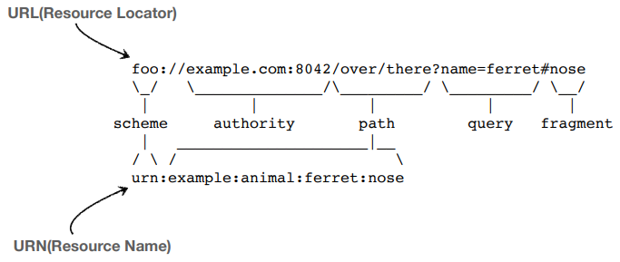

# URI (Uniform Resource Identifier)
**"URI는 로케이터(Locator) , 이름(Name) 또는 둘 다 추가로 분류 될 수 있다."**  

- **Uniform** : 리소스를 식별하는 통일된 방식
- **Resource** : 자원 , URI로 식별할 수 있는 모든 것(제한 없음)
- **Identifier** : 다른 항목과 구분하는데 필요한 정보
  
# URL , URN
- **URL - Locator : 리소스가 있는 위치를 지정**
- **URN - Name : 리소스에 이름을 부여**
- **위치는 변할 수 있지만 , 이름은 변하지 않는다.**
- **URN 이름만으로 실제 리소스를 찾을 수 있는 방법이 보편화 되지 않음**

> ✋ 이 다음 부터는 URI를 URL과 같은 의미로 정의한다.

# URL 전체 문법

**`scheme://[userinfo@]host[:port][/path][?query][#fragment]`**  
  
**`https://www.google.com:443/search?q=hello&hl=ko`**  

|  |  |
|:-------------:|:------------------:|
| 프로토콜 | https |
| 호스트명 | www.google.com   |
| 포트 번호| 443 |
| 패스       | `/search` |
| 쿼리 파라미터 | `q=hello&hl=ko` |

## **scheme**

scheme `//[userinfo@]host[:port][/path][?query][#fragment]`  
https `//www.google.com:443/search?q=hello&hl=ko`  

-   주로 프로토콜 사용
-   프로토콜 : 어떤 방식으로 자원에 접근할 것인가 하는 약속 규칙
    -   http , https , ftp 등등
-   http는 80포트 , https는 443포트를 주로 사용 (포트는 생략 가능)
-   https는 http에 보안 추가(HTTP Secure)

## **userinfo**

scheme //**`[userinfo@]`** host[:port][/path][?query][#fragment]  

-   URL에 사용자정보를 포함해서 인증
-   거의 사용하지 않음

## **host**

scheme //[userinfo@]**`host`**[:port][/path][?query][#fragment]  
https //**`www.google.com`**:443/search?q=hello&hl=ko  

-   호스트명
-   도메인명 또는 IP주소를 직접 사용 가능

## **port**

scheme //[userinfo@]host **`[:port]`**[/path][?query][#fragment]  
https //www.google.com:**`443`**/search?q=hello&hl=ko  

-   포트 (PORT)
-   접속 포트
-   일반적으로 생략 (생략 시 http는 80 , https는 443)

## **path**

scheme //[userinfo@]host[:port]**`[/path]`**[?query][#fragment]  
https //www.google.com:443/**`search`**?q=hello&hl=ko  

-   리소스 경로 , 계층적 구조
-   예)
    -   `/home/file1.jpg`
    -   `/members`
    -   `/members/100`
    -   `/items/iphone12`

## **query**

scheme //[userinfo@]host[:port][/path]**`[?query]`**[#fragment]  
https //www.google.com:443/search?**`q=hello&hl=ko`**  

-   key = value 형태
-   `?`로 시작 , `&`로 추가 가능 
    -   ?keyA=valueA&keyB=valueB
-   query parameter , query string등으로 불림
-   웹 서버에 제공하는 파라미터 , 문자 형태

## **fragment**

scheme //[userinfo@]host[:port][/path][?query]**`[#fragment]`**  
https //docs.spring.io/spring-boot/docs/current/reference/html/gettingstarted.html **`#getting-started-introducing-spring-boot`**

- html 내부 북마크 등에 사용
- 서버에 전송하는 정보 아님
- `H`헤더 이동할 때
