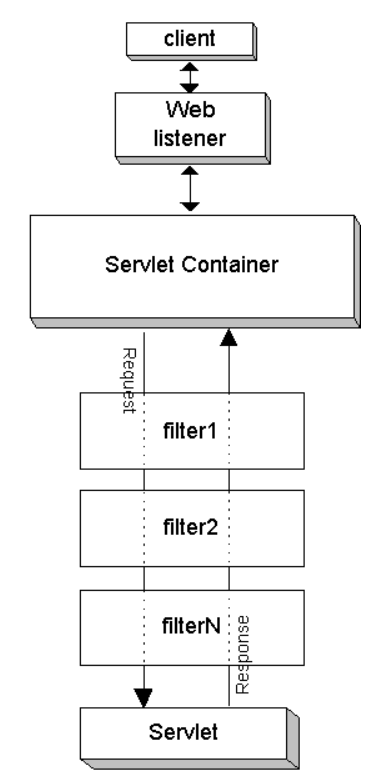

- org.springframework.boot 3.0.3
- org.apache.tomcat.embed:tomcat-embed-core 10.1.5


- [이미지 출처](https://unluckyjung.github.io/spring/2022/03/12/Spring-Filter-vs-Interceptor/)
  
Spring이 Request를 처리하는 과정이 대충 `HTTP 요청 ➔ WAS ➔ 필터 ➔ 서블릿 ➔ 스프링 인터셉터 ➔ 컨트롤러` 이렇다 라는 것은 말하기 쉽지만 상세하게 설명하지 못하는 것 같아 직접 디버깅하며 조사해보려한다.  


# Tomcat NIO

# Filter


- [이미지 출처](https://docs.oracle.com/cd/A97329_03/web.902/a95878/filters.htm)
  
[책임 연쇄 패턴](https://inpa.tistory.com/entry/GOF-%F0%9F%92%A0-Chain-Of-Responsibility-%ED%8C%A8%ED%84%B4-%EC%99%84%EB%B2%BD-%EB%A7%88%EC%8A%A4%ED%84%B0%ED%95%98%EA%B8%B0)의 좋은 예이다.  
다음 3가지 메소드를 구현해야 한다.  
  
서블릿 컨테이너는 필터를 인스턴스화한 후 `init()`을 정확히 한 번 호출한다. (기본 구현은 NO-OP이다.)  
`doFilter()`는 `urlPatterns`에 맞는 모든 HTTP 요청이 **디스패처 서블릿으로 전달되기 전에 웹 컨테이너에 의해 실행되는 메소드이다.**  
`destory()`는 Filter 인스턴스를 오프로드할 때 호출되며 수명주기동안 한 번만 호출된다. 실제로 언제 호출되는지는 확인해볼 수 없었지만, 해당 필터로 열린 자원들을 해제 작업을 하는 단계로 예상된다.  
  
```kotlin
class SuccessFilter : Filter {

    private val logger = SuccessFilter::class.logger()

    override fun init(filterConfig: FilterConfig?) {
        logger.info("success filter - init(), hashcode: ${System.identityHashCode(this)}")
    }

    override fun doFilter(request: ServletRequest?, response: ServletResponse?, chain: FilterChain?) {
        logger.info("success filter - doFilter(), hashcode: ${System.identityHashCode(this)}")
        chain?.doFilter(request, response)
    }

    override fun destroy() {
        logger.info("success filter - destroy(), hashcode: ${System.identityHashCode(this)}")
    }
}

class ExceptionFilter : Filter {

    private val logger = ExceptionFilter::class.logger()

    override fun init(filterConfig: FilterConfig?) {
        logger.info("exception filter - init(), hashcode: ${System.identityHashCode(this)}")
    }

    override fun doFilter(request: ServletRequest?, response: ServletResponse?, chain: FilterChain?) {
        logger.info("exception filter - doFilter(), hashcode: ${System.identityHashCode(this)}")
        throw FilterException("FilterException 발생!!!")
    }

    override fun destroy() {
        logger.info("exception filter - destroy(), hashcode: ${System.identityHashCode(this)}")
    }
}

@Bean
fun addSuccessFilter(): FilterRegistrationBean<Filter> {
    return FilterRegistrationBean<Filter>(SuccessFilter()).apply {
        this.addUrlPatterns("/adviceTest")
    }
}

@Bean
fun addExceptionFilter(): FilterRegistrationBean<Filter> {
    return FilterRegistrationBean<Filter>(ExceptionFilter()).apply {
        this.addUrlPatterns("/adviceTest")
    }
}
```

## Filter에서 예외가 발생하면?

```
doFilter:39, ExceptionFilter (example.adviceTest)                               (5) 다섯 번째 CustomFilter
internalDoFilter:185, ApplicationFilterChain (org.apache.catalina.core)
doFilter:158, ApplicationFilterChain (org.apache.catalina.core)
doFilter:21, SuccessFilter (example.adviceTest)                                 (4) 네 번째 CustomFilter
internalDoFilter:185, ApplicationFilterChain (org.apache.catalina.core)
doFilter:158, ApplicationFilterChain (org.apache.catalina.core)
doFilterInternal:100, RequestContextFilter (org.springframework.web.filter)     (3) 세 번째 Filter
doFilter:116, OncePerRequestFilter (org.springframework.web.filter)
internalDoFilter:185, ApplicationFilterChain (org.apache.catalina.core)
doFilter:158, ApplicationFilterChain (org.apache.catalina.core)
doFilterInternal:93, FormContentFilter (org.springframework.web.filter)         (2) 두 번째 Filter
doFilter:116, OncePerRequestFilter (org.springframework.web.filter)
internalDoFilter:185, ApplicationFilterChain (org.apache.catalina.core)
doFilter:158, ApplicationFilterChain (org.apache.catalina.core)
doFilterInternal:201, CharacterEncodingFilter (org.springframework.web.filter)  (1) 첫 번째 Filter
doFilter:116, OncePerRequestFilter (org.springframework.web.filter)
internalDoFilter:185, ApplicationFilterChain (org.apache.catalina.core)
doFilter:158, ApplicationFilterChain (org.apache.catalina.core)                 (0) FilterChain
invoke:177, StandardWrapperValve (org.apache.catalina.core)                     (0.1)
invoke:97, StandardContextValve (org.apache.catalina.core)
invoke:542, AuthenticatorBase (org.apache.catalina.authenticator)
invoke:119, StandardHostValve (org.apache.catalina.core)
invoke:92, ErrorReportValve (org.apache.catalina.valves)
invoke:78, StandardEngineValve (org.apache.catalina.core)
service:357, CoyoteAdapter (org.apache.catalina.connector)
service:400, Http11Processor (org.apache.coyote.http11)
process:65, AbstractProcessorLight (org.apache.coyote)
process:859, AbstractProtocol$ConnectionHandler (org.apache.coyote)
doRun:1734, NioEndpoint$SocketProcessor (org.apache.tomcat.util.net)
run:52, SocketProcessorBase (org.apache.tomcat.util.net)
runWorker:1191, ThreadPoolExecutor (org.apache.tomcat.util.threads)
run:659, ThreadPoolExecutor$Worker (org.apache.tomcat.util.threads)
run:61, TaskThread$WrappingRunnable (org.apache.tomcat.util.threads)
run:833, Thread (java.lang)
```
  
결론적으로는 [스프링 부트에서 톰캣이 내장](https://www.theserverside.com/definition/embedded-Tomcat)되면서 Filter에서 예외가 나면 ControllerAdvice에서 잡아줄 수 있지 않을까 잠깐 생각했지만, 콜스택 `(0.1)`에서 예외를 처리한다. (이전에 호출되었던 Filter에게도 전파된다.)  
  
```java
try {
    ...
} ... {

} catch (Throwable e) {
    ExceptionUtils.handleThrowable(e);
    container.getLogger().error(sm.getString(
            "standardWrapper.serviceException", wrapper.getName(),
            context.getName()), e);
    throwable = e;
    exception(request, response, e); // ServletException을 처리한다.
} finally {
    ...    
}

private void exception(
    Request request, 
    Response response,
    Throwable exception
) {
    request.setAttribute(RequestDispatcher.ERROR_EXCEPTION, exception);
    response.setStatus(HttpServletResponse.SC_INTERNAL_SERVER_ERROR);
    response.setError();
}
```
  
`ApplicationFilterChain`에서 Filter를 어떻게 호출할까?  


1. 위의 이미지를 보면 `ApplicationFilterChain`은 등록된 Filter들을 내부 필드 `ApplicationFilterConfig[]` 배열로 참조하고 있다.
2. `public void doFilter(ServletRequest request, ServletResponse response,FilterChain chain)` 파라미터에 `FilterChain`을 전달하고 있다. (ApplicationFilterChaindms FilterChain를 구현하고 있다.)

// ApplicationFilterChain 시각화하기

## OnceRerRequestFilter

> 모든 서블릿 컨테이너에서 요청 디스패치당 단일 실행을 보장하는 것을 목표로 하는 필터 기본 클래스입니다.

// 테스트 해보기

# DispatcherServlet

# Interceptor

## Interceptor에서 예외가 발생하면?


